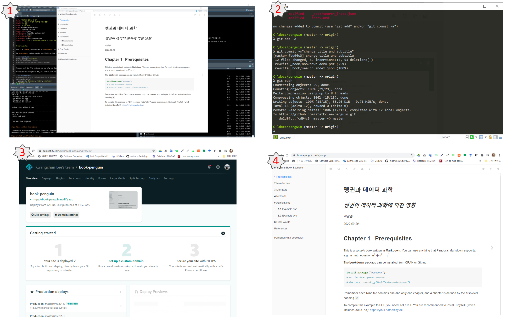
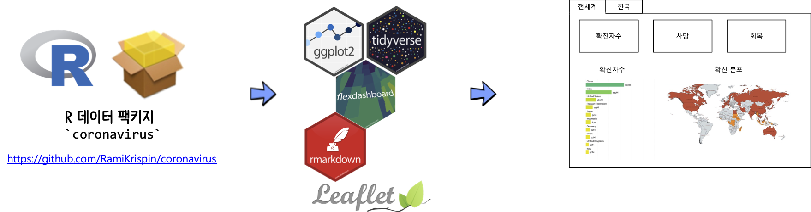

---
class: kcd-title-subslide

코딩 문서를 넘어서

---
class: title-style
layout: false

# 보고서 생성 자동화

.center[
  
]

.footnote[
- [데이터 과학을 위한 저작도구 - 보고서 자동화](https://statkclee.github.io/comp_document/ds-report-automation.html)
]  

---
class: title-style
layout: false

# Parameterized 문서

.pull-left[
```{r setup-parameterized, eval = FALSE}
# 1. 시도명 ---------------------------------------
provinces <- c("강원도", "경기도", "경상남도", "경상북도", "광주광역시", "대구광역시", 
               "대전광역시", "부산광역시", "서울특별시", "세종특별자치시", "울산광역시", 
               "인천광역시", "전라남도", "전라북도", "제주특별자치도", "충청남도", 
               "충청북도")

# 2. 보고서 만들기 ---------------------------------------
for(province in provinces) {
  rmarkdown::render("election-province.Rmd", 
                    output_format="html_document",
                    params = list(province = province),
  output_file = str_c(paste0(province, "_report_"), Sys.Date(), ".html", sep=""),
  encoding = 'UTF-8', 
  output_dir = "report")
}
```
]

.pull-right[

```{r eval=FALSE}
---
layout: page
title: "Computational Document"
subtitle: "`r params$province` 대통령 선거 득표 보고서"
author:
    name: 이광춘 (KPMG)
    affilates: 데이터 과학자
date: "`r Sys.Date()`"
always_allow_html: yes
params:
  province: "서울특별시"
output:
  html_document: 
    toc: yes
    toc_float: true
    highlight: tango
    code_folding: show
    number_section: true
---
```

]

.footnote[
- [기본문서](https://statkclee.github.io/comp_document/tutorial/02_parameterized_rmd/election.html)
- [매개변수 적용된 문서](https://statkclee.github.io/comp_document/tutorial/02_parameterized_rmd/election-province.html)
]  

---
class: title-style
layout: false

# 전자책 저작

.center[
  
]

.footnote[
- [데이터 과학을 위한 저작도구: Computational Documents - 북다운(`bookdown`)](https://statkclee.github.io/comp_document/bookdown-intro.html)
- [데이터과학을 위한 미적분학](https://calculus-book.netlify.app/)  
]  

---
class: title-style
layout: false

# 대쉬보드

<br>
<br>

.center[
  
]

.footnote[
- [데이터 과학을 위한 저작도구: Computational Documents - 대쉬보드(Dashboard)](https://statkclee.github.io/comp_document/cd-dashboard.html)
- [코로나19 대쉬보드](https://statkclee.github.io/comp_document/cd-corona.html)  
]  

