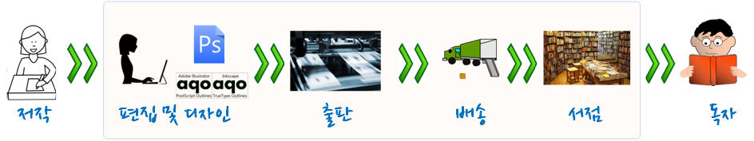
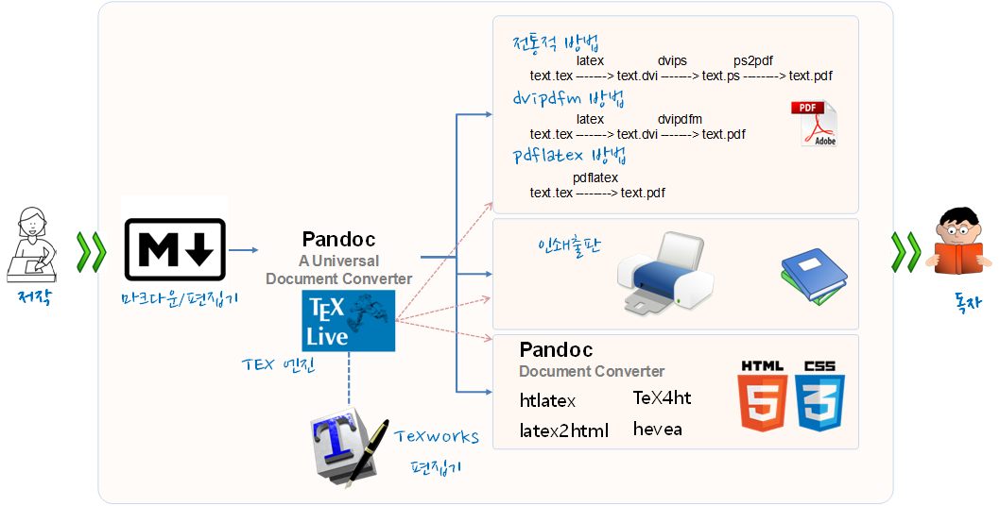

---
class: kcd-title-subslide

코딩 문서 기본기

---
class: title-style
layout: false

# 과거 코딩으로 글을 쓴다는 것 - $LaTeX$

.center[
  
  
]

.footnote[
  [글을 쓰는 것은 소프트웨어 개발이다!](https://statkclee.github.io/ds-authoring/ct-writing.html)
]

---
class: title-style
layout: false

# 세가지 다른 언어 패러다임

.center[
  
]

---
class: title-style
layout: false

# 현재 상황 요약

- **아래한글, 리브레오피스, MS 워드, 데스크톱 위지윅 도구** :지금까지 편지같은 단순한 저작물을 생성하는 가장 쉬운 방식이지만, 융통성이 없고, 불명확하고 수식 배치기능이 상대적으로 미약하고, 버젼제어 시스템과 궁합이 맞지 않음.
- **구글 독스, 웹기반 위지윅 도구**:  워드나 한글, 리브레오피스의 신속성을 갖추고, 더불어 협업을 수월(왜냐하면 모든이가 문서 사본 하나만 공유하기 때문)하게 한다. 하지만, 웹기반 위지윅 도구는 여전히 융통성이 없고 불명확하며, 책임을 질 수 없는 개인회사 바구니에 모든 달걀을 놓는 것에 많은 사람들이 불편해함.
- **데스크톱 LaTeX**: 강력한 조판언어로 수식과 참고문헌관리에 정말 훌륭한 기능을 제공한다. 버젼제어 시스템과 조화가 잘 되는데, 일반 텍스트로 문서를 저작하기 때문이다. 하지만, 지금까지 학습하기 가장 복잡하고, 텍스트와 그림을 원하는 곳에 배치시키는 작업이 고생스럽게도 수시간 소요될 수 있다.
- **Authorea, Overleaf 같은 웹기반 도구** : 위지윅 편집 인터페이스를 저자에게 제공하지만 문서는 LaTeX으로 저장되고, 변경사항을 타이핑해서 넣을 때마다 실시간으로 화면에 다시 출력해서 보여준다.
- **HTML** : 웹의 네이티브 언어로 $LaTeX$ 보다 훨씬 더 단순하지만, 훨씬 더 적은 기능을 제공한다: 주석, 참고문헌관리, 절마다 번호매김 같은 단순한 기능도 직접적으로 지원안됨. 상당히 버보스하게 상세할 수도 있고, CSS는 변덕스러움으로 유명.
- **마크다운** : HTML에 대한 단순화 대안으로 개발. 마크다운은 일반-텍스트 전자우편 관례를 사용: 빈줄은 문단을 구분하고, 이탤릭체로 만드는데 `*별표*`로 감싸는 등등. HTML보다 더 적은 작업을 수행하지만, 타이핑 양은 훨씬 더 적지만, 불행히도 거의 모든 마크다운 구현결과물이 자체적인 기능이 추가되어서 “마크다운 표준”은 모순어법에 해당된다.

---
class: title-style
layout: false

# 한국인이기 때문에 알아야 되는 것

.center[
  
]

.footnote[
  [R 유니코드, 인코딩](https://statkclee.github.io/ds-authoring/regex-encoding.html)
]

---
class: title-style
layout: false

# 데이터 과학 글을 쓴다는 것: Compendium

.center[
  
]

.footnote[
  출처: [Computational Documents - 개요서(Compendium) 시작하며](https://statkclee.github.io/comp_document/cd_compendium.html)
]

