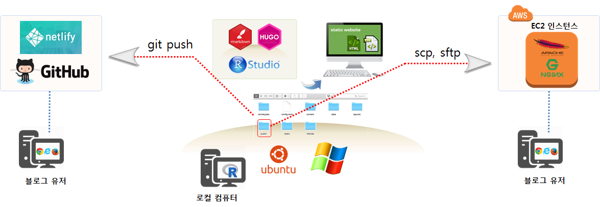

---
class: kcd-title-subslide

코딩 문서 사례

---
class: title-style
layout: false

# 책 -  $LaTex$ 사례

<br>
<br>

.pull-left[
  
]
.pull-right[
  
]

.footnote[
  [정보교육을 위한 파이썬: 데이터 과학자로의 여정, 아마존 절찬 판매중](https://statkclee.github.io/pythonlearn-kr/01-py4inf-python2/)
]  

---
class: title-style
layout: false

# 블로그

.center[
  
]

.footnote[
  [데이터 과학을 위한 저작도구: Computational Documents - 블로그 `blogdown`](https://statkclee.github.io/comp_document/ds-blogdown.html)
]  

---
class: title-style
layout: false

# 이력서

.center[
  
]

.footnote[
- [데이터 과학을 위한 저작도구: Computational Documents - 이력서(Resume)](https://statkclee.github.io/comp_document/ds-resume.html)
- [데이터 과학 입문 - 2020 봄학기](https://statkclee.github.io/ds-intro-2020/)
] 

---
class: title-style
layout: false

# 논문 - 재현가능한 글쓰기

.center[
  
]

.footnote[
  [데이터 과학: 재현가능한 저작 - R 마크다운 논문](https://statkclee.github.io/author_carpentry_kr/rmarkdown-authoring-paper.html)
]


---
class: title-style
layout: false

# 논문 - 재현가능한 글쓰기 환경

.center[
  
]

.footnote[
  [데이터 과학: 재현가능한 저작 - R 마크다운 논문](https://statkclee.github.io/author_carpentry_kr/rmarkdown-authoring-paper.html)
]

---
class: title-style
layout: false

# 논문 - 한국디지털경영학회

.center[
  
]

.footnote[
  [자동화에 따른 노동시간 변화 분석, 한국디지털경영학회](https://statkclee.github.io/comp_document/automation-kasdba.html)
]

---
class: title-style
layout: false

# 파워포인트 - `slideshow`

.center[
  
]

.footnote[
- [R 발표자료(Presentation) - xaringan 슬라이드쇼](https://statkclee.github.io/comp_document/ds-presn.html)
- [코딩으로 글쓰는 슬기로운 탐구생활, KCD 2020](https://statkclee.github.io/ds-authoring/KCD2020_Tidyverse.html#1)
]

---
class: title-style
layout: false

# GITHUB `readme.md`

```{r capture-github,eval=FALSE, echo=FALSE}
webshot2::webshot(url = "https://github.com/statkclee", file = "fig/github-readme.png", cliprect = c(0, 0, 1024, 768))
```

.center[
  
]

.footnote[
  [데이터 과학을 위한 저작도구: Computational Documents - GITHUB `readme.md`](https://statkclee.github.io/comp_document/ds-github-readme.html)
]

