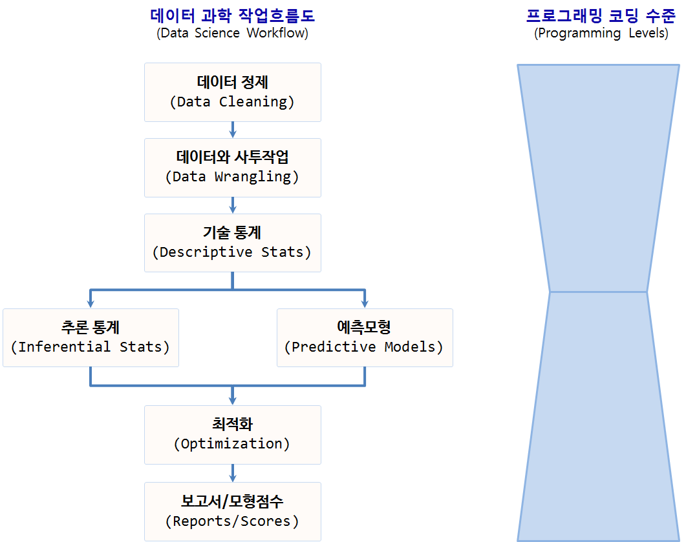

```{r setup, include=FALSE}
options(htmltools.dir.version = FALSE)
```


background-image: url("fig/ds-gartner.png")
background-size: cover


---
# 가트너 데이터 과학

- 기술 분석(Descriptive Analytics): 무슨 일이 있었나? (What happened?)

- 진단 분석(Diagnostic Analytics): 왜 일어났나? (Why did it happen?)

- 예측 분석(Predictive Analytics): 무슨 일이 일어날까? (What will happen?)

- 처방 분석(Prescriptive Analytics): 어떻게 그런 일을 일으킬까? (How can we make it happen?)

이를 통해 뒤늦은 깨달음(Hindsight) 복기, 깨달음/통찰력(Insight), 예지력/선견지명(Foresight)을 얻을 수 있다.
가치도 크지만 그에 따른 어려움도 가중된다.

.footnote[
  [xwMOOC - `tidyverse` 데이터 과학 기본체계](https://statkclee.github.io/data-science/ds-tidyverse.html)
]


--- 
# 데이터 과학 투여비용




---
class: inverse, middle, center

# 데이터 과학


