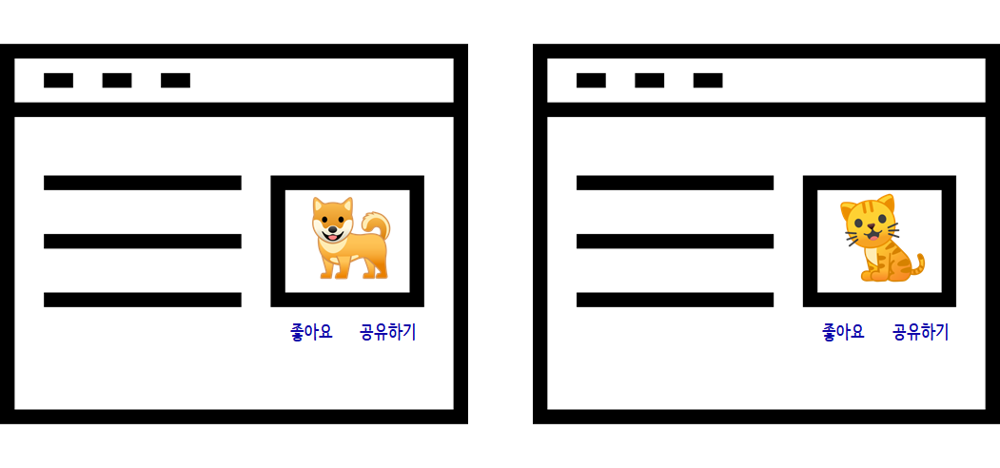
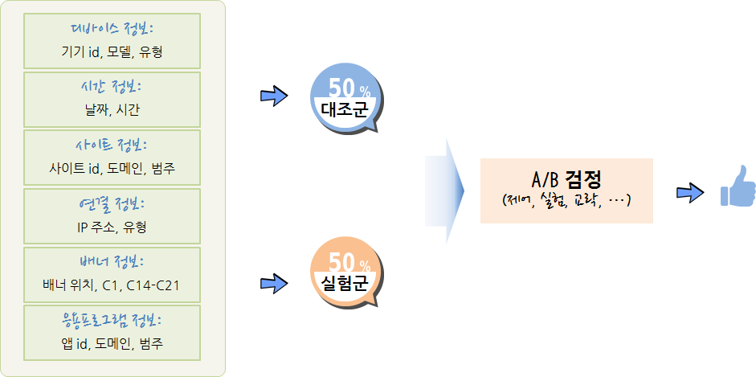
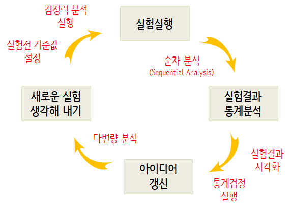
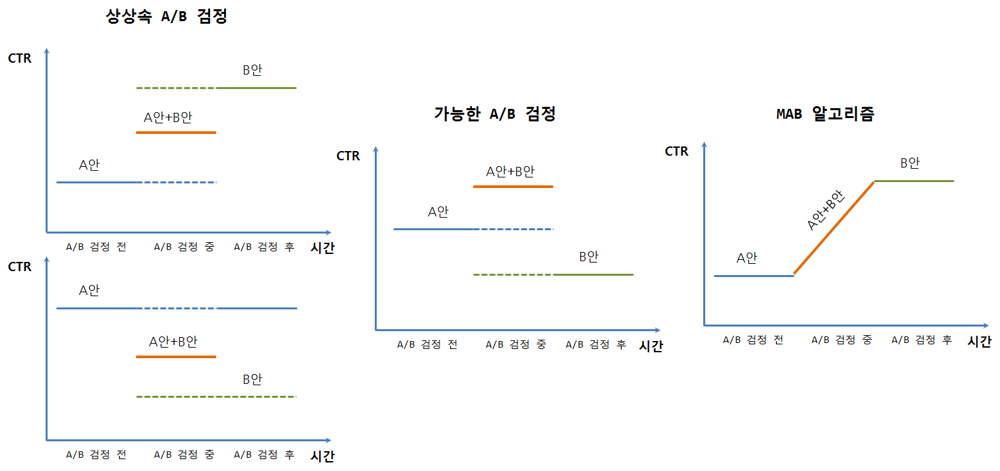

```{r setup, include=FALSE}
options(htmltools.dir.version = FALSE)

knitr::opts_chunk$set(echo = FALSE, warning=FALSE, message=FALSE,
                    comment="", digits = 3, tidy = FALSE, prompt = TRUE, fig.align = 'center')

```


background-image: url("fig/ab-testing-begin.png")
background-size: 170px

---
# A/B 테스팅(A/B 테스팅) 

.center[
 
]

.footnote[
  [데이터 과학-기초 통계: A/B 검정 (A/B Testing)](https://statkclee.github.io/statistics/stat-ab-testing.html)
]

---
# A/B 테스팅 데이터


```{r ab-testing-data}
# 0. 환경설정 ----
library(tidyverse)
library(DT)
library(lubridate)
library(extrafont)
library(broom)
loadfonts()

# 1. 데이터 ----
ab_df <- read_csv("data/website_sample.csv")

ab_df %>% 
  sample_n(10) %>% 
  datatable(  fillContainer = FALSE,
              rownames = FALSE,
              options = list(pageLength = 5, scrollX = TRUE)) %>% 
  formatRound(c("pgload_time", "time_spent"), digits=1)
```


---
# A/B 검정 구성요소

- 측정단위: 사용자, 점포, 도시 등 
- 표본추출: 독립 임의화[랜덤화,확률화] 블록 설계를 통한 $t-$ 검정, 쌍체 $t-$ 검정
    - 실험군(50%)과 대조군(50%)
- 종속변수: 매출액, 체류시간, 광고 연결률(광고클릭여부) 등 실험에서 확인하고자 하는 목표
- 독립변수: 종속변수에 영향을 주는 요인
    - 실험변수: 실험의 핵심 변수로 대조군에는 적용하지 않고, 실험군에만 적용되는 변수
    - 통제변수: 실험의 대표성을 높이기 위해 인구통제학적인, 환경적인 요인을 유사하게 맞춰주는 변수
    - 교략변수(Lurking, Confounding Varaible): 독립변수와 종속변수 모두 상관되는 외생 변수로, 
    아이스크림 판매량과 익사하는 사람수 관계(온도), 출생 순서와 다운증후군 연관성(산모 나이)을 예로 들 수 있다. 


---
# A/B 검정 사례

**광고 연결률(CTR, click through rates)**을 예측하는데 디바이스, 날짜/시간, 웹사이트, 네트워크 연결, 배너 배치, 앱 정보등을 수집하여 이를 바탕으로 광고 클릭을 연결과 실패로 구분하여 예측한다.

.center[

]

---
background-image: url("fig/ab-testing-begin02.jpg")
background-size: 570px


---
# A/B 검정 주제선정

.center[
<iframe width="560" height="315" src="https://www.youtube.com/embed/S6qQUdEOmM8" frameborder="0" allow="autoplay; encrypted-media" allowfullscreen></iframe>
]

.footnote[
[Youtube, "louie works through a chain of whys"](https://www.youtube.com/results?search_query=louie+works+through+a+chain+of+whys)
]


---
# A/B 검정에 대해서

- **왜(Why)**? 좀더 나은 웹사이트, 광고 캠페인, 버튼 위치, 매출 전략등 다양한 아이디어가 많고, 특정 아이디어는 다른 아이디어 보다 더 좋다. 그럼 특정 아이디어가 다른 아이디어보다 더 좋다는 것을 어떻게 선별할 수 있을까?

- **A/B 검정을 통한 전통적인 주제**
    - 상품 종류, 가격, 위치 등 최적화
    - 전자우편 메시지나 푸시 메시지의 제목/본문 등 설정 최적화
    - 회원가입 양식, 주문 양식 등 각종 항목 순서 등 배치 최적화
    - 웹사이트 네비게이션 UI 배치와 문구 등 설치 최적화
    - 회원 가입, 구매 버튼의 위치, 색상, 문구 등 설정 최적화

.center[

]


.footnote[
[온라인 게임에서의 A/B 테스팅](http://boxnwhis.kr/2015/01/29/a_b_testing_online_games.html)
] 


---
# 게임회사 A/B 검정 주제

게임에 있어 A/B 검정 최적화 주제로 검토가능한 것은 다음과 같다.

- MMORPG 게임에서 특정 재화를 투여할 경우 인플레이션이 발생할까?
- 적절한 아이템 드랍률은 얼마인가?
- 광고홍보 무료 아이템의 성능의 성능은 적절한가?
- 게임 스테이지별로 적절하게 난이도가 증가하고 있는가?
- 특정 던젼의 난이도는 다른 던젼과 비교하여 높은가?
- 레벨 설계에 고려되었던 특정 요소가 잘 반영되어 기대한 게임 패턴이 관측되는가?
- 매크로 지능이 설계한 것처럼 게임맵에서 동작하고 있는가?
- 게임 사용자 실력 평가 알고리즘이 적절한가?
- PvP 매칭 알고리즘이 적절한가?

---
background-image: url("fig/ab-testing-begin03.png")
background-size: 170px


---
# A/B 검정 작업흐름

<br/>

.center[

]

---
# 표본 크기(Sample Size)

$\text{표본크기} = f(\text{검정력, 유의수준, 효과크기})$


```{r sample-size, echo=TRUE}
library(pwr)

# 1. 검정력 데이터 생성 ----
d     <- seq(.1, 2, by=.1)    # 효과크기(Effect Size)
power <- seq(.1, 0.9, by=.1)    # 검정력(Power)
alpha <- c(0.01, seq(0.05, 0.5, 0.05)) # 유의수준(Significance Level)

sample_size_df <- expand.grid(power=power, effect_size=d, alpha=alpha) %>% 
  tbl_df

for(i in 1:nrow(sample_size_df)) {
  sample_size_df$sample_size[i] <- try(power.t.test(n = NULL,
                                                d = sample_size_df$effect_size[i],
                                                sig.level= sample_size_df$alpha[i],
                                                power = sample_size_df$power[i],
                                                type  = "two.sample")$n)
}

# https://stackoverflow.com/questions/33379962/power-t-test-error
sample_size_df <- sample_size_df %>% 
  mutate(sample_size = as.integer(sample_size))
```


---
# 표본 크기 데이터

$\text{표본크기} = f(\text{검정력, 유의수준, 효과크기})$


```{r sample-size-dt}
sample_size_df %>% 
  sample_frac(0.1) %>% 
  DT::datatable(fillContainer = FALSE,
                rownames = FALSE,
                options = list(pageLength = 5, scrollX = TRUE))
```

---
## 표본 크기 데이터: 검정력(Power)

$\text{표본크기} = f(\textbf{검정력}, \text{ 유의수준, 효과크기})$

```{r sample-size-power}
# 2. 검정력  ----
sample_size_df %>% 
  filter(alpha == 0.05, effect_size == 0.5) %>% 
  ggplot(aes(x=power, y=sample_size)) +
    geom_line() +
    geom_point() +
    theme(legend.position = "none") +
    labs(x="검정력(Power)", y="표본크기(Sample Size",
         title="검정력 강화에 따른 표본크기 변화",
         subtitle="유의수준(0.05)과 효과크기(0.5)를 고정") +
    theme_minimal(base_family = "NanumGothic")
```

---
## 표본 크기 데이터: 유의수준

$\text{표본크기} = f(\textbf{유의수준}, \text{검정력, 효과크기})$

```{r sample-size-alpha}
# 2. 유의수준  ----
sample_size_df %>% 
  filter(effect_size == 0.5, power == 0.80) %>% 
  ggplot(aes(x=alpha, y=sample_size)) +
  geom_line() +
  geom_point() +
  theme(legend.position = "none") +
  labs(x="유의수준(Significance Level)", y="표본크기(Sample Size",
       title="검정력과 효과크기를 고정한 뒤 유의수준별 표본크기",
       subtitle="유의수준(0.05)과 효과크기(0.8)를 고정") +
  theme_minimal(base_family = "NanumGothic")
```

---
## 표본 크기 데이터: 효과크기

$\text{표본크기} = f(\textbf{효과크기}, \text{검정력, 유의수준})$

```{r sample-size-effect-size}
# 3. 효과크기  ----
sample_size_df %>% 
  filter(alpha == 0.01, power ==0.8) %>% 
  ggplot(aes(x=effect_size, y=sample_size, group=1)) +
  geom_line() +
  geom_point() +
  theme(legend.position = "none") +
  labs(x="효과크기(Effect Size)", y="표본크기(Sample Size",
       title="검정력과 유의수준을 고정한 뒤 효과크기별 표본크기",
       subtitle="유의수준(0.05)과 검정력(0.8)를 고정") +
  theme_minimal(base_family = "NanumGothic")
```

---
## 표본 크기 사례

.pull-left[

### 효과크기가 큰 경우

```{r sample-size-small-effect, echo=TRUE}
pwr.t.test(power = 0.8,
           sig.level = 0.05,
           d = 0.8)
```
  
]

.pull-right[

### 효과크기가 작은 경우

```{r sample-size-large-effect, echo=TRUE}
pwr.t.test(power = 0.8,
           sig.level = 0.05,
           d = 0.1)
```
]

---
## 순차 분석(Sequential Analysis)

순차분석은 데이터를 수집하면서 반복적으로 유의성 통계검정을 수행하는 절차로 다음 세가지 중 하나를 택일한다.

- 실험 중단: 통계적 유의성이 있어 귀무가설을 기각하고 실험을 중단.
- 실험 중단: 통계적 유의성이 없어 귀무가설을 기각하지 못하고 실험을 중단.
- 실험 계속: 결론을 내리기에 충분하지 못해서 실험을 계속진행.

[gsDesign](https://cran.r-project.org/web/packages/gsDesign/index.html) 팩키지를 사용해서 순차분석을 통해 
실험에 대한 결론도 도출하고 표본크기도 산정한다.

`k = 4`는 3번 중간 분석을 수행하고 마지막 4번째 모든 데이터를 가지고 분석을 수행한다.
`test.type`은 단축, 양측 검정 등을 설정하는 것이고, `alpha`는 유의수준, `beta`는 검정력과 관계되어 0.2는 
검정력이 0.8을 나타내고 `sfu`는 Spending 함수로 여러 방법론이 있지만, `Pocock`을 지정하여 순차분석을 수행한다.

최대 가능 표본수가 1000개라고 가정하면 두집단이 되어 이를 `seq_analysis$timing`에 반영하면 중간중간 살펴봐야하는 표본을 산출할 수 있다.


---
## 순차 분석 사례

```{r sequential-analysis-case-study, echo=TRUE}
library(gsDesign)

# 1. 중단 규칙(stopping rule) ----
seq_analysis <- gsDesign(k = 4,
                         test.type = 2,
                         alpha = 0.05,
                         beta = 0.2,
                         sfu = "Pocock")

max_n <- 1000 
max_n_per_group <- max_n / 2
stopping_points <- max_n_per_group * seq_analysis$timing
stopping_points

# plot(seq_analysis)
```

---
background-image: url("fig/ab-testing-begin04.png")
background-size: 570px


---
### A/B-검정 사례: EDA

.pull-left[

```{r ab-testing-EDA, echo=TRUE, eval=FALSE}
ab_df %>% 
  mutate(day = day(date)) %>% 
  group_by(day) %>% 
  summarise(conversion = mean(like)) %>% 
  ggplot(aes(x=day, y=conversion)) +
  geom_line() +
  geom_point(size=2) +
  scale_y_continuous(limits = c(0,0.2), labels = scales::percent) +
  labs(x="일자별", y="전환율(%)", title="강아지/고양이 사진 A/B 검정 일별 전환율 추세",
       color="A/B검정") +
  theme_minimal(base_family = "NanumGothic")
```
]

.pull-right[
```{r ab-testing-EDA-run}
ab_df %>% 
  mutate(day = day(date)) %>% 
  group_by(day) %>% 
  summarise(conversion = mean(like)) %>% 
  ggplot(aes(x=day, y=conversion)) +
  geom_line() +
  geom_point(size=2) +
  scale_y_continuous(limits = c(0,0.2), labels = scales::percent) +
  labs(x="일자별", y="전환율(%)", title="강아지/고양이 사진 A/B 검정 일별 전환율 추세",
       color="A/B검정") +
  theme_minimal(base_family = "NanumGothic")
```
]


---
### A/B-검정 사례: 기술통계

```{r ab-testing-descriptive, echo=TRUE}
# 3. A/B 검정: 범주형 -----
## 3.1. 기술 통계량 -----
ab_df %>% 
  group_by(testing) %>% 
  summarise(conversion = mean(like)) 
```


---
### A/B-검정 사례: 시각화

.pull-left[
```{r ab-testing-viz, echo=TRUE, eval=FALSE}
## 3.2. 시각화 -----
ab_df %>% 
  mutate(day = day(date)) %>% 
  group_by(day, testing) %>% 
  summarise(conversion = mean(like)) %>% 
  ggplot(aes(x=day, y=conversion, color=testing, group=testing)) +
  geom_line() +
  geom_point(size=2) +
  scale_y_continuous(limits = c(0,1), labels = scales::percent) +
  labs(x="일자별", y="전환율(%)", title="강아지/고양이 사진 A/B 검정 일별 전환율 추세",
       color="A/B검정") +
  theme_minimal(base_family = "NanumGothic")
```
]

.pull-right[
```{r ab-testing-viz-run}
## 3.2. 시각화 -----
ab_df %>% 
  mutate(day = day(date)) %>% 
  group_by(day, testing) %>% 
  summarise(conversion = mean(like)) %>% 
  ggplot(aes(x=day, y=conversion, color=testing, group=testing)) +
  geom_line() +
  geom_point(size=2) +
  scale_y_continuous(limits = c(0,1), labels = scales::percent) +
  labs(x="일자별", y="전환율(%)", title="강아지/고양이 사진 A/B 검정 일별 전환율 추세",
       color="A/B검정") +
  theme_minimal(base_family = "NanumGothic")
```
]


---
### A/B-검정 사례: 통계검정


```{r ab-testing-stat-testing}
## 3.3. 통계검정 -----
glm(like ~ testing, family = "binomial", data = ab_df) %>%
  broom::tidy()
```

---
background-image: url("fig/ab-testing-begin05.png")
background-size: 570px


---
### A/B 검정과 MAD (I)

- 카지노에 슬롯머신이 쭉 배치되어 있는데, 각 슬롯머신 별로 승률이 달리 정해져 있지만 승률은 알지 못한다. 한정된 예산을 가지고 가장 많은 돈을 벌기 위해서 어떤 전략을 취하면 될까? 결국 탐색과 획득 딜레마(Explore/Exploit Dilemma)를 통해 우선 가장 승률이 좋은 슬롯머신을 찾아내는 과정과 본격적으로 돈을 버는 과정을 거치게 된다. 한정된 탐색과 획득과정 모두 비용과 시간이 들여 가장 많은 돈을 벌게 되는 최적화 문제를 푸는 것으로 귀결된다.

- 2차 세계대전 당시 다중 슬롯머신 문제가 매우 중요하지만 수학적으로 어려워서 이 문제를 잘 정리해서 독일에 전달하여 연구자원을 분산시키자고 Peter Whittle이 주장하기도 했다. 하지만, 오프라인에서는 탐색 비용이 매우 커서 비현실적이지만, 온라인 인터넷서비스에서는 상대적으로 비용이 적게 소요되어 밴딧 알고리즘이 A/B 검정의 한계를 극복하는 대안으로 구글, 야후 등에서 활발히 활용되고 있다. 밴딧 알고리즘은 실시간 온라인 학습(Online learning) 알고리즘이면서 동시에 강화학습과 같이 액티브 학습(Active Learning) 알고리즘이기도 하다.


---
### A/B 검정과 MAD (II)

- 머릿속으로 그리는 A/B 검정은 기존 A안에 새로운 대안을 넣어 그것이 더 좋은 결과를 얻은 경우 새로운 대안을 취하고, B안이 더 좋지 못한 결과를 얻게 되었을 경우 다시 A안으로 회귀하는 것이지만, A/B 검정 결과 더 좋은 것으로 나온 실험결과가 실제로 적용했을 경우 더 좋지 못한 결과가 되기도 한다. MAB 알고리즘은 A/B 검정과 달리 연속적으로 가장 좋은 대안을 찾아가는 방법론을 제시하고 있다.


<br/>

.center[

]

---
### `CausalImpact` 코드


``` {r ab-testing-causal-impact, echo=TRUE}
# 0. 환경설정----------------------------------------------
# install.packages("BoomSpikeSlab") # CausalImpact 의존성으로 사전 설치
# devtools::install_github("google/CausalImpact")
library(CausalImpact)
library(xts)

# 1. 데이터 생성----------------------------------------------
set.seed(1)
x1 <- 100 + arima.sim(model = list(ar = 0.999), n = 100)
y <- 1.2 * x1 + rnorm(100)
y[71:100] <- y[71:100] + 10
data <- cbind(y, x1)

time_points <- seq.Date(as.Date("2014-01-01"), by = 1, length.out = 100)
data_zoo <- zoo(data, time_points)

# 2. A/B 검정 기간 설정----------------------------------------------
pre_period <- as.Date(c("2014-01-01", "2014-03-11"))
post_period <- as.Date(c("2014-03-12", "2014-04-10"))

# 3. A/B 검정 효과 분석----------------------------------------------
impact <- CausalImpact(data_zoo, pre_period, post_period)
# plot(impact)
```


---
### `CausalImpact` 시각화


``` {r ab-testing-causal-impact-graph}
plot(impact)
```


---
### `CausalImpact` 보고서


```{css, echo=FALSE}
pre {
  max-width: 100%;
  overflow-x: scroll;
}
```

```{r causal-impact-report-run, echo=TRUE}
summary(impact, "report")
```


---
### `tidyverse`

.center[
 
]


.footnote[
    [데이터 과학 - tidyverse 데이터 과학 기본체계](https://statkclee.github.io/data-science/ds-tidyverse.html)
]

---
### `Tidyverse Korea` 페북 그룹

- [Tidyverse Korea](https://www.facebook.com/groups/1404219106509417/)

- [통계분석연구회(Statistics Analysis Study)](https://www.facebook.com/groups/statsas/)

- [PRESSer](https://www.facebook.com/groups/1473988286034801/)

- [R Korea - KRUG(Korean R User Group)](https://www.facebook.com/groups/KoreaRUsers/)

