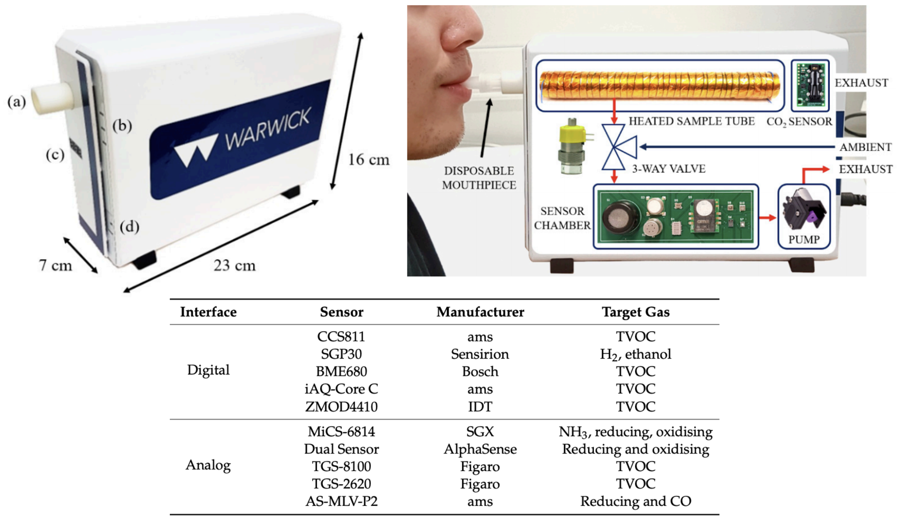

```{r setup, include = FALSE}
library(tidyverse)
# library(nhsrtheme)
# library(NHSRdatasets)
# set default options

options(
  htmltools.dir.version = FALSE, 
  htmltools.preserve.raw = FALSE,
  tibble.width = 60, tibble.print_min = 6,
  crayon.enabled = TRUE
)

knitr::opts_chunk$set(echo = FALSE, message=FALSE, warning=FALSE,
                      comment="", digits = 3, tidy = FALSE, prompt = FALSE, fig.align = 'center',
                      fig.width = 7.252,
                      fig.height = 4,
                      dpi = 300)

# uncomment the following lines if you want to use the NHS-R theme colours by default
# scale_fill_continuous <- partial(scale_fill_nhs, discrete = FALSE)
# scale_fill_discrete <- partial(scale_fill_nhs, discrete = TRUE)
# scale_colour_continuous <- partial(scale_colour_nhs, discrete = FALSE)
# scale_colour_discrete <- partial(scale_colour_nhs, discrete = TRUE)
```


class: title-slide, left, bottom

# `r rmarkdown::metadata$title`
----
## **`r rmarkdown::metadata$subtitle`**
### `r rmarkdown::metadata$author`
### `r rmarkdown::metadata$date`

 
---
class: inverse, middle
name: data-science-case

# 발표 개요

----

.pull-left[

알파고가 2016년 이세돌 9단을 가볍게 승리하면서 **AI 디지털 경제전환**이 촉발되었다면
코로나19는 .red[**디지털 경제전환**]을 가속화를 넘어 디지털 불평등을 심화시키고 있다.

AI 디지털 경제전환을 이해하는데 꼭 필요한 .black[**데이터 과학**]과 .green[**인공지능**] 기술적 토대를 살펴보고 이를 .warmyellow[**헬스케어**] 영역에 응용하여 활용방안을 모색해 보자. 

]
 
.pull-right[   
.left[

1\. **[.red[디지털 경제전환 (DT)]](#digital-transformation)**

2\. [데이터 과학 사례](#digital-data-science-case-study)

3\. [데이터 과학 (Data Science)](#data-science)

4\. **[.green[인공지능 (AI)]](#digital-ai)**

5\. [헬스케어 응용](#digital-healthcare)

6\. [마무리](#digital-goodbye)

]
] <!--end of right-column-->


```{r child='slideshows/healthcare/healthcare-goodbye.Rmd'} 
```


---
name: healthcare-data
# 개인정보

.center[

]

.footnote[
- [개인정보와 익명화](https://statkclee.github.io/privacy/anonymization.html)
]

---
name: healthcare-respiration
# 호흡 데이터 생성

.center[

]

.footnote[

```{r ai-device, results = 'asis'}
library(rcrossref)
doi <- c('10.3390/electronics9010084')
cat(unlist(rcrossref::cr_cn(dois = doi, format = "text", style = 'apa')))
```

]


 