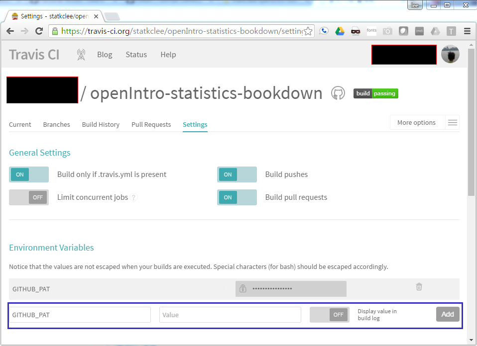

### 1. 트래비스(Travis) 연결 [^devops-github-travis]

[^devops-github-travis]: [Using Travis? Make sure you use a Github PAT](http://www.r-bloggers.com/using-travis-make-sure-you-use-a-github-pat/)

1. [GitHub PAT(Personal Access Tokens)](https://github.com/settings/tokens)를 생성한다. `Generate New Token`을 생성한다. 
    * 외부에 공개되는 만큼 최소 보안 원칙을 지켜 가능하면 최소한의 권한으로 한다. 즉, [최소권한 원칙](https://en.wikipedia.org/wiki/Principle_of_least_privilege) [^devops-github-pat], [GitHub Developer API OAuth](https://developer.github.com/v3/oauth/#scopes)를 확인한다.
    * 권장하는 것은 어떤 권한도 부여하지 않는 것이다. 
1. 생성한 키를 복사한다.
1. 트래비스(Travis) 저장소로 접근해 들어간다. 
    * 사전에 [GitHub](http://github.com)과 [트래비스(Travis)](https://travis-ci.org/)를 연동한다.
    * [GitHub](http://github.com)과 [트래비스](https://travis-ci.org/) 연동된 경우 트래비스 저장소에 해당사용자의 모든 [GitHub](http://github.com) 저장소가 표시된다.
1. [GitHub PAT(Personal Access Tokens)](https://github.com/settings/tokens)에서 생성한 토큰을 `GITHUB_PAT` 환경변수(Environment Variable)에 추가한다.

[^devops-github-pat]: [Creating an access token for command-line use](https://help.github.com/articles/creating-an-access-token-for-command-line-use/)

 

