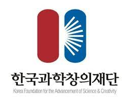
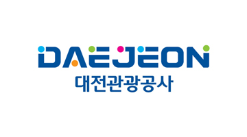
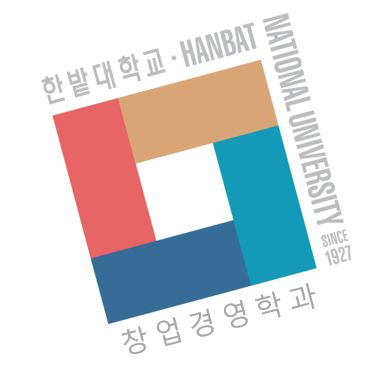

```{r setup, include = FALSE}
library(tidyverse)
xaringanExtra::use_panelset()
xaringanExtra::use_xaringan_extra(c("tile_view", "animate_css", "tachyons", "share_again"))
xaringanExtra::use_extra_styles()
library(ggmap)

# set default options

options(
  htmltools.dir.version = FALSE, 
  htmltools.preserve.raw = FALSE,
  tibble.width = 60, tibble.print_min = 6,
  crayon.enabled = TRUE
)

knitr::opts_chunk$set(echo = FALSE, message=FALSE, warning=FALSE,
                      comment="", digits = 3, tidy = FALSE, prompt = FALSE, fig.align = 'center',
                      fig.width = 7.252,
                      fig.height = 4,
                      dpi = 300)

# uncomment the following lines if you want to use the NHS-R theme colours by default
# scale_fill_continuous <- partial(scale_fill_nhs, discrete = FALSE)
# scale_fill_discrete <- partial(scale_fill_nhs, discrete = TRUE)
# scale_colour_continuous <- partial(scale_colour_nhs, discrete = FALSE)
# scale_colour_discrete <- partial(scale_colour_nhs, discrete = TRUE)

library(showtext)

showtext::showtext_auto()

# GGPLOT THEME ------------------------------------------------------------

theme_election <- function(..., font = "나눔바른펜") {
  
  theme_bw(base_family = font)  %+replace%
    
    theme(
      
      #grid elements
      panel.grid.major.x = element_line(color='gray75'),
      panel.grid.minor.x = element_blank(),
      # axis.ticks = element_blank(),          #strip axis ticks
      
      #since theme_minimal() already strips axis lines, 
      #we don't need to do that again
      
      #text elements
      plot.title = element_text(             #title
        family = font,            #set font family
        size = 30,                #set font size
        face = 'bold',            #bold typeface
        hjust = 0,                #left align
        vjust = 2),               #raise slightly
      
      plot.subtitle = element_text(          #subtitle
        family = font,            #font family
        hjust = 0,                #left align        
        size = 17),               #font size
      
      plot.caption = element_text(           #caption
        family = font,            #font family
        size = 12,                 #font size
        hjust = 1),               #right align
      
      axis.title = element_text(             #axis titles
        family = font,            #font family
        size = 20),               #font size
      
      axis.text.x = element_text(            #margin for axis text
        margin=margin(5, b = 10),
        size = rel(1.5),
        family = font, face="bold"),
      
      axis.text.y = element_text(
        size = rel(1.5),
        colour = "gray35", 
        family = font, face="bold"),
      
      strip.text.x = element_text(
        size = rel(1.5), 
        colour = "black", family = font, face="bold" ),
      
      strip.background = element_rect(fill="gray95"),
      
      legend.position = "top",
      legend.title=element_text(size=12),
      legend.text=element_text(size=10)
      
    )
}
```


class: title-slide, left, bottom

# `r rmarkdown::metadata$title`
----
## **`r rmarkdown::metadata$subtitle`**
### `r rmarkdown::metadata$author`
### `r rmarkdown::metadata$date`

 
---
class: inverse, middle
name: daejeon-public-data-toc

# 발표 개요 

----

.pull-left[

디지털 전환이 급속도로 진행됨에 따라 데이터를 수집하고 처리할 수 없을 정도로 
**.warmyellow[데이터가 폭증]**하고 있다. 무어의 법칙에 따라 컴퓨터 하드웨어와 
네트워크 분야에서 눈부신 발전을 거듭하고 있고, 
소프트웨어 분야도 오픈소스 문화가 정착됨에 따라 빅데이터 문제에 해법을 제시하고 있다.

하지만, 데이터를 통해 가치를 창출하는 **.warmyellow[시민 데이터 과학자]**가 
병목의 중심으로 부각되고 있다. 

공공 지역정보 데이터 수집과 분석 전략과 **.warmyellow[오픈 통계 패키지]**를 살펴보고,
시민이 주도가 되어 직접 인공지능 앱도 함께 개발하는 시간을 갖고자 한다.

]
 
.pull-right[   
.left[

1\. **[.warmyellow[대한민국 공공데이터]](#daejeon-public-data-toc)**

2\. [통계가 기여한 역사](#daejeon-history-toc)

3\. [오픈 통계 패키지 - BitStat](#daejeon-bitstat-toc)

4\. [인공지능 앱 개발](#daejeon-dl-toc)

]
] <!--end of right-column-->  


<!--------------------------  1. 대한민국 공공데이터 ----------------------------------------->

```{r child='slideshows/daejeon/daejeon-01-data-portal.Rmd'}
```


<!--------------------------  2. 역사적인 통계학 기여 ----------------------------------->

---
class: inverse, middle
name: daejeon-history-toc

# 발표 개요

----

.pull-left[

디지털 전환이 급속도로 진행됨에 따라 데이터를 수집하고 처리할 수 없을 정도로
**.warmyellow[데이터가 폭증]**하고 있다. 무어의 법칙에 따라 컴퓨터 하드웨어와
네트워크 분야에서 눈부신 발전을 거듭하고 있고,
소프트웨어 분야도 오픈소스 문화가 정착됨에 따라 빅데이터 문제에 해법을 제시하고 있다.

하지만, 데이터를 통해 가치를 창출하는 **.warmyellow[시민 데이터 과학자]**가
병목의 중심으로 부각되고 있다.

공공 지역정보 데이터 수집과 분석 전략과 **.warmyellow[오픈 통계 패키지]**를 살펴보고,
시민이 주도가 되어 직접 인공지능 앱도 함께 개발하는 시간을 갖고자 한다.

]

.pull-right[
.left[

1\. [대한민국 공공데이터](#daejeon-public-data-toc)

2\. **[.warmyellow[통계가 기여한 역사]](#daejeon-history-toc)**

3\. [오픈 통계 패키지 - BitStat](#daejeon-bitstat-toc)

4\. [인공지능 앱 개발](#daejeon-dl-toc)

]
] <!--end of right-column-->


```{r child='slideshows/data_science_student/ds-world-cholera.Rmd'}
```

```{r child='slideshows/data_science_student/ds-world-handwashing.Rmd'}
```

```{r child='slideshows/data_science_student/ds-world-normal.Rmd'}
```

```{r child='slideshows/data_science_student/ds-world-russia.Rmd'}
```

```{r child='slideshows/data_science_student/ds-world-nightingale.Rmd'}
```

```{r child='slideshows/data_science_student/ds-world-aircraft.Rmd'}
```


<!--------------------------  3. BitStat 오픈 통계 패키지 ----------------------------------->

```{r child='slideshows/daejeon/daejeon-03-bitstat.Rmd'}
```


<!--------------------------  4. 딥러닝 앱개발 ----------------------------------->

```{r child='slideshows/daejeon/daejeon-04-ai-app.Rmd'}
```


<!--------------------------  마무리 ----------------------------------------->

<!-- ```{r child='slideshows/daejeon/daejeon-goodbye.Rmd'} -->
<!-- ``` -->

---
name: daejeon-goodbye
class: middle, inverse

.pull-left[
# **경청해 주셔서 <br>감사합니다.**
<br/>
## AIS & [한국 R 사용자회](https://r2bit.com/)

]

.pull-right[
.right[


]
]

---
name: daejeon-sponsor 
# 후원

> 이 프로그램은 과학기술진흥기금 및 복권기금의 재원으로 운영되고,과학기술정보통신부와 한국과학창의재단의 지원을 받아 수행된 성과물로 우리나라의 과학기술 발전과 사회적 가치 증진에 기여하고 있습니다.

> R Consortium과 한밭대학교 창업경영학과에서 장소를 지원해 주셨으며, 과학기술정보통신부, 한국과학창의재단, 대전광역시, 대전관광공사, **대전과학문화거점센터** 지원해 주셨습니다.


|                                               |                               |                         |                                |
|:----------------:|:------------------:|:----------------:|:----------------:|
|  |  |  |  |
|                 |            |      |                                |

