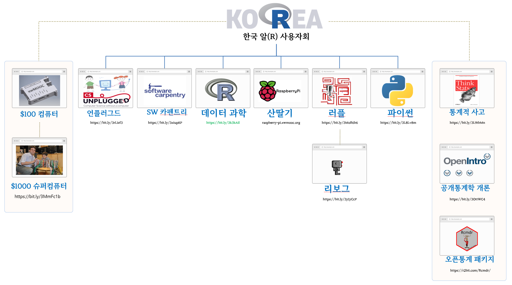

```{r setup, include = FALSE}
library(tidyverse)
# library(nhsrtheme)
# library(NHSRdatasets)
# set default options

options(
  htmltools.dir.version = FALSE, 
  htmltools.preserve.raw = FALSE,
  tibble.width = 60, tibble.print_min = 6,
  crayon.enabled = TRUE
)

knitr::opts_chunk$set(echo = FALSE, message=FALSE, warning=FALSE,
                      comment="", digits = 3, tidy = FALSE, prompt = FALSE, fig.align = 'center',
                      fig.width = 7.252,
                      fig.height = 4,
                      dpi = 300)

# uncomment the following lines if you want to use the NHS-R theme colours by default
# scale_fill_continuous <- partial(scale_fill_nhs, discrete = FALSE)
# scale_fill_discrete <- partial(scale_fill_nhs, discrete = TRUE)
# scale_colour_continuous <- partial(scale_colour_nhs, discrete = FALSE)
# scale_colour_discrete <- partial(scale_colour_nhs, discrete = TRUE)

xaringanExtra::use_panelset()
```


class: title-slide, left, bottom

# `r rmarkdown::metadata$title`
----
## **`r rmarkdown::metadata$subtitle`**
### `r rmarkdown::metadata$author`
### `r rmarkdown::metadata$date`

 
---
class: inverse, middle
name: data-science-case

# 발표 개요 

----

.pull-left[

**.warmyellow[데이터가 기하급수적으로 증가]**하고 있으며, 
지속적인 공공데이터 확대, 
데이터3법 및 데이터 기본법 통과에 따른 선진적인 데이터 법제도 기틀 마련되면서
이를 (데이터) 자원으로 가치를 창출하는 **디지털 전환**이 급속도로 진행되고 있으나,
디지털 전환에 따른 **.red[행정, 인력, 기술기반(도구와 언어)]**등 제반 여건은 성숙되지 못한 상황. 

**.red[플랫폼 (지방)정부]**를 위해서는 선진 디지털 기업을 벤치마킹하고
디지털 기업을 지탱하는 **.green[자동화(Automation)와 추상화(Abstraction)]** 
내재화가 반드시 필요함.

]
 
.pull-right[   
.left[

1\. **[.warmyellow[데이터 과학가 한일]](#ds-world)**

2\. [데이터 과학자 되는 길](#ds-world-career)

3\. [글쓰기](#ds-world-writing)

4\. [마무리](#ds-world-goodbye) 

]
] <!--end of right-column-->  
 
- [한국통계학회 소식지 2019년 10월호 ](https://statkclee.github.io/ds-authoring/ds-stat-tidyverse.html) 
  
<!--------------------------  1. 도구 ----------------------------------------->


```{r child='slideshows/data_science_world/ds-world-goodbye.Rmd'}
```


---
name: ds-world-career-joy
# 디지털 시대 시민 역량 - 교재


.center[

]


