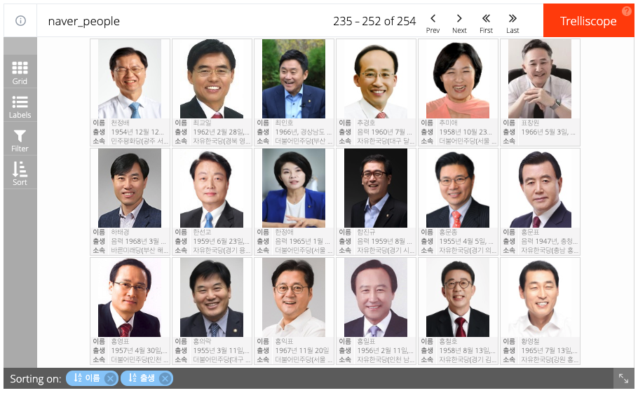
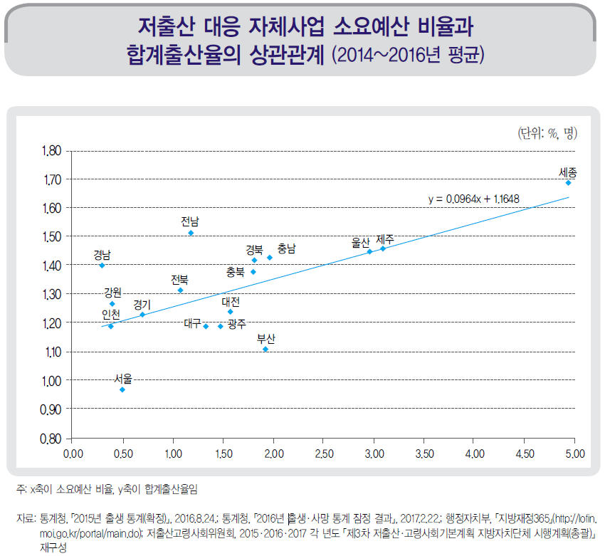
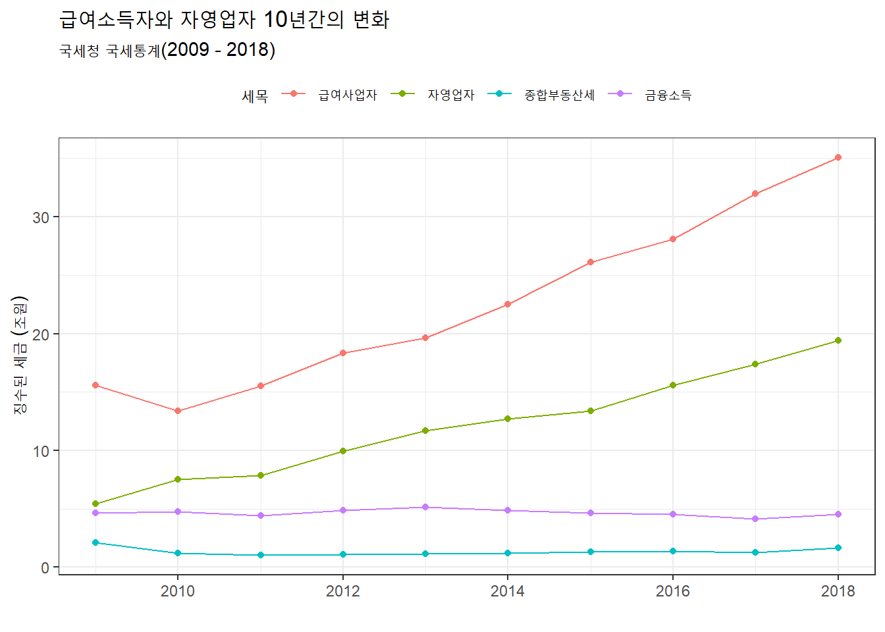

```{r setup, include = FALSE}
library(tidyverse)
# library(nhsrtheme)
# library(NHSRdatasets)
# set default options

options(
  htmltools.dir.version = FALSE, 
  htmltools.preserve.raw = FALSE,
  tibble.width = 60, tibble.print_min = 6,
  crayon.enabled = TRUE
)

knitr::opts_chunk$set(echo = FALSE, message=FALSE, warning=FALSE,
                      comment="", digits = 3, tidy = FALSE, prompt = FALSE, fig.align = 'center',
                      fig.width = 7.252,
                      fig.height = 4,
                      dpi = 300)

# uncomment the following lines if you want to use the NHS-R theme colours by default
# scale_fill_continuous <- partial(scale_fill_nhs, discrete = FALSE)
# scale_fill_discrete <- partial(scale_fill_nhs, discrete = TRUE)
# scale_colour_continuous <- partial(scale_colour_nhs, discrete = FALSE)
# scale_colour_discrete <- partial(scale_colour_nhs, discrete = TRUE)

xaringanExtra::use_panelset()
```


class: title-slide, left, bottom

# `r rmarkdown::metadata$title`
----
## **`r rmarkdown::metadata$subtitle`**
### `r rmarkdown::metadata$author`
### `r rmarkdown::metadata$date`

 
---
class: inverse, middle
name: data-science-case

# 발표 개요 

----

.pull-left[

**.warmyellow[데이터가 기하급수적으로 증가]**하고 있으며, 
지속적인 공공데이터 확대, 
데이터3법 및 데이터 기본법 통과에 따른 선진적인 데이터 법제도 기틀 마련되면서
이를 (데이터) 자원으로 가치를 창출하는 **디지털 전환**이 급속도로 진행되고 있으나,
디지털 전환에 따른 **.red[행정, 인력, 기술기반(도구와 언어)]**등 제반 여건은 성숙되지 못한 상황. 

**.red[플랫폼 (지방)정부]**를 위해서는 선진 디지털 기업을 벤치마킹하고
디지털 기업을 지탱하는 **.green[자동화(Automation)와 추상화(Abstraction)]** 
내재화가 반드시 필요함.

]
 
.pull-right[   
.left[

1\. **[.warmyellow[데이터 과학]](#krila-01-data-science)**

2\. [디지털 기업](#krila-02-digital-company)

3\. [자동화](#krila-03-automation)

4\. [플랫폼 (정부)](#krila-04-platform)

5\. [문서 공장](#krila-05-factory)

6\. [마무리](#krila-goodbye) 

]
] <!--end of right-column-->  
 
- [한국통계학회 소식지 2019년 10월호 ](https://statkclee.github.io/ds-authoring/ds-stat-tidyverse.html) 
  
<!--------------------------  1. 도구 ----------------------------------------->


```{r child='slideshows/data_science_world/ds-world-goodbye.Rmd'}
```


---
name: data-science
# 데이터 과학

데이터 사이언스(Data Science)는 데이터를 다루는 과학이다. 따라서 자연법칙을 다루는 자연과학과 맥이 닿아있다.
자연법칙을 측정하여 데이터프레임(DataFrame)으로 나타내면 **변수(Variable)**, **관측점(Observation)**, **값(Value)**으로 표현된다.


.footnote[
[Google Search - "데이터 과학"](https://www.google.com/search?q=%EB%8D%B0%EC%9D%B4%ED%84%B0+%EA%B3%BC%ED%95%99)
]


---
name: case-study-worldcup
## [실제 사례] 러시아 월드컵 (독일전)

<br>

.center[

]

.footnote[
[러시아 월드컵(2018) - 한국 vs 독일](https://statkclee.github.io/viz/viz-worldcup-germany.html)
]

---
name: case-study-earthquake
## [실제 사례] 지진해일 대피소

<br>

.center[

]

.footnote[
[xwMOOC (2018-01-17), "지진해일 대피소 - crosstalk"](https://statkclee.github.io/viz/viz-earthquake-shelter.html)
]

---
name: case-study-congress
## [실제 사례] 국회의원 프로필

<br>

.center[

]

.footnote[
[국회의원 사진 - trelliscope](https://statkclee.github.io/viz/viz-congressman.html)
]

---
name: case-study-avi
## [실제 사례] 동영상 감성 분석

<br>

.center[

]

.footnote[
- [xwMOOC 딥러닝 - 동영상 감정 분석](https://statkclee.github.io/deep-learning/ms-oxford-video.html)
- [KBS NEWS, 인공지능으로 분석한 대통령의 마음…슬픔은 어디에?](http://news.kbs.co.kr/news/view.do?ncd=3390429&ref=D)
]

---
name: case-study-regression
## [실제 사례] 회귀분석 - MLB 투수 유전자는 유전이 될까?

<br>

.center[

]

.footnote[
[회귀분석 - MLB 투수 유전자는 유전이 될까?](https://statkclee.github.io/politics/pe-baseball-era.html)
]

---
name: case-study-birthrate
## [실제 사례] 출산장려 예산은 출산율을 높일까?

<br>

.center[

]

.footnote[
[저출산과 소요예산 - 상관관계](https://statkclee.github.io/viz/viz-low-birth-rate.html)
]

---
name: case-study-tax
## [실제 사례] 증가된 정부예산: 누가 세금을 많이 냈나?

<br>

.center[

]

.footnote[
[국세 세금 데이터 분석](https://statkclee.github.io/election/election_tax_EDA.html)
]


---
name: case-study-dashboard
## [실제 사례] 대쉬보드

<br>

.center[

]

.footnote[
[대통령선거 - 대쉬보드](https://aispiration.com/president/social-dashboard.html)
]


---
name: data-science-mindmap
# 데이터 과학 마음 지도


.footnote[
[Google Search - "데이터 과학"](https://www.google.com/search?q=%EB%8D%B0%EC%9D%B4%ED%84%B0+%EA%B3%BC%ED%95%99)
]

