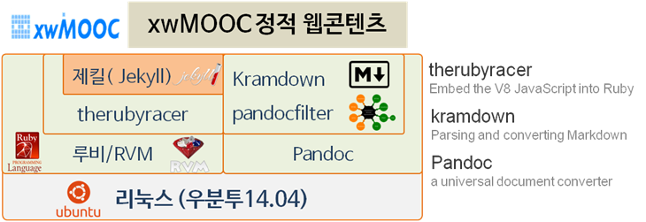

> ## 학습 목표 {.objectives}
>
> *  정적 웹콘텐츠 개발 툴체인(Tool Chain)을 이해한다. 
> *  정적 웹콘테츠 개발 가상컴퓨터 환경을 구축한다.
> *  우분투 경로명 환경설정을 이해한다.

## 정적 웹콘텐츠 제작 툴체인(Tool Chain)

정적 웹콘텐츠를 **`제킬(Jekyll)`** 기반으로 구축하기 위해서 `제킬(Jekyll)`과 관련된 소프트웨어도 함께 
버젼을 맞추어서 설치해야 된다. 특히, [소프트웨어 카펜트리](http://software-carpentry.org/)에서 정적 웹콘텐츠 저작을 위한 좋은 툴을 개발하여 활발히 사용되고 있다. [소프트웨어 카펜트리](http://software-carpentry.org/) 저작 도구는 `pandoc`, `jekyll`에 기반하고 있고 근본에는 루비언어 기반으로 글로벌 협업도구 **GitHub** 인프라가 깔려있다.

~~~ {.output}
Package Manager         Language               Webpage Reuse           Plugins (SWCarepntry)
+-----------+           +----------+           +-----------+           +---------------+ 
|           |           |          |           |           |           | therubyracer  |
| RVM       |---------->| Ruby     |---------->| Jekyll    |<--------->| pandocfilters |
|           |           |          |           |           |           | kramdown      | 
+-----------+           +----------+           +-----------+           +---------------+ 
                                                    ^
Document Converter                                  |
+-----------+                                       |
|           |                                       |
| Pandoc    |----------------------------------------
|           |          
+-----------+          
~~~

> ### 설치가 필요한 소프트웨어 {.callout}
> 
> * RVM(Ruby Version Manager) : 루비 버젼 관리자 
> * 팬독(Pandoc) : 마크다운 문서 변환 소프트웨어
> * 루비(Ruby) : 마츠모토 유키히로가 개발한 동적 객체 지향 스크립트 프로그래밍 언어.
> * 제킬(Jekyll) : GitHub 공동 창업자 Tom Preston-Werner이 루비로 작성한 단순하며, 블로그-인식, 정적사이트 생성 프로그램.
> * therubyracer : 루비 언어내에서 V8 자바스크립트 인터프리터를 내장. NodeJS 대신 경량화된 자바스크립트 인터프리터로 사용.
> * pandocfilters : pandoc 필터를 작성하는 파이썬 모듈. pandoc 필터는 파이프로 JSON을 받아 변환하여 출력한다.
> * kramdown : 루비로 작성된 마크다운 변환기

### 1. 팬독(Pandoc) 설치

`sudo apt-get install pandoc` 초기 버젼설치를 하지만 이전 버젼이라 최신 버젼으로 갱신하는 2단계 설치과정을 거친다.

### 1.1 Pandoc 초기 설치 

`sudo apt-get install pandoc` 명령어를 통해 `pandoc`을 설치할 경우 우분투 기본설정된 소프트웨어 저장소 정보가 최신이 아니라 이전 버젼 `pandoc`이 설치되어 다른 소프트웨어와 의존성 문제를 많이 일으킨다. 

~~~ {.input}
root@std-ubuntu:~# sudo apt-get update
root@std-ubuntu:~# sudo apt-get install pandoc
root@std-ubuntu:~# pandoc -v
~~~

~~~ {.output}
pandoc 1.12.2.1
Compiled with texmath 0.6.5.2, highlighting-kate 0.5.5.1.
Syntax highlighting is supported for the following languages:
    actionscript, ada, apache, asn1, asp, awk, bash, bibtex, boo, ..............................................................sql, sqlmysql, sqlpostgresql, tcl, texinfo, verilog, vhdl, xml, xorg, xslt, xul, yacc, yaml
Default user data directory: /root/.pandoc
Copyright (C) 2006-2013 John MacFarlane
Web:  http://johnmacfarlane.net/pandoc
This is free software; see the source for copying conditions.  There is no warranty, not even for merchantability or fitness for a particular purpose.
~~~

### 1.2 Pandoc 최신 설치 

`pandoc` 최신 버젼을 설치하여 사전에 여러 문제를 해결한다. [우분투 질문(askubuntu)](http://askubuntu.com/questions/341295/install-pandoc-required-for-docverter)사이트에 `cabal`을 이용한 `pandoc` 버젼을 올리는 방법이 나와 있다. 시간이 조금 걸릴 수 있으니 참조한다.
`cabal`을 설치하고 `cabal update`하고, `PATH=$HOME/.cabal/bin:$PATH` 명령어로 해당 터미널에서만 환경설정하고 나서,
`cabal install alex happy`을 통해 `alex`, `happy`를 설치하고, `cabal install pandoc pandoc-citeproc` 명령어로 `pandoc`과 `pandoc-citeproc`를 설치한다. `alex`, `happy`를 사용한 방법은 하스켈(haskell) 플랫폼 없이 `pandoc`을 설치하는 방법이다.

`sudo apt-get install zlib1g-dev`도 없으면 오류가 발생하여 설치가 되지 않을 수 있으니 사전에 설치한다.

~~~ {.input}
root@std-ubuntu:~# sudo apt-get install zlib1g-dev 
root@std-ubuntu:~# sudo apt-get install cabal-install
root@std-ubuntu:~# cabal update
root@std-ubuntu:~# PATH=$HOME/.cabal/bin:$PATH
root@std-ubuntu:~# cabal install alex happy
root@std-ubuntu:~# cabal install pandoc pandoc-citeproc
root@std-ubuntu:~# pandoc -v
~~~~

~~~ {.output}
pandoc 1.14.0.4
Compiled with texmath 0.8.2, highlighting-kate 0.6.
Syntax highlighting is supported for the following languages:
    abc, actionscript, ada, agda, apache, asn1, asp, awk, bash, ...........xslt, xul, yacc, yaml, zsh
Default user data directory: /root/.pandoc
Copyright (C) 2006-2015 John MacFarlane
Web:  http://johnmacfarlane.net/pandoc
This is free software; see the source for copying conditions. There is no warranty, not even for merchantability or fitness for a particular purpose.
~~~

[구글 그룹스 질의 응답](https://groups.google.com/forum/#!msg/pandoc-discuss/tf4iGstPxaE/Obf9I51sKiQJ)에도 나와 있지만, 경로설정을 빼먹지 말자. 가상 컴퓨터 로그인할 때 자동 실행되는 우분투의 경우 `.profile`에 다른 리눅스이 경우 `.bash_profile` 파일 맨 하단에 다음 `export PATH=$HOME/.cabal/bin:$PATH` 명령어를 삽입한다. 따라서, 다음 로그인할 때 자동으로 설치한 최신 `pandoc`을 실행한다.
혹은, `.bashrc` 파일에 동일 명령어를 하단에 삽입하여 명령어가 실행될 때마다 수행되게 할 수도 있다.

~~~ {.input}
export PATH=$HOME/.cabal/bin:$PATH
~~~

## 2 루비(Ruby) 설치

`제킬(Jekyll)`은 로컬 컴퓨터에서 정적 웹콘텐츠(Static Web Contents) 개발을 지원하는데 루비 의존성이 있다. 특히 옛날버젼 루비(Ruby)를 설치하면 여러가지 오류가 생겨 `RVM(Ruby Version Manager)` 도움을 통해 루비를 설치하고 `제킬(Jekyll)`을 올린다.

### 2.1 깨끗한 우분투 설치 환경 만들기 

RVM을 설치하기 전에 깨끗하게 우분투에 있는 이전버젼 `ruby`, `ruby-rvm`을 제거한다.

~~~ {.input}
root@std-ubuntu:~# sudo apt-get remove --purge ruby-rvm ruby
root@std-ubuntu:~# sudo rm -rf /usr/share/ruby-rvm /etc/rmvrc /etc/profile.d/rvm.sh
~~~

### 2.2 `rdoc`와 `ri` 문서화 모듈 없이 설치 및 관련 소프트웨어 설치

`rdoc`와 `ri` 문서화 모듈을 루비 설치시 동반할 경우 속도가 매우 느릴 수 있어 빠르게 하기 위해서,
문서화 모듈 없이 설치를 진행한다. `gem: --no-rdoc --no-ri`를 설정파일 하단에 삽입하고 `tail` 명령어로 확인한다.

~~~ {.input}
root@std-ubuntu:~# echo 'gem: --no-rdoc --no-ri' >> ~/.gemrc
root@std-ubuntu:~# tail ~/.gemrc
~~~

~~~ {.output}
gem: --no-rdoc --no-ri
~~~

`RVM` 루비 버젼관리자를 설치하기 전에 `git`, `build-essential`, `curl`, `wget`을 미리 설치한다. 사실 `rvm` 설치할 때 필요한 소프트웨어다. 

~~~ {.input}
root@std-ubuntu:~# sudo apt-get install -y git build-essential curl wget
~~~

### 2.3 `rvm` 통한 `ruby` 설치 및 환경설정

`rvm`을 로그인할 때 자동으로 적재(load)되록 `bash` 쉘인 경우 `~/.bashrc` 스크립트에 다음 행을 추가한다. 그리고 `ruby`를 설치한다.
`curl -sSL https://get.rvm.io | bash -s stable --ruby` 명령어를 실행하면 루비를 설치하는데 시간이 걸리니 커피를 한잔하고 와도 좋다.

~~~ {.input}
root@std-ubuntu:~# echo "[[ -s '${HOME}/.rvm/scripts/rvm' ]] && source '${HOME}/.rvm/scripts/rvm'" >> ~/.bashrc
root@std-ubuntu:~# gpg --keyserver hkp://keys.gnupg.net --recv-keys 409B6B1796C275462A1703113804BB82D39DC0E3
root@std-ubuntu:~# curl -sSL https://get.rvm.io | bash -s stable --ruby
~~~

`rvm`을 통한 `ruby` 설치가 완료되어 시스템을 다시 리부팅하거나 로그아웃하고 나서 다시 로그인한다.

~~~ {.input}
root@std-ubuntu:~# ruby --version
~~~

~~~ {.output}
ruby 2.2.1p85 (2015-02-26 revision 49769) [x86_64-linux]
~~~

> ## 루비 버젼 {.callout}
>
> `ruby` 1.9.x 버젼에서 의존성 문제가 있지만, `ruby` 2.x.x 이상 버전 사용을 권장한다.

## 3. 제킬(Jekyll) 설치

루비 최신 버젼이 설치되면 제킬 및 관련 소프트웨어 설치는 쉽게 설치할 수 있다.
제킬은 [의존성](http://jekyllrb.com/docs/installation/#requirements)이 `Ruby`, `RubyGems`, `NodeJS`가 있다. 
다만, `NodeJS`는 덩치가 크고 무겁기 때문에 대신에 `therubyracer`를 대신 설치한다. 
`jekyll`, `kramdown`, `pandocfilters`를 차례로 설치한다. 

`pandocfilters`는 파이썬 설치 모듈을 필요로 해서 `python-pip`를 설치한 후 `pip install` 명령어로 설치한다.

~~~ {.input}
root@std-ubuntu:~# gem install therubyracer
root@std-ubuntu:~# gem install jekyll
root@std-ubuntu:~# gem install kramdown
root@std-ubuntu:~# apt-get install python-pip
root@std-ubuntu:~# pip install pandocfilters
~~~

### 4. 정적 웹콘텐츠 제작 테스트

마크다운으로 저작을 한 후에 HTML을 비롯한 다양한 콘텐츠 형식으로 변환이 되는지 테스트를 하기 위해서 먼저 GitHub에서 예제 파일을 하나 다운로드한다.

~~~ {.input}
root@std-ubuntu:~# git clone -b gh-pages https://github.com/swcarpentry/lesson-example.git
root@std-ubuntu:~# cd lesson-example/
root@std-ubuntu:~/lesson-example# make preview
~~~

마크다운 `.md` 파일을 `.html` 파일로 변환한다.

~~~ {.output}
pandoc -s -t html \
            --smart \
            --template=_layouts/page \
            --filter=tools/filters/blockquote2div.py \
            --filter=tools/filters/id4glossary.py \
            -Vheader="$(cat _includes/header.html)" -Vbanner="$(cat _includes/ba
nner.html)" -Vfooter="$(cat _includes/footer.html)" -Vjavascript="$(cat _include
s/javascript.html)" \
            -o 01-one.html 01-one.md
~~~

제킬을 이용하여 서비스로 사용할 정적 웹콘텐츠를 `/var/www/html/`에 생성하자.

~~~ {.shell}
root@std-ubuntu:~/lesson-example # jekyll build -d /var/www/html/
~~~

~~~ {.output}
Configuration file: none
            Source: /root/lesson-example
       Destination: /var/www/html/
      Generating...
                    done.
 Auto-regeneration: disabled. Use --watch to enable.
~~~

## 5. 우분투 경로명 환경 설정

`pandoc`를 최신 버젼으로 버젼을 올릴 때 경로설정에 많은 애로를 얻게 얻는다. `echo $PATH` 명령어를 통해서 현재 설정된 경로를 확인한다.

### 5.1. 경로명(PATH) 확인

`echo $PATH` 명령어를 통해 현재 지정된 경로를 확인한다.

~~~ {.input}
root@std-ubuntu:~# echo $PATH
~~~

~~~ {.output}
/usr/local/sbin:/usr/local/bin:/usr/sbin:/usr/bin:/sbin:/bin:/usr/games:/usr/local/games
~~~

### 5.2. 경로명(PATH) 변경

경로를 지정하는 방법은 여러가지 방법이 있다. 도스 시절의 `autoexec.bat` 파일에 컴퓨터가 부팅될 때 자동 실행되게 설정을 했듯이 우분투에서도 비슷한 접근법을 취한다. 

- **`.bashrc`** : 쉘 명령어가 실행될 때마다 실행될 경로명 지정
- **`.profile`** : 최초 로그인할 때 실행될 경로명 지정 (다른 리눅스에서는 파일명이 `.bash_profile`)
- **`export`** : `export` 명령어를 쉘 프롬프트에 경로명과 함께 적어 일시적으로만 사용한다.

### 5.3. 변경한 경로명(PATH) 적용

우분투 `.profile`에 적용(다른 리눅스 버젼이면 `.bash_profile`)했다면 다시 로그인하면 된다. 특히 `ssh` 로그인을 사용하는 경우 유용한다. 다시 로그인하지 않고 변경한 경로명을 즉시 적용하고자 할 경우 다양한 명령어를 통해서 가능하다. 기본은 `source ~/.bashrc`지만 단축 명령어가 여러가지가 있다. `. ~/.bashrc`, `exec bash`도 가능하다.

~~~ {.input}
root@std-ubuntu:~# source ~/.bashrc
~~~

~~~ {.input}
root@std-ubuntu:~# . ~/.bashrc
~~~

~~~ {.input}
root@std-ubuntu:~# exec bash
~~~

