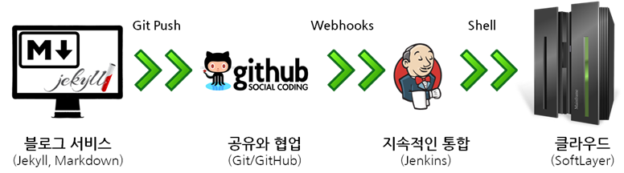
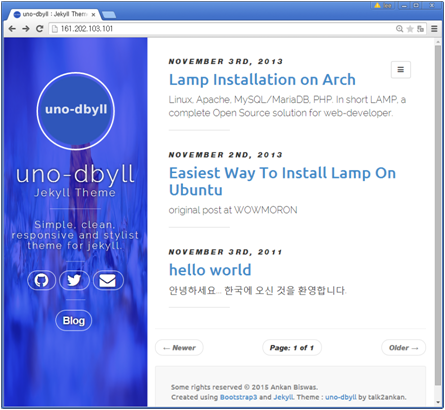
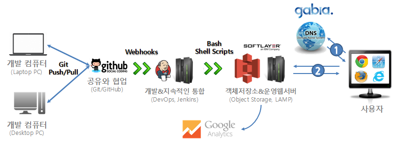
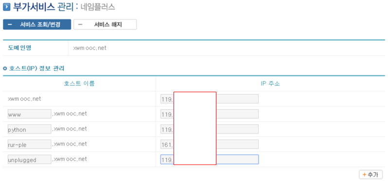
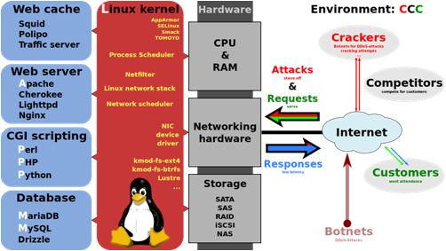
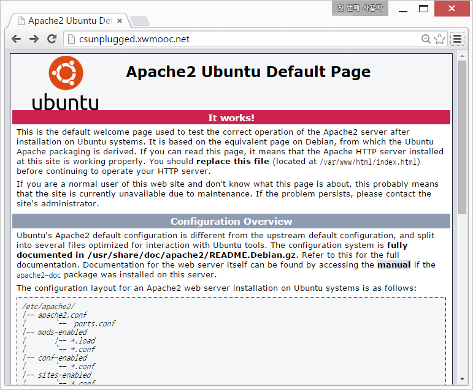
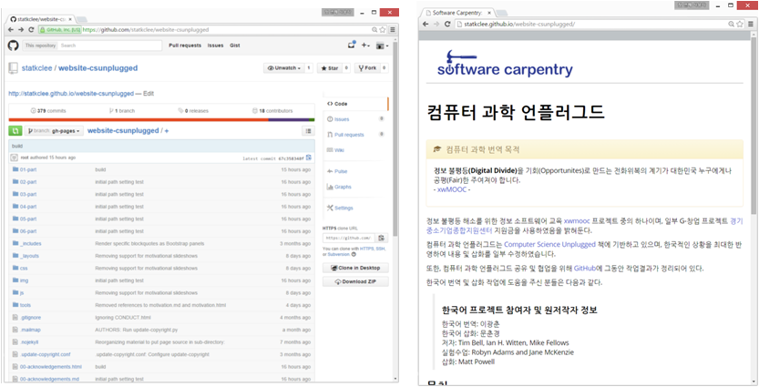

> ## 학습 목표 {.objectives}
>
> * 개발, 배포, 운영 서비스 개발 주기를 이해한다.
> * 컴퓨터 과학 언플러그드를 정적 웹서비스로 제품화한다. 

### 1. 개발운영(DevOps) 툴체인 다시 보기

개발운영(DevOps)는 개발(Development)과정과 운영(Operations)과정이 분리되어 이원화되고 
폭포수(Waterfall) 개발 과정을 지속적인 통합(Continuous Integration, CI) 과정으로 구현한다.
이를 위해서 다양한 기술과 툴체인이 필요하다. 전반적인 개발운영 툴체인이 구축되고 나면,
개발과정이 수작업 없이 매우 간결하고, 정확하며 빠르게 진행된다.

1. 개발 및 저작환경 : 마크다운을 개발언어로 제킬을 플랫폼으로 사용한다.
    - [제킬 테마](http://jekyllthemes.org/)에서 다양한 종류의 제킬 테마를 설치하여 이용할 수 있다.
    - 제킬 테마에서 [Uno-dbyll](http://jekyllthemes.org/themes/uno-dbyll/)를 다운로드받아 설치한다.
2. Git에서 변경사항이 생길 경우 지속적인 통합이 이루어져 자동 배포가 되도록 작업한다.
    - `git push`를 보낼 경우 작업을 깃허브에서 처리하도록 저장소를 하나 생성한다.
3. 깃허브와 젠킨스를 웹훅을 통해서 연결한다.
    - 깃허브를 중심으로 푸쉬 기반으로 설계하여 구현한다.
4. 젠킨스가 클라우드 지정한 가상 컴퓨터에 자동 배포한다.

#### 1.1. 개발 및 저작환경 

선택한 [uno-dbyll](https://github.com/talk2ankan/uno-dbyll) 제킬 테마를 포크(Fork)하여 깃허브 개인 저장소로 가져온다.
`git clone -b gh-pages` 명령어를 통해서 `gh-pages` 브랜치만 로컬로 복사해서 가져온다.
[uno-dbyll](https://github.com/talk2ankan/uno-dbyll)를 다운로드 받은 디렉토리에서 
`_posts`에 마크다운으로 `2011-11-03-hello-world.md` 파일을 저작 생성한다. 
그리고 `jekyll serve` 명령을 통해서 로컬 `_site`에 서비스할 웹페이지를 생성한다.
혹은 `http://127.0.0.1:4000/` 웹브라우져 로컬 호스트에서 생성한 웹페이지를 확인한다.

~~~ {.input}
$ git clone -b gh-pages git@github.com:statkclee/uno-dbyll.git
$ cd uno-dbyll/_posts
$ ls
2011-11-03-hello-world.md
2013-11-02-easiest-way-to-install-lamp-on-ubuntu.md
2013-11-03-lamp-installation-on-Arch.md
$ jekyll serve
~~~

#### 1.2. Git/GitHub 버젼관리 및 공동개발

공유와 협업이 강조되고 글로벌화가 보편화된 현재 버젼관리 보다도 글로벌 공동개발 및 협업을 위해서 깃허브가 많이 사용된다.
이제 로컬에서 개발 검증한 산출물을 버젼관리 및 글로벌 협업을 위해 Git/GitHub를 이용한다.
이미 이전 단계에서 `git clone`을 통해서 전세계 누군지는 모르지만 제킬 테마에 공유한 훌륭한 작업 산출물을 소비자 입장에서
사용하고 있으며 이번 단계는 생산자 입장으로 기여 공헌한다고 생각할 수도 있다.

~~~ {.input}
$ git add _posts/2011-11-03-hello-world.md
$ git commit -m "initial commit with Hello World"
$ git push origin gh-pages
~~~

#### 1.3. 깃허브와 젠킨스를 웹훅을 통해서 연결

깃허브 해당 프로젝트 저장소로 이동해서, 우측에 **Settings** --> **Webhooks & Services**를 클릭한다.
**Services**에서 **Add service**를 클릭하고, 젠킨스 서버에서 설치한 플러그인 **Jenkins (GitHub plugin)**을 선택한다.
비밀번호 인증을 마치고 나면 **Jenkins hook url**이 나타나고 젠킨스 서버가 설치된 웹호스트를 
`http://161.202.103.101:8080/github-webhook/`와 같이 지정하고 **Add service**로 저장한다.

#### 1.4. 젠킨스가 클라우드 지정한 가상 컴퓨터에 자동 배포한다.

젠킨스 첫화면에서 `새로운 Item`을 클릭하고 `Item 이름`에 `uno-dbyll` 이름으로 `새로운 Item`을 등록한다. 그리고 나서 `Freestyle project`를 클릭하고 `OK`를 클릭한다. 그리고 나서 차례로 관련 정보를 입력한다.

- GitHub project : https://github.com/statkclee/uno-dbyll
- 소스 코드 관리 : `Git` 클릭, Repositories --> Repository URL : https://github.com/statkclee/uno-dbyll.git Credentials에는 Add를 클릭해서 GitHub 사용자이름과 비밀번호를 입력한다.
- Branches to build : Branch Specifier (blank for 'any') `*/gh-pages`로 브랜치를 설정한다.
- Additional Behaviors : Add를 클릭하고 `Advanced sub-module behaviours`를 선택한다.
- 빌드 유발 : `Build when a change is pushed to GitHub` 체크한다.
- Build : `Add build step` --> `Execute Shell` 을 클릭하고 실행 쉘 스크립트를 작성한다.

**쉘스크립트**
쉘스크립트 내용은 `git` 에서 브랜치 `gh-pages`를 배포서버로 풀(`pull`)로 가져온다는 내용이다. 그리고 `make preview`를 통해서 빌드 작업을 하고 `jekyll build --destination /var/www/html` 명령어를 통해서 정적웹사이트를 생성한다. 그러면 자동으로 웹서버 배포위치로 배포가 완료된다.

~~~ {.input}
git submodule foreach git checkout gh-pages
git submodule foreach git pull
make preview
jekyll build --destination /var/www/html/
~~~

> ### Jenkins 권한관리 {.callout}
>
> `/var/www/html/` 디렉토리 소유자가 `root`인 경우 
> *permission denied "jekyll build -- destination /var/www/html* 처럼 권한 오류가 발생되어 빌드가 되지 못한다.
> 이런 경우 `whoami` 를 통해서 사용자를 확인하고 사용자에게
> `/var/www/html/` 적절한 권한을 부여한다. 사용자가 `jenkins` 라면
> `root@dev:~# chown -cR jenkins /var/www/html/`에 권한을 부여한다. 
> `-cR`은 `/var/www/html/` 디렉토리 및 내부 모든 파일의 소유자, 소유그룹을 변경한다.

빌드 진행 결과는 첫 대쉬보드 화면에서 **최근 성공** 에서 마우스를 위치하면 검은색 작은 삼각형이 생기고,
**Console Output**이 생기며 이를 클릭하면 확인할 수 있다.

~~~ {.output}
Started by user xwmooc
Building in workspace /var/lib/jenkins/workspace/rpy-cloudlayer
 > git rev-parse --is-inside-work-tree # timeout=10
Fetching changes from the remote Git repository
 > git config remote.origin.url https://github.com/statkclee/pyr-cloudlayer.git # timeout=10
Fetching upstream changes from https://github.com/statkclee/pyr-cloudlayer.git
 > git --version # timeout=10
using .gitcredentials to set credentials
 > git config --local credential.helper store --file=/tmp/git7866883837254744715.credentials # timeout=10
 > git -c core.askpass=true fetch --tags --progress https://github.com/statkclee/pyr-cloudlayer.git +refs/heads/*:refs/remotes/origin/*
 > git config --local --remove-section credential # timeout=10
 > git rev-parse refs/remotes/origin/gh-pages^{commit} # timeout=10
 > git rev-parse refs/remotes/origin/origin/gh-pages^{commit} # timeout=10
Checking out Revision 4a3d0d768fb85fa42841272f24afbeb48f3b7e35 (refs/remotes/origin/gh-pages)
 > git config core.sparsecheckout # timeout=10
 > git checkout -f 4a3d0d768fb85fa42841272f24afbeb48f3b7e35
 > git rev-list 4a3d0d768fb85fa42841272f24afbeb48f3b7e35 # timeout=10
[rpy-cloudlayer] $ /bin/sh -xe /tmp/hudson5339196130263367403.sh
+ git submodule foreach git checkout master
+ git submodule foreach git pull
+ make preview
make: Nothing to be done for `preview'.
+ whoami
jenkins
+ jekyll build --destination /var/www/html
[33mConfiguration file: none[0m
            Source: /var/lib/jenkins/workspace/rpy-cloudlayer
       Destination: /var/www/html
      Generating... 
                    done.
 Auto-regeneration: disabled. Use --watch to enable.
Sending e-mails to: i@xwmooc.net
Finished: SUCCESS
~~~

**빌드 후 조치 추가: 전자우편**
빌드가 완료된 후 자동으로 전자우편을 통해서 내용을 확인할 수 있다. 빌드가 성공되면 성공 메시지가, 실패하면 로그가 함께 전송되어 빌드결과를 바로 확인한다. 젠킨스 첫 대쉬보드 화면에서 `Jenkins 관리` --> `시스템 설정` --> `E-mail로 알려줌` 으로 내려간다. 구글 지메일(gmail)을 예시로 한다.

- SMTP 서버 : smpt.gmail.com      
- Default user e-mail suffix : @ gmail.com
- `Use SMTP Authentication` 을 체크한다.
- 사용자명 : gildong.hong@gmail.com
- 비밀번호 : `****************`
- `SSL 사용` 을 체크한다.
- SMTP Port : 465
- Reply-to Address : gildong.hong@gmail.com
- Charset : UTF-8

이제 빌드 후 조치도 완료했다. 젠킨스를 통해서 빌드가 완료되면 제킬을 통해 생성한 산출물을 웹서비스 제공위치로 이동하면 모든 작업이 완료된다. 처음 로컬 호스트 컴퓨터에서 작업을 하고 `git push` 명령을 전송하면 자동으로 모든 작업이 완료되고, 결과값이 모바일폰으로 전송도 된다. 

### 2. 컴퓨터과학 언플러그드 사례

[컴퓨터과학 언플러그드](http://csunplugged.org/)는 컴퓨터없이 컴퓨터 과학을 배우는 것으로 뉴질랜드에서 시작해서 전세계적으로 일부 차이는 있지만 실질적인 표준 교육과정으로 자리잡았다. 한국에서도 [xwMOOC](http://www.xwmooc.net)에서  [컴퓨터과학 언플러그드](http://csunplugged.org/) 가장 최신 [버젼 3.1](http://csunplugged.org/books/) 맞춰 번역을 완료하고 한국에서 추진되고 있는 언플러그드 활동을 가장 최신 정보 형태로 제공하고 있다.

#### 2.1. 서비스 제공 아키텍쳐

컴퓨터과학 언플러그드 서비스를 제공하는 과정은 마이크로소프트 워드나 아래아 한글 프로그램을 이용하여 단순히 컴퓨터과학 언플러그드 콘텐츠를 책 형태로 제공하는 것에서 벗어나 누구나 컴퓨터과학 언플러그드 콘텐츠 제작에 참여할 수 있고, 누구나 제작한 콘텐츠를 디바이스 종류에 관계없이 최상의 콘텐츠를 볼 수 있도록 공정한 활용이 가능하게 하는 것을 목표로 아키텍처를 잡았다. 

- Git/GitHub : 버젼관리 및 공유와 협업
- 개발서버와 젠킨스 : 지속적인 통합과 서비스 배포 자동화
- 객체저장소와 운영서버 : 무상태 웹서비스 아키텍처 및 오토 스케일링
- DNS 서비스 : 클라우드 운영 서버와 도메인 네임서비스 연결
- 구글 애널리틱스 : 사용자 웹로그 분석

##### 2.2.1. 도메인 네임 시스템(DNS) 설정

사용자가 컴퓨터과학 언플러그드 서비스를 제공받으려면 먼저 웹브라우져를 열고 주소창에 한국어 컴퓨터과학 언플러그드 도메인 네임을 입력하여 서비스 제공을 요청한다.

컴퓨터과학 언플러그드 서비스 제공자는 도메인 네임 시스템에 호스트/컴퓨터와 도메인을 연결하여 사용자가 IP주소를 기억할 필요없이 도메인 네임만 기억해서 바로 서비스를 제공받을 수 있게 한다.

도메인 네임 [csunplugged.xwmooc.org](http://csunplugged.xwmooc.org)을 생성한 운영 가상 웹서버 IP주소(`119.XXX.XXX.XXX`)와 연결한다. 

##### 2.2.2. 운영서버 준비

컴퓨터과학 언플러그드 웹서비스를 제공하기 위해서 기본적으로 [아파치](http://httpd.apache.org/), [nginx](http://nginx.org/en/) 같은 웹서비스 제공 소프트웨어를 설치해야 한다. 일반적으로 [LAMP](https://ko.wikipedia.org/wiki/LAMP)가 웹서비스를 제공하기 위한 하나의 팩키지로 되어 있어 베어메탈 하드웨어 위에 리눅스, 웹서버, 데이터베이스, 프로그래밍 언어를 각기 `sudo apt-get install apache2 mysql-server php5 php5-mysql` 설치하기도 하고, WIMP, LAMP, WAMP 등 개발-운영 환경에 맞춰 선택하기도 한다.

**도메인 네임과 운영 웹서버 연결 테스트**  

도메인 네임과 운영 웹서버 연결 테스트는 사용자 입장에서 웹브라우져를 열고 IP 주소를 입력한다. 도메인 네임 [csunplugged.xwmooc.org](http://csunplugged.xwmooc.org)과 웹서버 IP주소(`119.XXX.XXX.XXX`)를 주소창에 입력하면 동일한 화면이 출력되어야 한다. 

> #### 아파치 웹서버 구동 명령 {.callout}
>
> 웹서버 명령어는 `start`, `stop`, `restart`가 있다.
> `apache2` 다음에 인자를 달리하여 시작, 재시작, 중지한다.    
> 1. 명령-라인 실행 방법 : `root@csunplugged:~# /etc/init.d/apache2 restart`  
> 2. `service` 명령어 사용방법 : `sudo service apache2 restart`  
> 3. `~/.bash_profile` 프로파일 `alias` 설정 : `alias apache='sudo /etc/init.d/apache2'` 다음에 `apache restart` 명령어로 실행한다.

##### 2.2.3. 개발 컴퓨터 환경 설정

단독 개발을 하거나, 팀을 구성해서 개발을 할 때 버젼관리와 협업을 동시에 해야 한다. 이러한 목적을 달성하는 효과적인 방법이 **Git/GitHub**을 사용하는 것이다. 단독 개발할 때 개발 컴퓨터가 노트북(사무실)과 데스크톱(집)에 설치되어 있는 경우 개발 산출물을 동기화하거나 버젼관리 목적으로 *Git*과 *GitHub*를 동시에 사용한다. 

~~~ {.input}
# 노트북 컴퓨터 작업 사항
$ git add --a
$ git commit -m "added computer science unplugged template"
$ git push origin gh-pages
~~~

`git add --a` 명령어로 변경사항을 임시 저장소에 저장하고, `git commit -m` 명령어로 *Git* 로컬 저장소에 변경사항을 저장한다. 
`git push origin gh-pages` 명령어로 로컬 저장소 내용을 원격저장소 *GitHub*으로 저장한다.

~~~ {.input}
# 집 컴퓨터 작업 사항
$ git pull origin gh-pages
$ git add --a
$ git commit -m "added computer science unplugged template"
$ git push origin gh-pages
~~~

집에 있는 PC 컴퓨터에서 작업을 시작하기 전에 *GitHub* 클라우드 저장소의 작업내용을 `git pull origin gh-pages` 명령어로 가져온다. 다음 동일하게 노트북 컴퓨터에서 작업하듯이 결과를 *GitHub*에 올린다. 

##### 2.2.4. 구글 애널리틱스(Google Analytics) 설정

[구글 애널리틱스](http://www.google.com/analytics/)에 계정을 생성하고 추적할 웹사이트를 등록하면 추적코드가 생성된다. 생성된 추적코드를 추적하고자하는 웹페이지에 `<head> </head>` 등록한다. 혹은 별도의 파일로 만들어서 `include`해도 된다.

~~~ {.input}

~~~

