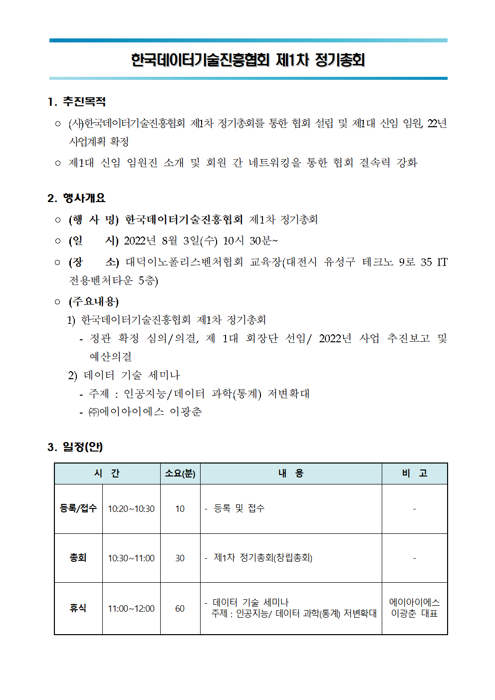

```{r setup, include = FALSE}
library(tidyverse)
xaringanExtra::use_panelset()
xaringanExtra::use_xaringan_extra(c("tile_view", "animate_css", "tachyons", "share_again"))
xaringanExtra::use_extra_styles()
library(ggmap)

# set default options

options(
  htmltools.dir.version = FALSE, 
  htmltools.preserve.raw = FALSE,
  tibble.width = 60, tibble.print_min = 6,
  crayon.enabled = TRUE
)

knitr::opts_chunk$set(echo = FALSE, message=FALSE, warning=FALSE,
                      comment="", digits = 3, tidy = FALSE, prompt = FALSE, fig.align = 'center',
                      fig.width = 7.252,
                      fig.height = 4,
                      dpi = 300)

# uncomment the following lines if you want to use the NHS-R theme colours by default
# scale_fill_continuous <- partial(scale_fill_nhs, discrete = FALSE)
# scale_fill_discrete <- partial(scale_fill_nhs, discrete = TRUE)
# scale_colour_continuous <- partial(scale_colour_nhs, discrete = FALSE)
# scale_colour_discrete <- partial(scale_colour_nhs, discrete = TRUE)

library(showtext)

showtext::showtext_auto()

# GGPLOT THEME ------------------------------------------------------------

theme_election <- function(..., font = "나눔바른펜") {
  
  theme_bw(base_family = font)  %+replace%
    
    theme(
      
      #grid elements
      panel.grid.major.x = element_line(color='gray75'),
      panel.grid.minor.x = element_blank(),
      # axis.ticks = element_blank(),          #strip axis ticks
      
      #since theme_minimal() already strips axis lines, 
      #we don't need to do that again
      
      #text elements
      plot.title = element_text(             #title
        family = font,            #set font family
        size = 30,                #set font size
        face = 'bold',            #bold typeface
        hjust = 0,                #left align
        vjust = 2),               #raise slightly
      
      plot.subtitle = element_text(          #subtitle
        family = font,            #font family
        hjust = 0,                #left align        
        size = 17),               #font size
      
      plot.caption = element_text(           #caption
        family = font,            #font family
        size = 12,                 #font size
        hjust = 1),               #right align
      
      axis.title = element_text(             #axis titles
        family = font,            #font family
        size = 20),               #font size
      
      axis.text.x = element_text(            #margin for axis text
        margin=margin(5, b = 10),
        size = rel(1.5),
        family = font, face="bold"),
      
      axis.text.y = element_text(
        size = rel(1.5),
        colour = "gray35", 
        family = font, face="bold"),
      
      strip.text.x = element_text(
        size = rel(1.5), 
        colour = "black", family = font, face="bold" ),
      
      strip.background = element_rect(fill="gray95"),
      
      legend.position = "top",
      legend.title=element_text(size=12),
      legend.text=element_text(size=10)
      
    )
}
```


class: title-slide, left, bottom

# `r rmarkdown::metadata$title`
----
## **`r rmarkdown::metadata$subtitle`**
### `r rmarkdown::metadata$author`
### `r rmarkdown::metadata$date`


 
---
class: inverse, middle
name: digital-ranking

# 발표 개요 

----

.pull-left[

4차 산업혁명은 .warmyellow[**디지털 전환(Digital Transformation)**] 이라는 
용어로 대체되고 있으며
전세계가 디지털 전환을 통해 새로운 도약을 준비하고 있어 다양한 지표를 통해
현재 대한민국 현재 위치를 데이터를 기반으로 객관적으로 파악한다.

디지털 기업의 핵심 경쟁력으로 파악되는 .black[**인공지능**]과 기술적 
기반이 되는 .black[**자동화**]와 .black[**딥러닝**]에 대해 전반적으로 조망한다.

.red[**인공지능 개발역량**]이 디지털 기업의 성패를 좌우하면서
인공지능 역량 내재화의 핵심문제로 부상되고 있는 
인력문제에 커뮤니티가 대안으로 급부상하고 있다.

]
 
.pull-right[   
.left[

1\. **[.warmyellow[디지털 전환]](#digital-ranking)** <br>
&nbsp;&nbsp;&nbsp;&nbsp;    1\.1\. 전통적 지표 <br>
&nbsp;&nbsp;&nbsp;&nbsp;    1\.2\. 디지털 지표
    
2\. [인공지능](#deep-learning-toc) <br>
&nbsp;&nbsp;&nbsp;&nbsp;    2\.1\. 자동화 <br>
&nbsp;&nbsp;&nbsp;&nbsp;    2\.2\. 인공지능 <br>
&nbsp;&nbsp;&nbsp;&nbsp;    2\.3\. 딥러닝 <br>

3\. [딥러닝 / 커뮤니티](#deep-learning-community) <br>
&nbsp;&nbsp;&nbsp;&nbsp;    3\.1\. 소프트웨어 2.0 <br>
&nbsp;&nbsp;&nbsp;&nbsp;    3\.2\. 하드웨어 / MLOps <br>
&nbsp;&nbsp;&nbsp;&nbsp;    3\.3\. 커뮤니티 <br>

4\. [마무리](#goodbye) 
]
] <!--end of right-column-->  


<!----------------  0. 대한민국 공공데이터 --------------------------->


---
name: automation-tax
# 한국데이터기술진흥협회 기술 세미나

.center[



] 


<!---------------------- 1. 디지털 전환 지표 -------------------------------->

```{r child='slideshows/diva_202207/diva-metrics-classic.Rmd'}
```

```{r child='slideshows/diva_202207/diva-metrics-digital.Rmd'}
```

<!-- -------------------- 2. 인공지능 ----------------------------- -->

```{r child='slideshows/diva_202207/diva-automation.Rmd'}
```

```{r child='slideshows/diva_202207/diva-ai.Rmd'}
```
  
<!-- -------------------- 3. 딥러닝 / 커뮤니티 ----------------------------- -->

```{r child='slideshows/diva_202207/diva-hr.Rmd'}
```

<!-- -------------------- 4. 마무리 ----------------------------- -->

```{r child='slideshows/diva_202207/diva-goodbye.Rmd'}
```
 