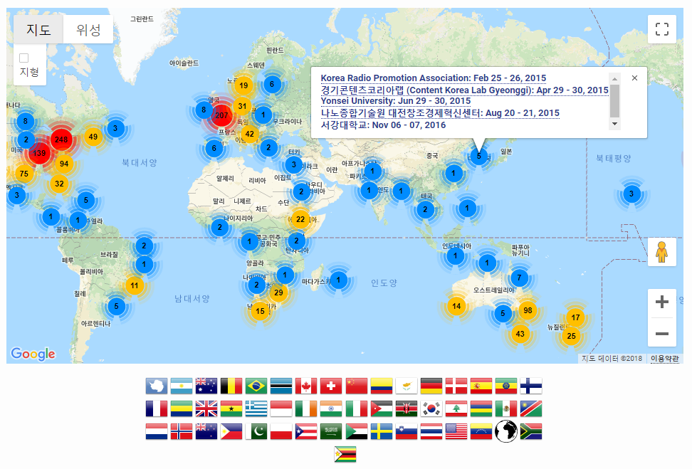

```{r setup, include=FALSE}
options(htmltools.dir.version = FALSE)

knitr::opts_chunk$set(echo = FALSE, warning=FALSE, message=FALSE,
                    comment="", digits = 3, tidy = FALSE, prompt = FALSE, fig.align = 'center')

```

> * 혁신성장 일자리 위원회 기획토론회
> * 주제: 4차 산업혁명과 대한민국 혁신성장 활로모색
> * 일시: 2019. 10. 07(월) 14:00 ~ 16:00
> * 장소: 국회의원회관 제8간담회실
> * [토론회 개요](fig/fourth-ir.jpg)

이세돌 9단이 2016년 4월 딥마인드에서 제작한 알파고에 의해 패배를 하면서 한국사회는 인공지능(AI)에 폭발적인 관심을 가지게 되었다. 알파고가 차용한 기술은 딥러닝 기술이고 딥러닝(Deep Learning, DL) 기술은 기계학습(Machine Learning, ML)을 구성하는 일부이며, 기계학습도 인공지능의 일부다. 기계학습/딥러닝 기술도 데이터 사이언스와 밀접한 관계를 갖고 있으며 이를 산업화한다는 것은 전혀 다른 패러다임의 전환을 요구하고 있다.

# 데이터 산업 {#data-industry}

세계은행(World Bank)과 한국개발연구원(KDI)은 약 2년여 기간의 공동연구를 통해 1960-2005 년간 한국 경제발전 과정에 관한 보고서를 출간했다. 경제성장이 지속되기 위해서는 생산성 증가가 대단히 중요하고, 1960년 이후 한국경제의 성공은 광의의 지식축적에 기인한 것으로 1960-2005년 사이 한국의 실질 1인당GDP의 75%가 광의의 지식축적에 기인한 것으로 분석했다.

경제발전단계에 따라, 교육 및 인적자원 개발 확대, 과학기술투자, 정보통신 인프라 확충을 통해 지식경제(Knowledge Economy)로의 전환을 이루고 괄목할만한 경제발전을 이룬 것으로 보고서는 적시하고 있다.

{#id .class width=77%}

바다에서 실종되기 전에 짐 그레이 박사는 모든 과학에서 데이터는 기하급수적으로 증가하고 있고, 거의 모든 과학은 데이터 주도(Data-driven) 현상이 나타나고 있다. 물리학과 생명과학이 통계와 컴퓨터 과학의 빅데이터를 통한 수렴현상도 심심치 않게 볼 수 있다고 주장을 했고, 이를 4가지 과학의 시대로 정의하였다.

- 실증 과학(Empirical Science): 수천년에 걸쳐 자연현상을 실증 과학의 시대.
- 이론 과학(Theoretical Science): 수백년에 걸쳐 모형과 일반화를 통한 이론 과학의 시대.
- 계산 과학(Computational Science): 수십년에 결쳐 복잡한 현상을 모의실험을 컴퓨터를 사용한 계산 과학 시대.
- 데이터 집약 과학(Data-Intensive Science): 현재는 이론, 실험, 통계를 사용한 계산 결과를 통합하는 데이터 집약 과학 시대.

과학이 가정-주도(Hypothesis-Driven) 에서 데이터-주도(Data-Driven) 발견 으로 급격히 이동 중으로 전혀 새로운 도전에 직면하고 있다.

## 원자재 데이터 [^unplugged] {#raw-material-data}

[^unplugged]: ["컴퓨터 과학 언플러그드"](https://statkclee.github.io/unplugged/)

컴퓨터(Computer)라는 말은 라틴어 "computare"에 기원하는데 계산하고 더한다는 의미를 지니지만, 오늘날 컴퓨터는 거대한 계산기 이상이다. 컴퓨터는 도서관도 될 수 있으며, 컴퓨터로 글을 작성할 수 있으며, 정보를 찾고, 음악을 연주하고, 영화를 보기도 한다. 그런데 컴퓨터는 이렇게 많은 모든 정보를 어떻게 저장할까? 믿든 믿지 않든, 컴퓨터는 단지 두 가지만을 사용한다. 영('0')과 일('1')이다.

빅데이터 시대를 맞이하여 데이터는 도처에 널려있지만, 오랜 세월을 거치면서 데이터는 나름대로 각자의 서식지를 가지고 있다. 과거 중요한 정보를 관계형 데이터베이스에서 체계적으로 관리를 했다면 빅데이터를 저장하고, 처리하고, 활용할 수 있는 기술이 비약적으로 발전하여 최근에는 이를 기계학습과 딥러닝 기법을 적용하여 혁신을 주도하는 단계로 넘어가고 있다.

{#id .class width="100%"}

## 데이터 사이언스 [^tidyverse-stat] {#data-science}

[^tidyverse-stat]: ["데이터 사이언스 운영체제 - tidyverse", 한국통계학회 소식지 2019년 10월호](https://statkclee.github.io/ds-authoring/ds-stat-tidyverse.html)

`tidyverse`의 핵심적인 내용은 다양한 형태의 데이터를 가져와서 최종 산출물을 사람과 기계와 커뮤니케이션할 수 있는 형태로 제작하는 과정을 추상화한 것으로 이해할 수 있다. 
시각화(Visualization)는 데이터에 대한 통찰력(insight)과 탄성, 놀라움을 줄 수 있지만, 확장성(Scalability) 측면에서는 한계가 명확히 존재하는데, 사람이 작업흐름 루프에 포함되기 때문이다. 
반대로 모형(Model)은 자동화와 확장성에는 장점이 있지만, 주어진 모형틀 안에서만 이뤄지기 때문에 통찰력, 놀라움, 탄성을 주지는 못하는 아쉬움이 있다.
따라서, `tidyverse`는 시각화와 모형을 통해 통찰력과 함께 자동화에 대한 부분도 충분히 반영한 체계적인 작업흐름을 제시하고 있는데, 이를 관통하는 핵심적인 개념이 파이프(pipe)로 이미 이런 개념은 유닉스 파이프 연산자를 통해 검증되었다. 

{#id .class width=77% height=77%}

## 데이터 공학과 사업화 {#data-engineering}

다양한 데이터 원자재를 산업화하는 과정은 기존 성공했던 다양한 과학기술이 사업화와 접목되어야만 가능하다. 데이터 원자재를 엑셀과 같은 형태의 직사각형 정형데이터로 가정한다면 이를 사업화하여 얻을 수 있는 실익은 크지 않다. 하지만, 데이터 원자재를 정형 데이터 뿐만 아니라, 이미지, 텍스트, 소리, 로드 등 비정형 데이터를 아우르게 되면 데이터의 양과 질, 그리고 속도에서 비교가 되지 않는 고도의 기술이 필요하다. 

빅데이터를 가지게 되면 이제 데이터 산업을 꽃피울 수 있는 원자재를 수급할 수 있는 토대를 만든 것에 불과하다. 데이터 사이언스를 통해 유의미한 무언가를 찾아내는 무수한 실험을 집행하여야 하고 이를 통해 나온 일부만이 사업적인 의미를 갖는다고 할 수 있다. 이러한 데이터 사이언스 발견을 토대로 데이터 공학을 적용시켜 실제 데이터 제품을 양산할 수 있게 되고 이를 시장에 출시하게 된다. 모든 제품과 서비스가 시장에서 성공하지 못하듯이 데이터 공학을 통해 살아남은 데이터 제품도 혹독한 시장 검증을 거치게 되고 그 일부가 사업화에 성공하여 빛을 발하게 된다.

{#id .class width=77%}

# 데이터 산업 인력 {#data-people}

원자재 데이터를 산업화시키는데 기존 제조업에서 필요로하는 역량과 전혀 다른 역량을 갖춘 기술과 경험을 갖춘 인력을 양성시켜야 된다. 늦었지만 다행히도 컴퓨팅 사고력을 갖춘 인력을 양성할 수 있도록 초등학교부터 체계적인 코딩 교육이 실시되고 있지만, 실제 산업체와 밀접한 관계를 갖는 
대학이상 고등교육에는 다양한 교육이 실시되고 있지만 교육과정 설계부터 많은 문제점을 안고 있다. 하지만, 소프트웨어/데이터 카펜트리를 비롯하여 무료로 공개된 다양한 데이터 사이언스 교재와 커뮤니티 그리고 이를 연결하는 미트업을 통해 부족하지만 이제 걸음마를 떼고 있다.

## 컴퓨팅 사고력 [^windows-statistics] {#data-people-person}

[^windows-statistics]: ["21세기 통계학을 배우는 방법", 통계의창](https://statkclee.github.io/ds-authoring/window-of-statistics.html)

카네기멜론 대학 쟈넷 윙(Wing) 교수가 이론적 사고(Theoretical Thinking), 실험적 사고(Experimental Thinking)와 더불어 컴퓨팅 사고(Computational Thinking)가 향후 인간의 사고 체제를 지배하는 중추적인 역할을 할 것이라고 주장했다. 산업혁명 이후로 산업, 즉 공장에서 필요한 인력을 육성하고 공급하기 위해서 수학과 공학을 초중등 과정에서 집중적으로 교육하였으며 이러한 전통이 지금까지 이어져 국내 및 전세계 누구나 이론적 사고체계는 익숙하고 친숙하다. 통계가 근간을 이루는 실험적 사고는 스몰 데이터(Small Data)를 일부 초중등 과정에서 접목하고 있지만, 학교를 졸업하고 현실에서 많이 접하게 되고 필수적인 것임에도 통계에 대한 충분한 교육 및 훈련을 받지 못하고 사회에 진출하고 있는 것도 사실이다. 이러는 와중에 빅데이터(Big Data)가 10년도 되지 않는 짧은 시간에 성급 우리곁에 다가왔고, 추상화(Abstraction)와 자동화(Automation)가 근간을 이루는 컴퓨터적 사고도 새로운 사고체계로 함께 받아들일 시점이 되었다.

컴퓨팅 사고 체계가 갖는 산업적인 영향력과 범위가 매우 커서, 미국, 영국, 이스라엘, 일본을 포함한 선진국 뿐만 아니라 중국, 인도, 에스토니아 등 많은 나라들이 컴퓨터적 사고 체계를 갖춘 인력 확보가 미래 국가 경쟁력과 밀접한 연관이 있다고 내다보고 집중적으로 인력양성에 나서고 있다. 거시적인 측면 뿐만 아니라, 개인적인 측면에서도 컴퓨터적 사고와 통계적 사고를 갖춘 사람과 그렇지 못한 사람과의 차이는 산업경제 체제에서 빈부격차보다 더 큰 정보 불평등(Digital Divide)을 디지털 경제 시대에 야기할 것으로 예측되고 있으며, 변화된 환경에 준비되고 잘 적응한 사람은 과거보다 훨씬 더 큰 혜택과 권한을 갖을 것이다.

{#id .class width="100%"}

## 소프트웨어 카펜트리 [^swcarpentry] {#data-people-software-carpentry}

[^swcarpentry]: [소프트웨어 카펜트리 버젼 5.3.](http://statkclee.github.io/swcarpentry-version-5-3-new/)

과학기술 연구자들이 느끼는 대부분의 고통은 체계적으로 소프트웨어를 어떻게 개발하는지, 만약 프로그램이 잘 동작한다면 작업결과를 전자우편을 통해서 전달하는 것을 제외하고 어떻게 동료와 공유하는지, 혹은 지금까지 연구한 것을 어떻게 기록하는지 잘 모른다는 사실에 기인하다.

소프트웨어 카펜트리(Software Carpentry)는 그렉 윌슨(Greg Wilson) 박사 주도로 1998년부터 시작된 무료 소프트웨어 교육 프로그램이다. 특히, 가설검증이나 모형 개발을 위한 대부분의 통계 프로젝트에서 데이터 처리 작업이 대략 10%정도 크지 않은 부분을 차지하지만 80% 이상 시간이 엑셀, SQL, 유닉스 쉘 스크립트 작성 등으로 쓰여지고 있는 것이 사실이다. 과학과 공학 연구자들이 대부분의 시간을 컴퓨터로 시뮬레이션하고 데이터를 분석하며 귀중한 시간을 보내지만 제대로 된 소프트웨어 교육을 받은 사람도 드물고, 가르칠 수 있는 사람도 부족한 현실에서 소프트웨어 카펜트리 프로젝트는 과학 및 기술 종사자가 본연의 업무에 집중하는데 큰 도움을 주고 있다.

소프트웨어 카펜트리에서는 유닉스 쉘을 이용한 작업자동화, 버젼관리와 협업을 위한 Git/GitHub, 추상화 모듈방식 프로그래밍으로 파이썬과 R, 데이터 관리를 위한 SQL을 핵심 교육내용으로 이틀동안 실습 중심으로 워크샵으로 진행한다. ’12년부터 전세계적으로 수백번의 워크샵을 통해서 34,000명이 참석하여 활발하게 진행되고 있으며, 한국에서도 '15년 한국전파진흥협회를 시작으로 연세대, 서강대, 한림대에서 매년 진행되면서 보조를 맞춰가고 있다.

{#id .class width="100%"}


## 데이터 사이언스 교육 [^data-science-education] [^data-science-education2] {#data-people-yonsei}

[^data-science-education]: [데이터 사이언스 입문](https://statkclee.github.io/yonsei/)
[^data-science-education2]: [데이터 사이언스를 위한 소프트웨어 공학](https://statkclee.github.io/yonsei2/)

데이터 사이언스라는 용어가 본격적으로 회자되기 시작한 것은 10년도 되지 않는 기간이지만, 21세기 가장 섹시한 직업이라고 소개되면부터 본격적으로 일반인들이 관심을 갖기 시작했고, 이미 미국을 비롯한 선진국에서는 데이터 사이언스 커리큘럼에 대한 합의가 이뤄지고 있다. 한국에서도 19년 봄학기 연세대 [데이터 사이언스 입문](https://statkclee.github.io/yonsei/) 과목과 가을학기 [데이터 사이언스를 위한 소프트웨어 공학](https://statkclee.github.io/yonsei2/) 과목을 통해 교육내용을 투명하게 인터넷에 공개할 뿐만 아니라 GitHub에 이를 연결시켜 공동저작의 형태로 발전시켜 나가고 있다. 


