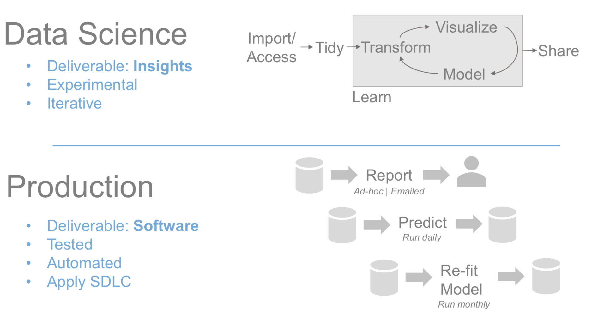

```{r setup, include=FALSE}
options(htmltools.dir.version = FALSE)

knitr::opts_chunk$set(echo = FALSE, warning=FALSE, message=FALSE,
                    comment="", digits = 3, tidy = FALSE, prompt = TRUE, fig.align = 'center')
```

## AWS KRUG - 데이터 사이언스

- 강의제목: "데이터 과학자의 클라우드 블로그"
- 강의일시
    - 2019년 9월 5일(목) 19:30 ~
- 강의장소: GS강남타워 역삼동 GS타워 12층 
- 강의내용
    - 데이터 과학자 vs. 개발자
    - 데이터 과학자의 블로그
    - Github 블로그
    - 데이터 사이언스 블로그: `blogdown`, netlify
    - AWS 블로그: S3, Route 53

---
class: inverse, middle, center

## 데이터 과학자 vs. 개발자

---
## `tidyverse` 

.center[
  
]

---
## 데이터 과학자와 개발자

.center[
  
]

.footnote[
   Edgar Ruiz (May 2018), "Big Data with R"
]


---
class: inverse, middle, center

## 데이터 과학자의 블로그


---
### 재현가능한 데이터 사이언스 환경

.center[
  
]

.footnote[
  [재현가능한 저작, "Author Carpentry"](https://statkclee.github.io/author_carpentry_kr/)   
]

---
## BMI 데이터 사이언스 보고서

author_carpentry_kr/tutorial/reproducible_finance/reproducible_finance.Rmd


---
class: inverse, middle, center

## GitHub 블로그


---
## Jekyll 기반 블로그 &rarr; [https://statkclee.github.io/](https://statkclee.github.io/)

.center[
  
]

.footnote[
 [데이터 사이언스: 저작(Authoring), "Github - 블로그"](https://statkclee.github.io/ds-authoring/ds-github-blog.html)
]

---
class: inverse, middle, center

## 데이터 사이언스 블로그: `blogdown`, netlify

---
## blogdown, netlify 호스팅 &rarr; http://xwmooc.netlify.com/

.center[

]

.footnote[
- [데이터 과학을 위한 저작도구 - 블로그 - blogdown](https://statkclee.github.io/ds-authoring/ds-blogdown.html)
- [이광춘 (2017.10.18), 데이터과학 블로그 10분 완성](https://tidyverse-korea.github.io/r-meetup-x-presser/)
]

---
class: inverse, middle, center

## AWS 블로그: S3, Route 53

---
## 클라우드 S3 블로그

.center[

]

.footnote[
- [빅데이터: 정적 웹호스팅 - S3](https://statkclee.github.io/bigdata/cloud-aws-s3-web-hosting.html)
]


---
## 클라우드 S3 블로그 + 도메인명

- http://tidyverse.info/

.footnote[
- [개인 도메인 블로그 - aws cli](https://statkclee.github.io/bigdata/cloud-aws-s3-blog.html)
]
