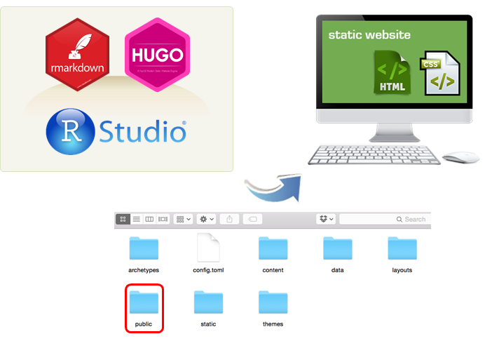
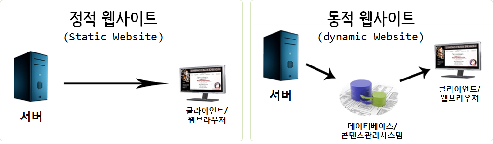

```{r, include=FALSE}
source("tools/chunk-options.R") 
```


## 1. `blogdown` 팩키지 {#blogdown}

[blogdown](https://github.com/rstudio/blogdown) 팩키지는 블로그 작성은 [R 마크다운](http://rmarkdown.rstudio.com/)에 기반하고 있고,
[휴고(Hugo)](https://gohugo.io/)라는 정적 웹사이트 생성 도구를 활용하여 데이터 과학 블로그 작성과 배포 공유를 수월하게 하는 목표로 개발되었다.
개발기간이 오래되지 않았지만, 다수 R 블로거가 기존 제킬(jekyll), 워드프레스를 버리고 블로그다운(blogdown)으로 갈아타고 있다.

- [blogdown 문서 - Creating Websites with R Markdown](https://bookdown.org/yihui/blogdown/)
- [GitHub - blogdown](https://github.com/rstudio/blogdown)



## 2. 블로그 생성 {#build-blog}

RStudio를 개발환경을 사용하는 것을 가정하면, R마크다운으로 블로그 콘텐츠를 작성하게 되고, 
휴고를 활용하여 정적 웹사이트를 생성하게 된다. 정적 웹사이트는 단순히 생각하면 HTML과 CSS 파일 조합이다.

### 1.1. `blogdown` 설치 {#install-blogdown}

블로그다운을 `devtools::install_github("rstudio/blogdown")` 명령어를 통해 실행한다. 
특히, 블로그다운은 R 마크다운으로 작성한 콘텐츠를 정적웹사이트 콘텐츠로 변환시키는데 휴고를 활용하기 때문에 
`blogdown::install_hugo()` 혹은 `blogdown::install_hugo(force = TRUE)` 명령어를 통해 휴고도 설치한다.

``` {r blogdown-install, eval=FALSE}
if (!requireNamespace("devtools")) install.packages("devtools")
devtools::install_github("rstudio/blogdown")

blogdown::install_hugo(force = TRUE)
```


### 1.2. 블로그 헬로월드 {#blogdown-hello-world}

RStudio를 R 통합개발도구로 사용하는 것을 가정하면 블로그 헬로월드를 생성하는 절차는 다음과 같다.

1. `File` &rarr; `New Project` ... 신규 프로젝트를 하나 생성한다.
1. `Ctrl + Shift + N` 키보드 단축키를 실행하여 R 스크립트 작성콘솔을 활성화시킨다.
1. `blogdown::new_site()`를 실행시킨다.

`blogdown::new_site()` 명령어를 실행시키게 되면 기본 블로그가 즉석에서 생성된다.
이제 남은 작업은 `2015-07-23-r-rmarkdown.Rmd` 예제 R마크다운 파일예제처럼 
블로그를 R마크다운 파일에 작성하면 된다. 

``` {r blogdown-hello-world, eval=FALSE}
blogdown::new_site()
```

> ### 블로그다운 프로젝트 디렉토리 구조
> 
> ``` {r blogdown-directory-structure, eval=FALSE}
> ㄴ archetypes/
> ㄴ content/
> ㄴ data/
> ㄴ layouts/
> ㄴ public/
>   |
>   ├── .git/
>   ├── .nojekyll
>   ├── index.html
>   ├── about/
>   └── ...
> ㄴ static/
> ㄴ themes/
> ......Rproj.user
> .....test.Rproj
> .....config.toml
> .....index.Rmd
> ```

R마크다운으로 블로그를 작성하게 되면 휴고가 정적웹콘텐츠를 생성시켜 `public` 디렉토리에 저장시킨다.
`blogdown::serve_site()` 명령어가 향후 지속적으로 활용할 명령어로 R마크다운 콘텐츠를 
`public` 디렉토리에 정정웹콘텐츠로 변환시켜 저장시키는 작업을 수행한다.



## 2. 정적 웹사이트와 동적 웹사이트 비교[^static-dynamic-comparison] {#static-web-vs-dynamic-web} 

[^static-dynamic-comparison]: [Website, https://www.javatpoint.com](https://www.javatpoint.com/website-static-vs-dynamic)

정적인 문서들로만 이루어져 있기 때문에 아파치나 nginx 같은 어떤 웹서버에도 동작이 가능하고, 
별도 데이터베이스나 콘텐츠관리시스템(CMS)가 필요없어, SQL 인젝션 같은 공격도 걱정할 필요가 없어 구축이 쉽고 속도가 빠른 것이 장점이다. 

[^hugo-vs-jekyll]: [snowdeer Code Holic, 정적 웹페이지 vs 동적 웹페이지](http://snowdeer.github.io/blog/2016/03/21/static-dynamic-webpage/)

|                    정적 웹사이트                          |                       동적 웹사이트                               |
|-----------------------------------------------------------|-------------------------------------------------------------------|
| 매번 웹페이지가 로딩되면 사전에 구축한 웹페이지가 열린다. | 콘텐츠가 신속히 생성되고 정기적으로 변경된다.                     |
| HTML/CSS 조합으로 웹사이트가 생성된다.                    | `PHP,SERVLET, JSP, ASP.NET`등 서버사이드 언어가 사용된다.         |
| 모든 클라이언트 요청에 동일한 응답이 전달된다.            | 클라이언트 요청별로 다른 HTML/CSS 조합이 전달된다.                |
| 콘텐츠 제작 시점 혹은 갱신 시점에만 콘텐츠가 변경된다.    | "서버사이드" 코드를 통해 페이지가 로딩될 때 콘텐츠가 생성된다.    |
| 별도 데이터베이스나 콘텐츠관리시스템(CMS)가 필요없다.     | 동적 콘텐츠를 위해 데이터베이스나 콘텐츠관리시스템(CMS)가 필요함. |

블로그를 정적웹사이트로 개발하고자 했다면 현존하는 두가지 정적 웹사이트 생성도구가 인기를 얻고 있다.
하나는 [제킬(Jekyll)](https://jekyllrb.com/)이고, 다른 하나는 [휴고](https://gohugo.io/)다. 
제킬과 휴고의 차이점과 장단점에 대한 간략한 개요는 다음을 참고한다. [^hugo-vs-jekyll]

|          제킬(Jekyll)         |           휴고(Hugo)              |
|-------------------------------|-----------------------------------|
| 루비(Ruby) 언어               |           고(Go) 언어             |
| 설치 과정이 복잡.	            | 설치과정 단순, 실행 파일 하나만 필요 |
| 휴고대비 컴파일 속도가 느림.  | 웹페이지 하나당 1 밀리초로 빠름   |
| 사용자 수가 아주 많음         | R 사용자가 증가하고 있음          |
| 많은 Plugin & 테마 지원       | 인기를 얻으면서 증가하고 있는 추세|


## 3. 정적 웹콘텐츠 블로그 배포 [^blogdown-github] {#blog-deployment} 

[^blogdown-github]: [Making a Website Using Blogdown, Hugo, and GitHub pages.](https://proquestionasker.github.io/blog/Making_Site/)

`blogdown::serve_site()` 명령어를 통해서 `public\` 디렉토리에 블로그 콘텐츠가 작성되었다면 다음 단계로 이를 
웹서버를 통해 배포하는 과정이 남게된다. 결국 블로그를 게시하는 것은 불특정 다수가 혹은 블로그를 보고자 하는 
특정 사용자에게 제공하기 위함이기 때문에 크게 두가지 방법을 생각할 수 있다.

- 자체 구축 웹서버 - IDC 혹은 AWS 클라우드에 웹서버를 두고 블로그 정적 콘텐츠 배포.
- PaaS 플랫폼: [GitHub](https://github.com/) 혹은 [Netlify](https://www.netlify.com/) 와 같은 정적 웹콘텐츠를 호스팅하는 서비스를 활용하여 배포.

두가지 방법 모두 장단점이 있으니 상황에 맞춰 활용하면 좋다.


### 3.1. PaaS 플랫폼 형태 - GitHub, Netlify

[Netlify](https://www.netlify.com/)에 대해서 `blogdown` 저자는 좋은 인상을 갖고 있는 듯 하다. 
정적 웹사이트로 구축된 블로그 콘텐츠를 [Netlify](https://www.netlify.com/)에 설치하는 방법에 대해 나름 정성을 들여서 
자세히 설명하고 있고, 직접 배포하는 것도 생각보다 어렵지 않다. 과거 Travice CI를 통한 경험을 상기해보면 좋을 듯 하다.
물론 전제 조건은 [GitHub](https://github.com/) 저장소에 블로그 콘텐츠를 저장시켜 활용해야 된다는 점이다.


[GitHub](https://github.com/)도 유사한 방법이지만, 다소 복잡하다. 
자세한 사항은 [Making a Website Using Blogdown, Hugo, and GitHub pages.](https://proquestionasker.github.io/blog/Making_Site/)를 참조한다.

### 3.2. IDC 혹은 AWS 클라우드 배포 {#aws-blogdown-deployment}

자체 운영하는 IDC나 AWS 클라우드나 정적 웹사이트 블로그 콘텐츠를 배포하는 입장에서는 큰 차이는 없다.
휴고를 통해 생성된 정적 웹콘텐츠가 `public/` 디렉토리에 모여있기 때문에,
이를 `scp` 명령어를 통해 AWS EC2 인스턴스로 전달한다.
웹서버 `/var/www/html` 디렉토리에 콘텐츠를 밀어 넣으면 된다. `-i aws-key.pem`은 EC2 인스턴스에 인증을 하기 위한 것이고,
`-r .` 매개변수는 디렉토리를 포함하여 `public/` 디렉토리에 있는 모든 콘텐츠를 모두 포함시켜 복사해 올리라는 의미가 된다.

``` {r scp-www, eval=FALSE}
$ scp -i aws-key.pem -r . ubuntu@ec2-xx-xxx-xxx-xxx.ap-northeast-2.compute.amazonaws.com:/var/www/html

.gitkeep                                      100%    0     0.0KB/s   00:00
index.html                                    100% 3249     3.2KB/s   00:00
index.xml                                     100%   12KB  11.6KB/s   00:00
fonts.css                                     100%  733     0.7KB/s   00:00
main.css                                      100% 4307     4.2KB/s   00:00
...
...
...
```