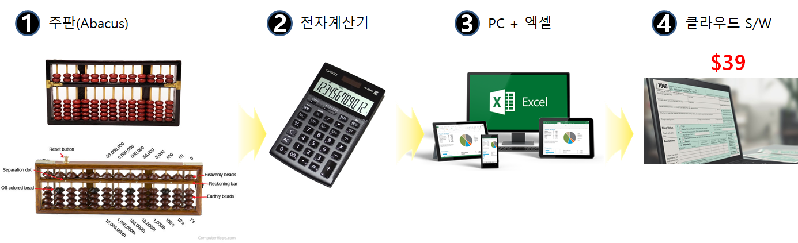
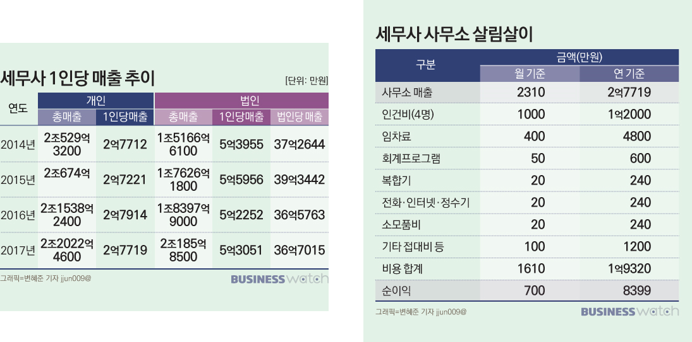
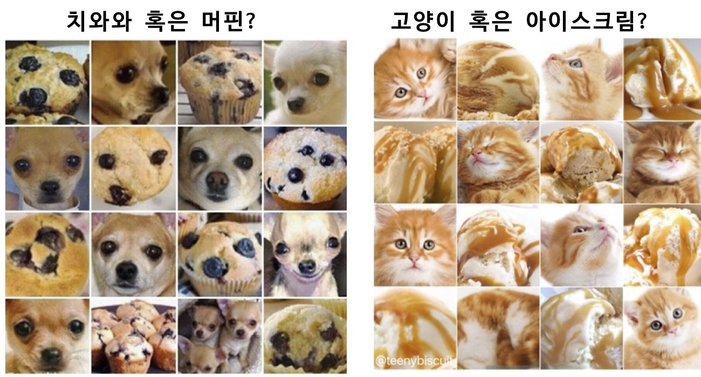
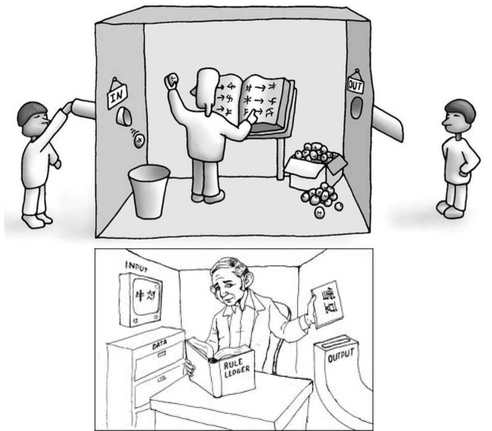
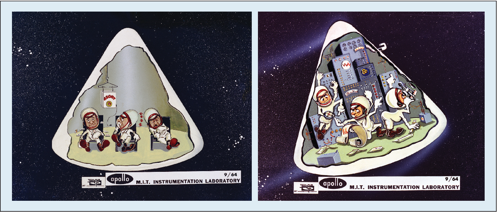
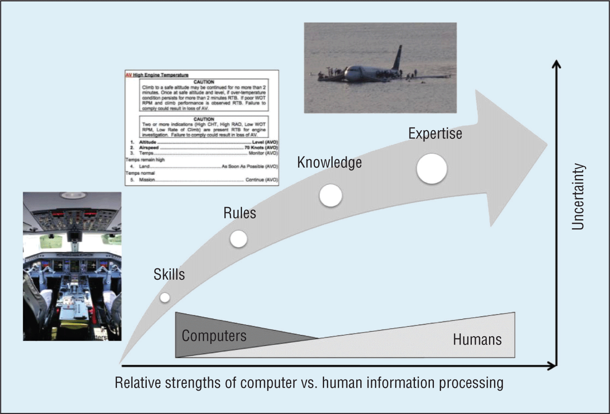
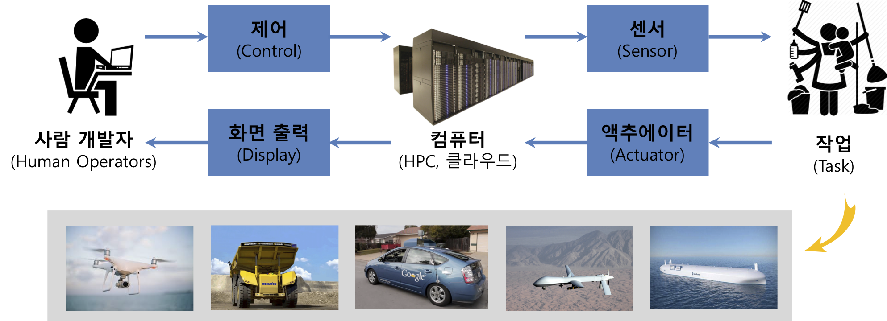
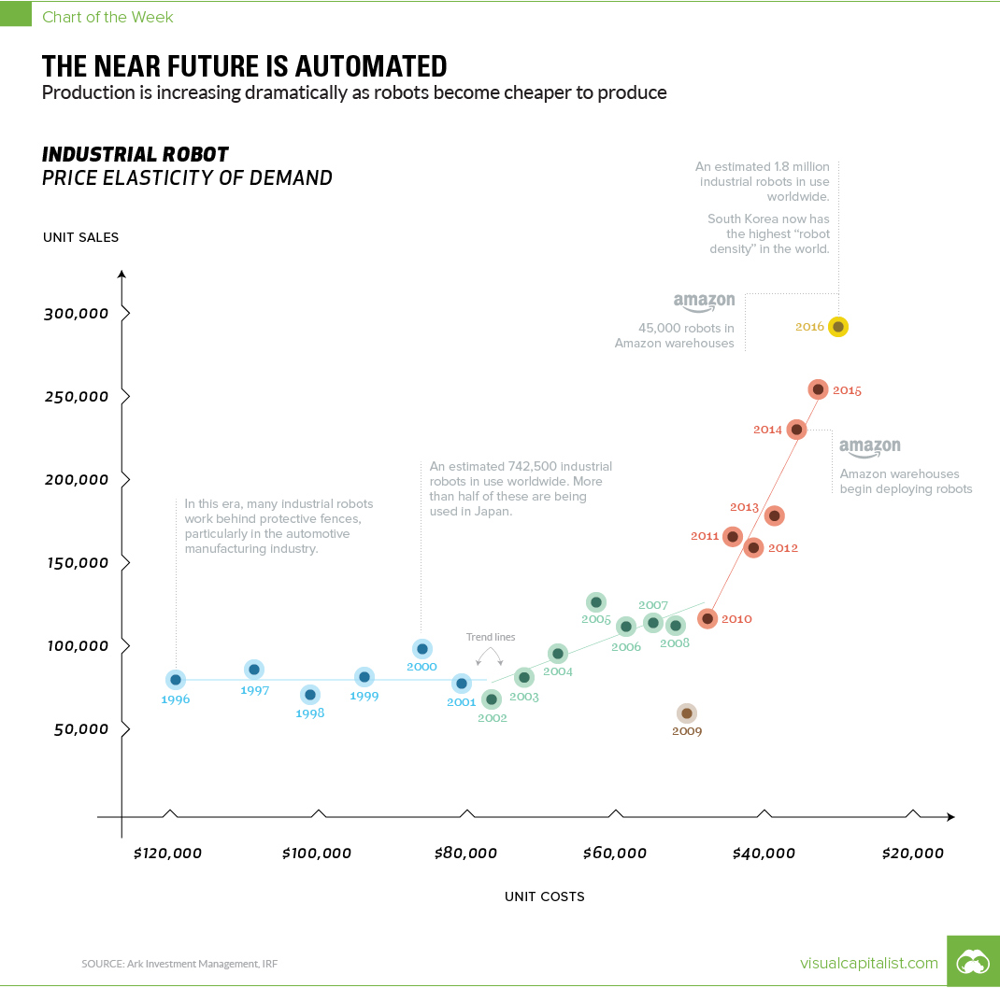

```{r setup, include=FALSE}
knitr::opts_chunk$set(echo = TRUE, message=FALSE, warning=FALSE,
                      comment="", digits = 3, tidy = FALSE, prompt = FALSE, fig.align = 'center')

library(reticulate)
use_condaenv("anaconda3")
# reticulate::repl_python()
```

# 국가와 회사의 흥망 {#data-trends}

<div class = "row">
  <div class = "col-md-6">
**GDP 상위 15국 (1970-2017) **

<iframe width="300" height="180" src="https://www.youtube.com/embed/jCNSqEwh7GQ" frameborder="0" allow="accelerometer; autoplay; encrypted-media; gyroscope; picture-in-picture" allowfullscreen></iframe>

<br>

데이터 출처: UNdata - http://data.un.org/
  </div>
  <div class = "col-md-6">
**글로벌 브랜드 가치 상위 15사 (2000-2018)**

<iframe width="300" height="180" src="https://www.youtube.com/embed/BQovQUga0VE" frameborder="0" allow="accelerometer; autoplay; encrypted-media; gyroscope; picture-in-picture" allowfullscreen></iframe>

<br>

데이터 출처: https://www.interbrand.com/
  </div>
</div>

# 세무사 업무 변천과정 [^evolution-tax] {#change-automation}

{#id .class width="100%"}

[^evolution-tax]: [PC 매거진, "The Best Tax Software for 2019"](https://www.pcmag.com/roundup/167894/the-best-tax-software)

## 연도별 세무사 합격자 {#tax-exam-trend}

[등록세무사만 1만3000명인데 합격자를 늘리다니… 세무사회 불만 고조](http://biz.newdaily.co.kr/site/data/html/2019/01/22/2019012200053.html) 기사 내용에도 언급되었어듯이 2008년부터 11년간 630명가량을 다소 편차가 있지만 뽑아왔다. 현재 한국세무사회에 등록된 [개인 및 법인현황](http://www.kacpta.or.kr/)을 통해 12,973명이 개업하여 활동하고 있는 것으로 집계되어 있다.

```{r tax-exam}
library(tidyverse)
library(rvest)

tax_url <- "http://www.wcpa.co.kr/cta/info_ystats.php"

Sys.setlocale("LC_ALL", "C")

exam_df <- tax_url %>% 
  read_html() %>% 
  html_node(xpath = '/html/body/div[1]/div[2]/div/div[2]/div[2]/div/ul[2]/li/div/table') %>% 
  html_table(fill = TRUE)

Sys.setlocale("LC_ALL", "Korean")

exam_df %>% 
  gather(year, value, -`구분`) %>% 
  filter(구분 == "합격자") %>% 
  select(연도=year, 합격자=value) %>% 
  knitr::kable()
```

## 세무사 연봉 [^tax-accountant-salary] {#tax-accountant-salary}

[^tax-accountant-salary]: [임명규 (2018.10.10), "세무사는 얼마나 벌까요", Business Watch](http://news.bizwatch.co.kr/article/tax/2018/10/05/0010)



# 자동화 [^missy-automation] {#automation-overview}

[^missy-automation]: [Mary (Missy) Cummings, "Man versus Machine or Man + Machine?", Ieee INteLLIGeNt sYstems](https://hal.pratt.duke.edu/sites/hal.pratt.duke.edu/files/u10/IS-29-05-Expert%20Opinion%5B1%5D_0.pdf)

기계(Machine)하면 우선 기계장치를 떠올릴 수 있지만, 영어로 머신(machine)은 인공지능을 탑재한 컴퓨터도 의미하기 한다.
자동화 수준을 전혀 컴퓨터, 즉 기계의 도움없이 모든 결정과 행동을 사람이 취하는 수준부터,
인간을 배제하고 기계가 모든 의사결정을 내리고 자율적으로 운전, 판결, 세금계산 등등을 하는 완전한 자동화까지로 수준을 나눌 수 있다.
인간의 어떤 영역은 자동화가 많이 진행되었고, 또 다른 영역은 자동화가 진행되고 있거나, 어떤 영역은 거의 완전한 자동화가 진행된 부분도 있다.

| 자동화 수준 | 자동화 수준 설명 |
|:-----------:|:------------------------------------------|
|     1       | 컴퓨터는 어떤 도움도 주고 있지 못함: 사람이 모든 결정을 해야하고 행동도 취해야 함 |
|     2       | 컴퓨터가 대안이 될 수 있는 의사결정 목록과 행동목록을 제시함 |
|    3       | 선택지를 몇개로 줄여줌 |
|    4       | 대안을 제시함  |
|    5       | 사람이 승인하면 제안된 것을 실행함.  |
|    6       | 자동 실행하기 전에 사람에게 거부권을 행사할 시간을 부여함 |
|    7       | 자동으로 실행하고 나서, 필요할 때만 인간에게 통보함 |   
|    8       | 컴퓨터가 요청을 받을 때만 인간에게 통보함 |  
|    9       | 컴퓨터가 결정을 내려야 될 때만, 인간에게 통보함 |
|   10       | 인간을 배제하고, 컴퓨터가 모든 결정을 내리고 행동도 자율적으로 취함.

## 사람과 기계 비교 {#man-human-comparison}

사람과 기계는 서로 다른 잘하는 영역이 나눠져 있었다.
단어를 세고 가장 많이 사용되는 단어를 찾는 것은 컴퓨터에게는 무척이나 쉬운 작업인 반면, 논문이나 책에서 텍스트를 읽고 이해하는 것은 컴퓨터에게 어렵다. 사람은 지루하고 반복되는 문제를 해결하는데 적합하지 않은 반면에 컴퓨터는 추상적이고 일반화하는 작업에는 적합지 않았다. 
이런 사실은 1970년대 미국 카네기 멜론 대학 (CMU) 로봇 공학자 한스 모라벡(Hans Moravec) 교수의 **모라벡의 역설(Moravec's paradox)**로 잘 알려져 있다.

|   속성  |        사람         |         기계        |
|:---------:|:---------------------:|:---------------------:|
|   속도  |  상대적으로 느림    |        탁월함       | 
| 경격출력 | 상대적으로 약함    | 일관된 작업에 우수성을 보임 |
| 일관성  | 믿을 수 없는 학습능력과 피로 | 일관되고 반복적인 작업에 이상적임 |
| 정보처리능력 | 주로 한개 채널   | 멀티 채널 |
| 기억     | 원칙과 전략에 좋음. 다재다능하고 혁신적임 |문자 그대로 재현하는데 이상적임, 형식적임 |
| 추론 계산 | 귀납적, 프로그램하기 더 좋고, 느리고, 오류 수정 좋음 | 연역적, 프로그램하기 귀찮고, 빠르고 정확, 오류 수정 나쁨 |
| 감지(sensing) | 넓은 감지 반경, 다기능, 분별력 | 정량적 평가에 좋지만, 패턴인식에는 나쁨 |
| 인지(perceiving) | 변화에 더 잘 대응 | 잡음에 취약하여 변화에 잘 대응 못함. |


<style>
div.blue { background-color:#e6f0ff; border-radius: 5px; padding: 10px;}
</style>
<div class = "blue">

**모라벡의 역설(Moravec's paradox)**

미국 카네기 멜론 대학 (CMU) 로봇 공학자 한스 모라벡(Hans Moravec)이 1970년대에 ‘it is comparatively easy to make computers exhibit adult level performance on intelligence tests or playing checkers, and difficult or impossible to give them the skills of a one-year-old when it comes to perception and mobility’라는 표현으로 컴퓨터와 인간의 능력 차이를 역설적으로 표현하였다.

즉, 인간은 걷기, 느끼기, 듣기, 보기, 의사소통 등의 일상적인 행위는 매우 쉽게 할 수 있는 반면 복잡한 수식 계산 등을 하기 위해서는 많은 시간과 에너지를 소비하여야 하는 반면, 컴퓨터는 인간이 하는 일상적인 행위를 수행하기 매우 어렵지만 수학적 계산, 논리 분석 등은 순식간에 해낼 수 있다.



</div>

# **중국어 방 주장 (Chinese room argument) [^chinese-room] [^wiki-chinese-room]** {#chinese-room}

[^chinese-room]: [중국어 방 역설 (Chinese room argument) - 대체 누가 중국어를 이해하고 있는가?](http://ko.experiments.wikidok.net/wp-d/592f718da44f1a4153e80611/View)

[^wiki-chinese-room]: [위키백과, "중국어 방"](https://ko.wikipedia.org/wiki/%EC%A4%91%EA%B5%AD%EC%96%B4_%EB%B0%A9)

중국어 방 혹은 중국인 방(영어: Chinese room)은 존 설(John Searle)이 튜링 테스트로 기계의 인공지능 여부를 판정할 수 없다는 것을 논증하기 위해 고안한 사고실험이다.

> 우선 방 안에 영어만 할 줄 아는 사람이 들어간다. 그 방에 필담을 할 수 있는 도구와, 미리 만들어 놓은 중국어 질문과 질문에 대한 대답 목록을 준비해  둔다. 이 방 안으로 중국인 심사관이 중국어로 질문을 써서 안으로 넣으면 방 안의 사람은 그것을 준비된 대응표에 따라 답변을 중국어로 써서 밖의 
> 심사관에게 준다.

안에 어떤 사람이 있는지 모르는 중국인이 보면 안에 있는 사람은 중국어를 할 줄 아는 것처럼 보인다. 그러나, 안에 있는 사람은 실제로는 중국어를 전혀 모르는 사람이고, 중국어 질문을 이해하지 않고 주어진 표에 따라 대답할 뿐이다. 이로부터 중국어로 질문과 답변을 완벽히 한다고 해도 안에 있는 사람이 중국어를 진짜로 이해하는지 어떤지 판정할 수 없다는 결론을 얻는다. 이와 마찬가지로 지능이 있어서 질문 답변을 수행할 수 있는 기계가 있어도 그것이 지능을 가졌는지는 **튜링 테스트**로는 판정할 수 없다는 주장이다.

{#id .class width="77%"}


결국 다음과 같이 컴퓨터, 인간, 인공지능을 비교할 수 있다. 
중국어 방이 하드웨어, 인간의 외형적인 몸체라면, 질문과 답변을 입출력으로 정의할 수 있고,
질문&대답 목록과 처리 규칙을 담은 알고리즘을 데이터베이스/알고리즘, 습득된 경험, 지식, 지능으로 대응할 수 있다. 

|  인공지능 |       컴퓨터      |       인간            |
|:---------:|:-----------------:|:---------------------:|
| 중국어 방 |      하드웨어     | 인간의 외형적인 몸체  |
| 영어만 할 줄 아는 사람| 소프트웨어| 인간의 지능 |
| 중국어로 된 질문 | 입력(Input) | 인간이 외부에서 접할 수 있는 자극 |
| 중국어로 된 답변 | 출력(Output) | 인간이 외부에서 접한 자극에 대한 반응 |
| 질문&대답 목록 | 데이터베이스(Database) | 습득된 기억 |

# 사람과 기계 업무 분장 {#man-human-boundary}

앞서 자동화 수준을 1-10 사이로 구분했다면, 사람과 기계 사이의 업무 분장 경계를 적당히 지어야만 해당 문제를 자동화를 통해서 최선의 결과를 낼 수 있다. 오랜동안 논란이 되었지만, 대표적으로 달에 사람을 보내는 아폴로 계획에서 사람과 기계의 역할을 어떻게 구분하는 것이 좋은지는 항상 논란이 되어왔고 오늘날까지 이어지고 있다.

{#id .class width="100%"}

듀크 대학과 MIT 매리 커밍스(Mary Cummings) 교수는 기존 S-R-K 틀에 E를 더 붙이는 등 확장을 하여 다음과 같은 기계와 사람이 잘하는 분야, 즉 자동화가 되는 영역과 자동화의 도움을 받는 영역으로 범주화 시켰다. 매리 커밍스 교수가 F-18 여성 조종사 경력을 바탕으로 항공 사례를 예시로 들고 있다.

| 인지 작업 (cognitive behavior/task) | 자동화 정도(degree of automation) |
|:--------------------------:|--------------------------|
| 기량(skill-based)        | 자동화에 최적화됨. 물론 내외부 상태와 오류 피드백에 대한 신뢰성있는 센서를 가정 |
| 규칙(rule-based)         | 자동화 가능한 대상. 물론 규칙집합이 잘 만들어지고 테스트된 것을 가정 |
| 지식(knowledge-based)    | 일부 자동화를 통해 데이터를 조직화하고, 필터링하고, 합성하는데 도움을 줌 |
| 전문적 식견(expertise)   | 사람이 가장 잘 할 수 있지만, 팀동료로 자동화 기계를 통해 도움을 받을 수 있음 |

{#id .class width="77%"}

최근 자동화 기계는 드론, 무인 자동차, 무인 화물자동차, 무인 비행기, 무인 선박 모두 센서와 액추에이터를 통해서 자동으로 설정한 목표를 달성하게 되어 있지만 이는 중앙 컴퓨터의 제어를 받는다. 중앙 컴퓨터 제어는 결국 사람이 화면을 보고 제어 로직을 심어둔 것으로 크게 볼 수 있다.

{#id .class width="100%"}

# 자동화와 직업 통계자료 {#automation-job-statistics} 

## 산업용 로봇  [^industrial-robot] {#industrial-robot}

[^industrial-robot]: [Ang Ahlstrom (May 24, 2018), "Chart: Why Industrial Robot Sales are Sky High"](https://www.visualcapitalist.com/industrial-robot-sales-sky-high/)

{#id .class}

기사가 반영하지 못한 가장 최근 추세를 추가해서 시각화 한다.

```{r industrial-robot}
library(tidyverse)
library(rvest)

robot_url <- "https://en.wikipedia.org/wiki/Industrial_robot"

robot_dat <- robot_url %>%
  read_html() %>%
  html_nodes(xpath='//*[@id="mw-content-text"]/div/table[2]') %>%
  html_table(fill = TRUE) %>% 
  .[[1]]

robot_dat %>% 
  tbl_df %>% 
  mutate(supply = parse_number(supply)) %>% 
  ggplot(aes(x=Year, y=supply)) +
    geom_line() +
    geom_point() +
    expand_limits(y=0) +
    scale_y_continuous(labels = scales::comma) +
    theme_bw(base_family = "AppleGothic") +
    labs(x="", y="산업용 로봇 공급대수", title="전세계 연간 산업용 로봇 공급대수")
```

## 생산성과 임금 격차 {#wage-productivity-gap}

[Economic Policy Institute, "The Productivity - Pay Gap", July 2019](https://www.epi.org/productivity-pay-gap/)

생산성이 오르면 임금도 따라 오른 다는 것이 그동안의 믿음이었다. 
하지만, 생산성이 오른다고 임금도 따라 오르지 않는 현상이 1979년부터 심화되고 있다. 이를 데이터를 통해서 확인해보자. 

데이터 출처: EPI analysis of unpublished Total Economy Productivity data from Bureau of Labor Statistics (BLS) Labor Productivity and Costs program, wage data from the BLS Current Employment Statistics, BLS Employment Cost Trends, BLS Consumer Price Index, and Bureau of Economic Analysis National Income and Product Accounts Updated from Figure A in Raising America’s Pay: Why It’s Our Central Economic Policy Challenge (Bivens et al. 2014)

```{r productivity-gap}
library(tidyverse)

productivity_gap <- tribble(~"Year",~"Hourly compensation", ~"Net productivity",
"1948", "0.00%"  ,"0.00%",
"1949", "6.24%"  ,"1.55%",
"1950", "10.46%"  ,"9.34%",
"1951", "11.74%"  ,"12.24%",
"1952", "15.02%"  ,"15.49%",
"1953", "20.82%"  ,"19.41%",
"1954", "23.48%"  ,"21.44%",
"1955", "28.70%"  ,"26.38%",
"1956", "33.89%"  ,"26.59%",
"1957", "37.08%"  ,"30.04%",
"1958", "38.08%"  ,"32.72%",
"1959", "42.46%"  ,"37.63%",
"1960", "45.38%"  ,"40.06%",
"1961", "47.84%"  ,"44.37%",
"1962", "52.32%"  ,"49.80%",
"1963", "54.86%"  ,"55.03%",
"1964", "58.32%"  ,"59.94%",
"1965", "62.27%"  ,"64.92%",
"1966", "64.70%"  ,"69.95%",
"1967", "66.68%"  ,"71.98%",
"1968", "71.05%"  ,"77.13%",
"1969", "74.39%"  ,"77.85%",
"1970", "76.81%"  ,"80.35%",
"1971", "81.66%"  ,"87.10%",
"1972", "91.34%"  ,"92.20%",
"1973", "90.96%"  ,"96.96%",
"1974", "87.05%"  ,"93.83%",
"1975", "86.86%"  ,"98.11%",
"1976", "89.35%"  ,"103.59%",
"1977", "92.82%"  ,"106.05%",
"1978", "95.66%"  ,"108.27%",
"1979",  "93.25%",  "108.11%",
"1980", "88.05%"  ,"106.77%",
"1981", "87.36%"  ,"110.50%",
"1982", "87.70%"  ,"108.37%",
"1983", "88.49%"  ,"114.51%",
"1984", "87.03%"  ,"120.21%",
"1985", "86.18%"  ,"123.65%",
"1986", "87.25%"  ,"128.28%",
"1987", "84.67%"  ,"128.80%",
"1988", "84.02% ",  "132.01%",
"1989", "83.93%"  ,"134.12%",
"1990", "82.37%"  ,"136.95%",
"1991", "82.02%"  ,"138.50%",
"1992", "83.20%"  ,"147.48%",
"1993", "83.46%"  ,"148.51%",
"1994", "83.89%"  ,"150.54%",
"1995", "82.76%"  ,"151.59%",
"1996", "82.87%"  ,"156.24%",
"1997", "84.87%"  ,"160.72%",
"1998", "89.27%"  ,"166.21%",
"1999", "91.98%"  ,"173.46%",
"2000", "92.96%"  ,"179.47%",
"2001", "95.60%"  ,"183.71%",
"2002", "99.49%"  ,"191.50%",
"2003", "101.58%",  "201.22%",
"2004", "100.56%",  "209.29%",
"2005", "99.73%"  ,"215.29%",
"2006", "99.88%"  ,"217.61%",
"2007", "101.45%",  "219.78%",
"2008", "101.39%",  "221.39%",
"2009", "109.30%",  "228.75%",
"2010", "111.00%",  "238.23%",
"2011", "108.47%",  "238.21%",
"2012", "106.50%",  "239.57%",
"2013", "108.40%",  "240.96%",
"2014", "109.08%",  "242.91%",
"2015", "112.41%",  "245.75%",
"2016", "114.39%",  "246.34%",
"2017", "114.67%",  "249.78%",
"2018", "115.62%",  "252.90%")

productivity_gap_df <- productivity_gap %>% 
  mutate(`Hourly compensation` = parse_number(`Hourly compensation`) / 100,
         `Net productivity`    = parse_number(`Net productivity`) / 100,
         Year = as.integer(Year)) 

productivity_gap_long_df <- productivity_gap_df %>%
  mutate(gap = abs(`Net productivity` - `Hourly compensation`)) %>% 
  gather(metric, value, - Year)

productivity_gap_long_df %>% 
  ggplot(aes(x=Year, y=value, group=metric, color=metric)) +
    geom_line() +
    geom_point(size=0.3) +
    scale_y_continuous(labels = scales::percent) +
    theme_bw(base_family="NanumGothic") +
    labs(x="", y="", title="Productivity growth and hourly compensation growth, 1948-2018",
         color="생산성과 시간당 급여",
         caption="자료출처: https://www.epi.org/productivity-pay-gap/") +
    theme(legend.position = "top") +
    facet_wrap(~metric)

library(plotly)

productivity_gap_g <- productivity_gap_long_df %>% 
  ggplot(aes(x=Year, y=value, color=metric)) +
    geom_line() +
    geom_point(size=0.3) +
    scale_y_continuous(labels = scales::percent) +
    theme_bw(base_family="NanumGothic") +
    labs(x="", y="", title="Productivity growth and hourly compensation growth, 1948-2018",
         color="생산성과 시간당 급여",
         caption="") +
    theme(legend.position = "top")

plotly::ggplotly(productivity_gap_g)

```


## 보울리 법칙(Bowley's Law) {#bowley-law}

앞서 언급한 임금과 노동생산성 간 격차의 지속적 증가는 노동소득분배율 (labour income share)의 감소로 연결되는데, 노동소득분배율은 총국민소득 중 노동소득이 차지하는 비중으로 보울리의 법칙으로 불리며 경제성장이나 발전과는 상관없이 기능적 소득분배((functional income distribution))가 장기적으로 일정하다는 가설인데 이것이 최근 깨지고 있다. [^bowley-law]

[^bowley-law]: [이상혁(2014), "제네바에서 온 편지: 당신의 월급은 공정합니까?", slow news](https://slownews.kr/24431)

FRED Economic Data 중 [Shares of gross domestic income: Compensation of employees, paid: Wage and salary accruals: Disbursements: to persons (W270RE1A156NBEA)](https://fred.stlouisfed.org/series/W270RE1A156NBEA) 다운로드 받아 시각화한다.
미국 노동소득분배율이 50%대에서 40%초반으로 훅 떨어진 것이 시각적으로 확인된다.
이에 대해서 ILO 세계임금보고서와 다른 [OECD (2015), "The Labour Share in G20 Economies"](https://www.oecd.org/g20/topics/employment-and-social-policy/The-Labour-Share-in-G20-Economies.pdf) 내용을 통해 다양한 원인을 살펴볼 수 있다.

- 노동분배몫 하락 요인 (ILO 세계임금보고서, 2012)
    - 산업구조 변화와 기술 변화
    - 세계화
    - 금융화(financialization)
    - 노동시장과 복지정책의 약화


```{r labor-share-us}
labor_share <- tribble(~"date",	~"share",
"1948-01-01",	"49.3",
"1949-01-01",	"49.7",
"1950-01-01",	"49.3",
"1951-01-01",	"49.9",
"1952-01-01",	"50.9",
"1953-01-01",	"51.6",
"1954-01-01",	"50.9",
"1955-01-01",	"50.1",
"1956-01-01",	"50.7",
"1957-01-01",	"50.6",
"1958-01-01",	"50.2",
"1959-01-01",	"49.8",
"1960-01-01",	"50.2",
"1961-01-01",	"49.8",
"1962-01-01",	"49.5",
"1963-01-01",	"49.3",
"1964-01-01",	"49.3",
"1965-01-01",	"49.0",
"1966-01-01",	"49.5",
"1967-01-01",	"50.1",
"1968-01-01",	"50.3",
"1969-01-01",	"51.0",
"1970-01-01",	"51.6",
"1971-01-01",	"50.6",
"1972-01-01",	"50.2",
"1973-01-01",	"49.9",
"1974-01-01",	"50.2",
"1975-01-01",	"48.7",
"1976-01-01",	"48.5",
"1977-01-01",	"48.2",
"1978-01-01",	"48.1",
"1979-01-01",	"48.5",
"1980-01-01",	"48.8",
"1981-01-01",	"47.7",
"1982-01-01",	"47.6",
"1983-01-01",	"46.9",
"1984-01-01",	"46.2",
"1985-01-01",	"46.3",
"1986-01-01",	"46.7",
"1987-01-01",	"46.9",
"1988-01-01",	"46.6",
"1989-01-01",	"46.3",
"1990-01-01",	"46.7",
"1991-01-01",	"46.4",
"1992-01-01",	"46.3",
"1993-01-01",	"45.9",
"1994-01-01",	"45.3",
"1995-01-01",	"45.3",
"1996-01-01",	"45.1",
"1997-01-01",	"45.2",
"1998-01-01",	"45.8",
"1999-01-01",	"46.1",
"2000-01-01",	"46.6",
"2001-01-01",	"46.3",
"2002-01-01",	"45.3",
"2003-01-01",	"44.8",
"2004-01-01",	"44.3",
"2005-01-01",	"43.4",
"2006-01-01",	"43.2",
"2007-01-01",	"44.3",
"2008-01-01",	"44.9",
"2009-01-01",	"43.8",
"2010-01-01",	"42.6",
"2011-01-01",	"42.4",
"2012-01-01",	"42.1",
"2013-01-01",	"41.9",
"2014-01-01",	"41.9",
"2015-01-01",	"42.5",
"2016-01-01",	"42.9",
"2017-01-01",	"43.2",
"2018-01-01",	"43.2")

library(dygraphs)
library(xts)

## Dataframe --> XTS
labor_share_df <- labor_share %>% 
  mutate(date = lubridate::ydm(date),
         share = parse_number(share)/100)

labor_share_xts <- xts(x = labor_share_df$share, order.by = labor_share_df$date)
colnames(labor_share_xts) <- "share" 

## Dygraph 시각화  
 # https://gist.github.com/Arkoniak/8191386f2e36309f694511dfd5bf0808
dygraph(labor_share_xts, 
        main = "미국 노동소득분배율 연도별 추이 (1948 - 2018)", 
        ylab = "노동소득분배율(%)") %>% 
  dyRangeSelector() %>% 
  dyAxis("y", valueFormatter = "function(v){return (v*100).toFixed(1) + '%'}",
              axisLabelFormatter = "function(v){return (v*100).toFixed(0) + '%'}")

```


## 노동인력 참여율 {#labor-participation}

[Federal Reserve Bank of ST. Louis](https://research.stlouisfed.org/docs/api/api_key.html) 웹사이트에서 API-KEY 발급받아 `usethis::edit_r_environ()` 명령어를 통해서 API 키를 잘 관리한다.

`fredr` 팩키지를 활용하여 직접 웹사이트에서 크롤링하는 번거러움을 해결한다. 
`fredr_set_key(FRED_KEY)` 명령어로 API-KEY를 설정한다.


```{r fred-data-labor-participation, eval=FALSE}
library(fredr)
library(xts)
fredr_set_key(FRED_KEY)

## Labor Force Participation Rate (CIVPART)	데이터 가져오기
labor_participation <- fredr(
  series_id = "CIVPART",
  observation_start = as.Date("1948-01-01")
) %>% 
  mutate(value = value/100)

## DF --> XTS 자료 변환
labor_participation_xts <- xts(labor_participation$value, order.by = labor_participation$date)

## 인터랙티브 시계열 시각화
dygraph(labor_participation_xts, 
        main = "미국 노동참여율 연도별 추이 (1948 - 2018)", 
        ylab = "노동참여율(%)") %>% 
  dyRangeSelector() %>% 
  dyAxis("y", valueFormatter = "function(v){return (v*100).toFixed(1) + '%'}",
              axisLabelFormatter = "function(v){return (v*100).toFixed(0) + '%'}")
```


# 참고문헌 {#references}

- [Martin Ford(2015), "The Rise of the Robots: Technology and the Threat of Mass Unemployment", Basic Books](https://www.amazon.de/gp/product/1780748485)
- [Erik Brynjolfsson, Andrew McAfee, Jeff Cummings (2014), "The Second Machine Age: Work, Progress, and Prosperity in a Time of Brilliant Technologies"](https://www.amazon.de/gp/product/B00D97HPQI)
- ["This chart spells out in black and white just how many jobs will be lost to robots"](https://www.marketwatch.com/story/this-chart-spells-out-in-black-and-white-just-how-many-jobs-will-be-lost-to-robots-2017-05-31)


