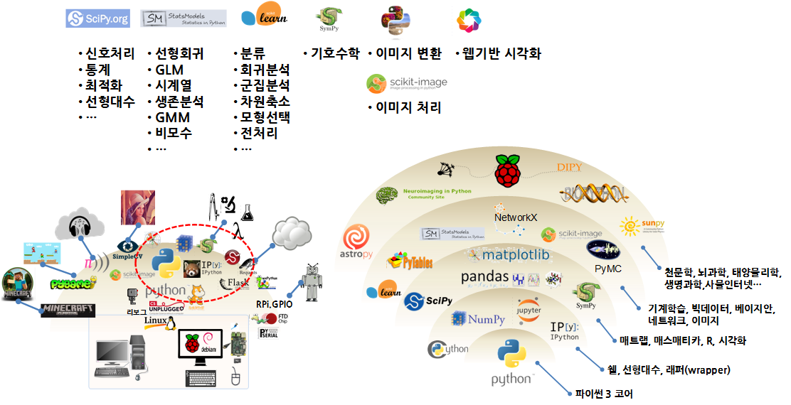
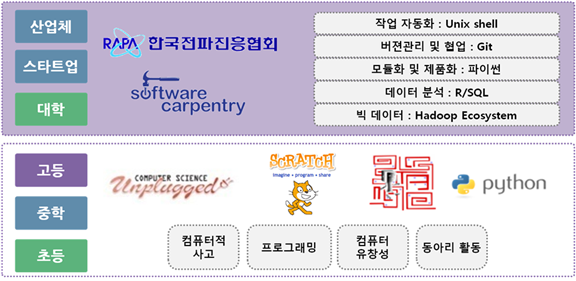
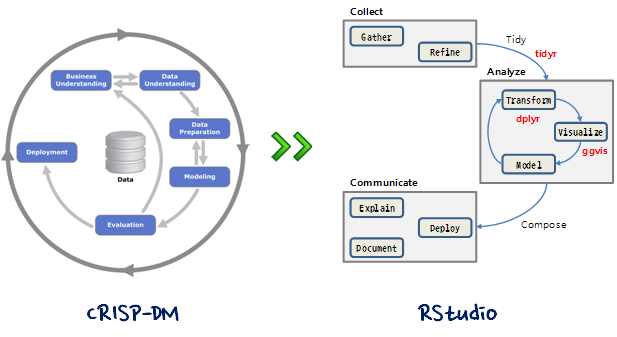
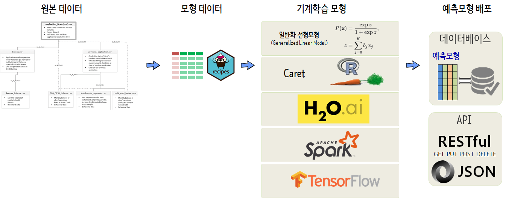
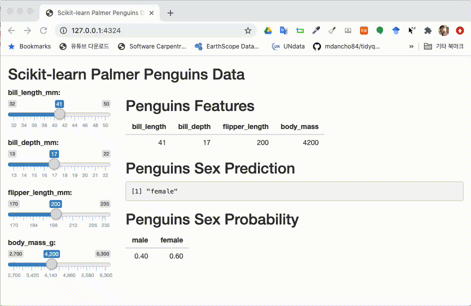

```{r setup, include = FALSE}
options(htmltools.dir.version = FALSE)

knitr::opts_chunk$set(echo = FALSE, warning=FALSE, message=FALSE,
                    comment="", digits = 3, tidy = FALSE, prompt = FALSE, fig.align = 'center')

```


# 들어가며

## 데이터야 놀자 2020


<small>
데이터와 놀이를 시작해야 되는데 가장 먼저 어떤 친구와 놀까가 매우 중요하게 다가오는데... 데이터 과학 언어를 선정하는데 다른 어떤 것보다 현실적인 문제를 푸는데 집중하고 덤으로 재미를 추구해야 하는데 그것이 쉽지 않고 귀가 얇아 주변에서 어떤게 좋다고하고 이러한 비행에 편승하여 비행 데이터 과학자가 되곤 한다. 조언이 도움이 되지 못하고 오히려 모든 고통의 원천이 되기도 한다. 데이터 과학 언어 전쟁은 결론이 나 있지만 사실 많은 사람들은 승부가 결론난 전쟁에 아직도 싸움을 계속하고 있다.
</small>

- 행사링크: [데이터야놀자](https://datayanolja.github.io/)

# 과학 기술 

## 가치(Value) 원천


<small> 세계은행(World Bank)과 한국개발연구원(KDI)은 약 2년여 기간의 공동연구를 통해 1960-2005 년간 한국 경제발전 과정에 관한 보고서를 출간했다. 경제성장이 지속되기 위해서는 생산성 증가가 대단히 중요하고, 1960년 이후 한국경제의 성공은 광의의 지식축적에 기인한 것으로 1960-2005년 사이 한국의 실질 1인당GDP의 75%가 광의의 지식축적에 기인한 것으로 분석했다. 
</small>

## 4번째 패러다임


## 라즈베리파이와 파이썬



[과학기술 파이썬 툴체인](https://statkclee.github.io/raspberry-pi/raspberry-pi-programming-science.html)

## 과학컴퓨팅


[과학기술 파이썬 툴체인](https://statkclee.github.io/raspberry-pi/raspberry-pi-programming-science.html)

## 소트프웨어 카펜트리



- [이광춘 (2015년 8월), "한국에서 SW 카펜트리 1년...", 파이콘 2015](http://statkclee.github.io/slideshows/korea/index.html)
- [소프트웨어 카펜트리 버젼 5.3.](http://statkclee.github.io/swcarpentry-version-5-3-new/)


# 데이터 과학 

## 사람 vs. 기계


[기초 통계 -통계 모형(Statistical models)](https://statkclee.github.io/statistics/stat-modeling.html)

## 데이터 사이언스 언어

데이터 사이언스를 대표하는 R이나 파이썬 모두 컴퓨터 프로그래밍 언어라서 태생적으로 거의 모든 컴퓨터 프로그래밍 언어가 갖고 있는 두 언어 문제에서 역시 자유로울 수는 없다.

<br>
<br>

| 시스템 언어  | Ousterhout 이분법  | 스크립트 언어  |
|:-------------:|:-----------:|:-------------:|
|   정적       |     --      |     동적     |
|   컴파일      |     --      |    인터프리터 |
| 사용자정의 자료형|     --      |  표준 자료형 |
|   빠른 속도   |     --      |   늦은 속도   |
|   어려움       |     --      |   쉬움     |


[Ousterhout dichotomy](https://en.wikipedia.org/wiki/Ousterhout%27s_dichotomy)

## 유닉스 | `tidyverse`


- 기존 자료구조를 재사용: Reuse existing data structures.
- 파이프 연산자로 간단한 함수를 조합: Compose simple functions with the pipe.
- 함수형 프로그래밍을 적극 사용: Embrace functional programming.
- 기계가 아닌 인간을 위한 설계: Design for humans.

## 데이터 과학 프로세스 



## ML 개발 프로세스


## 어떤 언어를 고를 것인가?


## 데이터 과학 언어 추세

<small>
R을 예로 들면, 팩키지 개발을 할 때 R 스크립트로 모든 기능을 선행하여 기능을 구현하고 유용성이 인정되어 사용자가 많아지면, [Rcpp](https://cran.r-project.org/web/packages/Rcpp/index.html) 팩키지를 사용하여 C/C++로 후행하여 속도와 성능이 필요한 부분에 재개발하는 경우가 흔하다.
</small>


# 데이터 과학 언어

## 문제 개요


- [펭귄 성별예측모형: 파이썬 + `Shiny`](https://statkclee.github.io/model/tidyverse-penguin-python-shiny.html)

## 펭귄 데이터셋


- [펭귄 vs 붓꽃 데이터](https://statkclee.github.io/data-science/ds-iris-penguin.html)

## 모형 아키텍쳐

| 앙상블 | Random Forest | XGBoost |
|--------|----------------|---------|
||  |  |

- [펭귄 성별예측모형: tidymodels](https://statkclee.github.io/model/tidyverse-parsnip-penguin.html)

## 모형 최적화: Hyper Parameter Tuning


- [펭귄 성별예측모형: tidymodels - Hyper Parameter](https://statkclee.github.io/model/tidyverse-parsnip-penguin-hyper-parameter.html)

## 모형 배포: RESTful API



- [펭귄 성별예측모형: tidymodels - RESTful API](https://statkclee.github.io/model/tidyverse-parsnip-penguin-RESTful-api.html)

## 설명가능한 예측모형: Explainable AI


- [펭귄 성별예측모형: tidymodels - MDP / DALEX](https://statkclee.github.io/model/tidyverse-parsnip-penguin-DALEX.html)

## `tidyposterior` 모형 평가


- [펭귄 성별예측모형: tidyposterior](https://statkclee.github.io/model/model-tidyposterior.html)

## Shiny Front-End + `tidymodels` Back-End


- [펭귄 성별예측모형: `tidymodels` - Shiny](https://statkclee.github.io/model/tidyverse-parsnip-penguin-shiny.html)

## Shiny Front-End + Python Back-End



- [펭귄 성별예측모형: 파이썬 - `Shiny`](https://statkclee.github.io/model/tidyverse-penguin-python-shiny.html)

# 데이터 과학 커뮤니티

- [Seoul R Meetup Group: Meetup.com](https://www.meetup.com/seoul-r-meetup/)
- [Facebook Group: Tidyverse Korea](https://www.facebook.com/groups/tidyverse/)
- [Seoul R Meetup Website](https://tidyverse-korea.github.io/seoul-R/)
- [Shiny Korea Meetup](https://github.com/shinykorea/Meetup)
- [웹에서 하는 R 통계](http://web-r.org/)

# 
