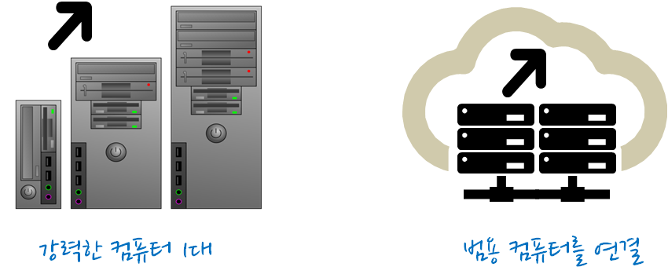
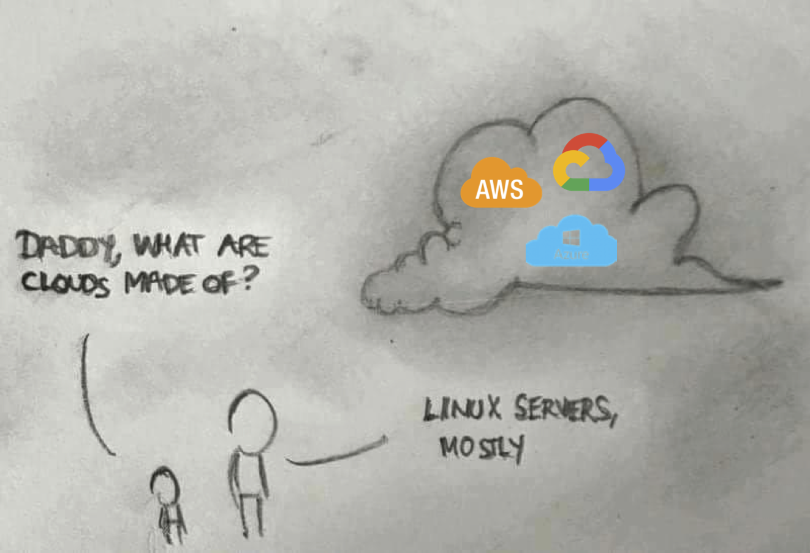

# 데이터(Data)

## 원재료 데이터

- [직사각형 데이터](https://statkclee.github.io/data-science/)
- [텍스트 데이터](https://statkclee.github.io/text/)
- [네트워크 데이터](https://statkclee.github.io/network/)
- [지리정보 데이터](https://statkclee.github.io/spatial/)
- [이미지 데이터](https://statkclee.github.io/trilobite/)
- 오디오/소리 데이터
- ...

## 빅데이터

|       구분     |               데이터 크기                                     |
|----------------|---------------------------------------------------------------|
| 매우 큰 데이터 | 컴퓨터 한대 메모리에 저장될 수 없는 크기 : **5 TB이상**          |
| 중간 데이터    | 서버 컴퓨터 메모리에 저장할 수 있는 크기 : **10 GB -- 5 TB**  |
| 작은 데이터    | 노트북 컴퓨터 메모리에 저장할 수 있는 크기 : **10 GB 이하**       |

# 컴퓨터

## 왜 슈퍼컴퓨터가 필요한가?

[xwMOOC 고성능 R 아키텍처](http://statkclee.github.io/parallel-r/r-perf-arch.html)

## 빅데이터 전략 

[빅데이터 - 스파크 이해하기](https://statkclee.github.io/bigdata/bigdata-spark-mooc.html)

## 병렬/분산 컴퓨팅

[고성능 컴퓨팅(HPC) - 고성능 컴퓨팅 기초](http://statkclee.github.io/hpc/hpc-basic.html)

# 소프트웨어

## 프로그래밍 언어

1. **R**
1. **파이썬**
1. **SQL**
1. 자바 스크립트
1. C/C++

## 작업 흐름

{#id .class width=100%}

## 데이터 사이언스 운영체제

{#id .class width=80% height=80%}

[이광춘 ( 삼정 KPMG 상무), "데이터 사이언스 운영체제 - `tidyverse`", 한국통계학회 소식지 2019년 10월호](https://statkclee.github.io/ds-authoring/ds-stat-tidyverse.html)

# 문서 != 문서 편집기

## 사무자동화의 꽃 - MS 오피스

- [도전받는 데이터 사이언스 도구](https://statkclee.github.io/ds-authoring/ds-finance-why-201904.html#30)
    - 엑셀
    - 파워포인트
    - 워드
    - 액세스

## 디지털 리터러시 특강: 한림대

[글쓰기는 자동화의 시작 - 데이터 과학의 세계](https://statkclee.github.io/ds-authoring/ds-digital-literacy.html#/)

## 데이터 과학자의 블로그

- [AWSKRUG - AWS한국사용자모임 (2019년 9월 5일), "데이터 과학자의 클라우드 블로그"](https://statkclee.github.io/ds-authoring/ds-blog-aws-cloud.html#7)

# 실생활 데이터 사이언스

## 러시아 월드컵 (독일전)

[러시아 월드컵(2018) - 한국 vs 독일](https://statkclee.github.io/viz/viz-worldcup-germany.html)

## 지진해일 대피소

[xwMOOC (2018-01-17), "지진해일 대피소 - `crosstalk`"](https://statkclee.github.io/viz/viz-earthquake-shelter.html)

## 국회의원 프로필

[국회의원 사진 - `trelliscope`](https://statkclee.github.io/viz/viz-congressman.html)

## 동영상 감성 분석

[xwMOOC 딥러닝 - 동영상 감정 분석](https://statkclee.github.io/deep-learning/ms-oxford-video.html)

[KBS NEWS, 인공지능으로 분석한 대통령의 마음…슬픔은 어디에?](http://news.kbs.co.kr/news/view.do?ncd=3390429&ref=D)

## 회귀분석 - MLB 투수 유전자는 유전이 될까?

[회귀분석 - MLB 투수 유전자는 유전이 될까?](https://statkclee.github.io/politics/pe-baseball-era.html)

# 마무리

## 

“고대에는 ’땅’이 가장 중요했고 땅이 소수에게 집중되자 인간은 귀족과 평민으로 구분됐으며, 근대에는 ’기계’가 중요해지면서 기계가 소수에게 집중되자 인간은 자본가와 노동자 계급으로 구분됐다”. 이제는 데이터가 또 한번 인류를 구분하는 기준이 될 것이다. 향후 데이터가 소수에게 집중되면 단순 계급에 그치는 게 아니라 데이터를 가진 종과 그렇지 못한 종으로 분류될 것이이다. - 유발 하라리(Yuval Noah Harari)

## 

“The future is here, it’s just not evenly distributed yet.”
- William Gibson

