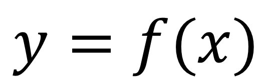
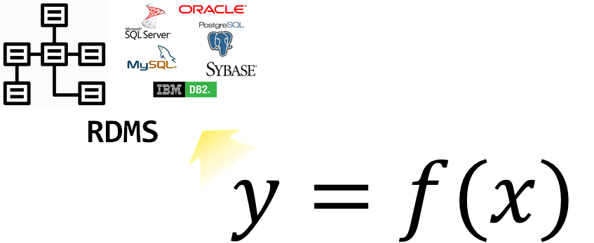

```{r setup, include=FALSE}
options(htmltools.dir.version = FALSE)

knitr::opts_chunk$set(echo = FALSE, warning=FALSE, message=FALSE,
                    comment="", digits = 3, tidy = FALSE, prompt = TRUE, fig.align = 'center')
```

.center[
  
]

.footnote[
[데이터를 만지는 모든 이를 위한 세미나 및 네트워킹](https://www.onoffmix.com/event/181554)
]

---
background-image: url("fig/civil-war-r-python.png")
background-position: 50% 50%
class: center, bottom, inverse

#  R vs Python 

---
class: inverse, middle, center

## 데이터 과학자 1세대

---
## 데이터 과학자

.pull-left[
  
]

.pull-right[
  <iframe width="400" height="250" src="https://www.youtube.com/embed/K_TGdklC504" frameborder="0" allow="accelerometer; autoplay; encrypted-media; gyroscope; picture-in-picture" allowfullscreen></iframe>
]

.footnote[
- 삼정 KPMG 데이터 과학자
- 연세대학교 겸임교수, ["데이터 사이언스 입문"](https://statkclee.github.io/yonsei/)
- [이광춘(2019) "데이터 사이언스, 타이디버스로 향하다", 마이크로소프트웨어 395호](http://it.chosun.com/site/data/html_dir/2019/01/29/2019012900392.html)
- [데이터 사이언스 미트업 운영](https://tidyverse-korea.github.io/r-meetup-x-presser/)
- [소프트웨어 카펜트리(Software Carpentry) 강사 (Kwangchun Lee)](https://carpentries.org/instructors/)
- [Cloudera Conference 2018 - Seoul: 기계의 역습 - 설명가능한 기계학습](https://www.clouderasessionsseoul.com/agenda.php)
]

---
class: inverse, middle, center

## 빅데이터 &rarr; 데이터 사이언스

---
## 구글 Trends 데이터 사이언스 한미 비교 - 미국

```{r google-trends-comparison-us, echo=FALSE, fig.width=12, fig.height=8}
library(tidyverse)
library(lubridate)
library(googleVis)
library(extrafont)
loadfonts()

Sys.setenv(TZ='Asia/Seoul')

us_df <- read_rds("data/us_df.rds")
kr_df <- read_rds("data/kr_df.rds")

us_df$interest_over_time %>% tbl_df %>% 
  mutate(hits = as.integer(hits)) %>% 
  ggplot(aes(x=date, y=hits, color=keyword)) +
    geom_line() +
    labs(x="", y="구글 인기도", color="구글 검색어") +
    theme_minimal(base_family = "NanumGothic") +
    theme(legend.position = "top",
          legend.title=element_text(size=17), 
          legend.text=element_text(size=15))

```


---
## 구글 Trends 데이터 사이언스 한미 비교 - 한국


```{r google-trends-comparison-kr, fig.width=12, fig.height=8}
kr_df$interest_over_time %>% tbl_df %>% 
  mutate(hits = as.integer(hits)) %>% 
  ggplot(aes(x=date, y=hits, color=keyword)) +
    geom_line() +
    labs(x="", y="구글 인기도", color="구글 검색어") +
    theme_minimal(base_family = "NanumGothic") +
    theme(legend.position = "top",
          legend.title=element_text(size=17), 
          legend.text=element_text(size=15))
```

---
## 데이터 사이언스란?

데이터 사이언스는 데이터를 다루는 과학이다. 따라서 자연법칙을 다루는 자연과학과 맥이 닿아있다.
자연법칙을 측정하여 데이터프레임(`DataFrame`)으로 나타내면 **변수(Variable)**, **관측점(Observation)**, **값(Value)**으로 표현된다.


---
## 데이터 사이언스 업무 - 에어비앤비


- **분석(Analytics) 데이터 과학자(Data Analyst)**는 좋은 질문을 던질 수 있고, 
탐색적 데이터 분석을 통해서 문제와 해법을 명확히 하는 재주가 있고, 대쉬보드와 시각화를 통해 데이터 분석을 자동화하고, 추천 결과물을 통해 비즈니스를 변화시킨다. 
- **알고리즘(algorithm) 데이터 과학자(AI/Machine Learning Engineer)**는 기계학습에 특기가 있는 사람에 적합하고 제품/서비스, 프로세스에 데이터를 알고리즘을 통해 녹여내서 비즈니스 가치를 창출한다. 
- **추론(inference) 데이터 과학자(Statistician)**는 통계를 사용해서 의사결정을 향상시키고, 업무의 영향도를 측정하는데 주로 통계학, 경제학, 사화과학 전공지식을 적극 활용한다.

.footnote[
  [Elena Grewal(July 25, 2018), "One Data Science Job Doesn’t Fit All"](https://www.linkedin.com/pulse/one-data-science-job-doesnt-fit-all-elena-grewal/)
]

---
class: inverse, middle, center

## 기술로 요약한 데이터 사이언스

---
class: middle, center




---
class: middle, center




---
class: middle, center


---
class: middle, center


---
class: inverse, middle, center

## 데이터 사이언스 언어

---
### 사람 vs. 기계

.center[
  
]

.footnote[
  [기초 통계 -통계 모형(Statistical models)](https://statkclee.github.io/statistics/stat-modeling.html)
]

---
### 프로그래밍 언어

데이터 사이언스를 대표하는 R이나 파이썬 모두 컴퓨터 프로그래밍 언어라서 태생적으로 거의 모든 컴퓨터 프로그래밍 언어가 갖고 있는 두 언어 문제에서 역시 자유로울 수는 없다.

<br>
<br>

|    시스템 언어    | Ousterhout 이분법  | 스크립트 언어  |
|:-----------------:|:------------------:|:-------------:|
|    정적           |     --             |     동적     |
|   컴파일          |     --             |    인터프리터 |
| 사용자정의 자료형 |     --             |  표준 자료형 |
|   빠른 속도       |     --             |   늦은 속도   |
|   어려움          |     --             |   쉬움     |


.footnote[
  [Ousterhout dichotomy](https://en.wikipedia.org/wiki/Ousterhout%27s_dichotomy)
]


---
### 데이터 사이언스 언어

.center[
  
]

---
### Premature optimization is the root of all evil

R을 예로 들면, 팩키지 개발을 할 때 R 스크립트로 모든 기능을 선행하여 기능을 구현하고 유용성이 인정되어 사용자가 많아지면, [Rcpp](https://cran.r-project.org/web/packages/Rcpp/index.html) 팩키지를 사용하여 C/C++로 후행하여 속도와 성능이 필요한 부분에 재개발하는 경우가 흔하다.

.center[
  
]

---
### R과 파이썬의 아름다운 동행

.center[
  
]


---
### 데이터 사이언스 프로세스 


---
### tidyverse

.center[
  
]

- 기존 자료구조를 재사용: Reuse existing data structures.
- 파이프 연산자로 간단한 함수를 조합: Compose simple functions with the pipe.
- 함수형 프로그래밍을 적극 사용: Embrace functional programming.
- 기계가 아닌 인간을 위한 설계: Design for humans.

---
### 데이터 탐험(Data Adventure)

2019년 1월 28일, 마이크로소프트웨어 395호 데이터 탐험(Data Adventure)편

.left-column[

]


.right-column[
- SCHEMA
  - S1. **데이터 사이언스, 타이디버스로 향하다** - 이광춘
  - S2. 데이터 분석가는 어떤 스킬셋을 가져야 하는가 - 서희
- OPINIONS, 
- FUTURE
- TECHNOLOGY
- WORKS
- APPLIED
- RESEARCH
- ETC

]

.footnote[
[MICRO SOFTWARE 홈페이지](https://www.imaso.co.kr/), [마이크로소프트웨어 395호 데이터 탐험(Data Adventure)](https://www.imaso.co.kr/archives/4654)
]

---
class: inverse, middle, center

# 데이터 사이언스 - AI/ML

---
### 데이터 사이언스와 API 프로그래밍

- 들어가며: 코드 몇줄로 엄청난 생산성!!!
    - [데이터 과학 – 기초 통계, `tidycensus` 기초](https://statkclee.github.io/statistics/tidycensus-basic.html)
- 웹크롤링과 API 비교
    - [데이터 과학 – 기초 통계, `kosis`와 `tidycensus` 비교](https://statkclee.github.io/statistics/tidycensus-kosis-comparison.html)
- 유료와 무료    
    - [공간통계를 위한 데이터 사이언스, "지리정보 API - 주소와 위도경도"](https://statkclee.github.io/spatial/geo-info-lonlat.html)
- AI 인공지능
    - [xwMOOC 딥러닝, "텍스트와 이미지 API"](https://statkclee.github.io/deep-learning/ms-text-image.html)
    - [구글 클라우드 비젼 API](https://statkclee.github.io/deep-learning/r-google-vision-api.html)
    - [xwMOOC 딥러닝 - "IBM 왓슨"](https://statkclee.github.io/deep-learning/r-watson.html)
    - [유튜브 - "알릴레요 vs. 홍카콜라 - 댓글 분류"](https://statkclee.github.io/text/nlp-youtube-comment.html)

.footnote[ 
- [안상선 M로보 대표 "MVP는 경운기 만드는 과정"](https://mirakle.mk.co.kr/view.php?year=2019&no=209240)
- [이광춘 (2019-04-04), "'뉴스 데이터'라고 읽고 '텍스트 데이터'로 분석하여 사례 만들기"](https://statkclee.github.io/ds-authoring/ds_kpf.html), 한국언론진흥재단, “2019 뉴스빅데이터 해커톤 개최”
]

---
### 한영 번역 

- [데이터 사이언스를 위한 소프트웨어 공학, "파파고 API - 한영번역"](https://statkclee.github.io/sw4ds/sw4ds-api-papago-translation.html)

```{python show-translation, echo=TRUE, eval=FALSE}
$ curl "https://openapi.naver.com/v1/papago/n2mt" \
  -H "Content-Type: application/x-www-form-urlencoded; charset=UTF-8" \
  -H "X-Naver-Client-Id: zRsZRLqoDEYE1AufliHS" \
  -H "X-Naver-Client-Secret: i5n4wY0ZLi" \
  -d "source=ko&target=en&text=만나서 반갑습니다." -v

* Connection #0 to host openapi.naver.com left intact
{"message":{"@type":"response","@service":"naverservice.nmt.proxy",
"@version":"1.0.0","result":{"srcLangType":"ko","tarLangType":"en",
"translatedText":"Nice to meet you."}}}
```

---
### 금융 적용 - 인지기술(cognitive technology)

.center[

]

- 각종 계약서
    - 리보(LIBOR, London Interbank Offered Rate, 런던 은행간 금리)가 명기된 계약서
- 우편/민원/이력서 분류


---
## 기계가 인식하는 사물

- [사진속 객체 인식 - 작업흐름](https://statkclee.github.io/sw4ds/sw4ds-keras-image-object.html)
    - 국문: `~swc/author_carpentry_kr/tutorial/reproducible_finance/shiny`
    - 영문: `~swc/author_carpentry_kr/tutorial/reproducible_finance/shiny`
- [비행기 vs 자동차 vs 배 인식](https://statkclee.github.io/deep-learning/r-keras-cnn.html) 

.footnote[
[xwMOOC, "이미지 분류 - 케라스(딥러닝)"](https://statkclee.github.io/data-product/shiny-image-classification.html)
]


---
class: middle

## R powered by AI

- `author_carpentry_kr/tutorial/reproducible_finance/shiny/`
- `author_carpentry_kr/tutorial/reproducible_finance/shiny/global.R`  
- `author_carpentry_kr/tutorial/reproducible_finance/shiny/server.R`
- `author_carpentry_kr/tutorial/reproducible_finance/shiny/ui.R`
- `author_carpentry_kr/tutorial/reproducible_finance/shiny/www/*.jpg`

---
background-image: url("fig/Avengers_Endgame_poster.jpg")
background-position: 50% 50%
class: center, bottom, inverse

#  삼정 KPMG 인턴 채용 중 


