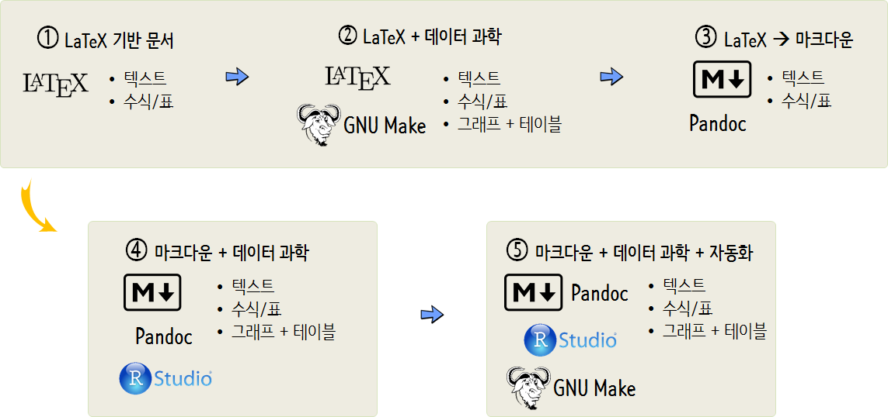
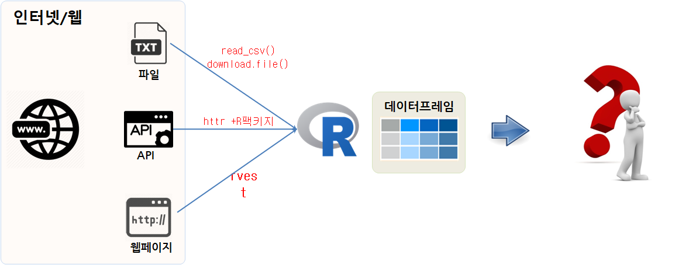

```{r setup, include=FALSE}
options(htmltools.dir.version = FALSE)

knitr::opts_chunk$set(echo = FALSE, warning=FALSE, message=FALSE,
                    comment="", digits = 3, tidy = FALSE, prompt = TRUE, fig.align = 'center')
```

class: inverse, middle, center

## 데이터 과학자 1세대

---
### 데이터 과학자

.pull-left[
  
]

.pull-right[
  <iframe width="400" height="250" src="https://www.youtube.com/embed/K_TGdklC504" frameborder="0" allow="accelerometer; autoplay; encrypted-media; gyroscope; picture-in-picture" allowfullscreen></iframe>
]

.footnote[
- 삼정 KPMG 데이터 과학자
- 연세대학교 겸임교수, ["데이터 사이언스 입문"](https://statkclee.github.io/yonsei/)
- [이광춘(2019) "데이터 사이언스, 타이디버스로 향하다", 마이크로소프트웨어 395호](http://it.chosun.com/site/data/html_dir/2019/01/29/2019012900392.html)
- [데이터 사이언스 미트업 운영](https://tidyverse-korea.github.io/r-meetup-x-presser/)
- [소프트웨어 카펜트리(Software Carpentry) 강사 (Kwangchun Lee)](https://carpentries.org/instructors/)
- [Cloudera Conference 2018 - Seoul: 기계의 역습 - 설명가능한 기계학습](https://www.clouderasessionsseoul.com/agenda.php)
]

---
class: inverse, middle, center

## 빅데이터 &rarr; 데이터 사이언스

---
### 구글 Trends 데이터 사이언스 한미 비교 - 미국

```{r google-trends-comparison-us, echo=FALSE, fig.width=12, fig.height=8}
library(tidyverse)
library(lubridate)
library(googleVis)
library(extrafont)
loadfonts()

Sys.setenv(TZ='Asia/Seoul')

us_df <- read_rds("data/us_df.rds")
kr_df <- read_rds("data/kr_df.rds")

us_df$interest_over_time %>% tbl_df %>% 
  mutate(hits = as.integer(hits)) %>% 
  ggplot(aes(x=date, y=hits, color=keyword)) +
    geom_line() +
    labs(x="", y="구글 인기도", color="구글 검색어") +
    theme_minimal(base_family = "NanumGothic") +
    theme(legend.position = "top",
          legend.title=element_text(size=17), 
          legend.text=element_text(size=15))

```


---
### 구글 Trends 데이터 사이언스 한미 비교 - 한국


```{r google-trends-comparison-kr, fig.width=12, fig.height=8}
kr_df$interest_over_time %>% tbl_df %>% 
  mutate(hits = as.integer(hits)) %>% 
  ggplot(aes(x=date, y=hits, color=keyword)) +
    geom_line() +
    labs(x="", y="구글 인기도", color="구글 검색어") +
    theme_minimal(base_family = "NanumGothic") +
    theme(legend.position = "top",
          legend.title=element_text(size=17), 
          legend.text=element_text(size=15))
```

---
### 데이터 사이언스란?

데이터 사이언스는 데이터를 다루는 과학이다. 따라서 자연법칙을 다루는 자연과학과 맥이 닿아있다.
자연법칙을 측정하여 데이터프레임(`DataFrame`)으로 나타내면 **변수(Variable)**, **관측점(Observation)**, **값(Value)**으로 표현된다.


---
### 데이터 사이언스 업무


- **분석(Analytics) 데이터 과학자(Data Analyst)**는 좋은 질문을 던질 수 있고, 
탐색적 데이터 분석을 통해서 문제와 해법을 명확히 하는 재주가 있고, 대쉬보드와 시각화를 통해 데이터 분석을 자동화하고, 추천 결과물을 통해 비즈니스를 변화시킨다. 
- **알고리즘(algorithm) 데이터 과학자(AI/Machine Learning Engineer)**는 기계학습에 특기가 있는 사람에 적합하고 제품/서비스, 프로세스에 데이터를 알고리즘을 통해 녹여내서 비즈니스 가치를 창출한다. 
- **추론(inference) 데이터 과학자(Statistician)**는 통계를 사용해서 의사결정을 향상시키고, 업무의 영향도를 측정하는데 주로 통계학, 경제학, 사화과학 전공지식을 적극 활용한다.

.footnote[
  [Elena Grewal(July 25, 2018), "One Data Science Job Doesn’t Fit All"](https://www.linkedin.com/pulse/one-data-science-job-doesnt-fit-all-elena-grewal/)
]


---
class: inverse, middle, center

## 데이터 사이언스 기본기 &rarr; 글쓰기
 
---
### 파워포인트의 종말 &larr; 아마존 제프 베이조스

.center[

]

.footnote[
 [김미리 기자 (2019.04.06.), "보고서 치장은 그만, 글로 써라.. '제로 PPT' 선언하는 기업들", 조선일보](https://news.v.daum.net/v/20190406030158105)
]

---
## 세가지 다른 글쓰기 패러다임


---
## 도구가 자동화하는 저작 업무

.pull-left[
### 1. $LaTex$ 사례
  
  
  [정보교육을 위한 파이썬: 데이터 과학자로의 여정, 아마존 절찬 판매중](https://statkclee.github.io/pythonlearn-kr/01-py4inf-python2/)
]


.pull-right[
### 2. 북다운(Bookdown)

.center[
  
]
[컴퓨터 과학 언플러그드, 이광춘 번역](https://statkclee.github.io/unplugged/)
]

---
## 도구가 자동화하는 저작 업무

.pull-left[
### 3. 파이썬 스핑크스
  

- [Welcome to Reeborg world!](http://reeborg.ca/index_en.html)
- [리보그 한국어 버젼](http://reeborg.ca/docs/ko/index.html)
- [프로그래밍과 문제해결: 파이썬, 리보그, 러플](https://statkclee.github.io/code-perspectives/)

]

.pull-right[
### 4. 블로그

.center[
  
]

[데이터 과학을 위한 저작도구 블로그 - `blogdown`](https://statkclee.github.io/ds-authoring/ds-blogdown.html)
]

---
## 도구가 자동화하는 저작 업무

### 5. 슬라이드쇼(slideshow)

.center[
  
]

.footnote[
  [소프트웨어에 물들다(왕곡초등학교, 2018-05-26)](somul_20180525.html) -  글쓰기를 잘하기 위해서 알아야 되는 코딩
]


---
class: inverse, middle, center

# 데이터 사이언스 글쓰기

---
## 재현가능한 글쓰기

.center[

]

.footnote[
 [데이터 과학: 재현가능한 저작 - R 마크다운 논문](https://statkclee.github.io/author_carpentry_kr/rmarkdown-authoring-paper.html)
]

---
## 재현가능한 글쓰기 환경

.center[

]

.footnote[
 [데이터 과학: 재현가능한 저작 - R 마크다운 논문](https://statkclee.github.io/author_carpentry_kr/rmarkdown-authoring-paper.html)
]

---
## 데이터로 저작 사례 

### 데이터 사이언스 제품

.center[



-----  


]

.footnote[
 [데이터야 놀자 발표자료(2017)](https://statkclee.github.io/ds-authoring/slides/ds_data_product.html)
]


---
## 참고문헌

### 강서양천일보('15.08월)
- [글을 쓰는 것은 소프트웨어 개발이다!](https://goo.gl/RiXTIb)
- [컴퓨터 사고력과 소프트웨어 교육](https://goo.gl/IXIW4n)

### 데이터과학자를 위한 저작 툴체인
- [데이터 과학을 위한 저작도구](https://statkclee.github.io/ds-authoring/)
- [Modern Scientific Authoring](http://swcarpentry.github.io/modern-scientific-authoring/)
- [데이터 과학: 재현가능한 저작](https://statkclee.github.io/author_carpentry_kr/)

