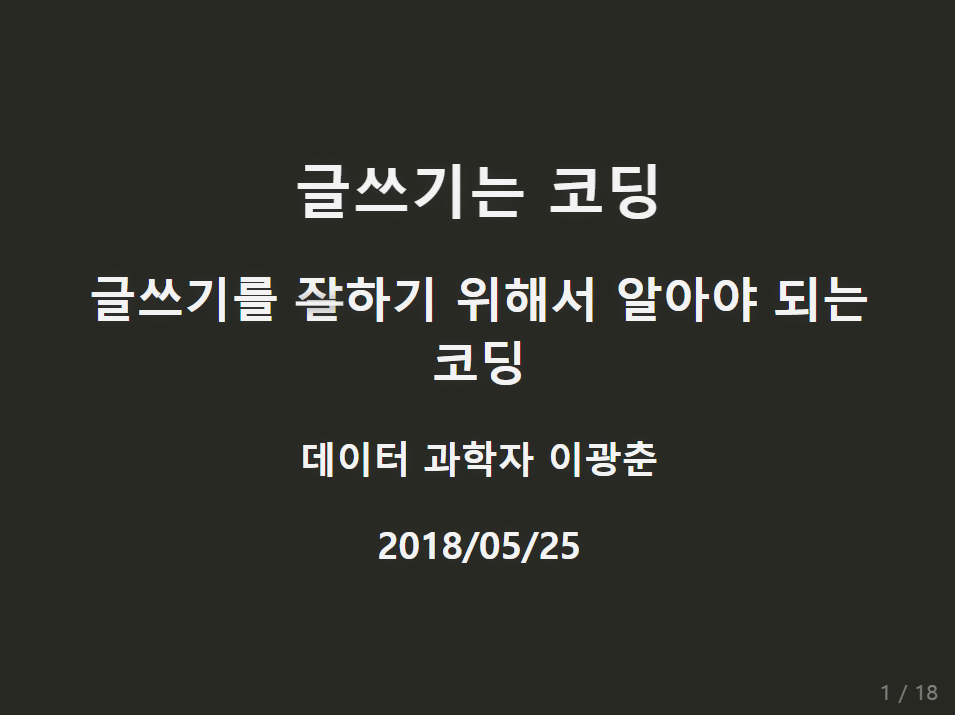
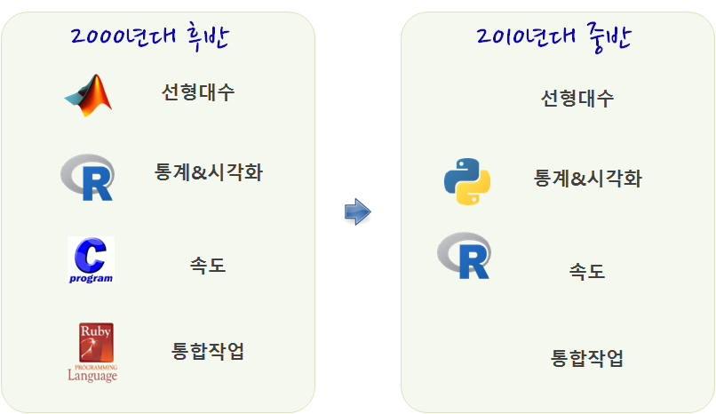

class: inverse, middle, center

## 데이터 과학자 1세대

---
### 데이터 과학자

.pull-left[
  
]

.pull-right[
  <iframe width="400" height="250" src="https://www.youtube.com/embed/K_TGdklC504" frameborder="0" allow="accelerometer; autoplay; encrypted-media; gyroscope; picture-in-picture" allowfullscreen></iframe>
]

.footnote[
- 삼정 KPMG 데이터 과학자
- 연세대학교 겸임교수, ["데이터 사이언스 입문"](https://statkclee.github.io/yonsei/)
- [이광춘(2019) "데이터 사이언스, 타이디버스로 향하다", 마이크로소프트웨어 395호](http://it.chosun.com/site/data/html_dir/2019/01/29/2019012900392.html)
- [데이터 사이언스 미트업 운영](https://tidyverse-korea.github.io/r-meetup-x-presser/)
- [소프트웨어 카펜트리(Software Carpentry) 강사 (Kwangchun Lee)](https://carpentries.org/instructors/)
- [Cloudera Conference 2018 - Seoul: 기계의 역습 - 설명가능한 기계학습](https://www.clouderasessionsseoul.com/agenda.php)
]

---
class: inverse, middle, center

## 빅데이터 &rarr; 데이터 사이언스

---
### 구글 Trends 데이터 사이언스 한미 비교 - 미국


---
### 구글 Trends 데이터 사이언스 한미 비교 - 한국


---
### 데이터 사이언스란?

데이터 사이언스는 데이터를 다루는 과학이다. 따라서 자연법칙을 다루는 자연과학과 맥이 닿아있다.
자연법칙을 측정하여 데이터프레임(`DataFrame`)으로 나타내면 **변수(Variable)**, **관측점(Observation)**, **값(Value)**으로 표현된다.


---
### 데이터 사이언스 업무


- **분석(Analytics) 데이터 과학자(Data Analyst)**는 좋은 질문을 던질 수 있고, 
탐색적 데이터 분석을 통해서 문제와 해법을 명확히 하는 재주가 있고, 대쉬보드와 시각화를 통해 데이터 분석을 자동화하고, 추천 결과물을 통해 비즈니스를 변화시킨다. 
- **알고리즘(algorithm) 데이터 과학자(AI/Machine Learning Engineer)**는 기계학습에 특기가 있는 사람에 적합하고 제품/서비스, 프로세스에 데이터를 알고리즘을 통해 녹여내서 비즈니스 가치를 창출한다. 
- **추론(inference) 데이터 과학자(Statistician)**는 통계를 사용해서 의사결정을 향상시키고, 업무의 영향도를 측정하는데 주로 통계학, 경제학, 사화과학 전공지식을 적극 활용한다.

.footnote[
  [Elena Grewal(July 25, 2018), "One Data Science Job Doesn’t Fit All"](https://www.linkedin.com/pulse/one-data-science-job-doesnt-fit-all-elena-grewal/)
]


---
class: inverse, left

## 도전받는 데이터 사이언스 도구

### 엑셀

.footnote[
1. **도전받는 데이터 사이언스 도구**: 엑셀
1. 도전받는 데이터 사이언스 도구: 파워포인트
1. 도전받는 데이터 사이언스 도구: 워드
1. 데이터 사이언스 언어 : R
1. 데이터 사이언스 언어 : 시각화
1. 데이터 사이언스 언어 : AI/ML
] 

---
### 위기의 스프레드쉬트(엑셀)

.center[

]

.footnote[
 [스터디 뽀개기 7월 (2016-07-30), 분석행(Train to data-analysis)](https://onoffmix.com/event/73626)
]

---
### 스프레드쉬트 참사 

|     회사      | 손실 |   날짜 |        영향           |               참사 개요                         | 
|---------------|-----------|----------|-----------------------|-------------------------------------------------|
|     Mouchel   |  £ 4.3백만  |  '10.11월  | CEO 사임, 주가폭락 | 연금펀드평가 £ 4.3백만 엑셀 오류 |
|   C&C Group   |  £ 9 백만  |  '09.7월  | 주가 15% 하락 등 | 매출 3% 상승이 아니고 5% 하락, 엑셀 오류 |
|   King 펀드   | £ 130 백만 |  '11.05월  | 브래드 이미지 하락 | 웨일즈 지방 NHS 지출 엑셀 오류 |
| AXA Rosenberg | £ 150 백만 |  '11.02월  | 은폐, 벌금, 브래드 이미지 하락 | 엑셀 오류를 감춰서 $242 백만 벌금 |
| JP Morgan Chase | £ 250 백만 |  '13.01월  | 명성, 고객 신뢰도 저하 | 바젤 II VaR 위험 평가 엑셀 오류 |
| Magellan 펀드 | £ 1.6 십억 |  '95.01월  | 투자자에게 약속한 배당금 지급 못함 | 음수 부호 누락으로 자본이득 과대계상|
| 미연방준비위원회 | £ 2.5 십억 |  '10.10월  | 명확하지 않음 | 리볼빙 카드 신용액 산출 과정에 엑셀 오류 |


.footnote[
[THE DIRTY DOZEN 12 MODELLING HORROR STORIES & SPREADSHEET DISASTERS](http://blogs.mazars.com/the-model-auditor/files/2014/01/12-Modelling-Horror-Stories-and-Spreadsheet-Disasters-Mazars-UK.pdf)
]

---
### 스프레드쉬트를 버려야 하는 6가지 이유 

> #### 스프레드쉬트를 사용하는 이유
> 
> * 항상 엑셀을 사용했다: 항상 데이터를 엑셀로 저장하고 분석해서 사용했다. 하지만, 버튼 하나로 데이터를 내보내기 쉽다.
> * 데이터베이스를 사용할 만큼 데이터가 충분하지 않다: 데이터가 작아서 데이터베이스를 사용할 이유를 찾지 못하지만,
사업이 커지고, 업무량이 늘어나면서 엑셀 작업량이 높아지고, 복잡성도 커지고, 엑셀 자체에서 처리되는 시간도 늘어난다.

1. 한번에 한사람만 작업이 가능하다.
<br>
1. 데이터 감사는 데이터베이스에서만 가능
<br>
1. 데이터베이스는 정형화된 작업흐름을 지원한다.
<br>
1. 데이터베이스는 엑셀보다 모형을 보다 잘 지원한다.
<br>
1. 데이터베이스로 보고서 생성이 수월하다.
<br>
1.  데이터베이스는 보안이 강력하고 규제하기 좋다.
<br>

.footnote[
 [데이터 과학, "위기의 스프레드쉬트"](https://statkclee.github.io/data-science/ds-why-not-excel.html)
]

---
### 스프레드쉬트 알고리즘 복잡성

<br>
<br>
<br>

.center[

]

.footnote[
[탈옥(jailbreakr) – 엑셀에서 탈출… 자유](https://statkclee.github.io/data-science/ds-xls.html)
]


---
### 스프레드쉬트 복잡성과 효율성

- 스프레드쉬트는 데이터, 서식, 수식으로 구성된다. 
- 숫자 데이터를 엑셀로 가져오게 되면 엑셀 내장 함수를 통해 수식 계산을 수행한다. 
- 엑셀 사용자 본인 혹은 외부 사람을 위해 서식을 입히는 과정을 거쳐 비로소 완성된 스프레드쉬트가 된다.

.center[

]

.footnote[
[탈옥(jailbreakr) – 엑셀에서 탈출… 자유](https://statkclee.github.io/data-science/ds-xls.html)
]


---
class: inverse, left

## 도전받는 데이터 사이언스 도구

### 파워포인트
 
.footnote[
1. ~~도전받는 데이터 사이언스 도구: 엑셀~~
1. **도전받는 데이터 사이언스 도구: 파워포인트**
1. 도전받는 데이터 사이언스 도구: 워드
1. 데이터 사이언스 언어 : R
1. 데이터 사이언스 언어 : 시각화
1. 데이터 사이언스 언어 : AI/ML
] 
 
 
---
### 파워포인트의 종말 &larr; 아마존 제프 베이조스

.center[

]

.footnote[
 [김미리 기자 (2019.04.06.), "보고서 치장은 그만, 글로 써라.. '제로 PPT' 선언하는 기업들", 조선일보](https://news.v.daum.net/v/20190406030158105)
]
 
---
## 세가지 다른 글쓰기 패러다임


---
## 도구가 자동화하는 저작 업무

.pull-left[
### 1. $LaTex$ 사례
  
  
  [정보교육을 위한 파이썬: 데이터 과학자로의 여정, 아마존 절찬 판매중](https://statkclee.github.io/pythonlearn-kr/01-py4inf-python2/)
]


.pull-right[
### 2. 북다운(Bookdown)

.center[
  
]
[컴퓨터 과학 언플러그드, 이광춘 번역](https://statkclee.github.io/unplugged/)
]

---
## 도구가 자동화하는 저작 업무

.pull-left[
### 3. SW 도움말
  

- [Welcome to Reeborg world!](http://reeborg.ca/index_en.html)
- [리보그 한국어 버젼](http://reeborg.ca/docs/ko/index.html)
- [프로그래밍과 문제해결: 파이썬, 리보그, 러플](https://statkclee.github.io/code-perspectives/)

]

.pull-right[
### 4. 블로그

.center[
  
]

[데이터 과학을 위한 저작도구 블로그 - `blogdown`](https://statkclee.github.io/ds-authoring/ds-blogdown.html)
] [xwMOOC 블로그 - `netlify`](http://xwmooc.netlify.com/)


---
## 도구가 자동화하는 저작 업무

### 5. 슬라이드쇼(slideshow)

.center[
  
]

.footnote[
  [소프트웨어에 물들다(왕곡초등학교, 2018-05-26)](somul_20180525.html) -  글쓰기를 잘하기 위해서 알아야 되는 코딩
]


---
class: inverse, left

## 도전받는 데이터 사이언스 도구

### 워드

.footnote[
1. ~~도전받는 데이터 사이언스 도구: 엑셀~~
1. ~~도전받는 데이터 사이언스 도구: 파워포인트~~
1. **도전받는 데이터 사이언스 도구: 워드**
1. 데이터 사이언스 언어 : R
1. 데이터 사이언스 언어 : 시각화
1. 데이터 사이언스 언어 : AI/ML
] 

---
## 재현가능한 글쓰기

.center[

]

.footnote[
 [데이터 과학: 재현가능한 저작 - R 마크다운 논문](https://statkclee.github.io/author_carpentry_kr/rmarkdown-authoring-paper.html)
]

---
## 재현가능한 글쓰기 환경

.center[

]

.footnote[
 [데이터 과학: 재현가능한 저작 - R 마크다운 논문](https://statkclee.github.io/author_carpentry_kr/rmarkdown-authoring-paper.html)
]

---
## 데이터로 저작 사례 

### 데이터 사이언스 제품

.center[


-----  


]

.footnote[
 [데이터야 놀자 발표자료(2017)](https://statkclee.github.io/ds-authoring/slides/ds_data_product.html)
]


---
## 글쓰기 사례 - 글쓰기는 코딩

- 마크다운(Markdown)
    - 제목, 글꼴, 중요항목, 그림, 표, ... 
- 한번 작성하고 나머지는 기계에 위탁
    - 자바(Write Once, Run Anywhere)
    - HTML, 워드, PDF, ...
- 글쓰기에 수학을 넣어보자
    - 수식, 표, 그래프, ...
- 학위 논문과 저널에 투고할 논문을 저작해보자.
    - 참고문헌, 인용, 색인, ...
- 이제는 디지털 시대
    - 인터랙티브 웹페이지
- 데이터 사이언스 글쓰기
    - 데이터기반 의사결정을 시작합니다.
    - 재현가능한 데이터 사이언스 및 의사결정

.footnote[
[데이터 과학: 재현가능한 저작](https://statkclee.github.io/author_carpentry_kr/)
]

---
class: middle

## BMI 데이터 사이언스 보고서

`author_carpentry_kr/tutorial/reproducible_finance/reproducible_finance.Rmd`

.footnote[
[재현가능한 데이터 사이언스 - BMI](https://statkclee.github.io/author_carpentry_kr/tutorial/reproducible_finance/reproducible_finance.html)
]


---
class: inverse, left

# 데이터 사이언스 언어

## R

.footnote[
1. ~~도전받는 데이터 사이언스 도구: 엑셀~~
1. ~~도전받는 데이터 사이언스 도구: 파워포인트~~
1. ~~도전받는 데이터 사이언스 도구: 워드~~
1. **데이터 사이언스 언어 : R**
1. 데이터 사이언스 언어 : 시각화
1. 데이터 사이언스 언어 : AI/ML
] 

---
## 사람 vs. 기계

.center[
  
]

.footnote[
  [기초 통계 -통계 모형(Statistical models)](https://statkclee.github.io/statistics/stat-modeling.html)
]

---
### 데이터 사이언스 언어

데이터 사이언스를 대표하는 R이나 파이썬 모두 컴퓨터 프로그래밍 언어라서 태생적으로 거의 모든 컴퓨터 프로그래밍 언어가 갖고 있는 두 언어 문제에서 역시 자유로울 수는 없다.

<br>
<br>

| 시스템 언어  | Ousterhout 이분법  | 스크립트 언어  |
|:-------------:|:-----------:|:-------------:|
|   정적       |     --      |     동적     |
|   컴파일      |     --      |    인터프리터 |
| 사용자정의 자료형|     --      |  표준 자료형 |
|   빠른 속도   |     --      |   늦은 속도   |
|   어려움       |     --      |   쉬움     |


.footnote[
  [Ousterhout dichotomy](https://en.wikipedia.org/wiki/Ousterhout%27s_dichotomy)
]

---
### 데이터 사이언스 언어 추상화

R을 예로 들면, 팩키지 개발을 할 때 R 스크립트로 모든 기능을 선행하여 기능을 구현하고 유용성이 인정되어 사용자가 많아지면, [Rcpp](https://cran.r-project.org/web/packages/Rcpp/index.html) 팩키지를 사용하여 C/C++로 후행하여 속도와 성능이 필요한 부분에 재개발하는 경우가 흔하다.

.center[
  
]

---
### 데이터 사이언스 프로세스 


---
### 왜 R 언어인가?

.center[
  
]

---
### `tidyverse`

.center[
  
]

- 기존 자료구조를 재사용: Reuse existing data structures.
- 파이프 연산자로 간단한 함수를 조합: Compose simple functions with the pipe.
- 함수형 프로그래밍을 적극 사용: Embrace functional programming.
- 기계가 아닌 인간을 위한 설계: Design for humans.

---
### 데이터 탐험(Data Adventure)

2019년 1월 28일, 마이크로소프트웨어 395호 데이터 탐험(Data Adventure)편

.left-column[

]


.right-column[
- SCHEMA
  - S1. **데이터 사이언스, 타이디버스로 향하다** - 이광춘
  - S2. 데이터 분석가는 어떤 스킬셋을 가져야 하는가 - 서희
- OPINIONS, 
- FUTURE
- TECHNOLOGY
- WORKS
- APPLIED
- RESEARCH
- ETC

]

.footnote[
[MICRO SOFTWARE 홈페이지](https://www.imaso.co.kr/), [마이크로소프트웨어 395호 데이터 탐험(Data Adventure)](https://www.imaso.co.kr/archives/4654)
]


---
class: inverse, left

# 데이터 사이언스 언어

## 시각화

.footnote[
1. ~~도전받는 데이터 사이언스 도구: 엑셀~~
1. ~~도전받는 데이터 사이언스 도구: 파워포인트~~
1. ~~도전받는 데이터 사이언스 도구: 워드~~
1. ~~데이터 사이언스 언어 : R~~
1. **데이터 사이언스 언어 : 시각화**
1. 데이터 사이언스 언어 : AI/ML
] 


---
## 왜 시각화하는가?

.center[
  
]


- [이광춘 (2019-02-24), "시각화 (Visualization) 개요", Tidyverse Korea](https://statkclee.github.io/viz/viz.html)


---
## 정적 시각화를 넘어서...

- [이광춘, "데이터 과학자의 시각화 - 7. 애니메이션 기능 - 그래프", 데이터야 놀자 2018](https://statkclee.github.io/ds-authoring/ds_data_scientist_visualization.html#26)
<br>
<br>
- ["러시아 월드컵(2018) - 한국 vs 독일"](https://statkclee.github.io/viz/viz-worldcup-germany.html)

---
## 인터랙티브 시각화 - `crosstalk`

[이광춘, "데이터 과학자의 시각화 - 다른 위젯 조합 - crosstalk", 데이터야 놀자 2018](https://statkclee.github.io/ds-authoring/ds_data_scientist_visualization.html#30)

---
## 회귀모형 시각화

[xwMOOC 모형 (2018-06-29), "회귀모형 - purrr + trelliscopejs"](https://statkclee.github.io/model/model_purrr_trelliscopejs.html)

---
## 빅데이터 시각화

[이광춘 (2019-03-08), "빅데이터 시각화 주식 - `trelliscope`: 코스피 200 주식데이터"](https://statkclee.github.io/finance/finance-trelliscope-advanced.html)

---
class: inverse, left

# 데이터 사이언스 언어

## AI/ML

.footnote[
1. ~~도전받는 데이터 사이언스 도구: 엑셀~~
1. ~~도전받는 데이터 사이언스 도구: 파워포인트~~
1. ~~도전받는 데이터 사이언스 도구: 워드~~
1. ~~데이터 사이언스 언어 : R~~
1. ~~데이터 사이언스 언어 : 시각화~~
1. **데이터 사이언스 언어 : AI/ML**
] 

---
## 데이터 사이언스와 API 프로그래밍

- 들어가며: 코드 몇줄로 엄청난 생산성!!!
    - [데이터 과학 – 기초 통계, `tidycensus` 기초](https://statkclee.github.io/statistics/tidycensus-basic.html)
- 웹크롤링과 API 비교
    - [데이터 과학 – 기초 통계, `kosis`와 `tidycensus` 비교](https://statkclee.github.io/statistics/tidycensus-kosis-comparison.html)
- 유료와 무료    
    - [공간통계를 위한 데이터 사이언스, "지리정보 API - 주소와 위도경도"](https://statkclee.github.io/spatial/geo-info-lonlat.html)
- AI 인공지능
    - [xwMOOC 딥러닝, "텍스트와 이미지 API"](https://statkclee.github.io/deep-learning/ms-text-image.html)
    - [구글 클라우드 비젼 API](https://statkclee.github.io/deep-learning/r-google-vision-api.html)
    - [xwMOOC 딥러닝 - "IBM 왓슨"](https://statkclee.github.io/deep-learning/r-watson.html)
    - [유튜브 - "알릴레요 vs. 홍카콜라 - 댓글 분류"](https://statkclee.github.io/text/nlp-youtube-comment.html)

.footnote[ 
- [안상선 M로보 대표 "MVP는 경운기 만드는 과정"](https://mirakle.mk.co.kr/view.php?year=2019&no=209240)
- [이광춘 (2019-04-04), "'뉴스 데이터'라고 읽고 '텍스트 데이터'로 분석하여 사례 만들기"](https://statkclee.github.io/ds-authoring/ds_kpf.html), 한국언론진흥재단, “2019 뉴스빅데이터 해커톤 개최”
]

---
### 한영 번역 

- [데이터 사이언스를 위한 소프트웨어 공학, "파파고 API - 한영번역"](https://statkclee.github.io/sw4ds/sw4ds-api-papago-translation.html)


```python
> $ curl "https://openapi.naver.com/v1/papago/n2mt" \
>   -H "Content-Type: application/x-www-form-urlencoded; charset=UTF-8" \
>   -H "X-Naver-Client-Id: zRsZRLqoDEYE1AufliHS" \
>   -H "X-Naver-Client-Secret: i5n4wY0ZLi" \
>   -d "source=ko&target=en&text=만나서 반갑습니다." -v
> 
> * Connection #0 to host openapi.naver.com left intact
> {"message":{"@type":"response","@service":"naverservice.nmt.proxy",
> "@version":"1.0.0","result":{"srcLangType":"ko","tarLangType":"en",
> "translatedText":"Nice to meet you."}}}
```

---
### 금융 적용 - 인지기술(cognitive technology)

.center[

]

- 각종 계약서
    - 리보(LIBOR, London Interbank Offered Rate, 런던 은행간 금리)가 명기된 계약서
- 우편 분류


---
## 기계가 인식하는 사물

- [사진속 객체 인식 - 작업흐름](https://statkclee.github.io/sw4ds/sw4ds-keras-image-object.html)
    - 국문: `~swc/author_carpentry_kr/tutorial/reproducible_finance/shiny`
    - 영문: `~swc/author_carpentry_kr/tutorial/reproducible_finance/shiny`
- [비행기 vs 자동차 vs 배 인식](https://statkclee.github.io/deep-learning/r-keras-cnn.html) 

.footnote[
[xwMOOC, "이미지 분류 - 케라스(딥러닝)"](https://statkclee.github.io/data-product/shiny-image-classification.html)
]


---
class: middle

## R powered by AI

- `author_carpentry_kr/tutorial/reproducible_finance/shiny/`
- `author_carpentry_kr/tutorial/reproducible_finance/shiny/global.R`  
- `author_carpentry_kr/tutorial/reproducible_finance/shiny/server.R`
- `author_carpentry_kr/tutorial/reproducible_finance/shiny/ui.R`
- `author_carpentry_kr/tutorial/reproducible_finance/shiny/www/*.jpg`


