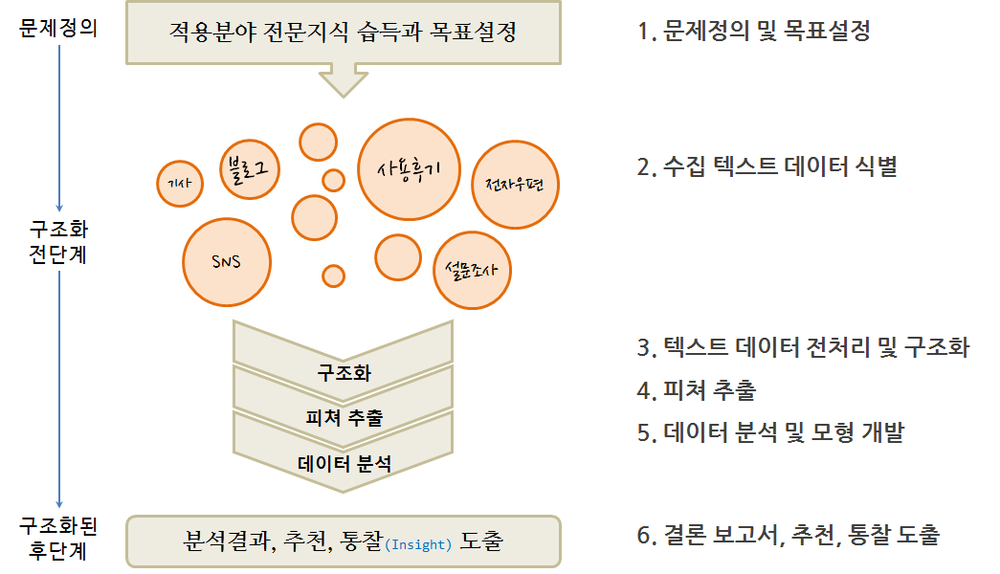

# 문서 != 문서 편집기

## 사무자동화의 꽃 - MS 오피스

- [도전받는 데이터 사이언스 도구](https://statkclee.github.io/ds-authoring/ds-finance-why-201904.html#30)
    - 엑셀
    - 파워포인트
    - 워드
    - 액세스

## 디지털 리터러시 특강: 한림대

# 텍스트 마이닝(text mining)

## 텍스트 데이터 분석 - R

- [자연어 처리 - 텍스트](https://statkclee.github.io/text/)

## [텍스트 데이터 분석 - R](https://statkclee.github.io/text/nlp-amazon-google.html)

## [LangCon2019: NLP하기 좋은 날입니다!](https://songys.github.io/2019LangCon/)

## [유튜브 댓글 텍스트 분석](https://statkclee.github.io/text/langcon-2019-tutorial.html)

# [자연어 처리 (NLP)](https://statkclee.github.io/nlp2/)

## 정규표현식

- [Software Carpentry - 정규표현식(Regular Expression)](https://statkclee.github.io/nlp2/regex-index.html)

## EDA

- [텍스트 데이터 시각화](https://statkclee.github.io/nlp2/nlp-text-viz.html)
- [텍스트 기술통계량](https://statkclee.github.io/nlp2/nlp-twitter-describe.html)

## 파이썬 NLTK 도우미

- [textblob - 객체지향 NLP 라이브러리](https://statkclee.github.io/nlp2/nlp-textblob.html)

## 모형

- [문서분류 - 헬로월드](https://statkclee.github.io/nlp2/nlp-classification.html)
- [문서분류 - 뉴스기사 분류 (M/L)](https://statkclee.github.io/nlp2/nlp-newsgroup-classification.html)
- [문서분류 - 뉴스기사 분류 (D/L)](https://statkclee.github.io/nlp2/nlp-newsgroup-classification-dl.html)
- [감성분석 빅픽쳐](https://statkclee.github.io/nlp2/nlp-sentiment.html)
- [트위터 감성 예측](https://statkclee.github.io/nlp2/nlp-twitter-ml.html)

## 이력서

- [데이터 사이언스: 저작(Authoring) - 이력서(Resume)](https://statkclee.github.io/ds-authoring/ds-resume.html)
- [데이터 과학: 재현가능한 저작 - 이력서](https://statkclee.github.io/author_carpentry_kr/)
    - 영문 이력서

# 문서 ~ PDF

## 원재료 추출

## PDF

- [문자인식(OCR) - tesseract](https://statkclee.github.io/ingest-data/ingest-ocr.html)
- [PDF 감옥에서 데이터를 탈출시키다.](https://statkclee.github.io/ingest-data/ds-extract-text-from-pdf-survey.html)
- [PPT 장표 - OCR tesseract](https://statkclee.github.io/ingest-data/ingest-ocr-ppt.html)

# Document AI

## 이력서

- [데이터 사이언스: 저작(Authoring) - 이력서(Resume)](https://statkclee.github.io/ds-authoring/ds-resume.html)
- [데이터 과학: 재현가능한 저작 - 이력서](https://statkclee.github.io/author_carpentry_kr/)
    - 영문 이력서

# 마치며

## KPMG hiring
