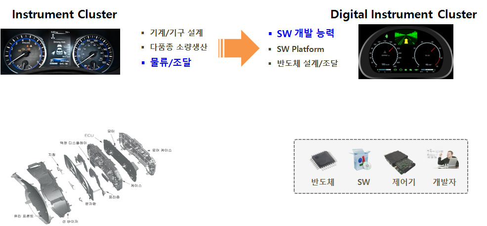
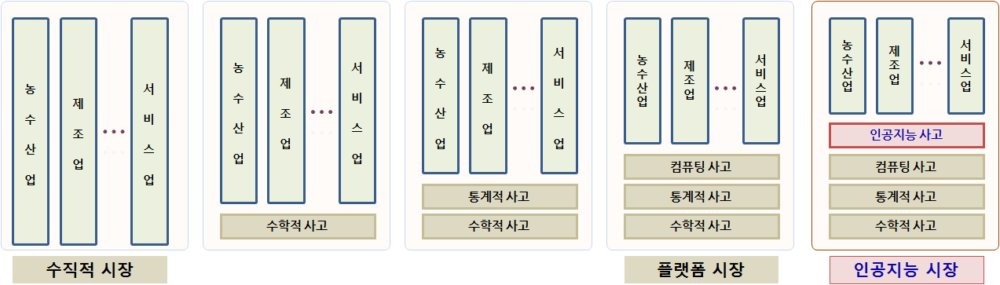

## 빅데이터의 이해와 정책 활용

- 강의주제: 빅데이터의 이해와 정책 활용
- 강의일시
    - 2019년 6월 17일(월) 15:00 ~ 17:00 (1기)
    - 2019년 7월 08일(월) 15:00 ~ 17:00 (1기)
- 강의장소: 경기도 인재개발원 본관 307호
- 대상: 도, 시군 공무원 및 공공기관 직원
- 강의내용
    - 빅데이터 개념
    - 빅데이터 사례
    - 현업에 돌아가서 빅데이터 정책을 활용

---
class: inverse, middle, center

## 데이터 과학자 1세대

---
## 데이터 과학자

.pull-left[
  
]

.pull-right[
  <iframe width="400" height="250" src="https://www.youtube.com/embed/K_TGdklC504" frameborder="0" allow="accelerometer; autoplay; encrypted-media; gyroscope; picture-in-picture" allowfullscreen></iframe>
]

.footnote[
- 삼정 KPMG 데이터 과학자
- 연세대학교 겸임교수, ["데이터 사이언스 입문"](https://statkclee.github.io/yonsei/)
- [이광춘(2019) "데이터 사이언스, 타이디버스로 향하다", 마이크로소프트웨어 395호](http://it.chosun.com/site/data/html_dir/2019/01/29/2019012900392.html)
- [데이터 사이언스 미트업 운영](https://tidyverse-korea.github.io/r-meetup-x-presser/)
- [소프트웨어 카펜트리(Software Carpentry) 강사 (Kwangchun Lee)](https://carpentries.org/instructors/)
- [Cloudera Conference 2018 - Seoul: 기계의 역습 - 설명가능한 기계학습](https://www.clouderasessionsseoul.com/agenda.php)
]

---
## 수업 참가자 자기 소개

[본인소개 etherpad](https://etherpad.net/p/gg-first)

.center[
<iframe name="embed_readwrite" src="https://etherpad.net/p/gg-first?showControls=true&showChat=true&showLineNumbers=true&useMonospaceFont=false" width=600 height=400></iframe>
]


---
class: inverse, middle, center

## 빅데이터 &rarr; 데이터 사이언스

---
## 구글 Trends 데이터 사이언스 한미 비교 - 미국


---
## 구글 Trends 데이터 사이언스 한미 비교 - 한국


---
## 데이터 사이언스란?

데이터 사이언스는 데이터를 다루는 과학이다. 따라서 자연법칙을 다루는 자연과학과 맥이 닿아있다.
자연법칙을 측정하여 데이터프레임(`DataFrame`)으로 나타내면 **변수(Variable)**, **관측점(Observation)**, **값(Value)**으로 표현된다.


---
## 데이터 사이언스 업무 - 에어비앤비


- **분석(Analytics) 데이터 과학자(Data Analyst)**는 좋은 질문을 던질 수 있고, 
탐색적 데이터 분석을 통해서 문제와 해법을 명확히 하는 재주가 있고, 대쉬보드와 시각화를 통해 데이터 분석을 자동화하고, 추천 결과물을 통해 비즈니스를 변화시킨다. 
- **알고리즘(algorithm) 데이터 과학자(AI/Machine Learning Engineer)**는 기계학습에 특기가 있는 사람에 적합하고 제품/서비스, 프로세스에 데이터를 알고리즘을 통해 녹여내서 비즈니스 가치를 창출한다. 
- **추론(inference) 데이터 과학자(Statistician)**는 통계를 사용해서 의사결정을 향상시키고, 업무의 영향도를 측정하는데 주로 통계학, 경제학, 사화과학 전공지식을 적극 활용한다.

.footnote[
  [Elena Grewal(July 25, 2018), "One Data Science Job Doesn’t Fit All"](https://www.linkedin.com/pulse/one-data-science-job-doesnt-fit-all-elena-grewal/)
]

---
class: inverse, middle, center

## 데이터 사이언스 가치


---
## 가치(Value) 원천

.center[
  
]

세계은행(World Bank)과 한국개발연구원(KDI)은 약 2년여 기간의 공동연구를 통해 1960-2005 년간 한국 경제발전 과정에 관한 보고서를 출간했다. 경제성장이 지속되기 위해서는 생산성 증가가 대단히 중요하고, 1960년 이후 한국경제의 성공은 **광의의 지식축적**에 기인한 것으로 1960-2005년 사이 한국의 실질 1인당GDP의 75%가 광의의 지식축적에 기인한 것으로 분석했다.

---
## 4번째 패러다임

.center[
  
]

---
## 자동차 클러스터 사례

.center[
  
]

---
## 기계-전기전자-반도체-SW 원가구조 변화 - 10년 전

.center[
  
]

---
## 수직적 시장 &rarr; 인공지능 시장

<br>
<br>
<br>
<br>
<br>

.center[
  
]

<br>
<br>

- 수직적(Vertical) 시장 &rarr; 플랫폼(Platform) 시장 &rarr; 인공지능(AI) 마켓으로

---
class: inverse, middle, center

## 데이터 사이언스로 요약


---
class: middle, center


---
class: middle, center


---
class: middle, center


---
class: middle, center


---
class: inverse, middle, center

## 은폐된 데이터 사이언스 진실

---
### 설명가능한 기계학습 - 늑대와 허스키(에스키모 개) 분류 사례

.center[
  
]


.footnote[
Marco Tulio Ribeiro, Sameer Singh, Carlos Guestrin(2016), "Why Should I Trust You?": Explaining the Predictions of Any Classifier", [arXiv:1602.04938](https://arxiv.org/abs/1602.04938)
]


---
### 실제로 분류한 것은? 

.center[
  
]

.footnote[
[Kasia Kulma (PhD, Data Scientist, Aviva, 2017), "Interpretable Machine Learning Using LIME Framework", $H_2 O$.ai](https://www.youtube.com/watch?v=CY3t11vuuOM&t=1956s)
]


---
### 알고리즘 담합 유형

.center[
  
]


.footnote[  
  [ODEC (2017), "ALGORITHMS AND COLLUSION - Competition policy in the digital age"](http://www.oecd.org/competition/algorithms-collusion-competition-policy-in-the-digital-age.htm)
]

---
### 암묵적 담합에 대한 법규 준수

.left[

```bash
> 
+ if (가격 상관계수 > 0.9999 & 
+       case_when(회사 알고리즘,
+                    모니터링 알고리즘 ~ TRUE,
+                    병행 알고리즘 ~ TRUE,
+                    신호 알고리즘 ~ TRUE,
+                    작학습 알고리즘 ~ TRUE)) {
+   return(공정거래법 위반)
+ } else {
+   return(공정거래법 위반 없음)
+ }
+       
```
]

.right[
    
]

.footnote[
  [연합뉴스 (2018/10/31), '전설적인 美 보스턴 갱두목, 비참한 최후…"종신형 감옥서 피살"'](http://www.yonhapnews.co.kr/bulletin/2018/10/31/0200000000AKR20181031005300072.HTML)
]

---
### 알고리즘 담합 사례

1. **포스터 레볼루션, 병행 알고리즘으로 가격담합**
    - 온라인에서 포스터를 판매하는 미국기업 포스터레볼루션(PosterRevolution)의 창업자 데이빗톱킨스(David Topkins)는 사업자들과 일부 고전영화포스터의 **가격을 고정**하기로 합의. 톱킨스와 공모기업들은 병행알고리즘 형태로 가격담합. 결국 2015년 미국법무부는 톱킨스에게 **2만 달러** 벌금부과.
1. **이투라스, 암묵적 동의하에 이루어진 담합**
    - 온라인 여행예약 사이트를 운영하는 리투아니아 이투라스(Eturas)는 자사 플랫폼에서 사업을 영위하는 여행사들에게 소비자에게 적용되는 최대할인율을 공통적으로 제한한다는 메시지를 보내고 예약시스템의 **최대할인율을 3%로 일괄조정**. 리투아니아 최고행정법원은 이투라스와 여행사간 암묵적 동의하에 이루어진 담합이라 판단, 이투라스와 여행사에 **과징금 150만 유로** 부과.
1. **우버, Hub-and-Spoke 모델로 가격담합 논란**
    - 공유경제 생태계에서 플랫폼 역할을 하는 우버는 최적화 알고리즘을 통해 가격을 결정. 법적으로 사업관계인 운전드라이버들이 우버의 동일가격 알고리즘을 이용하는 것이 담합에 해당되는지, 담합에 해당되지 않는지 논란됨. 뉴욕남부지법은 중재를 해달라는 우버의 주장을 기각하고, 집단소송 원고적격을 인정. 지금은 연방항소법원에서 **심리중**.


---
### 기계의 역습 - 설명가능한 기계학습

.center[
  <iframe width="600" height="350" src="https://www.youtube.com/embed/K_TGdklC504" frameborder="0" allow="accelerometer; autoplay; encrypted-media; gyroscope; picture-in-picture" allowfullscreen></iframe>
]

.footnote[
- [Cloudera Conference 2018 - Seoul: 기계의 역습 - 설명가능한 기계학습](https://www.clouderasessionsseoul.com/agenda.php)
]

---
## 빅데이터와 데이터 사이언스

[빅데이터와 데이터 사이언스 강의 전후](https://etherpad.net/p/gg-data-science)

.center[
<iframe name="embed_readwrite" src="https://etherpad.net/p/gg-data-science?showControls=true&showChat=true&showLineNumbers=true&useMonospaceFont=false" width=600 height=400></iframe>
]

---
class: inverse, left

## 도전받는 데이터 사이언스 도구

### 엑셀

.footnote[
1. **도전받는 데이터 사이언스 도구**: 엑셀
1. 도전받는 데이터 사이언스 도구: 파워포인트
1. 도전받는 데이터 사이언스 도구: 워드
] 

---
### 위기의 스프레드쉬트(엑셀)

.center[

]

.footnote[
 [스터디 뽀개기 7월 (2016-07-30), 분석행(Train to data-analysis)](https://onoffmix.com/event/73626)
]

---
### 스프레드쉬트 참사 

|     회사      | 손실 |   날짜 |        영향           |               참사 개요                         | 
|---------------|-----------|----------|-----------------------|-------------------------------------------------|
|     Mouchel   |  £ 4.3백만  |  '10.11월  | CEO 사임, 주가폭락 | 연금펀드평가 £ 4.3백만 엑셀 오류 |
|   C&C Group   |  £ 9 백만  |  '09.7월  | 주가 15% 하락 등 | 매출 3% 상승이 아니고 5% 하락, 엑셀 오류 |
|   King 펀드   | £ 130 백만 |  '11.05월  | 브래드 이미지 하락 | 웨일즈 지방 NHS 지출 엑셀 오류 |
| AXA Rosenberg | £ 150 백만 |  '11.02월  | 은폐, 벌금, 브래드 이미지 하락 | 엑셀 오류를 감춰서 $242 백만 벌금 |
| JP Morgan Chase | £ 250 백만 |  '13.01월  | 명성, 고객 신뢰도 저하 | 바젤 II VaR 위험 평가 엑셀 오류 |
| Magellan 펀드 | £ 1.6 십억 |  '95.01월  | 투자자에게 약속한 배당금 지급 못함 | 음수 부호 누락으로 자본이득 과대계상|
| 미연방준비위원회 | £ 2.5 십억 |  '10.10월  | 명확하지 않음 | 리볼빙 카드 신용액 산출 과정에 엑셀 오류 |


.footnote[
[THE DIRTY DOZEN 12 MODELLING HORROR STORIES & SPREADSHEET DISASTERS](http://blogs.mazars.com/the-model-auditor/files/2014/01/12-Modelling-Horror-Stories-and-Spreadsheet-Disasters-Mazars-UK.pdf)
]

---
### 스프레드쉬트를 버려야 하는 6가지 이유 

> #### 스프레드쉬트를 사용하는 이유
> 
> * 항상 엑셀을 사용했다: 항상 데이터를 엑셀로 저장하고 분석해서 사용했다. 하지만, 버튼 하나로 데이터를 내보내기 쉽다.
> * 데이터베이스를 사용할 만큼 데이터가 충분하지 않다: 데이터가 작아서 데이터베이스를 사용할 이유를 찾지 못하지만,
사업이 커지고, 업무량이 늘어나면서 엑셀 작업량이 높아지고, 복잡성도 커지고, 엑셀 자체에서 처리되는 시간도 늘어난다.

1. 한번에 한사람만 작업이 가능하다.
<br>
1. 데이터 감사는 데이터베이스에서만 가능
<br>
1. 데이터베이스는 정형화된 작업흐름을 지원한다.
<br>
1. 데이터베이스는 엑셀보다 모형을 보다 잘 지원한다.
<br>
1. 데이터베이스로 보고서 생성이 수월하다.
<br>
1.  데이터베이스는 보안이 강력하고 규제하기 좋다.
<br>

.footnote[
 [데이터 과학, "위기의 스프레드쉬트"](https://statkclee.github.io/data-science/ds-why-not-excel.html)
]

---
### 스프레드쉬트 알고리즘 복잡성

<br>
<br>
<br>

.center[

]

.footnote[
[탈옥(jailbreakr) – 엑셀에서 탈출… 자유](https://statkclee.github.io/data-science/ds-xls.html)
]


---
### 스프레드쉬트 복잡성과 효율성

- 스프레드쉬트는 데이터, 서식, 수식으로 구성된다. 
- 숫자 데이터를 엑셀로 가져오게 되면 엑셀 내장 함수를 통해 수식 계산을 수행한다. 
- 엑셀 사용자 본인 혹은 외부 사람을 위해 서식을 입히는 과정을 거쳐 비로소 완성된 스프레드쉬트가 된다.

.center[

]

.footnote[
[탈옥(jailbreakr) – 엑셀에서 탈출… 자유](https://statkclee.github.io/data-science/ds-xls.html)
]


---
class: inverse, left

## 도전받는 데이터 사이언스 도구

### 파워포인트
 
.footnote[
1. ~~도전받는 데이터 사이언스 도구: 엑셀~~
1. **도전받는 데이터 사이언스 도구: 파워포인트**
1. 도전받는 데이터 사이언스 도구: 워드
] 
 
 
---
### 파워포인트의 종말 &larr; 아마존 제프 베이조스

.center[

]

.footnote[
 [김미리 기자 (2019.04.06.), "보고서 치장은 그만, 글로 써라.. '제로 PPT' 선언하는 기업들", 조선일보](https://news.v.daum.net/v/20190406030158105)
]
 
---
## 세가지 다른 글쓰기 패러다임


---
## 도구가 자동화하는 저작 업무

.pull-left[
### 1. $LaTex$ 사례
  
  
  [정보교육을 위한 파이썬: 데이터 과학자로의 여정, 아마존 절찬 판매중](https://statkclee.github.io/pythonlearn-kr/01-py4inf-python2/)
]


.pull-right[
### 2. 북다운(Bookdown)

.center[
  
]
[컴퓨터 과학 언플러그드, 이광춘 번역](https://statkclee.github.io/unplugged/)
]

---
## 도구가 자동화하는 저작 업무

.pull-left[
### 3. SW 도움말
  

- [Welcome to Reeborg world!](http://reeborg.ca/index_en.html)
- [리보그 한국어 버젼](http://reeborg.ca/docs/ko/index.html)
- [프로그래밍과 문제해결: 파이썬, 리보그, 러플](https://statkclee.github.io/code-perspectives/)

]

.pull-right[
### 4. 블로그

.center[
  
]

[데이터 과학을 위한 저작도구 블로그 - `blogdown`](https://statkclee.github.io/ds-authoring/ds-blogdown.html)
] [xwMOOC 블로그 - `netlify`](http://xwmooc.netlify.com/)


---
## 도구가 자동화하는 저작 업무

### 5. 슬라이드쇼(slideshow)

.center[
  
]

.footnote[
  [소프트웨어에 물들다(왕곡초등학교, 2018-05-26)](somul_20180525.html) -  글쓰기를 잘하기 위해서 알아야 되는 코딩
]


---
class: inverse, left

## 도전받는 데이터 사이언스 도구

### 워드

.footnote[
1. ~~도전받는 데이터 사이언스 도구: 엑셀~~
1. ~~도전받는 데이터 사이언스 도구: 파워포인트~~
1. **도전받는 데이터 사이언스 도구: 워드**
] 

---
## 재현가능한 글쓰기

.center[

]

.footnote[
 [데이터 과학: 재현가능한 저작 - R 마크다운 논문](https://statkclee.github.io/author_carpentry_kr/rmarkdown-authoring-paper.html)
]

---
## 재현가능한 글쓰기 환경

.center[

]

.footnote[
 [데이터 과학: 재현가능한 저작 - R 마크다운 논문](https://statkclee.github.io/author_carpentry_kr/rmarkdown-authoring-paper.html)
]

---
## 데이터로 저작 사례 

### 데이터 사이언스 제품

.center[


-----  


]

.footnote[
 [데이터야 놀자 발표자료(2017)](https://statkclee.github.io/ds-authoring/slides/ds_data_product.html)
]


---
## 글쓰기 사례 - 글쓰기는 코딩

- 마크다운(Markdown)
    - 제목, 글꼴, 중요항목, 그림, 표, ... 
- 한번 작성하고 나머지는 기계에 위탁
    - 자바(Write Once, Run Anywhere)
    - HTML, 워드, PDF, ...
- 글쓰기에 수학을 넣어보자
    - 수식, 표, 그래프, ...
- 학위 논문과 저널에 투고할 논문을 저작해보자.
    - 참고문헌, 인용, 색인, ...
- 이제는 디지털 시대
    - 인터랙티브 웹페이지
- 데이터 사이언스 글쓰기
    - 데이터기반 의사결정을 시작합니다.
    - 재현가능한 데이터 사이언스 및 의사결정

.footnote[
[데이터 과학: 재현가능한 저작](https://statkclee.github.io/author_carpentry_kr/)
]

---
class: middle

## BMI 데이터 사이언스 보고서

`author_carpentry_kr/tutorial/reproducible_finance/reproducible_finance.Rmd`

.footnote[
[재현가능한 데이터 사이언스 - BMI](https://statkclee.github.io/author_carpentry_kr/tutorial/reproducible_finance/reproducible_finance.html)
]

---
## 디지털 노동과 글쓰기

[디지털 노동과 글쓰기 토론](https://etherpad.net/p/gg-authoring)

.center[
<iframe name="embed_readwrite" src="https://etherpad.net/p/gg-authoring?showControls=true&showChat=true&showLineNumbers=true&useMonospaceFont=false" width=600 height=400></iframe>
]

---
class: inverse, middle, center

## 빅데이터 활용

---
## 디지털 노동


- Digital Laobr
- RPA(Robot Process Automation)
- Cognitive Technology
    - Resume
    - Cognitive Contract Management
    - LIOBR
    - ...
- AI    
- 데이터 품질    
