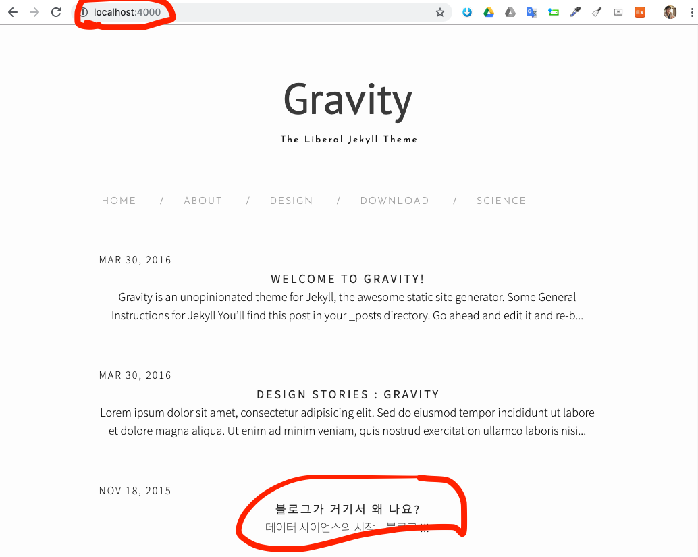
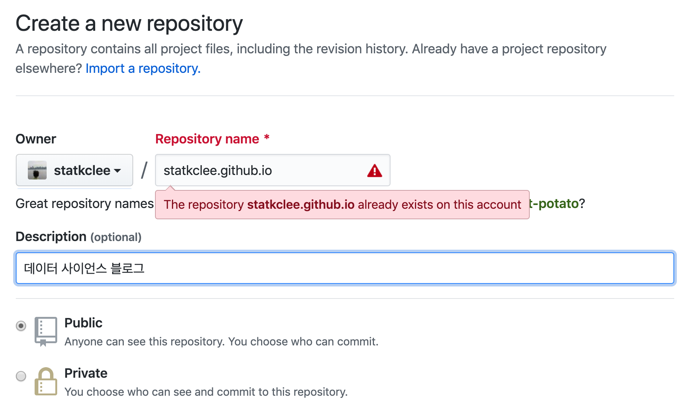
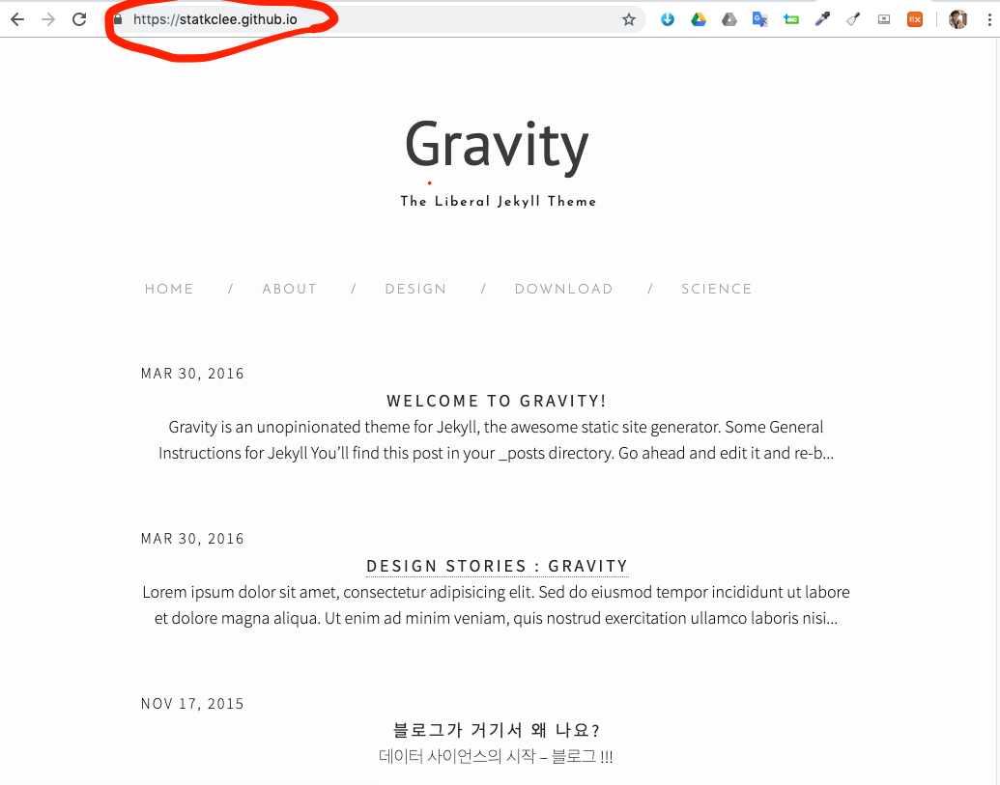

```{r setup, include=FALSE}
knitr::opts_chunk$set(echo = TRUE, message=FALSE, warning=FALSE,
                      comment="", digits = 3, tidy = FALSE, prompt = FALSE, fig.align = 'center')

library(reticulate)
use_condaenv("anaconda3")
# reticulate::repl_python()
```

# GitHub 블로그 {#github-blog} 

[GitHub](https://github.com/) 웹사이트에 개인 블로그를 제작하는 방법은 무척이나 세련되고 단순화 되었다. [YONGDEOK AN 님 Web Developer's Blog](https://krauser085.github.io/)를 참고해서 제킬 기반 블로그를 제작해보자. [^blog-01] [^blog-02] [^blog-03]

[^blog-01]: [Jekyll + Github으로 블로그 시작하기-1](https://krauser085.github.io/start-jakyllandgithubpage/)

[^blog-02]: [Jekyll + Github으로 블로그 시작하기-2](https://krauser085.github.io/start-jakyllandgithubpage-2/)

[^blog-03]: [Jekyll + Github으로 블로그 시작하기-3](https://krauser085.github.io/start-jakyllandgithubpage-3/)

개인블로그를 아무런 비용부담없이 제작하는 방법으로 Github을 생각해볼 수 있다. 이를 위해서 리눅스 쉘을 사용할 수 있는 환경을 구축하고 이를 바탕으로 Ruby 언어기반 개발환경을 구축한 후에 `jekyll`을 설치한 후 [Jekyll Themes](http://jekyllthemes.org/)에서 원하는 취향의 Theme을 고른 후에 블로그 콘텐츠는 `.md` 마크다운에 집중해서 작업하면 된다.


# 블로그 제작 도구 설치 {#github-blog-toolchain} 

가장 먼저 제킬(jekyll)을 활용하여 블로그를 마크다운으로 제작하여 Github에 배포하는 것이라 제킬을 설치해야 하는데 이는 루비 언어에 기반하고 관련된 팩키지 설치 프로그램 등을 쭉 깔아야 한다.

- Ruby : `ruby -v`
- RubyGems: `gem -v`
- GCC, MAKE: `GCC -v`, `make -v`

[Jekyll Themes](http://jekyllthemes.org/) 웹사이트에서 마음에 드는 테마를 골라 다운로드 받아 압축을 풀게 되면 `Gemfile.lock`, `Gemfile`이 생성된다. 이것이 없으면 `bundle init` 명령어로 초기화되면 설정되는데 버젼이 맞지 않아 다양한 문제에 봉착할 수도 있다. 이런 경우 `Gemfile`에 다음 내용을 복사하여 붙여 넣고 `jekyll serve` 명령어를 던지게 되면 문제가 해결될 수 있다. [^jekyll-serve] 단, `ruby` 버젼은 `ruby -version`으로 쉘에서 확인된 동일한 버젼으로 매칭시킨다.

[^jekyll-serve]: [stackoverflow, "Jekyll -v error (Bundler::GemNotFound)"](https://stackoverflow.com/questions/47046526/jekyll-v-error-bundlergemnotfound)

```{r Gemfile-ex, eval=FALSE}
# Gemfile
source "https://rubygems.org"

ruby "2.4.2"

gem 'github-pages' # helpfully pulls in more than just jekyll
```


# 블로그 외양(theme) 고르기 {#github-blog-theme}

[Jekyll Themes](http://jekyllthemes.org/)에서 마음에 드는 Theme을 골랐다면 다음으로 압축을 풀고 `jekyll serve` 명령어를 던지게 되면 `localhost:4000`에 로컬 컴퓨터에서 블로그를 확인할 수 있다.



## 제킬 블로그 구조 {#github-blog-structure}

[Jekyll Themes](http://jekyllthemes.org/)에서 마음에 드는 블로그 외양을 다운로드 받아 압축을 풀면 다음고 같은 구조를 갖게 된다. **`_posts`** 디렉토리가 블로그를 제작하는 주된 공간이 된다. 물론 처음에 블로그명 등 관련된 설정을 HTML/자바스크립트/CSS 파일을 통해서 해줘야 하지만  **`_posts`** 디렉토리 마크다운 파일을 작성하는 것이 가장 핵심적인 사항이 된다.

```{r theme-tree, eval=FALSE}
$ tree -L 2
.
├── Gemfile
├── Gemfile.lock
├── LICENSE.txt
├── README\ 2.md
├── README.md
├── _config.yml
├── _includes
│   ├── footer.html
│   ├── head.html
│   ├── header.html
│   ├── icon-github.html
│   ├── icon-github.svg
│   ├── icon-twitter.html
│   └── icon-twitter.svg
├── _layouts
│   ├── archive.html
│   ├── default.html
│   ├── page.html
│   └── post.html
├── _posts
│   ├── 2015-07-23-test.md
│   ├── 2016-03-30-design-stories.markdown
│   └── 2016-03-30-welcome-to-jekyll.markdown
├── _sass
│   ├── _base.scss
│   ├── _color.scss
│   ├── _layout.scss
│   └── _syntax-highlighting.scss
├── _site
│   ├── LICENSE.txt
│   ├── README\ 2.md
│   ├── README.md
│   ├── about
│   ├── css
│   ├── design
│   ├── download
│   ├── feed.xml
│   ├── index.html
│   ├── jekyll
│   └── science
├── about.md
├── css
│   └── style.scss
├── design.md
├── download.md
├── feed.xml
├── index.html
└── science.md

```

# 블로그 작성 {#github-blog-write}

블로그 작성은 단순하다. 마크다운 파일(`.md`) 내에 YAML 헤더로 블로그에 대한 기본 내용을 명세하고 관련 내용을 마크다운 문법에 기초하여 작성하면 된다.

`_posts\` 디렉토리 `2016-03-30-design-stories.markdown` 마크다운 파일에 적힌 내용은 다음과 같다.

```{r markdown-yaml, eval=FALSE}
---
layout: post
title:  "Design Stories : Gravity"
date:   2016-03-30 19:45:31 +0530
categories: ["design", "science", "life"]
author: "Hemang Kumar"
---
Lorem ipsum dolor sit amet, consectetur adipisicing elit.

Sed do eiusmod tempor incididunt ut labore et dolore magna aliqua. Ut enim ad minim veniam, quis nostrud exercitation ullamco laboris nisi ut aliquip ex ea commodo consequat.
```


# 로컬 블로그 &rarr; Github 블로그 {#github-blog-github}

로컬 블로그를 인터넷에 올려 누구나 접근할 수 있도록 만들기 위해서는 [Jekyll + Github으로 블로그 시작하기-2](https://krauser085.github.io/start-jakyllandgithubpage-2/)에 나와 있듯이 저장소를 하나 만든다. Github에서 제공하는 블로그 서비스는 다음과 같다.

> `https://<Github 아이디>.github.io`

Github 계정과 동일하기 때문에 저장소 명칭을  `https://<Github 아이디>.github.io` 형식에 맞춰 작성한다.



다음으로 `git clone` 해서 저장소를 가져오고 [Jekyll Themes](http://jekyllthemes.org/)에서 압축을 푼 것을 디렉토리에 넣어주고 `git add`, `git commit`, `git push` 작업흐름으로 Github에 보내버리면 `https://<Github 아이디>.github.io`에서 확인이 가능하게 된다.

# 개인 Github 블로그 {#github-blog-github-run}

`https://<Github 아이디>.github.io`로 맞춰놨기 때문에 `https://statkclee.github.io` 웹사이트를 통해 개인 블로그가 올라간 것이 확인된다. 이제 `_posts` 디렉토리에 마크다운 파일을 작성해서 저장시켜 두면, `jekyll serve` 명령어로 로컬 컴퓨터에서 개발된 사항을 확인할 수 있고 `git add`, `git commit`, `git push` 작업흐름을 거치게 되면 블로그를 공개할 수 있게 된다.




