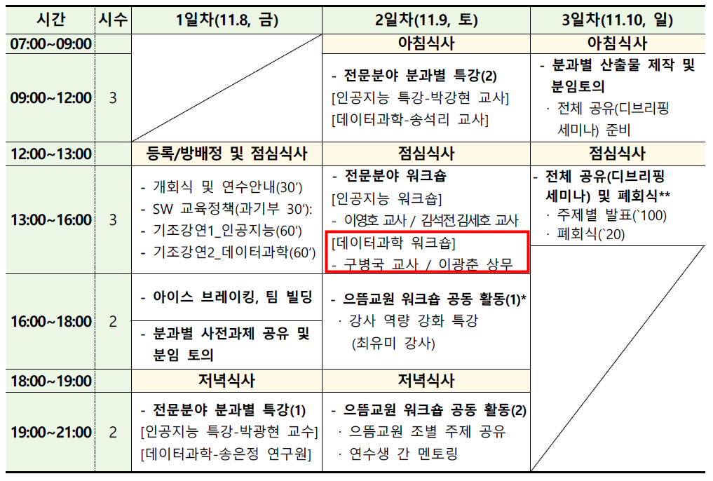
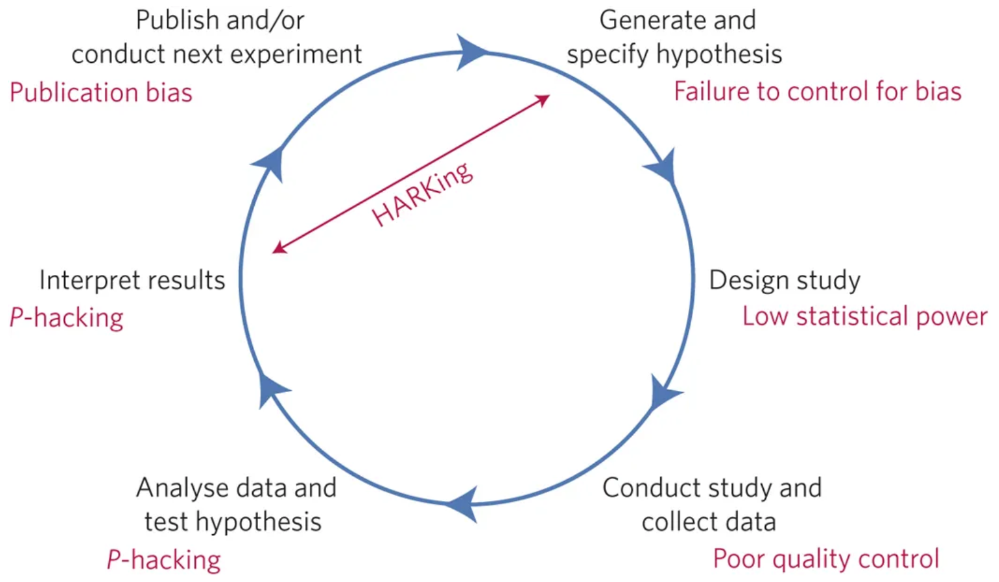
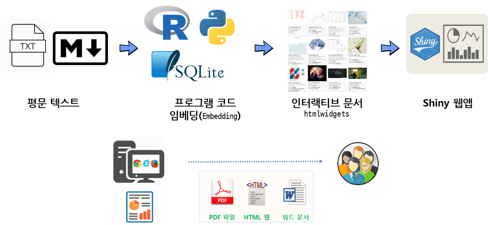

# S/W 정보교육 교원 연수

## 데이터 과학 시대 재현가능한 글쓰기

{#id .class width="77%"}

# 재현가능 위기 & 오피스

## 출판된 연구 결과 대부분이 거짓이라고?

<iframe width="560" height="315" src="https://www.youtube.com/embed/42QuXLucH3Q?start=528" frameborder="0" allow="accelerometer; autoplay; encrypted-media; gyroscope; picture-in-picture" allowfullscreen></iframe>

## 재현가능한 과학의 위협

{#id .class width="70%"}

출처: [A manifesto for reproducible science](https://www.nature.com/articles/s41562-016-0021)

## 사무자동화의 꽃 - MS 오피스

- [도전받는 데이터 사이언스 도구](https://statkclee.github.io/ds-authoring/ds-finance-why-201904.html#30)
    - 엑셀
    - 파워포인트
    - 워드
    - [액세스](http://statkclee.github.io/capstone-novice-spreadsheet-biblio/)

# 데이터 과학 글쓰기

## 데이터 과학 문서 툴체인

출처: [데이터 과학: 재현가능한 저작, "재현가능한 논문 제작 환경"](https://statkclee.github.io/author_carpentry_kr/authoring-tools.html)

## 데이터 과학 문서 구성요소

출처: [Computational Documents, "데이터 과학 문서"](https://statkclee.github.io/comp_document/)

## 실습자료 다운로드

[Download 클릭!!!](https://github.com/statkclee/comp_document/blob/gh-pages/tutorial.zip)

## 강의 노트

[Google Docs - 공동 강의노트](https://docs.google.com/document/d/1tYH3AP8gsmwkAamZttQVW2IBjdfcZLMf2l1fydJVNeY/edit?usp=sharing)

# Computaional Documents

## [`.Rmd`](https://statkclee.github.io/comp_document/tutorial/01_rmarkdown/bmi.html)

## [매개변수를 갖는 `.Rmd`](https://statkclee.github.io/comp_document/tutorial/02_parameterized_rmd/election-province.html)

## [`htmlwidgets` 갖는 `.Rmd`](https://statkclee.github.io/rstudio-trainer/viz-lecture-note.html)

## Shiny 구성요소를 갖는 `.Rmd`

## Shiny 웹앱(WebApp)

