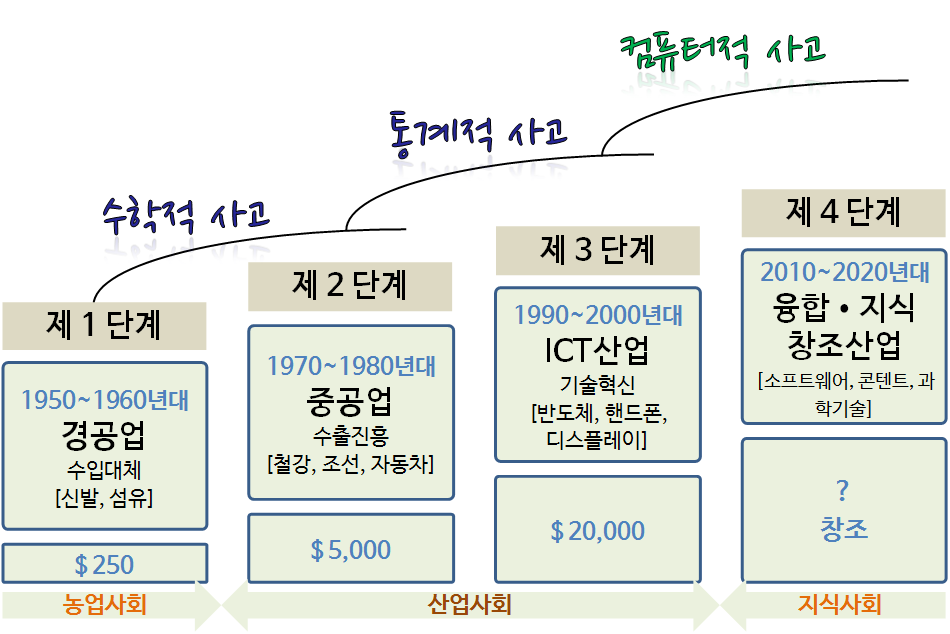
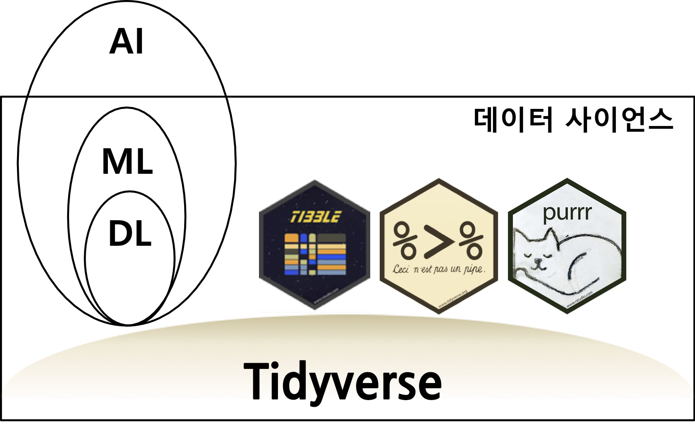
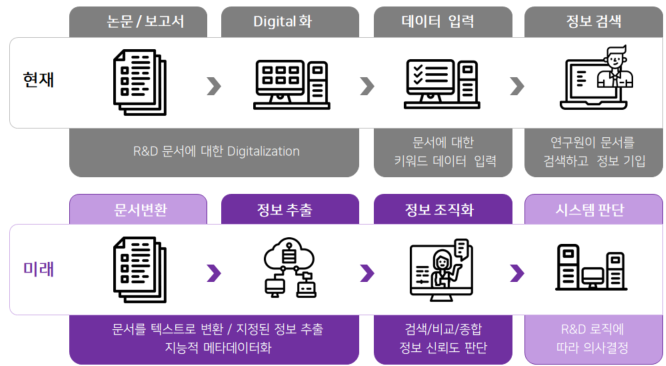

```{r setup, include=FALSE}
knitr::opts_chunk$set(echo = FALSE, warning=FALSE, message=FALSE,
                    comment="", digits = 3, tidy = FALSE, prompt = FALSE, fig.align = 'center')
```

# 과학 패러다임의 전환

2020년 들어 가장 부각되고 있는 분야 중 하나가 인공지능(AI)라는 것은 모두 동의할 것이다.
SXSW 2010년 행사에서 Douglas Rushkoff는 "프로그래밍 하느냐 프로그래밍 되느냐(Program or be Programmed)" \cite{rushkoff2010program}라는 표현을 통해서 일자리에 대한 위험을 경고했을 뿐만 아니라, 앞으로의 성장에 대해서도 방향을 제시하였다는 평가를 받고 있다.
R&D도 이러한 변화의 물결에서 자유로울 수 없고, 인공지능을 이해하지 않고 현재와 미래를 살아가는 것은 마치 산업화 시대에 글과 숫자를 이해하지 못하고 산업화시대를 살아간 것에 비견될 수 있다.

짐 그레이 박사는 바다에서 실종되기 전에 데이터 집약 과학\cite{hey2009fourth}이 앞으로 가장 중요한 과학방법론이 될 것이라고 주장했으며 그의 주장은 현실로 다가왔다.
거의 모든 과학연구에서 데이터는 기하급수적으로 증가하고 있고, 데이터 주도(Data-driven) 과학연구가 일반화 되어 있다.
물리학과 생명과학에서 통계와 컴퓨터 과학의 빅데이터를 통한 과학연구 수렴현상도 일상적으로 관찰되고 있다.
수천년전부터 시작된 과학연구의 패러다임의 전환은 다음과 같은 4가지 단계로 구분된다.

-   실증 과학(Empirical Science): 수천년에 걸쳐 자연현상에 대한 실증 과학의 시대.
-   이론 과학(Theoretical Science): 수백년에 걸쳐 이론과 수학에 기반한 일반화를 통한 이론 과학의 시대.
-   산 과학(Computational Science): 수십년에 결쳐 복잡한 현상을 모의실험에 컴퓨터를 활용한 계산 과학 시대.
-   데이터 집약 과학(Data-Intensive Science): 현재는 이론, 실험, 빅데이터를 사용하여 계산 결과를 통합하는 데이터 집약 과학 시대.

```{r paradigm, out.width = "100%", dpi = 300, fig.cap="과학기술 패러다임의 전환"}
knitr::include_graphics("fig/ai-lab-4th-paradigm.png")
```


통상적인 과학연구 과정은 가설을 세워, 데이터를 수집하고, 탐색적 과정을 거쳐 발견과 분석을 수행하고 이를 발표하는 과정을 거졌지만, 기하급수적으로 증가하는 데이터에 의해 이러한 흐름에 변화가 생겨나고 있다.
과학이 **가정-주도(Hypothesis-Driven)** 에서 **데이터-주도(Data-Driven)** 발견으로 급격히 이동하면서 전혀 새로운 도전에 직면하고 있다.
과거 데이터를 수집하고 분석과 발견 과정을 거쳐서 출판 게시했다면, 이제는 다양하고 휘발성이 강하며 대용량의 데이터(Big Data)를 수집하는 동시에 인터넷에 게시하여 공개를 먼저하고, 동료 연구자와 함께 데이터 분석과 탐색 과정을 통해 정보를 추출하고 모형을 개발하는 것으로 과정이 변경되고 있다.
이러한 과학연구의 변화를 세가지 측면에서 다음과 같이 요약할 수 있다.

-   기하급수적인 데이터 증가: 분산된 환경에서 데이터 수집과 데이터 크기와 형태의 증가.
-   새로운 분석 패러다임: 과학자 친화적인 데이터 과학 언어 등장과 협업(Collaboration) 모델의 진화.
-   새로운 게시 패러다임: 과학자가 점점 출판업자와 전시 책임자같은 큐레이터와 같이 진화.

## 사고체계의 전환

과학기술자가 갖춰야 되는 개인적 소양과 사고방식도 패러다임 전환의 시대에 큰 변화를 맞이하고 있다.
카네기멜론 대학 쟈넷 윙(Wing) 교수\cite{wing2006computational}는 **컴퓨터적 사고(Computational Thinking)**의 중요성을 강조하며, 이론적 사고(Theoretical Thinking), 실험적 사고(Experimental Thinking)와 더불어 컴퓨터적 사고(Computational Thinking)가 향후 인간의 사고 체제를 지배하는 중추적인 역할을 할 것이라고 주장했다.
산업혁명이 일어난 이후 산업, 즉 공장에서 필요한 인력을 육성하고 공급하기 위해서 수학과 공학을 초중등 과정에서 집중적으로 교육하였으며 이러한 전통이 지금까지 이어져 국내 및 전세계 누구나 이론적 사고체계는 내재화 되었다.
왜냐하면, 공장 컨베이어 벨트 시스템을 통해서 생산되는 제품생산과정 생각하면 왜 이론적 사고체계가 훌륭한 뼈대가 되는지 어렵지 않게 이해할 수 있기 때문이다.
통계가 근간을 이루는 실험적 사고는 스몰 데이터(Small Data)를 일부 초중등 과정에서 일부 기본적인 개념을 배우고 있지만, 학교를 졸업하고 나면 실무에서 많이 접하게 되고 필수적인 것임에도 통계에 대한 충분한 교육 및 훈련을 받지 못한 상태로 사회에 진출하고 있는 것도 사실이다.
이러한 와중에 추상화(Abstraction)와 자동화(Automation)을 근간으로 하는 컴퓨터적 사고의 중요성은 과학 패러다임의 전환에 따라 그 중요성도 함께 주목받고 있다.[^1]

[^1]: [김광두 (2013-05-14)), "창조경제의 개념과 성공조건", 국가미래연구원 (IFS 세미나)](https://www.youtube.com/watch?v=ZaEihnQwR9s)

```{r paradigm-development, out.width = "100%", dpi = 300, fig.cap="대한민국 산업발달과정과 사고체계의 진화"}

```


## 데이터 과학

이세돌 9단이 2016년 4월 딥마인드에서 제작한 알파고에 의해 패배를 하면서 한국사회는 인공지능(AI)에 폭발적인 관심을 가지게 되었고 과학기술분야 종사하는 일부 연구원들은 상당한 충격을 받았다.
이런 기술적인 혁신을 이끈 알파고가 차용한 핵심기술은 딥러닝(Deep Learning, DL) 기술이다.
딥러닝 기술은 기계학습(Machine Learning, ML)을 구성하는 일부이며, 기계학습도 인공지능의 일부다.
기계학습은 정형/비정형 데이터의 양과 질에 따라 성능에 큰 영향을 받고, 회귀모형과 수학적인 공통기반을 공유하고 있다는 점에서도 통계학과 깊은 관련을 맺고 있다.
따라서, 인공지능의 한축을 담당하는 ML/DL 도 데이터 과학의 탄탄한 이론적인 토대없이는 지속적인 발전에 한계가 있다.

최근 인기를 얻고 있는 ML/DL 주도 인공지능(AI)과는 별개로 10여년 전부터 RStudio 해들리 위컴(Hadley Wickham) 이 주축이 되어 `tidyverse`을 통해 데이터 과학을 새롭게 정의하는 시도가 있었고, 현재는 많은 이론 통계학자와 실무자로부터 호응을 얻고 있었다.
이러한 기여를 인정받아 2019년 통계학의 노벨상이라고 불리는 COPSS 상을 해들리 위컴이 수상하면서 순수 이론 중심의 통계학도 데이터 과학을 적극 포용하는 시작을 공식적으로 알리는 계기가 되었다.

```{r paradigm-tidyverse, out.width = "100%", dpi = 300, fig.cap="tidyverse 운영체제"}

```

`tidyverse`의 핵심적인 내용\cite{wickham2019welcome}은 다양한 형태의 데이터를 가져와서 최종 산출물을 사람과 기계가 커뮤니케이션할 수 있는 형태로 제작하는 과정을 추상화한 것으로 이해할 수 있다.
데이터 과학자가 `tidyverse`를 수용하여 극적인 생산성 향상을 이룰 수 있도록 과학연구의 새로운 지평을 열 수 있는 실질적인 도구도 제공됨은 물론이고, 동료 커뮤니티도 유대가 강하게 형성되어 있다.
`tidyverse`는 깔끔한 데이터(tidy data)를 핵심 자료구조로 두고 있으며 탄탄한 데이터를 바탕으로 시각화와 모형을 통한 반복적인 과학적이 연구방법의 중요성을 제시하고 있다.
시각화(Visualization)는 데이터에 대한 통찰력(insight)과 탄성, 놀라움을 줄 수 있지만, 확장성(Scalability) 측면에서는 한계가 명확히 존재하게 되는데 이는 사람이 작업흐름 루프에 포함되기 때문이다.
반대로 모형(Model)은 자동화와 확장성에는 장점이 있지만, 주어진 모형틀 안에서만 이뤄지기 때문에 통찰력, 놀라움, 탄성을 주지는 못하는 아쉬움이 있다.
따라서, `tidyverse`는 유닉스 운영체제에서 검증된 **파이프(pipe)** 연사자를 데이터 과학에 도입하여 시각화/모형, 즉 사람과 기계를 이음새가 없이 아주 매끄럽게 연결하여 데이터에서 나오는 가치 창출을 한단계 더 높인 것으로 평가받고 있다.

```{r paradigm-tidyverse-workflow, out.width = "100%", dpi = 300, fig.cap="Tidyverse 데이터 과학 작업흐름"}
knitr::include_graphics("fig/maso_tidyverse.png")
```

## 텍스트 데이터 자원

전통적으로 과학실험에 나오는 데이터를 실험결과에 대한 유의성 검증과 모형개발, 시각화를 위해 SAS/SPSS/미니탭과 같은 통계팩키지 소프트웨어를 활용하는 것이 일반적이였고, 각종 실험데이터는 직사각형 데이터프레임 데이터가 주를 이뤘다.
이렇게 축적된 데이터는 관계형 데이터베이스(RDBMS) 저장되어 관리되고, 정형데이터로부터 가치창출에 특화된 SQL 언어를 통한 방식이 빅데이터 과학연구의 주류를 형성하고 있었다.
2017년 캐글(Kaggle) 설문결과를 통해 과학자가 다루는 원천 데이터 유형에 대해 이러한 사실이 재확인 되었다.
하지만, 자연어 처리(NLP)를 위한 텍스트 데이터가 과반을 넘게 차지하고 있는 점은 시사하는 바가 매우 크다.
관심을 가져야 할 기타 데이터로 이미지/동영상, 지리정보, 네트워크 등이 포함되는데 데이터를 교차하여 가치를 창출하는 방안도 활발히 연구되고 있으며 실무에 적용되어 가시적인 성과를도 내고 있다.

\begin{table}
    \centering
    \begin{tabular}{|l|l|l|l|}
    \hline
        원천 데이터 & 응답모수 & 응답자 & 비율 \\ \hline
        관계형 데이터 & 8,024 & 5,256 & 65.50 \% \\ \hline
        텍스트 데이터 & 8,024 & 4,255 & 53.02 \% \\ \hline
        이미지 데이터 & 8,024 & 1,456 & 18.14 \% \\ \hline
        기타 & 8,024 & 823 & 10.25 \% \\ \hline
        비디오 데이터 & 8,024 & 409 & 5.09 \% \\ \hline
    \end{tabular}
\end{table}

# R&D NLP

변화된 과학 패러다임에 맞춰 연구개발 생산성을 높이고 투명성을 강화하고 재현가능하도록 연구결과물을 만들기 위해서는 연구개발의 핵심적인 산출물인 과학논문과 보고서 제작 생산성을 높이는 것이 전제되어야 한다.
이를 바탕으로 빅데이터를 수집, 처리, 분석하여 유의미한 가치를 창출할 수 있는 체계를 데이터 과학을 도입되여 풀어야 하며, 마지막으로 9년마다 2배씩 증가하고 있는 과학연구 성과물을 디지털화(Digitization) 시키고 자연어 처리를 통한 연구개발 고도화도 병행추진하는 것이 요구된다.

## 논문 저작

전통적인 논문과 책, 보고서 제작과정은 워드 프로세스를 기본으로 두고, 숫자 계산이 필요하면 엑셀, 이미지가 필요하면 그래픽 전문 소프트웨어, 정보 검색은 구글링을 통해 웹브라우져를 사용했다.
이러한 논문저작 컴퓨팅 환경에 더하여 논문 저작을 글자, 단어, 문장, 문단, 장/절/항으로 생각의 단위를 추상화시켜 서문, 본문, 결어가 포함된 텍스트와 참고문헌, 주석, 그림, 그래프, 도표 를 포함하여 체계적 구성하여 논문과 보고서를 완성했다.
과학연구원이 다양한 소프트웨어를 통해서 원고를 탈고하고 나면 서식, 문장 문단 모양, 색인, 참조문헌 등 보기 좋고 가독성 높은 형태로 외양을 입히는 과정을 거쳐 논문과 보고서에 대한 디자인 작업이 완료되면 다양한 형태로 배포하기 위한 출판 과정을 거쳐 PDF, 전자책(ePUB), 웹(HTML), 출판책 형태로 R&D 성과물을 배포했다.

데이터 집약 과학연구 패러다임에서 "Literate Programming"은 연구개발 저작물 작성의 핵심이다.
워드프로세서나 엑셀 등 특정 목적에 최적화된 소프트웨어 도구를 사용해서 특정 목적을 달성하는 것이 과거 거의 유일한 접근법이였다면, 데이터 집약 과학 산출물을 논문과 책, 보고서에 담기 위해서는 수식은 $LaTeX$, 서지관리는 `bibtex`, 문서 저작은 마크다운(Markdown), 그래프를 포함한 시각화는 그래프 문법(Grammar of Grpahics), 데이터 분석과 모형을 위한 데이터 과학 코드는 R 혹은 파이썬, 재현가능한 과학을 위한 버전제어를 위해 코드는 Git, 협업은 GitHub, 컴퓨팅 환경은 도커(Docker) 등을 사용한다.
출판, PDF, 전자책(ePub), 웹(HTML) 배포는 DevOps 파이프라인을 구축하고 팬독(Pandoc)을 사용해서 연구원이 수작업으로 WIMP(Window, Icon, Mouse, Pointer) 대신 명령라인 인터페이스(Command Line Interface, CLI)를 통해 적극 차용한다.
이를 통해 연구원은 One-Source Multi-Use 방식으로 소스코드만 관리하여 재현성의 문제도 극복할 뿐만 아니라 생산성이라는 두마리 토끼도 함께 잡을 수 있다.

```{r paradigm-tidyverse-writing, out.width = "100%", dpi = 300, fig.cap="재현가능한 과학연구 산출물 개발 프로세스"}
knitr::include_graphics("fig/koita-writing.png")
```

## R&D 논문 제작

코딩을 통해 연구논문을 작성하는 시도가 최근에는 일반화 되었다.이유는 대다수 연구논문이 데이터 과학에 기반을 두고 작성되는 경우가 빈번해 지면서 재현가능한 연구(Reproducible Research)가 기본이 되고 홀로 연구논문을 작성하는 대신 협업을 통한 작성이 일반화 되면서 특정 플랫폼, 특정 소프트웨어에 종속되는 것은 큰 장애로 다가서고 있기 때문이다.
다른 한편으로는 연구 산출물을 한가지 형태가 아닌 저널에 투고하는 논문과 발표를 위해 작성하는 슬라이드쇼, 웹사이트에 올리기 위한 웹형태 문서 등 One-Source Multi-Use 패러다임에 충실해야만 연구개발에 대한 주목도 높일 수 있고 협업을 위한 기반이 마련되기 때문이다.

연구논문을 해체하면 문서 데이터의 전형이 나타난다.
연구논문은 연구제목, 저자, 소속기관, 초록, 그래프, 표, 참고문헌 등으로 구성된다.
과학연구자가 본격적인 연구에 앞서 데이터, 코드, 수식, 텍스트, 참고문헌, 스타일 등 논문을 구성하는 다양한 요소를 조합하고 재현가능하도록 논문을 저작해야 하고, 더 나아가 협업이 가능하고 누구나 특정 플랫폼이나 소프트웨어 제한없이 접근이 가능하도록 연구산출물을 저작하여야 한다.

한걸음 더 들어가 앞서 언급한 문제를 고려하여 연구논문을 제작하기 해서는 프로젝트 개념을 도입하여 가장 상단에 위치시키고 연구논문을 구성하는 데이터, 코드, 문서를 하위에 배치시켜 체계적으로 관리되어야 한다.
데이터를 탐색적으로 분석하여 도출된 연구결과물인 표, 그래프, 모형에 대한 내용을 체계적으로 정리하고 공유되어야만 재현가능한 연구의 초석과 협업을 위한 단초가 마련된다.

재현가능한 연구논문을 특히 데이터 과학을 차용한 연구논문은 한번에 작성되기보다 수준별 차이를 갖는 개요서(Compendium)의 진화 과정을 거쳐 작성되는 것이 일반적이다.
즉, 먼저 데이터를 관리하고 데이터를 탐색적으로 분석함으로써 유의미한 결과를 찾아내게 되고, 이를 마크다운 언어로 보고서화하여 공유가능한 기초를 갖춘다.
다음으로 팩키지 개념을 도입하여 누구나 편하게 사용할 수 있는 형태로 변화시키고, 도커 개념도 넣어 특정 플랫폼, 소프트웨어에 종속되지 않게 확장시킨다.
이렇게 제작된 논문과 보고서를 웹사이트, PDF, 워드, 발표 슬라이드 등 다양한 형태로 뽑아내는 과정을 자동화시키고, 버전제어기능도 기본으로 장착시키고, 논문 개발환경에 대한 정보도 도커파일로 작성한다.
과학연구결과물에 대한 체계적인 개발과정과 관리체계 수립을 통해 중복적인 수작업을 미연에 방지함으로써 R&D 생산성과 투명성 협업을 통한 지속적인 가치창출이 가능한 초석이 마련된다.

## 광학 문자 판독(OCR)

최근 한국에서 업무 자동화로 대표되는 RPA(Robotic Process Automation)를 넘어서 NLP(Natural Language Processing)를 장착한 AI 봇이 제품으로 출시되어 활발히 적용되고 있다.
RPA는 소프트웨어 봇 또는 인공지능(AI) 워커(worker)의 개념에 기반을 두고 있으며 사용자가 GUI로 수행했던 많은 작업을 백그라운드에서 API와 전용 스크립트 언어를 사용해서 업무를 정확하고 신속하게 자동화시켰다.
RPA가 정형화되고 검증된 업무 흐름을 로봇을 사용해서 자동화시켜 사람으로 치면 쉬지 않고 손과 발이 되어 업무를 수행했다면 이제 머리에 해당되는 영역을 NLP 자연어 처리 기술이 탑재되어 자동화 범위를 넓혀가고 있다.

한걸음 더 들어가면 규칙기반 "Rule Engine"은 검증이 완료되어 일상화되고 있다면 현재는 데이터를 통한 학습기반 단계에 진입하여 프로세스에 대한 자동화 범위 확대와 성과를 가시화하고 있다.
규칙 엔진(Rule Engine)은 정형데이터 및 정형화된 업무 분석을 근간으로 스크립트 언어로 빠르게 현업에 적용시킬 수 있도록 업무흐름 자동화 소프트웨어의 핵심기능을 담당하고 있다.
반면 NLP 자연어 처리 기술은 일단 종이로 출력된 이미지 아날로그 정보를 디지털 정보로 변환시키는 디지털화(Digitization) 과정이 선행되어야만 큰 힘을 발휘한다.
이를 위해서 다양한 이미지 전처리 작업과 컴퓨터 비젼 기술 그리고 광학문자판독(OCR, Optical Character Recognition) 기술이 NLP 전위부대 역할을 담당한다.

현재 상황을 보면, 초고속 인터넷이 보편화되면서 상당히 많은 텍스트 데이터가 이미 디지털화 되어 NLP 작업을 위한 준비가 된 부분도 적지 않은 반면, 아직도 많은 텍스트 데이터가 종이, 팩스, 포스터, 현수막 등에 갖혀있다.
최근 고성능 스캐너의 보급과 고화질 스마트폰 카메라를 이용한 스캐닝 작업이 일반화되고 딥러닝 기술을 접목한 OCR 엔진이 강력해지고 오픈소스 tesseract 및 클라우드 API(네이버 OCR API, 마이크로소프트 Azure API, 구글 API, AWS API 등)가 저렴하고 사용하기 쉽게 공급되어 Digitization 작업에 활력을 불어넣고 있다.

## 자연어 처리

과학연구 산출물이 9년마다 두배씩 증가한다는 연구결과는 2014년에 발표\cite{van2014global}되었으며 전세계적인 대학졸업생의 증가와 맞물려 이런 추세는 당분간 지속될 것으로 예상되고 있다.
뿐만 아니라, 기업이 준수해야 할 법률 및 행정규제도 10년마다 30% 증가하고 있으며 최근에는 그 증가폭이 가파르게 상승하고 있으며 단순하게 문서에 담긴 최빈 단어를 보는 수준만으로 전체적인 맥락을 이해하는 것은 불가능할 정도로 복잡성도 함께 커지고 있다.

자연어처리(NLP)는 비전 기술과 함께 인공지능(AI)의 중요한 한 축을 담당하고 있으며, 텍스트 분류, 텍스트 요약, 문서 유사성 측정, 자연어 텍스트 생성, 번역, 음성 인식 등 다양한 세부 기술을 아우르고 있다.
연구개발 산출물인 논문, 보고서, 블로그, 책 행태의 텍스트 데이터를 원재료로 삼은 대략적인 자연어 처리 과정은 다음과 같다.
디지털화를 통해 텍스트 데이터를 가져오는 단계, 데이터 분석에 적합한 형태로 말뭉치(corpus) 수집 및 구축하는 과정, 불용어 처리 및 토큰화로 대표되는 전처리 과정, 기계학습 모형 설계, 학습, 모형 검증을 포함한 딥러닝 모형 구축 과정, 마지막으로 딥러닝 기계학습 모형 성능 평가 후 서비스 배포 과정을 거치게 된다.

다양한 문서를 디지털화하여 기계가 처리할 수 있는 형태(OCR)로 정보를 조직화 한 후 기계 독해 기술(MRC)과 자연어 이해 기술을 결합시키게 되면 연구개발을 한단계 도약시킬 수 있다.
자연어 처리 기계모형이 장착된 과학기술 RPA는 논문, 보고서 내용을 수집, 이해, 해석하여 문서에 담긴 핵심적인 사항을 식별하는 것은 물론이고, 논문 제작과정에 도움을 주어 연구원 제작한 연구성과물과 비교하여 차이가 없거나 경우에 따라서는 더 좋은 성능을 보여주는 것도 가능한 시점이 되었다.

NLP 기능이 탑재된 기계가 연구원을 도와 과학기술논문을 분석하고 연구원의 질문에 대해 즉각적인 대답을 제시함으로써 연구개발과정에서 낭비되는 불필요한 시간소모를 줄이는 것은 물론이고, 연구원에서 일상적으로 작성되는 일반행정문서를 자동 생성, 검증함으로써 업무 정확도 향상과 효과성 측면에서도 잡무를 줄여줌으로써 연구개발에 더 많은 시간을 투여할 수 있도록 진화하고 있다.
특히, 단어와 구문, 토픽(topic)을 통해 추출한 정보를 네트워크 시각화 분석과 결합하여 제시할 경우 문제 상황에 대한 정확한 상황파악은 물론이고 향후 연구방향을 예측하는데 도움을 주어 연구원의 연구방향도 실시간으로 지원하고 있다.

```{r paradigm-tidyverse-twoblock, out.width = "100%", dpi = 300, fig.cap="투블럭 RPAi 개념"}

```

