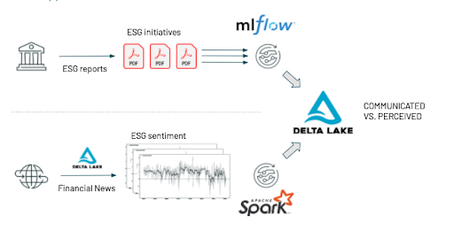
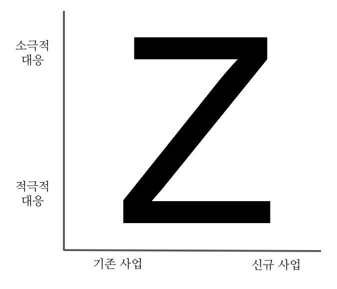
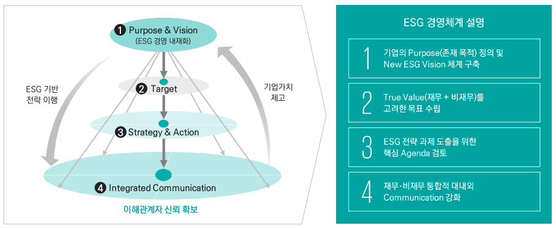

```{r setup, include=FALSE}
knitr::opts_chunk$set(echo = FALSE, warning=FALSE, message=FALSE,
                    comment="", digits = 3, tidy = FALSE, prompt = FALSE, fig.align = 'center')
```

# 기후변화

시간을 되돌려 10년 전으로 돌아가면 자산가치 붕괴, 중국성장 둔화, 소득 불균형, 미국 재정적자와 같은 경제적 위험이 큰 과제였다면 현재는 기상 이변, 자연 재해, 온실가스, 생물 다양성 감소와 같은 환경적 위험이 누구나 손꼽는 최우선 과제임은 재론의 여지가 없다.


전 지구적 기후변화는 식량위기 및 원자재 가격 폭등 더 나아가 금융위기 등의 연쇄적 현상으로 확대되어 인류 생존과 경제문제로 직결되고 있으며, 일어날지 아닐지 알 수 없는 **블랙스완** 과는 달리 나타날 것이 확실시 되고 더 복잡하고 연쇄적인 현상이 될 수 있이 자명하기 때문에 **그린스완(Green Swan)**이란 용어가 많이 회자되고 있다. 연도별/품목별 식량가격지수가 상승하면서 식량위기가 고조되고, 탈탄소, 친환경 정책으로 친환경 원자재 가격 폭등하면서 원자재 랠리가 이어지고 있으며, 국제결제은행 공급 수요 불균형으로 그린스완이 서서히 모습을 드러내고 있다.

# 국가

신 기후체제에 대응하기 위해 글로벌 선진국들은 탄소중립(Net Zero)을 강력히 추진하고 있으며 국가별 친환경 정책추진이 지속될 것으로 전망되고 있다. 조 바이든 미국 대통령은 파리 기후협정은 매우 중요한 사안이며 취임 첫날 미국은 바로
복귀할 것임은 천명했고, 시진핑 중국 국가주석은 녹색 경제 회복을 위해 모든 국가가 노력함과 동시에 2060 년까지 탄소중립
달성을 목표를 제시했다. EU 정상회의에서는 폴란드 제외 전 EU 회원국 탄소중립 실시 추진한다고 밝혔고, 스가 요시히데 일본 총리도 2050년까지 탄소중립 실현하여 경제와 환경의 선순환 구축을 제시했다.

대한민국도 디지털 뉴딜과 그린 뉴딜을 양대축으로 하는 한국판 뉴딜을 통해 이미 글로벌 환경 정책 변화에 신속히 대응하고 있으며, 친환경 정책 중심 그린 뉴딜을 추진을 통해 2050년 탄소중립 목표를 제시하고 8조원 투자계획도 실천에 들어갔다.

# 국가에서 기업으로

환경 규제 강화 및 친환경 신재생에너지로의 패러다임 전환에 따라 , 기존 국가 중심 친환경 정책은 기업중심 친환경 경영으로 빠르게 확산되고 있다. 2015년 UN 기후변화 회의에서 채택된 신 기후체제(파리협정)를 채택하면서 2021 년 1월부터 온실가스 감축 조약이 적용되어, 국제 공조체계를 기반으로 지구 온도 상승폭을 산업화 이전 대비 2℃ 이하로 2100 년까지 유지 목표를 정했다.
이러한 움짐임은 기업 차원의 친환경화 요구로 확대되고 있으며 기업 활동에 필요한 에너지를 재생에너지로 100% 대체를
목표로 RE 100이 만들어졌으며, 기업은 브랜드 가치 제고 차원으로 활용되면서 The Climate Group이 주도하는 신재생에너지 사용 자발적 운동에 참여하는 기업이 늘고 있다.

# 기업 

ESG 성과가 기업의 재무적 가치에 영향을 미치고, 공식적인 기업 평가지표로서 ESG 의 역할이 확대됨에 따라 ESG는 기업 경영의 핵심 요소로 주목받고 있다. 글로벌 연기금 및 자산운용사들은 ESG 투자 요구 증대에 따라 ESG 투자체계를 강화하고 있으며, 실제 ESG 투자규모도 폭발적인 증가 추세에 있다. 실제로 포츈 500에서 추린 상위 250개 기업(G250)의 CEO 들은 기후 변화를 중대 위험으로 인식하고, 적기 대응을 위한 기업 차원의 선제적 움직임을 강화하는 등 기업 운영 핵심 Agenda 로 설정하며 적극적인 움직임을 보이고 있다. 하지만, ESG 경영이 기업 경영 화두의 최우선 과제로 급부상하는 가운데, 국내 기업은 글로벌 대비 낮은 수준을 보이며 , ESG 등급 개선 속도 또한 미진한 상황이다.

ESG[@esg2021hankyung]

파이낸싱 측면에서도 ESG 요소가 자금조달·투자 기준으로 부상하고 있다. 네덜란드의 ING, 프랑스의 BNP파리바 등 글로벌 대형 은행 중심으로 지속가능 연계대출 활동이 증가하고 있고, 국내 주요 은행도 ESG 요소 도입을 구체화하고 있다. 블랙록, 뱅가드, 스테이트스트리트(SSGA) 등 글로벌 3대 자산운용사도 투자 포트폴리오에서 ESG 요소를 강화하고 있다. 뿐만 아니라 ESG 채권 발행 및 펀드로의 자금 유입도 증가하고 있다. 2020년 글로벌 ESG 채권 발행 규모는 4841억달러(약 529조원)로 전년 대비 63% 증가했다.

기업 인수합병(M&A) 딜 소싱과 밸류에이션 과정에서도 ESG 테마에 대한 검토가 필요하다. 최근 전기차 소재, 폐기물 처리 등 환경 테마의 대형 딜이 활발하게 진행되고 있으며, 2020년 거래액 5000억원 이상의 국내 대형 M&A 중 40% 이상이 ESG 관련 M&A인 것으로 파악된다. ESG 선도 기업들은 딜 소싱 시 환경오염 유발, 사회갈등 야기, 경영진의 비위 등을 기준으로 기업을 선별하는 작업을 강화하고 있다. 반환경적, 반윤리적, 비인도적 사업에 대해선 매각도 검토하고 있다.


# Green Transformation을 성장의 기회

# 데이터 사이언스

데이터 사이언스(Data Science)를 기반으로 ESG의 투명성, 가시성, 오픈협업 유인을 조성할 수


A.	E: 공장의 EHS 솔루션과 활동 기반 Process Mining
B.	S: 브랜드 평판분석, VoC 등 디지털마케팅 방법론 중 Data Science 기반 재정리
C.	G: 글로벌 MNC들이 채택하는 IBM, SAP 등의 GRC 솔루션 기반 Process Mining과 BoD 이사회의사록, 경영회의 등 비정형 혹은 자연어 제약조건의 비교분석


# 




[@esg2020Antoine]

# KPMG GT 매트릭스 {#kpmg-gt-matrix}

ESG의 핵심인 환경(Environment)에 대해 KPMG에서 개발한 Z 모델[@esg2021kpmg]은 기업들이 단계별로 대처하는 단순하면서 명쾌한 모형을 제시하고 있다. 기존 산업에서 소극적 대응은 **방어자 유형(Defender)**으로 4분면의 시작점이 되며 규제 대응 및 사후 대응 중심 사업추진으로 기존 사업 범위 내 발생하는 사회적 니즈 및 이슈에 대응하는 전략으로 구글의 데이터 센터 에너지 효율화와 네슬레 친환경 패키징 도입을 대표적인 사례로 들 수 있다. **선발대 유형(Advancer)**은 기 보유중인 역량과 신규 사업기회를 결합하여 사넝ㅂ을 전개하는 것으로 별도의 신규 사업을 통해 사업 포트폴리오를 확정하는 것으로 세븐일레븐의 친환경차 충전소 구축과 화웨이 친환경 스마트카 사업추진을 사례가 있다. **혁신가 유형(Innovator)**은 기존 사업 범위 내 소비자 니즈에 부흥하며 동시에 사업/제품 포트폴리오에 추가시키는 것으로 바스프의 친환경 제품 개발, 유니레버의 친환경 브랜드 확장을 꼽을 수 있다. 마지막으로 **개척자 유형(Pioneer)**은 기업의 생존과 성장을 위해 과감한 포트폴리오 재편을 통해 기존 사업 영역을 벗어나 신성장 동력을 발굴하는 것으로 파나소닉의 친환경 스마트 시티 사업계발과 브리티시 페트롤륨(BP)의 전기 충전소 사업추진이 대표적이다.




# ESG 경영체계 {#esg-mgmt-framework}

[@esg2020kpmg]


