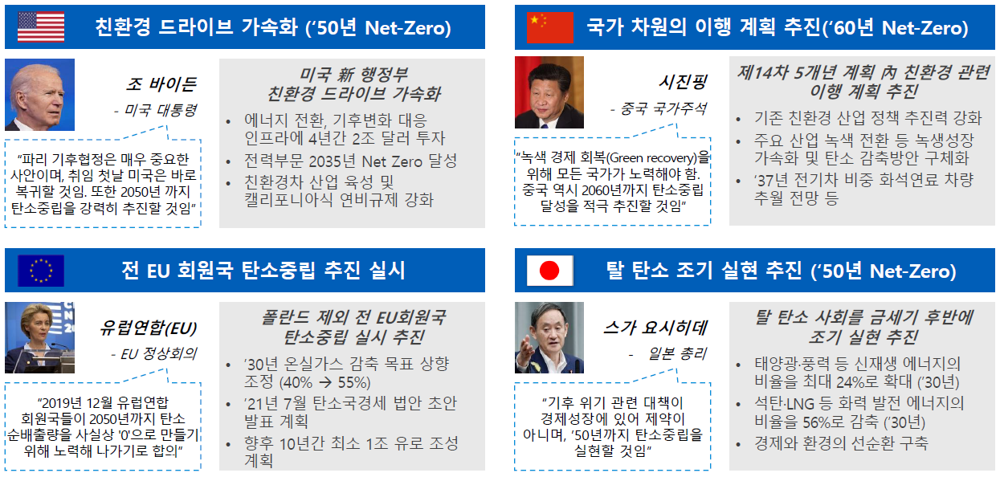
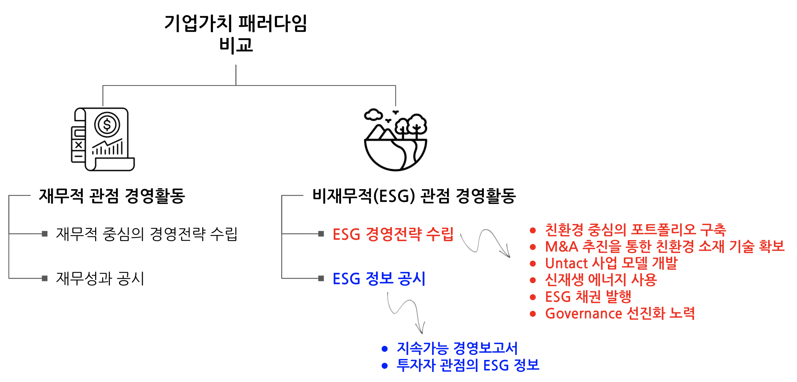
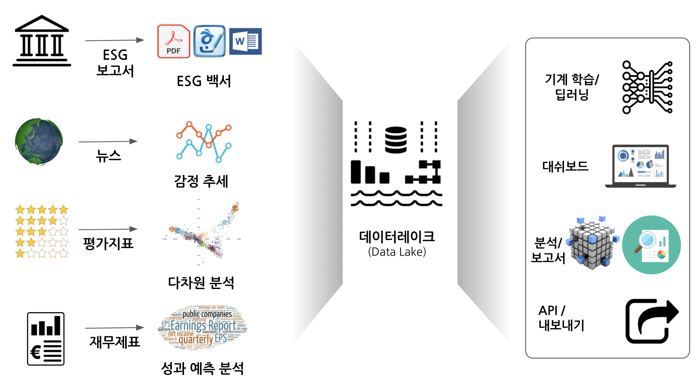
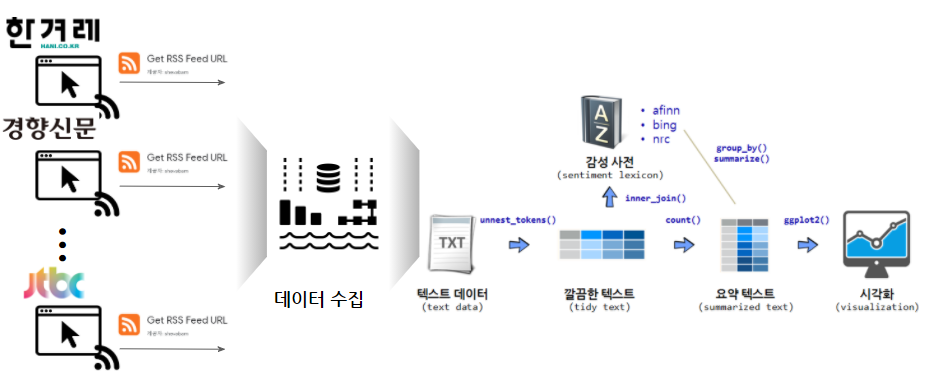

# 기후변화 {#climate-change}

시간을 되돌려 10년 전으로 돌아가면 자산가치 붕괴, 중국성장 둔화, 소득 불균형, 미국 재정적자와 같은 경제적 위험이 큰 과제였다면 현재는 기상 이변, 자연 재해, 온실가스, 생물 다양성 감소와 같은 환경적 위험이 누구나 손꼽는 최우선 과제임은 재론의 여지가 없다.

전 지구적 기후변화는 식량위기 및 원자재 가격 폭등 더 나아가 금융위기 등의 연쇄적 현상으로 확대되어 인류 생존과 경제문제로 직결되고 있으며, 일어날지 아닐지 알 수 없는 **블랙스완**과는 달리, **그린스완(Green Swan)**으로 불리며 나타날 것이 확실시 되며 발현될 경우 더 복잡하고 연쇄적인 현상이 될 것이다.
기후변화에 따라 연도별/품목별 식량가격지수가 상승하면서 식량위기가 고조되고, 탈탄소, 친환경 정책으로 친환경 원자재 가격 폭등하면서 원자재 랠리가 이어지고 있으며, 국제결제은행 공급 수요 불균형으로 그린스완이 서서히 모습을 드러내며 코로나19로 인해 그 존재를 명확히 하고 있다.

## 국가별 대응 {#response-to-climate-change}

신 기후체제에 대응하기 위해 글로벌 선진국들은 탄소중립(Net Zero)을 강력히 추진하고 있으며 국가별 친환경 정책이 지속 추진될 것으로 전망되고 있다.
조 바이든 미국 대통령은 파리 기후협정을 매우 중요한 사안으로 인식하여 취임 첫날 행정명령 서명을 통해 파리 기후변화협약에 복귀했고, 시진핑 중국 국가주석은 녹색 경제 회복을 위해 모든 국가의 노력을 호소하고 동시에 2060 년까지 탄소중립 달성을 목표를 제시했다.
EU 정상회의에서는 폴란드를 제외한 전 EU 회원국이 탄소중립을 추진한다고 밝혔고, 스가 요시히데 일본 총리도 2050년까지 탄소중립을 실현하여 경제와 환경의 선순환 구축을 제시했다.

대한민국은 디지털 뉴딜과 그린 뉴딜을 양대축으로 하는 한국판 뉴딜을 통해 글로벌 환경 정책 변화에 신속히 대응하고 있으며, 친환경 정책 중심 그린 뉴딜을 추진을 통해 2050년 탄소중립 목표를 제시하고 8조원 투자계획도 실천에 들어갔다.

## 국가에서 기업으로 {#companies-to-climate-change}

2015년 UN 기후변화 회의에서 채택된 신 기후체제(파리협정)를 채택하면서 2021 년 1월부터 온실가스 감축 조약이 적용되어, 국제 공조체계를 기반으로 지구 온도 상승폭을 산업화 이전 대비 2℃ 이하로 2100 년까지 유지 목표를 정했다.
환경 규제 강화 및 친환경 신재생 에너지로의 패러다임 전환에 따라, 기존 국가 중심 친환경 정책이 기업중심 친환경 경영으로 빠르게 무게중심을 옮기고 있다.

이러한 움짐임은 기업 차원의 친환경화 요구로 확대되고 있으며 기업 활동에 필요한 에너지를 재생에너지로 100% 대체를 목표로 **RE 100**이 만들어졌다.
우선 이러한 작은 활동이 기업 브랜드 가치 제고에 기여하여 기업가치를 높이는 것이 증명되면서 The Climate Group이 주도하는 신재생에너지 사용 자발적 운동에 참여하는 기업이 늘고 있다.

# 발빠른 기업의 움직임 {#movement-company}

앞서 살펴본 친환경 활동이 기업 브랜드 가치를 제고하는 것을 넘어 ESG 성과는 기업의 재무적 가치에 영향을 이미 미치고 있으며, 공식적인 기업 평가지표로서 ESG 역할이 확대됨에 따라 ESG는 기업 경영의 핵심 요소로 주목받고 있다.
글로벌 연기금 및 자산운용사들은 ESG 투자 요구 증대에 따라 ESG 투자체계를 강화하고 있으며, 실제 ESG 투자규모도 폭발적인 증가 추세에 있다.
실제로 포츈 500에서 추린 상위 250개 기업(G250)의 CEO 들은 기후 변화를 중대 위험으로 인식하고, 적기 대응을 위한 기업 차원의 선제적 움직임을 강화하는 등 기업 운영 핵심 Agenda 로 설정하여 발빠른 움직임을 보이고 있다.
하지만, 전반적으로 ESG 경영이 기업 경영 화두의 최우선 과제로 급부상하는 것은 분명하지만, 국내 기업은 아직 글로벌 대비 낮은 수준을 보이며, ESG 등급 개선 속도 또한 미진한 상황이다.

파이낸싱 측면에서도 ESG 요소가 자금조달·투자의 중요 기준으로 부상하고 있다.
네덜란드의 ING, 프랑스의 BNP파리바 등 글로벌 대형 은행 중심으로 지속가능 연계대출 활동이 증가하고 있고, 국내 주요 은행도 ESG 요소 도입을 구체화하고 있다.
블랙록, 뱅가드, 스테이트스트리트(SSGA) 등 글로벌 3대 자산운용사도 투자 포트폴리오에서 ESG 요소를 강화하고 있다.
뿐만 아니라 ESG 채권 발행 및 펀드로의 자금 유입도 꾸준히 증가하고 있으며, 2020년 글로벌 ESG 채권 발행 규모는 4841억달러(약 529조원)로 전년 대비 63% 증가하며 전혀 새로운 금융환경이 다가오고 있다.

기업 인수합병(M&A) 딜 소싱과 밸류에이션 과정에서도 ESG 테마에 중대한 변화가 나타나고 있다.
최근 전기차 소재, 폐기물 처리 등 환경 테마의 대형 딜이 활발하게 진행되고 있으며, 2020년 거래액 5000억원 이상의 국내 대형 M&A 중 40% 이상이 ESG 관련 M&A인 것으로 파악된다.
ESG 선도 기업들도 딜 소싱 시 환경오염 유발, 사회갈등 야기, 경영진의 비위 등을 기준으로 기업을 선별하는 작업을 강화하고 있으며, 반환경적, 반윤리적, 비인도적 사업에 대해선 선제적 매각을 통해 위험관리에 적극 나서고 있다.

이러한 기업들의 변화에는 중심에 기업가치 패러다임 변화가 있다.
전통적으로 기업가치는 재무적 관점의 경영활동을 통해 측정되었다.
즉, 재무 중심의 경영전략을 수립과 재무성과 공시를 한 생애주기라고 했다면, 비재무적(ESG) 관점의 경영활동은 ESG 경영전략 수립과 ESG 정보 공시를 생애주기로 한다.
과거 재무성과를 DART 시스템에 다양한 재무제표를 통해 재무성과 공시를 했다면, 이제는 지속가능 경영보고서나 투자자 관점의 ESG 정보공시가 새로운 뉴노멀로 자리잡아가고 있다.

## ESG 경영체계 {#esg-mgmt-framework}

기업의 비즈니스 리더는 기존의 경영체계를 "ESG 경영체계"로 디지털 전환과 발맞추어 재설계해야 한다.
우선 기업의 Purpose & Vision을 ESG 기준에 맞춰 재정립하고, 재무성과와 비재무성과를 통합한 새로운 목표를 수립하고 이에 맞춰 목표달성을 위한 세부전략과제 도출을 위해 ESG 핵심 어젠다를 검토해야 되는데 비즈니스 리더가 주목할 ESG 경영 5대 어젠다로는 규제(Regulation), 파이낸싱(Financing), 인수합병(M&A), 기술(Tech), 보고(Reporting)가 제시되고 있다.

## KPMG GT 매트릭스 {#kpmg-gt-matrix}

ESG의 핵심인 환경(Environment)에 대해 KPMG에서 개발한 GT(Green Transformation) 매트릭스 Z 모델은 기업들이 단계별로 대처하는 단순하면서 명쾌한 모형을 제시하고 있다.
기존 산업에서 소극적 대응은 **방어자 유형(Defender)**으로 4분면의 시작점이 되며 규제 대응 및 사후 대응 중심 사업추진으로 기존 사업 범위 내 발생하는 사회적 니즈 및 이슈에 대응하는 전략으로 구글의 데이터 센터 에너지 효율화와 네슬레 친환경 패키징 도입을 대표적인 사례로 들 수 있다.
**선발대 유형(Advancer)**은 기 보유중인 역량과 신규 사업기회를 결합하여 사업을 전개하는 것으로 별도의 신규 사업을 통해 사업 포트폴리오를 확정하는 전략으로 세븐일레븐의 친환경차 충전소 구축과 화웨이 친환경 스마트카 사업추진을 사례가 있다.
**혁신가 유형(Innovator)**은 기존 사업 범위 내 소비자 니즈에 부흥하는 동시에 사업/제품 포트폴리오에 추가하는 전략으로 바스프의 친환경 제품 개발, 유니레버의 친환경 브랜드 확장을 꼽을 수 있다.
마지막으로 **개척자 유형(Pioneer)**은 기업의 생존과 성장을 위해 과감한 포트폴리오 재편을 통해 기존 사업 영역을 벗어나 신성장 동력을 발굴하는 것으로 파나소닉의 친환경 스마트 시티 사업계발과 브리티시 페트롤륨(BP)의 전기 충전소 사업추진이 대표적이다.

# 증거기반 ESG {#esg-data-science}

과거에는 불가능하다고 생각되던 데이터를 통한 증거기반 ESG 기업전환이 빅데이터(Big Data) 기술의 발전으로 대용량 데이터가 실시간으로 축적되고, 데이터 과학(Data Science)의 발전으로 데이터를 통한 지속가능한 가치창출과 발견이 가능해지고, 기계학습/딥러닝 기술의 발전으로 자동화를 통해 더 높은 예측력을 갖추게 되었다.
특히, 오픈 공공데이터를 통해서 자유로이 데이터가 유통될 수 있는 기술적, 제도적, 문화적 환경이 마련되었다.
특히, 정부에서도 제2의 석유라고 불리는 데이터를 원자재로 삼아 부가가치를 창출하는 **데이터 경제**를 표방하면서 데이터 산업이 각광받고 있으며 데이터 3법이 통과되면서 규제에서 촉진으로 사업환경이 크게 변화하고 있다.

ESG에서 추구하는 가치를 증거기반 데이터로 축적하여 환경(Environment)측면에서 공장의 EHS 솔루션과 활동 기반 프로세스 마이닝(Process Mining) 도입하고, 사회(Social) 측면에서는 브랜드 평판분석, VoC 등 디지털 마케팅 재편, 지배구조(G) 측면에서 글로벌 다국적 기업들이 채택하는 IBM, SAP 등의 GRC 솔루션을 도입하여 BoD 이사회의사록, 경영회의 등 비정형 혹은 텍스트 데이터를 활용한 자연어 처리와 Process Mining 결과가 속속 공개되고 있다.

## ESG 기업 감성분석 사례 {#esg-sentiment-analysis}

2020년 11월 기준 한국언론진흥재단에 등록된 107개 언론사 웹사이트의 RSS 주소를 원천데이터로 삼아 데이터를 수집하여 데이터베이스로 구축하고, 이렇게 수집된 텍스트 데이터를 자연어 처리 작업을 기반 기술로 뉴스에 언급된 기업과 ESG 항목을 매칭하면 기업의 활동성을 파악할 수 있다.
한걸음 더 나아가, 별도 구축한 감성사전을 결합시키거나 기학습된 감성 분류 기계학습 모형이 있다면, 해당 기업에 대한 사회적 감성을 모니터링하는 것은 물론, 데이터 분석을 통해 새로운 통찰력을 발굴하고 기업가치를 향상시킬 수 있는 방안도 마련할 수 있다.

# 마무리 및 제언 {#esg-data-science-conclusion}

**창백한 푸른 점(Pale Blue Dot)**은 보이저 1호가 1990년 2월 14일 지구로 보내 온 한장의 사진이지만 이것이 시사하는 바는 인류가 직면한 기후 변화의 문제를 지금까지 봐 왔던 관점과 전혀 다른 과점에서 접근할 것을 요구하고 있다.
지금까지 사회와 기업, 정부가 재무적 성과를 최우선으로 추구했다면 이제는 ESG가 제시하고 있는 환경, 사회, 지배구조를 시작점으로 기후 변화로 촉발된 전 지구적 기후 문제를 모두의 중지를 모아 헤쳐나갈 시점이 되었다.
특히 디지털 전환이 가속화되면서 그동안 진행되었던 ESG도 증거기반 ESG로 급격한 변화가 이뤄지고 있다.
이에 ESG 분야 중 하나인 사회를 골라 뉴스에 포함된 특정 회사에 대한 감성분석을 통해 증거기반 ESG의 실증적인 사례로 살펴봤다.
향후 이와 같은 증거기반 ESG 경험을 지속적으로 축적해 나가면, 기후변화라는 엄중한 상황도 지혜를 모아 슬기롭게 극복해 나갈 것으로 기대된다.
