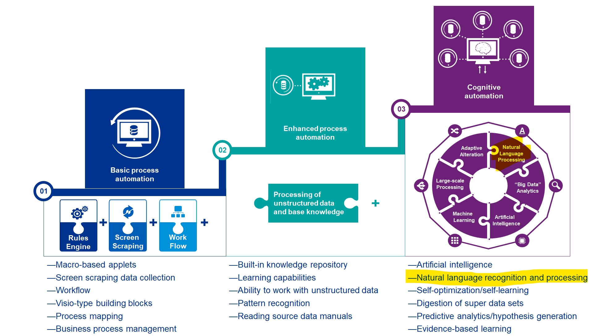
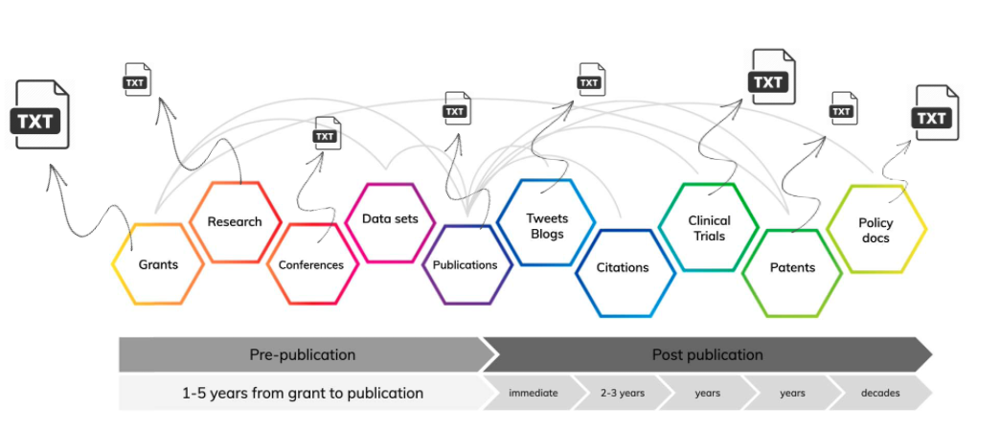
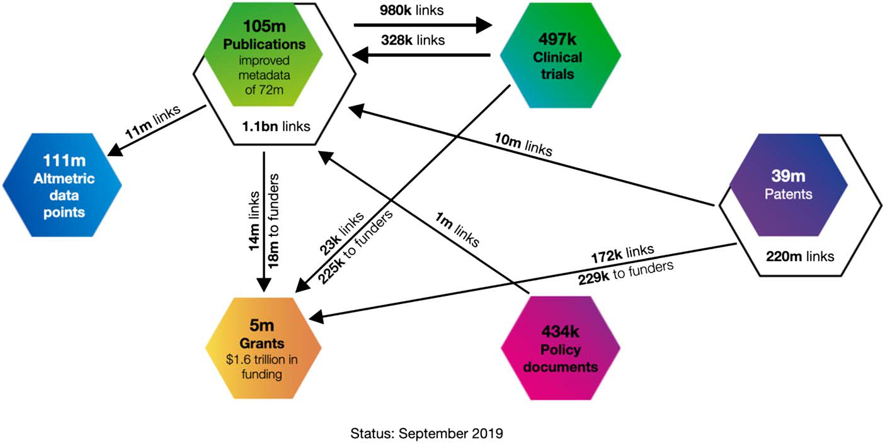
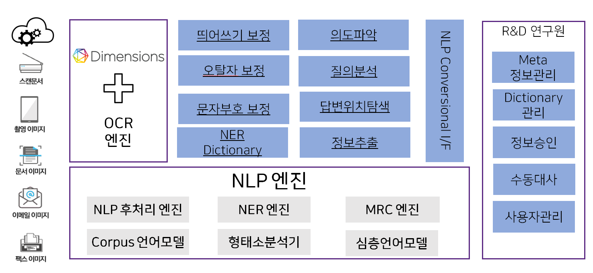
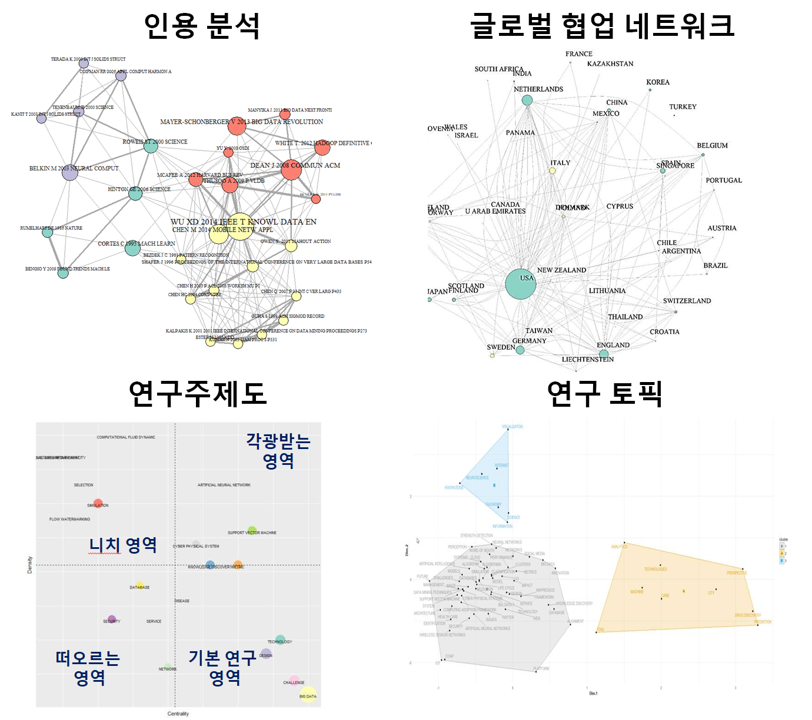

```{r setup, include=FALSE}
knitr::opts_chunk$set(echo = FALSE, warning=FALSE, message=FALSE,
                    comment="", digits = 3, tidy = FALSE, prompt = FALSE, fig.align = 'center')
```


# 디지털 전환시대 R&D {#digital-transformation-rnd}

통상적인 과학연구 과정은 가설을 세워, 데이터를 수집하고, 탐색적 과정을 거쳐 발견과 분석을 수행하고 이를 발표하는 과정을 거졌지만, 기하급수적으로 증가하는 데이터에 의해 이러한 흐름에 변화가 생겨나고 있다. 과학이 **가정-주도(Hypothesis-Driven)** 에서 **데이터-주도(Data-Driven)** 발견으로 급격히 이동하면서 전혀 새로운 도전에 직면하고 있다. 과거 데이터를 수집하고 분석과 발견 과정을 거쳐서 출판 게시했다면, 이제는 다양하고 휘발성이 강하며 대용량의 데이터(Big Data)를 수집하는 동시에 인터넷에 게시하여 공개를 먼저하고, 동료 연구자와 함께 데이터 분석과 탐색 과정을 통해 정보를 추출하고 모형을 개발하는 전과정이 자동화되고 있다.

R&D 분야에서 연구실 과학(Lab Science) 연구생산성 향상을 위해서 많은 연구논문과 데이터 수집 작업이 수작업을 통해 진행되었다면 
현재는 규칙엔진, 화면 스크랩핑, 작업흐름 자동화로 요약되는 RPA(Rapid Processign Automation)를 도입하여 연구자동화에 커다란 전환이 이뤄지고 있다. 앞으로 정형/비정형 데이터를 처리할 수 있도록 RPA 봇이 한단계 진화될 것이고, 다양한 인공지능 모형을 탑재하여 스마트(smart)해짐에 따라 또다른 R&D 연구원의 역할을 하게 될 것이며 봇과 연구원간 적절한 업무분장을 통해 R&D 발전을 가속화시킬 것으로 기대된다. 최근 개발되고 있는 R&D 지원 봇은 자연어를 이해하고 다양한 질문에 대답을 할 수 있을 뿐만 아니라 필요한 경우 논문이나 보고서 제작도 어느 정도 할 수 있을 수준으로 발전했다. 




# NLP를 통한 R&D 가치창출 {#dimensions-ai}

R&D 연구개발[@herzog2020dimensions]은 크게 출판(Publications)을 기점으로 출판전과 후로 나뉘고 R&D 연구자금 투여를 시작으로 연구개발이 진행되고 컨퍼런스 발표를 통해 최신 연구성과물에 대한 교류가 이어지고 빅데이터 시대 데이터 주도(Data-driven) 과학연구가 일반화되어 데이터를 수집하고 공개하여 검증과정을 거쳐 
데이터 집약 연구결과물을 출판하게 된다. 출판이 이뤄진다고 끝이 나는 것은 아니고 트윗 등을 통해 연구결과는 실시간으로 연구원들 사이에 공유되고 또다른 논문과 보고서에 참고문헌으로 인용되면서 가치를 인정받게 되고 특허와 정책 보고서에 담겨 경제적인 가치도 인정받고 사회경제적인 영향을 미치게 된다. R&D 생애과정은 최소 몇년에서 최대 몇십년이 걸리는데 이 과정에서 자연어 처리(NLP, Natural Language Processing)를 통해 가치를 창출할 수 있는 다양한 텍스트 데이터가 각 단계별로 산출되고 연결되어 축적된다. 


[`Dimensions`](https://www.dimensions.ai/)는 R&D 연구개발과정에서 생성되는 모든 결과물을 데이터베이스로 구축하여 R&D 종사자 누구나 접근이 가능하도록 공개하고 있다. 과거 파편적으로 단절되어 구축되어 사일로(Silo) 형태로 축적되던 다양한 연구결과물을 최신 데이터 과학기술을 적용하여 이를 상호 연결시켜 이를 통한 R&D 연구 동향은 물론, 핵심 논문, 연구기관, 논문저작자 식별을 용이하게 함으로써 글로벌 협업을 가속시켜 R&D 성과물이 시장에 조기 출시되는 것도 돕고 있다.
실시간으로 연구성과물은 축적되고 연결되는 것은 물론 검증을 거쳐 데이터 가치를 높이는 작업이 지속적되고 있는데 2019년 기준 출판 데이터는 1억이 넘고 이와 연결된 임상실험(Clinical Trials)은 50만건, 특허는 4천만건, 40만건이 넘는 정책보고서 등이 [`Dimensions`](https://www.dimensions.ai/)에 공개되고 있다.



# R&D NLP 

변화된 과학 패러다임에 맞춰 연구개발 생산성을 높이고 투명성을 강화하고 재현가능하도록 연구결과물을 만들기 위해서는 연구개발의 핵심적인 산출물인 과학논문과 보고서 제작 생산성을 높이고 공유와 협업이 가능형태로 작성되어야 한다. 과학저널 네이처[^nature-blog]에 따르면 9년마다 2배씩 증가하고 있어 과학연구 성과물을 디지털화(Digitization) 시키는 것은 물론 이를 연결시켜 교차분석을 통해 가치를 창출하는 것은 물론 자연어 처리를 통한 시도가 늘어나고 있다.

[^nature-blog]: [Richard Van Noorden (07 May 2014), "Global scientific output doubles every nine years", nature.com](http://blogs.nature.com/news/2014/05/global-scientific-output-doubles-every-nine-years.html)

자연어처리(NLP)는 비전 기술과 함께 인공지능(AI)의 중요한 한 축을 담당하고 있으며, 텍스트 분류, 텍스트 요약, 문서 유사성 측정, 자연어 텍스트 생성, 번역, 음성 인식 등 다양한 세부 기술을 아우르고 있다. 다양한 문서를 디지털화하여 기계가 처리할 수 있는 형태(OCR)로 정보를 조직화 한 후 기계 독해 기술(MRC)과 자연어 이해 기술을 결합시키게 되면 연구개발을 한단계 도약시킬 수 있다.
자연어 처리 기계모형이 장착된 과학기술 RPA는 논문, 보고서 내용을 수집, 이해, 해석하여 문서에 담긴 핵심적인 사항을 식별하는 것은 물론이고, 논문 제작과정에 도움을 주어 연구원 제작한 연구성과물과 비교하여 차이가 없거나 경우에 따라서는 더 좋은 성능을 보여주고 있다.

NLP 기능이 탑재된 기계가 연구원을 도와 과학기술논문을 분석하고 연구원의 질문에 대해 즉각적인 대답을 제시함으로써 연구개발과정에서 낭비되는 불필요한 시간소모를 줄이는 것은 물론이고, 연구원에서 일상적으로 작성되는 일반행정문서를 자동 생성, 검증함으로써 업무 정확도 향상과 효과성 측면에서도 잡무를 줄여줌으로써 연구개발에 더 많은 시간을 투여할 수 있도록 진화하고 있다.
특히, 단어와 구문, 토픽(topic)을 통해 추출한 정보를 네트워크 시각화 분석과 결합하여 제시할 경우 문제 상황에 대한 정확한 상황파악은 물론이고 향후 연구방향을 예측하는데 도움을 주어 연구원의 연구방향도 실시간으로 지원하고 있다.



# 코로나19 R&D {#covid-rnd}

코로나19 팬데믹으로 인해 2020년 1분기에만 60,000 건이 넘는 논문이 코로나 바이러스 관련 쏟아졌다. 
특히 신약개발에 상당한 연구자금이 투자되지만 대다수는 특별한 연구성과 없이 버려지는 경우가 허다하다.
AI가 성과를 내기 시작한 시점부터 파이자(Pfizer), 사노피(Sanofi), 호프만 라 로슈(Roche) 등 이름만 들어도 
알 수 있는 다국적 거대 제약회사[^durg-rnd]에서 AI 특히 NLP 기술을 활용하여 신속히 저렴하지만 효과적인 신약개발에 
활용하고 있다. 특히 사노피는 특허, 임상실험, EHR, 인터넷 문서, 컨퍼런스 발표 논문 등을
수집하고 정제하여 정형화시켜 초기 신약개발, 유전자 질병 매핑, 목표식별과 우선순위 지정, 약물 용도변경(Drug repurposing) 등 
다양한 연구목표 달성에 NLP 텍스트 마이닝 기술을 활용하여 성과를 내고 있다. [^sanofi]

[^durg-rnd]: [Nic Fleming (30 MAY 2018), "How artificial intelligence is changing drug discovery", nature.com](https://www.nature.com/articles/d41586-018-05267-x)

[^sanofi]: [Melissa Fassbender (30-Jan-2019), "Sanofi: NLP text mining and other AI tech to advance findings, improve data use"](https://www.outsourcing-pharma.com/Article/2019/01/30/Sanofi-NLP-text-mining-and-other-AI-tech-to-advance-findings-improve-data-use)




