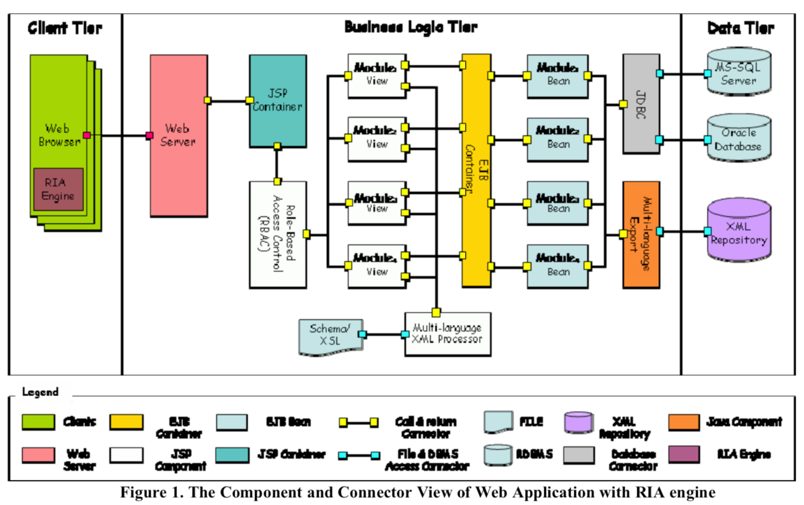
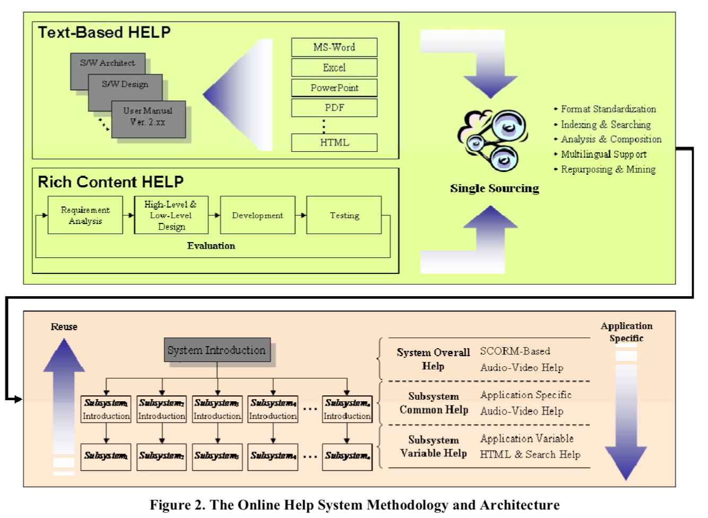
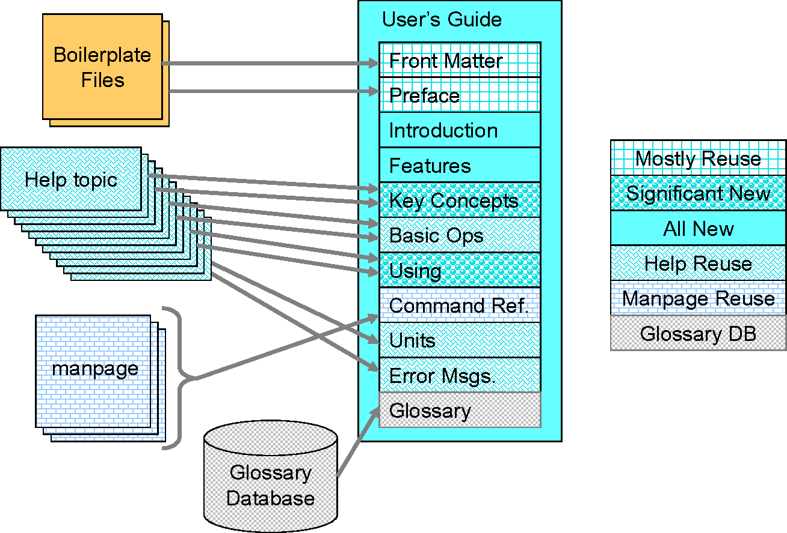
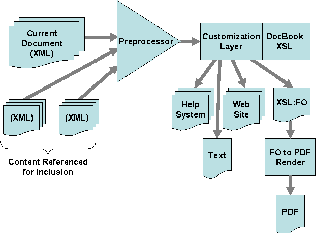

```{r setup, include=FALSE}
options(htmltools.dir.version = FALSE)

knitr::opts_chunk$set(echo = FALSE, warning=FALSE, message=FALSE,
                    comment="", digits = 3, tidy = FALSE, prompt = TRUE, fig.align = 'center')
```

## Market-Oriented Big Data & IoT

- 강의제목: "Document Engineering and Digital Labor"
- 강의일시
    - 2019년 8월 29일(목) 16:30 ~ 18:30
- 강의장소: 고려대 Hyundai Motor Hall
- 강의내용
    - Document Engineering
    - One Source Multi-Use: Authoring Automation
    - Digital Labor
    - RPA Software

---
class: inverse, middle, center

## 데이터 과학자 1세대

---
## 데이터 과학자

.pull-left[
  
]

.pull-right[
  <iframe width="400" height="250" src="https://www.youtube.com/embed/K_TGdklC504" frameborder="0" allow="accelerometer; autoplay; encrypted-media; gyroscope; picture-in-picture" allowfullscreen></iframe>
]

.footnote[
- 삼정 KPMG 데이터 과학자
- 연세대학교 겸임교수, ["데이터 사이언스 입문"](https://statkclee.github.io/yonsei/)
- [이광춘(2019) "데이터 사이언스, 타이디버스로 향하다", 마이크로소프트웨어 395호](http://it.chosun.com/site/data/html_dir/2019/01/29/2019012900392.html)
- [데이터 사이언스 미트업 운영](https://tidyverse-korea.github.io/r-meetup-x-presser/)
- [소프트웨어 카펜트리(Software Carpentry) 강사 (Kwangchun Lee)](https://carpentries.org/instructors/)
- [Cloudera Conference 2018 - Seoul: 기계의 역습 - 설명가능한 기계학습](https://www.clouderasessionsseoul.com/agenda.php)
]


---
class: inverse, left

## Document Engineering and Digital Labor

### Software Document

.footnote[
1. Software Document
1. No More Microsoft Office 
1. OSMU - R Markdown and friends
1. Document Engineering
1. Digital Labor
1. RPA Software
] 

---
## Online help framework - ACM 2007

.pull-left[
    
]

.pull-right[
    
]


.footnote[ 
[KwangChun Lee and Dan Hyung Lee, "An online help framework for web applications", SIGDOC '07 Proceedings of the 25th annual ACM international conference on Design of communication Pages 176-180, El Paso, Texas, USA — October 22 - 24, 2007 ](https://dl.acm.org/citation.cfm?id=1297179)
]

---
## Hewlett-Packard Company

- [Hewlett-Packard](https://en.wikipedia.org/wiki/Hewlett-Packard)
- [List of acquisitions by Hewlett-Packard](https://en.wikipedia.org/wiki/List_of_acquisitions_by_Hewlett-Packard)
- [Office Locations - HPE WW Office Locations](https://www.hpe.com/us/en/ww-office-locations.html)
- [IT INFRASTRUCTURE PRODUCTS & SOLUTIONS](https://www.hpe.com/us/en/products.html)

---
## Hewlett-Packard Company - ACM 2007

.pull-left[
    
]

.pull-right[
    
]

.footnote[ 
[Kathy Haramundanis and Larry Rowland (Hewlett-Packard Company), "Experience paper: a content reuse documentation design experience", SIGDOC '07 Proceedings of the 25th annual ACM international conference on Design of communication Pages 229-233, El Paso, Texas, USA — October 22 - 24, 2007 ](https://dl.acm.org/citation.cfm?id=1297193)
]

---
class: inverse, left

## Document Engineering and Digital Labor

### No More Microsoft Office 

.footnote[
1. ~~Software Document~~
1. No More Microsoft Office 
1. OSMU - R Markdown and friends
1. Document Engineering
1. Digital Labor
1. RPA Software
] 

---
## No More Microsoft Office

- [도전받는 데이터 사이언스 도구](https://statkclee.github.io/ds-authoring/ds-finance-why-201904.html#30)

---
class: inverse, left

## Document Engineering and Digital Labor

### OSMU - R Markdown and friends

.footnote[
1. ~~Software Document~~
1. ~~No More Microsoft Office~~ 
1. OSMU - R Markdown and friends
1. Document Engineering
1. Digital Labor
1. RPA Software
] 


---
## OSMU - R Markdown and friends

### BMI 데이터 사이언스 보고서

`author_carpentry_kr/tutorial/reproducible_finance/reproducible_finance.Rmd`

.footnote[
[재현가능한 데이터 사이언스 - BMI](https://statkclee.github.io/author_carpentry_kr/tutorial/reproducible_finance/reproducible_finance.html)
]

---
class: inverse, left

## Document Engineering and Digital Labor

### Document Engineering

.footnote[
1. ~~Software Document~~
1. ~~No More Microsoft Office~~ 
1. ~~OSMU - R Markdown and friends~~
1. Document Engineering
1. Digital Labor
1. RPA Software
] 

---
## Document Engineering

.center[

]

.footnote[
- [영문 이력서: PDF &rarr; 데이터프레임](https://statkclee.github.io/author_carpentry_kr/df-pdf-df.html)
- [영문 이력서: 데이터프레임 &rarr; PDF](https://statkclee.github.io/author_carpentry_kr/df-pdf.html)
]

---
class: inverse, left

## Document Engineering and Digital Labor

### Digital Labor

.footnote[
1. ~~Software Document~~
1. ~~No More Microsoft Office~~ 
1. ~~OSMU - R Markdown and friends~~
1. ~~Document Engineering~~
1. Digital Labor
1. RPA Software
] 

---
## Digital Labor

**파워포인트 슬라이드**

---
class: inverse, left

## Document Engineering and Digital Labor

### RPA Software

.footnote[
1. ~~Software Document~~
1. ~~No More Microsoft Office~~ 
1. ~~OSMU - R Markdown and friends~~
1. ~~Document Engineering~~
1. ~~Digital Labor~~
1. RPA Software
] 


---
## RPA Software

**파워포인트 슬라이드**

