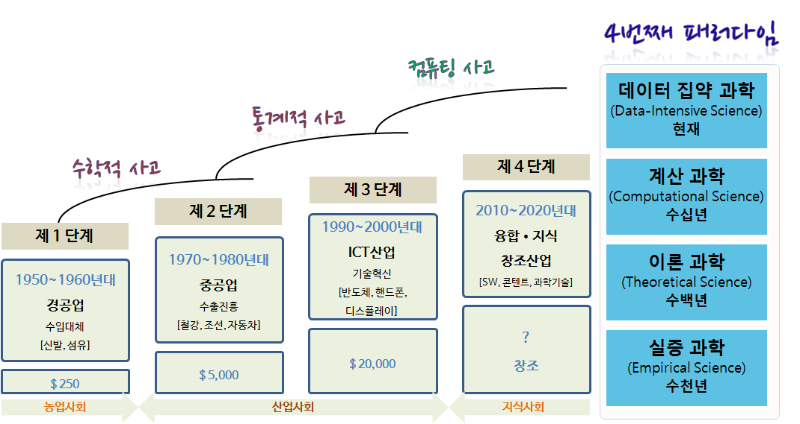
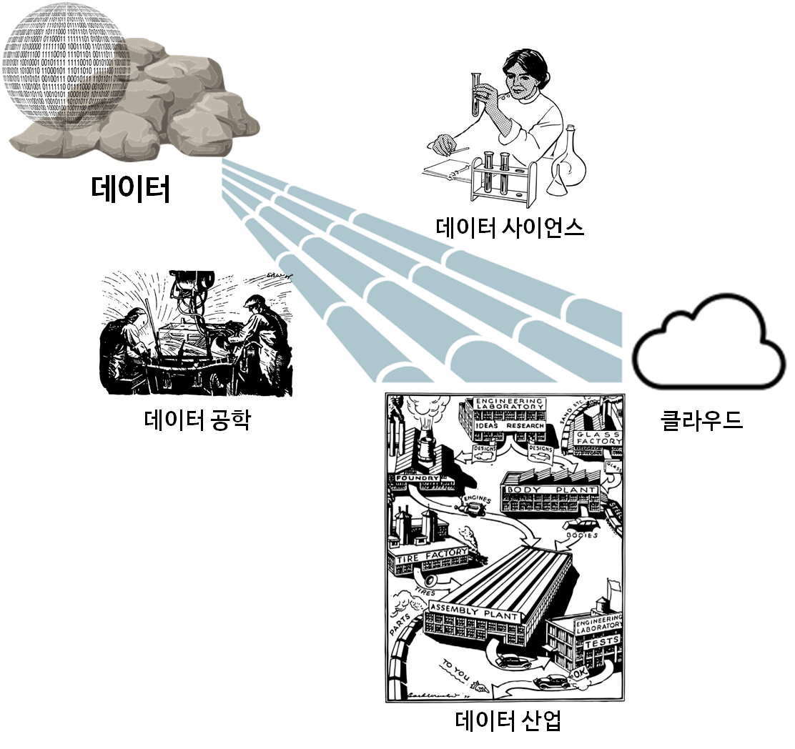
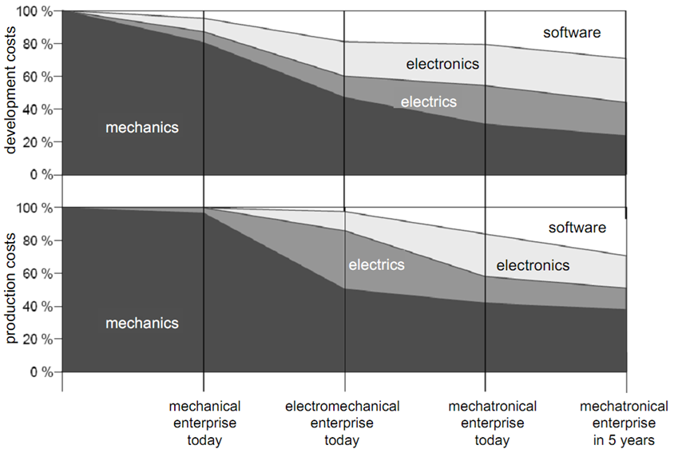
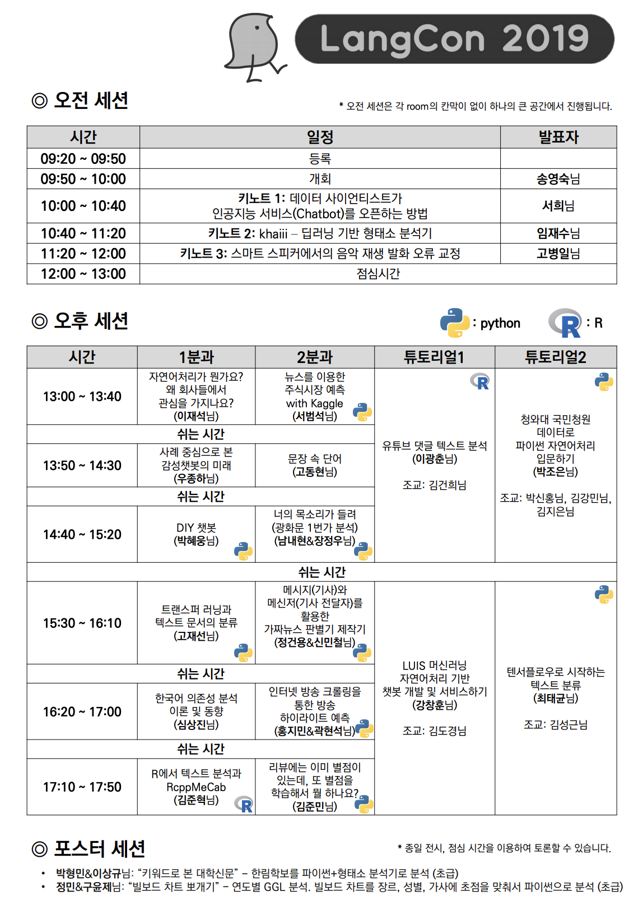
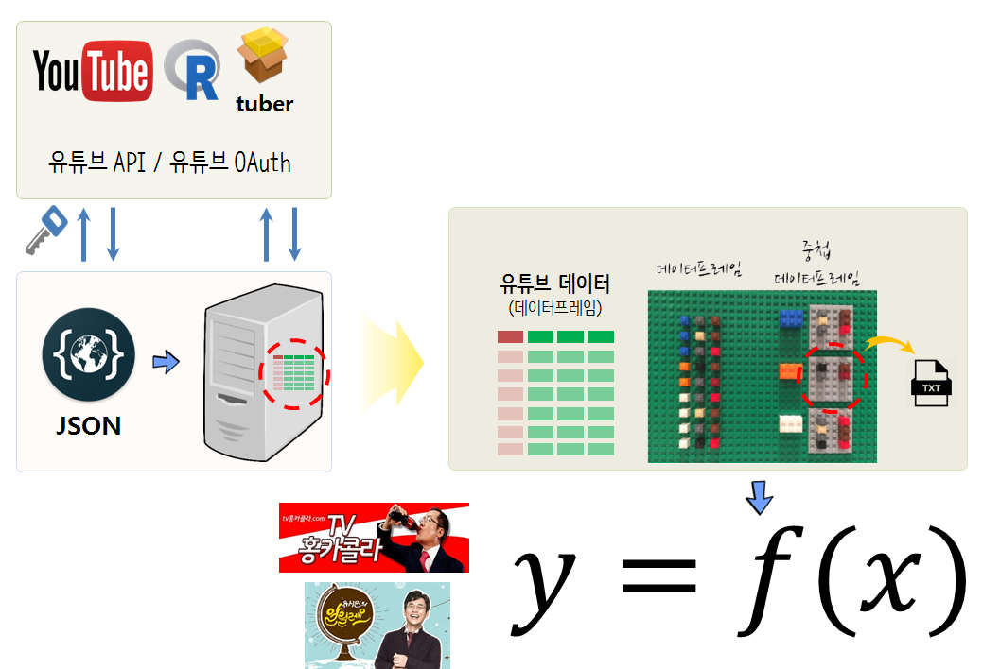

```{r setup, include=FALSE}
knitr::opts_chunk$set(echo = FALSE, message=FALSE, warning=FALSE,
                      comment="", digits = 3, tidy = FALSE, prompt = FALSE, fig.align = 'center')

```

# 가치와 사고체계

## 가치(Value) 원천

<!-- {.id class width="77%"} -->


<small>
세계은행(World Bank)과 한국개발연구원(KDI)은 약 2년여 기간의 공동연구를 통해 1960-2005 년간 한국 경제발전 과정에 관한 보고서를 출간했다. 경제성장이 지속되기 위해서는 생산성 증가가 대단히 중요하고, 1960년 이후 한국경제의 성공은 광의의 지식축적에 기인한 것으로 1960-2005년 사이 한국의 실질 1인당GDP의 75%가 광의의 지식축적에 기인한 것으로 분석했다.
</small>

## 4번째 패러다임


## 사고 체계 진화



## 산업역군(?)

<iframe width="400" height="270" src="https://www.youtube.com/embed/t346si4gy_M" frameborder="0" allowfullscreen></iframe>


<small>
[MATT RICHTEL, "Reading, Writing, Arithmetic, and Lately, Coding"", The New York Time,  MAY 10, 2014](http://www.nytimes.com/2014/05/11/us/reading-writing-arithmetic-and-lately-coding.html)
</small>

# AI/Big Data/Data Science

## 구글 Trends 한미 비교 - 미국

```{r google-trends-comparison-us, echo=FALSE, fig.width=12, fig.height=8}
library(timelineS) # devtools::install_github("daheelee/timelineS")
library(tidyverse)
library(lubridate)
library(googleVis)
library(extrafont)
loadfonts()

Sys.setenv(TZ='Asia/Seoul')

us_df <- read_rds("data/us_df.rds")
kr_df <- read_rds("data/kr_df.rds")

us_df$interest_over_time %>% tbl_df %>% 
  mutate(hits = as.integer(hits)) %>% 
  ggplot(aes(x=date, y=hits, color=keyword)) +
    geom_line() +
    labs(x="", y="구글 인기도", color="구글 검색어") +
    theme_minimal(base_family = "NanumGothic") +
    theme(legend.position = "top",
          legend.title=element_text(size=17), 
          legend.text=element_text(size=15))

```


## 구글 Trends 한미 비교 - 한국

```{r google-trends-comparison-kr, fig.width=12, fig.height=8}
kr_df$interest_over_time %>% tbl_df %>% 
  mutate(hits = as.integer(hits)) %>% 
  ggplot(aes(x=date, y=hits, color=keyword)) +
    geom_line() +
    labs(x="", y="구글 인기도", color="구글 검색어") +
    theme_minimal(base_family = "NanumGothic") +
    theme(legend.position = "top",
          legend.title=element_text(size=17), 
          legend.text=element_text(size=15))
```

## 데이터 과학 가치 


<small>
- [Tidyverse Korea, "데이터 과학 tidyverse 모형 : 기계학습 모형 개요"](https://statkclee.github.io/model/model-ml-intro.html)
</small>

## 데이터 과학과 ML/DL


<small>
- [Tidyverse Korea, "4차산업혁명과 대한민국 혁신성장 활로모색 - 데이터 자원과 사이언스와 엔지니어링 그리고 사업화"](https://statkclee.github.io/ds-authoring/ds-4th-ir.html)
</small>

## 데이터 &rarr; 산업화



<small>
- [Tidyverse Korea, "4차산업혁명과 대한민국 혁신성장 활로모색 - 데이터 자원과 사이언스와 엔지니어링 그리고 사업화"](https://statkclee.github.io/ds-authoring/ds-4th-ir.html)
</small>

# 자동차 사례

### [자동차 데이터](https://statkclee.github.io/automotive/)

- 자동차 제조사(OEM)와 공급사
    - 자동차 생산량 - 제조사별, 국가별
    - 글로벌 자동차 부품공급사(상위 100사)
- 자동차 품질
    - 초기품질지수(IQS) / 차량 내구성 조사(VDS)
    - 초기품질지수 vs 차량 내구성 조사
- 자동차 경제성
    - 자동차 연비
- 리콜과 불만
    - NHTSA - 현대기아차 리콜과 불만 추세(2001-2017)
        - NHTSA - 현대기아차 리콜 고장부품
        - NHTSA - 현대기아차 고객불만 고장부품
    - 공공데이터포털 - 대한민국 리콜(2011-2016)

## 자동차 클러스터 사례


## 차량 내 전장부품 원가비중


<small>
[Analyst 이안나 (2018-06-25), "자동차 전장부품 - 차량용 반도체가 핵심!", 골든브릿지투자증권 리서치센터](http://file.mk.co.kr/imss/write/20180625141236__00.pdf)
</small>

## ECU 내부 


## ECU 제어기 &rarr; 반도체 


## 자율주행 시대 자동차 경쟁구도 변화


## 기계-전기전자-반도체-SW 원가구조 변화



## 부품-반도체-소프트웨어


## 수직적 시장 &rarr; 인공지능 시장


- 수직적(Vertical) 시장 &rarr; 플랫폼(Platform) 시장 &rarr; 인공지능(AI) 마켓으로

## 한국 기업(?) vs. AI기반 기업


# 문서 ~ PDF

## 원재료 추출


## PDF

- [문자인식(OCR) - tesseract](https://statkclee.github.io/ingest-data/ingest-ocr.html)
- [PDF 감옥에서 데이터를 탈출시키다.](https://statkclee.github.io/ingest-data/ds-extract-text-from-pdf-survey.html)
- [PPT 장표 - OCR tesseract](https://statkclee.github.io/ingest-data/ingest-ocr-ppt.html)

## 텍스트 분석

<style>
.container{
    display: flex;
}
.col{
    flex: 1;
}
</style>

<div class="container">

<div class="col">

</div>

<div class="col">

</div>

</div>

<small>
- [LangCon2019: NLP하기 좋은 날입니다!](https://songys.github.io/2019LangCon/)
- [유튜브 댓글 텍스트 분석](https://statkclee.github.io/text/langcon-2019-tutorial.html)
</small>


## KPMG Ignite CCM

<iframe width="560" height="315" src="https://www.youtube.com/embed/An_NvQ-JVCo" frameborder="0" allow="accelerometer; autoplay; encrypted-media; gyroscope; picture-in-picture" allowfullscreen></iframe>


