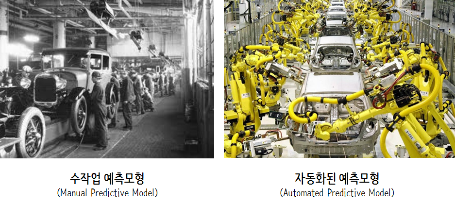

```{r setup, include = FALSE}
options(htmltools.dir.version = FALSE)

knitr::opts_chunk$set(echo = FALSE, warning=FALSE, message=FALSE,
                    comment="", digits = 3, tidy = FALSE, prompt = FALSE, fig.align = 'center')

```

## 강의 개요

- 실생활 속 데이터 과학 (AI/ML)
- 왜 AI/ML은 어려운가?
- Big Data/AI/ML/Data Science
- 데이터 경제와 산업
- 소중한 자원 규제법령 데이터

# 실생활 속 데이터 과학 (AI/ML)

## 러시아 월드컵 감동을 디지털로...


[러시아 월드컵(2018) - 한국 vs 독일](https://statkclee.github.io/viz/viz-worldcup-germany.html)

## 지진해일 대피소가 없다고?


[xwMOOC (2018-01-17), "지진해일 대피소 - `crosstalk`"](https://statkclee.github.io/viz/viz-earthquake-shelter.html)

## 자 이제 됐고! 


[국회의원 사진 - `trelliscope`](https://statkclee.github.io/viz/viz-congressman.html)

## 대통령의 마음... 슬픔은 어디에?


[xwMOOC 딥러닝 - 동영상 감정 분석](https://statkclee.github.io/deep-learning/ms-oxford-video.html)

[KBS NEWS, 인공지능으로 분석한 대통령의 마음…슬픔은 어디에?](http://news.kbs.co.kr/news/view.do?ncd=3390429&ref=D)

## MLB 투수 유전자는 유전이 될까?


[회귀분석 - MLB 투수 유전자는 유전이 될까?](https://statkclee.github.io/politics/pe-baseball-era.html)

## 출산장려 예산은 출산율을 높일까?


[저출산과 소요예산 - 상관관계](https://statkclee.github.io/viz/viz-low-birth-rate.html)

## 증가된 정부예산: 누가 세금을 많이 냈나?


[국세 세금 데이터 분석](https://statkclee.github.io/election/election_tax_EDA.html)

# 왜 AI/ML은 어려운가?


## 누구나 꿈은 있다.


## 누구나 이런 소박한 꿈을 가지고 시작한다.


## 현실은 아마도 ...


## 더 성공한 존경받는 AI/ML 프로젝트/기업(?)


## 빗나간 AI/ML 성공(?) 프로젝트 모움

```{r tidyverse-list-filenames, eval = TRUE}
library(tidyverse)
library(slickR)

filenames <- list.files("fig/")

gif_filenames <- filenames[str_detect(filenames, "06.*\\.gif")]

gif_df <- tibble(page = glue::glue("fig/{gif_filenames}") )
  
slickR(gif_df$page, height = 600)
```

## 그럼에도 불구하고 꿈꾸는 AI/ML 미래


# Big Data/AI/ML/Data Science

## Google Trends: 미국


## Google Trends: 대한민국


# 데이터 경제와 산업

## 데이터 자원


## 파이프라인


## 가치 {#data-value}

<small>
<ul>
  <li>기술 분석(Descriptive Analytics): 무슨 일이 있었나? (What happened?)</li>
  <li>진단 분석(Diagnostic Analytics): 왜 일어났나? (Why did it happen?)</li>
  <li>예측 분석(Predictive Analytics): 무슨 일이 일어날까? (What will happen?)</li>
  <li>처방 분석(Prescriptive Analytics): 어떻게 그런 일을 일으킬까? (How can we make it happen?)</li>
</ul>
</small>

{#id .class width="67%"}

## 비용 {#data-science-cost}

{#id .class width="77%"}

## 자동화 

{#id .class width="77%"}


# 소중한 자원 규제법령 데이터

## 아날로그 &rarr; 디지털화(Digitization)

{#id .class width="77%"}

출처: [공정거래법 전면개편안: Digitization](https://statkclee.github.io/text/text-fair-law.html)

## 텍스트 추출

{#id .class width="77%"}

출처: [최고의 OCR 엔진: 구글, 네이버, Azure, tesseract](https://statkclee.github.io/text/text-fair-law-ocr.html)

## 문서 분류

{#id .class width="77%"}

출처: [parsnip + tidytext + textrecipes](https://statkclee.github.io/model/tidyverse-parsnip-textrecipes.html)
