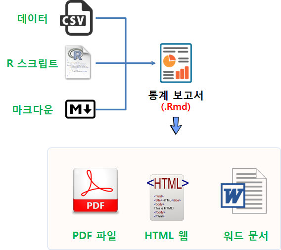
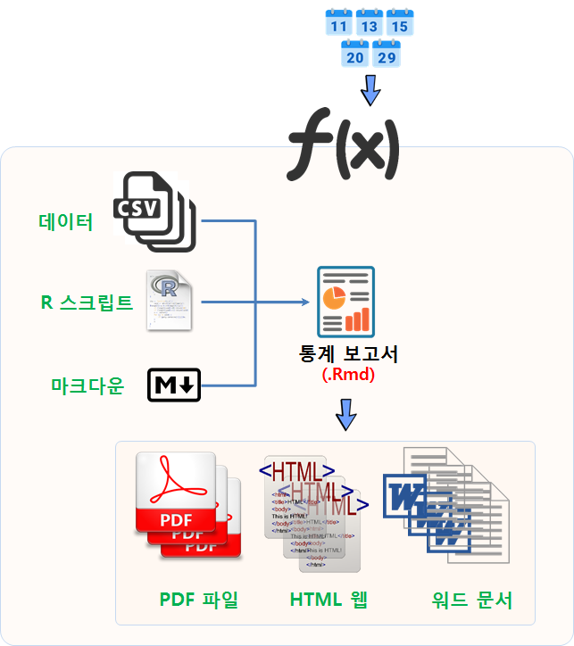
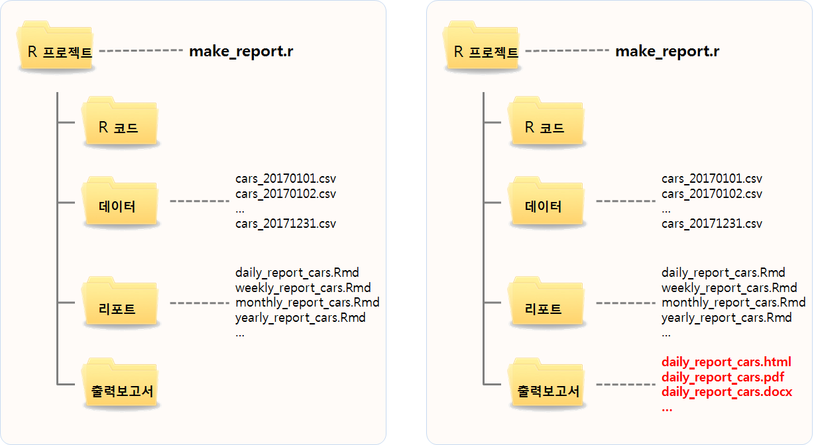
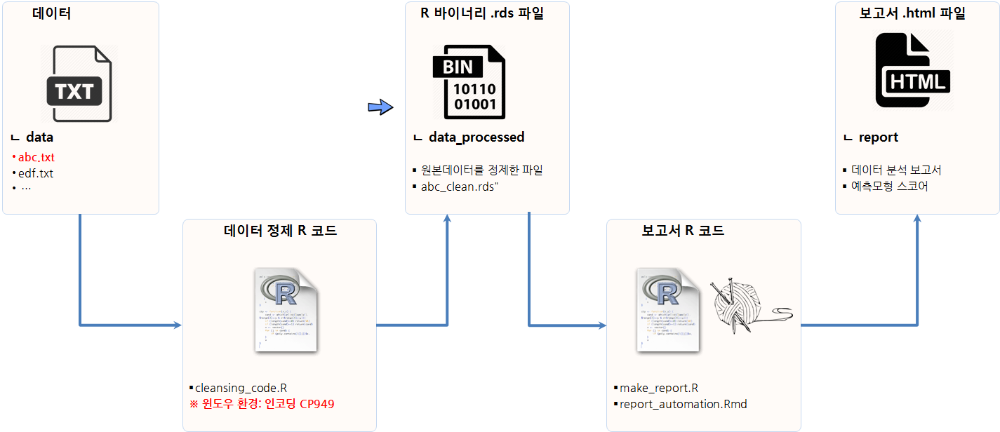

```{r, include=FALSE}
source("tools/chunk-options.R") 
```

## 1. 일반적인 보고서 작성 작업흐름

일반적인 보고서 작성을 위한 작업흐름과 필요한 요소는 다음과 같다.
데이터 기반 보고서를 작성할 때 데이터와 데이터를 처리하는데 필요한 R/SAS/SPSS/파이썬 스크립트, 마크다운으로 작성한 문서가 포함된다.
즉, 데이터를 데이터베이스, 웹, 파일형태로 가져오면 R 스크립트를 통해 전처리를 하고 필요한 통계량을 뽑아내고
시각적으로 히스토그램, 막대그래프, 원그래프, 시계열 추세 선 그래프 등이 포함된다. 
그리고, 데이터에서 나온 다양한 통계량 및 시각적 산출물에 대한 견해와 함께 최종 보고서 작성자의 의견을 덧붙여 마무리하고 
보고서 작성자, 참고문헌, 목차, 각주 등을 붙여 보고서를 완성한다.

GUI가 아닌 CLI 방식으로 데이터를 분석한 후에 이를 `.R` 파일로 저장하고 나서 이를 `.Rmd` 파일(코드와 문서)로 함께 작성한 뒤에 
이를 기계에 던져 원하는 형태의 문서 `.pdf`, `.html`, `.docx` 파일을 뽑아내서 웹, PC 배포문서, 저작 가능한 문서 형태로 배포한다. 




## 2. 일별보고서를 넘어 다수 보고서 자동 생성

하루일과는 아침에 일어나서 밥을 먹고, 학교나 회사에 출근하고, 점심먹고, 오후에 놀거나 추가 작업을 하고, 퇴근을 하고 저녁을 먹고, 쉬고 잠을 자는 과정이 일반적인 일상이다.
이런 과정이 매일 매일 반복된다. 마찬가지로 보고서도 이런 일상적인 과정을 담아내야 한다.
즉, 일별로 생성되는 데이터를 동일한 형태의 보고서로 작성하게 된다.
이를 위해 상기 "일반적인 보고서 작성 흐름"을 복사해서 붙여넣기 신공을 발휘하기 보다는 데이터를 바꿔넣고 해당 데이터를 매개변수(parameter)로 던져서 일별 보고서를 자동화시킨다.

따라서, 일자 정보를 `.Rmd` 파일에 전달하는 과정을 거치는 것이 필요하고, 통계보고서를 자동생성시키는 과정을 별도 스크립트로 만들어서 실행시킨다.




## 3. 보고서 생성 자동화 (R)

보고서 생성 자동화 프로세스를 구현하는 방법은 다양하다. 
RStudio 통합개발도구를 바탕으로 운영체제 쉘로 내려가지 않고 R 스크립트 내에서 작업하는 업무 구현사례는 다음과 같다.

즉, 다양한 보고서 템프릿을 생성시켜놓는다. 일별, 주별, 월별, 년도별 보고서를 템플릿형태로 작성하고 나서 내용을 채워 넣는다.

보고서 내용보다 변하는 것이 데이터가 된다. 2017-01-01 데이터부터 일별로 데이터가 쭉 생성된다. 이를 일자별로, 주별, 월별, 연도별로 인식한 후 
이에 대한 적절한 데이터 분석결과를 담아내는 분석 R 스크립트를 활용한다.

데이터, 보고서 콘텐츠, 데이터분석 스크립트가 모두 준비되면 이를 리포트보고서(.Rmd)가 담고 있어야 한다.
마지막으로 `make_report.r`을 실행하여 보고서를 자동생성 시킨다.



### 3.1. 보고서 Make 파일 

일자별로 보고서를 생성시키기 위해서 보고서에 일자를 `.Rmd` 파일에 넘겨야 한다.
우선 일자 정보를 보고서에 전달할 수 있는 형태로 만들기 위해서 다음과정을 거친다.

- 리포트 생성일자를 자동 생성
- 월, 일을 뽑아내고 0을 덧붙여 일자를 두자리로 생성
- 해당 리포트는 `daily_cars_report.Rmd` 파일에 `params` 리스트로 월(`dmonth`)과 일(`dday`)을 넘김.
- 출력결과는 `html_document` 형식으로 지정
- 한국어가 깨지는 문제가 있어 인코딩은 `UTF-8`으로 필히 지정
- 1월1일부터 5월18일까지 일별로 돌리게 되면 오류가 생겨는 경우 이를 무시하고 계속 보고서 생성시키도록 `try`, `silent=TRUE`를 지정하여 넘김.


``` {r report-make, eval=FALSE}
library(stringr)
library(lubridate)

reporting_date <- seq(as.Date("2017-01-01"), as.Date("2017-05-18"), by = "day")


for(i in reporting_date) {
    ## 날짜뽑아내기
    xmonth <- month(as.Date(i, origin="1970-01-01"))
    xday <- day(as.Date(i, origin="1970-01-01"))
    dmonth <- stringr::str_pad(xmonth, 2, pad="0")
    dday <- stringr::str_pad(xday, 2, pad="0")
    ## 보고서 생성
    try(
        rmarkdown::render('./report/daily_cars_report.Rmd',
                      params = list(
                          dmonth = dmonth,
                          dday   = dday),
                      output_format="html_document",
                      output_file =paste0 ("daily_cars_2017", dmonth, dday, ".html"),
                      encoding = 'UTF-8'
        ),
    silent = TRUE)
}
```

### 3.2. 매개변수를 넘겨받는 보고서 Rmarkdown 파일


`make_report.r` 파일에서 정의된 매개변수(parameter)를 받는 `.Rmd` 파일은 다음과 같은 모양이 된다.
즉, YAML 헤더에 params에 `dmonth`, `dday`를 정의하고 이를 `params$dmonth, params$dday`로 문서의 변수로 적용한다.
이를 통해 일자별로 생성되는 데이터를 자동으로 분석하여 보고서를 자동생성시키게 된다.


``` {r report-make-rmarkdown, eval=FALSE}
---
title: 보고서 예제
date: '`r strftime(Sys.time(), format = "%B %d, %Y")`'
output:
  html_document:
    toc: yes
    toc_depth: 2
params:
    dmonth:
        value: x
    dday:
        value: x
---

#```{r, include = F}
knitr::opts_chunk$set(echo = FALSE, warning = FALSE, message = FALSE)
library(tidyverse)

options(scipen = 999, stringsAsFactors = FALSE)
#```

### 3.3. 보고서 시작합니다.

#```{r, sample-report}
print(paste(params$directory, params$file, sep = '/'))
getwd()
dataset <- read.csv(paste0("../data/cars_2017", params$dmonth, params$dday, ".rds"))
glimpse(dataset)
#```
```

## 4. 예측모형 보고서

R 스크립트로 데이터 분석과정을 프로그래밍하게 되면, 이를 다양한 R 팩키지와 조합하여 
예측모형을 담은 보고서도 손쉽게 작성할 수 있다.




- 데이터
    - 원본작업데이터: 로그파일, 엑셀파일, RDBMS 등
    - R 바이너리 파일: 아스키 형태 데이터(.csv 등)로 저장할 경우 메타 정보가 증발하여 R 작업흐름에 태워서 사용할 경우 `.rds`와 같은 R 바이너리 파일이 유용하다.
    - 보고서 HTML 파일: 최종 산출물 보고서
- R 스크립트
    - 원본 데이터를 정제하는 R 스크립트
    - 보고서 혹은 예측모형을 산출하는 R 스크립트


### 4.1. 원본데이터 정제

윈도우 터미널을 열고 `RScript` 명령어를 실행한다.

- R 정제 파일: `cleansing_code.R`
- 데이터 디렉토리: `../data`
- 채팅 로그 파일: `abc.txt`
- 처리결과 저장 디렉토리: `../data_processed`
- 처리결과 파일명: `abc_clean.rds`

``` {r datalog-clean, eval=FALSE}
C:\xwMOOC_project\code> RScript cleansing_code.R "../data" "abc.txt" "../data_processed"

[1] "../data_processed\\abc_clean.rds"
```

### 4.2. 보고서 생성

정제된 데이터(`.rds`)를 통계분석하여 예측모형이 포함된 보고서를 생성한다.

- R make 파일: `make_report.R`
- 보고서 Rmd 파일: `report_automation.Rmd` 은 `make_report.R` 파일 내 지정됨
- 정제된 데이터 디렉토리: `data_processed`
- 정제된 데이터 파일: `abc_clean.rds`

``` {r datalog-report, eval=FALSE}

C:\xwMOOC_project\report>RScript make_report.R "data_processed" "abc_clean.rds"

processing file: report_automation.Rmd
output file: report_automation.knit.md

Output created: report_abc_clean_file.html
```