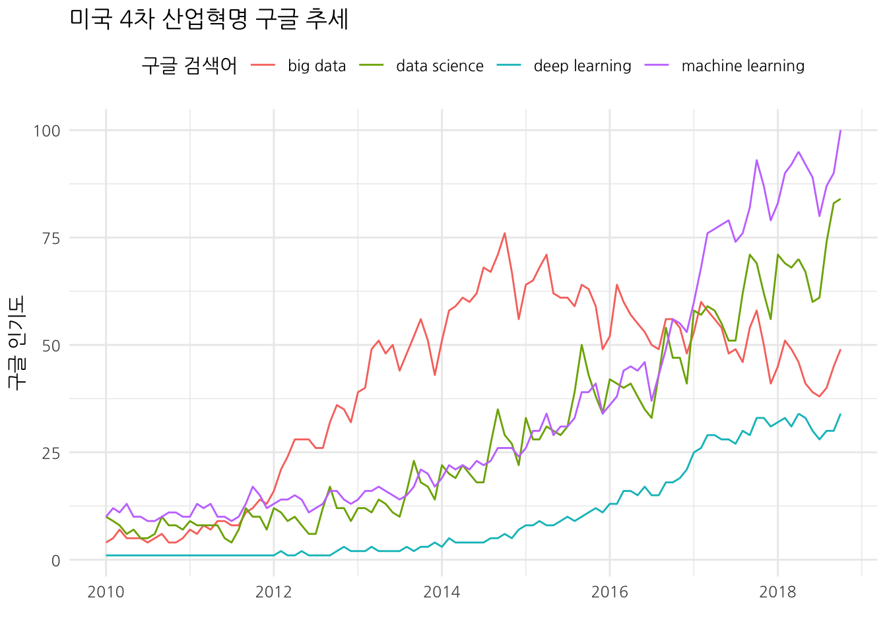
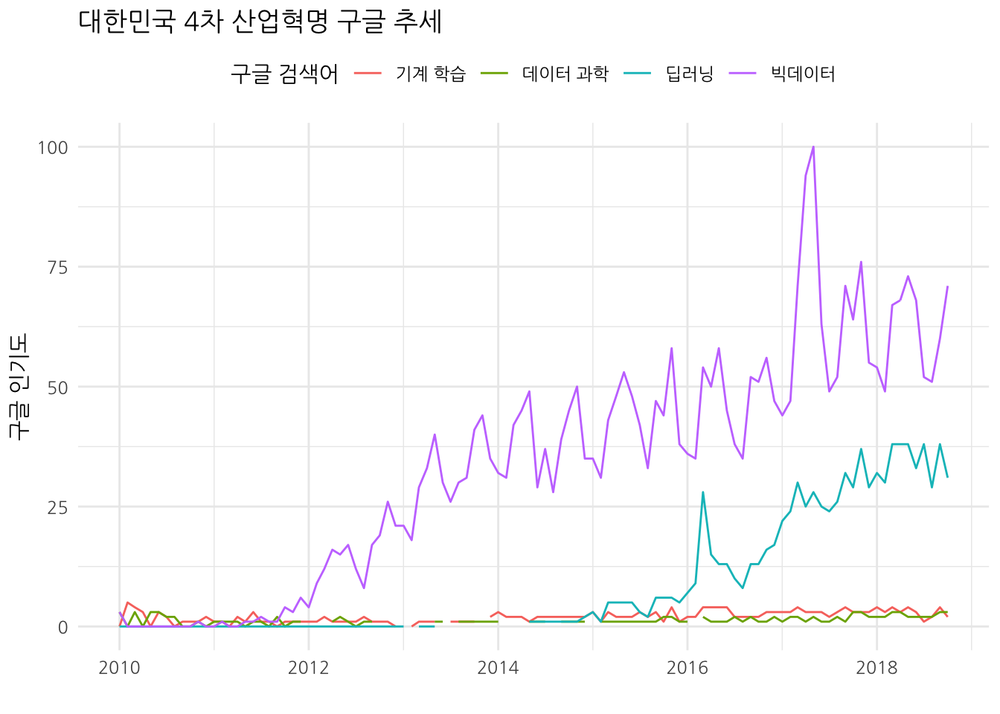
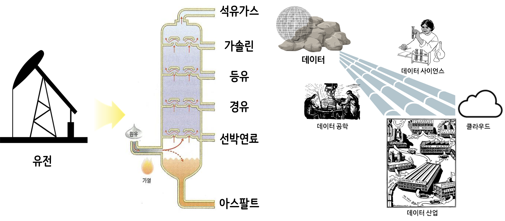

```{r setup, include = FALSE}
options(htmltools.dir.version = FALSE)

knitr::opts_chunk$set(echo = FALSE, warning=FALSE, message=FALSE,
                    comment="", digits = 3, tidy = FALSE, prompt = FALSE, fig.align = 'center')

```

## 강의 개요

- Big Data/AI/ML/Data Science
- 데이터 경제와 산업
- Data Engineering/Science/ML
- AI 비즈니스 (KPMG)

# Big Data/AI/ML/Data Science

## Google Trends: 미국



## Google Trends: 대한민국




# 데이터 경제와 산업

## 데이터 자원


## 파이프라인



## 가치 {#data-value}

<small>
<ul>
  <li>기술 분석(Descriptive Analytics): 무슨 일이 있었나? (What happened?)</li>
  <li>진단 분석(Diagnostic Analytics): 왜 일어났나? (Why did it happen?)</li>
  <li>예측 분석(Predictive Analytics): 무슨 일이 일어날까? (What will happen?)</li>
  <li>처방 분석(Prescriptive Analytics): 어떻게 그런 일을 일으킬까? (How can we make it happen?)</li>
</ul>
</small>

{#id .class width="67%"}

## 비용 {#data-science-cost}

{#id .class width="77%"}

## 자동화 

{#id .class width="77%"}

# Data Engineering/Science/ML

## (비)정형 데이터와 함수

```{r y-fx}
library(tidyverse)
library(slickR)

file_path <- c("fig/intree-xy.png", "fig/intree-xy-x.png", "fig/intree-xy-y.png", "fig/intree-xy-f.png")

y_fx_df <- tibble(img_path = file_path)

slickR(y_fx_df$img_path, height = 350) 
```


# AI 비즈니스 (KPMG)

## 텍스트/문서


