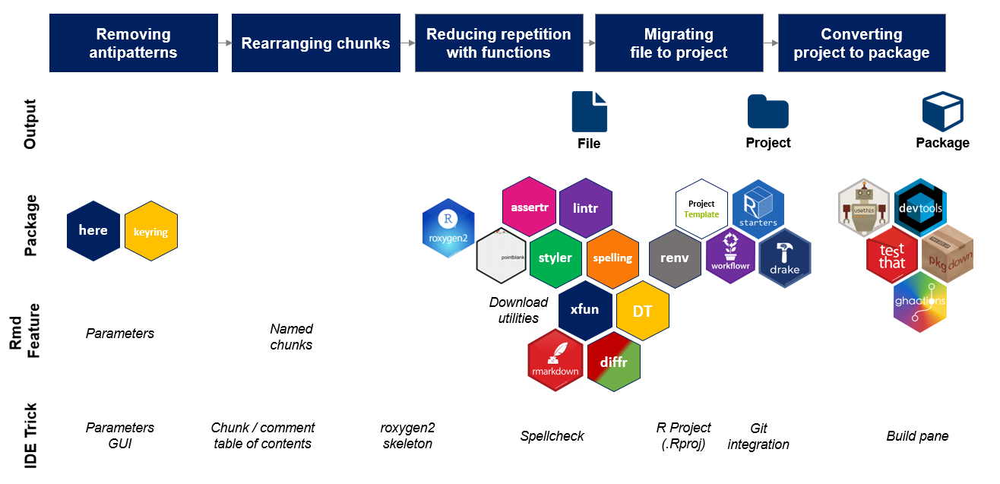

```{r setup, include=FALSE}
knitr::opts_chunk$set(echo = TRUE, message=FALSE, warning=FALSE,
                      comment="", digits = 3, tidy = FALSE, prompt = FALSE, fig.align = 'center')

```

# Rmarkdown Driven Development, RDD [^RDD] [^time-series] {#RDD}

[^RDD]: [Slideshare, "RMarkdown Driven Development (rstudio::conf 2020)"](https://www.slideshare.net/EmilyRiederer/rmarkdown-driven-development-rstudioconf-2020)

[^time-series]: [Rob Hyndman, "How Rmarkdown changed my life"](https://robjhyndman.com/seminars/rmarkdown/)

R마크다운 주도 개발(Rmarkdown Driven Development, RDD)은 RStudio R Conference 2020에서 Emily Riederer가 ["RMarkdown Driven Development: the Technical Appendix"](https://emilyriederer.netlify.com/post/rmddd-tech-appendix/) 제목으로 발표한 것에 영향을 받아 관련 내용을 대폭 변경하게 되었다. 우선 Emily Riederer의 발표는 R마크다운에 대한 이해와 깊이를 심화시켰다.



반면에, RStudio R Conference에서 Yihui Xie, "One R Markdown Document, Fourteen Demos", [Rob Hyndman, "How Rmarkdown changed my life"](https://github.com/robjhyndman/Rmarkdown2020)의 발표는 문서에 대한 다양한 응용분야에 대한 폭을 넗혔다.

- Yihui Xie 
    - bookdown for authoring books : https://bookdown.org
    - blogdown for creating websites : https://github.com/rstudio/blogdown
    - rticles for writing journal papers : https://github.com/rstudio/rticles
    - xaringan for making slides : https://github.com/yihui/xaringan
    - flexdashboard for generating dashboards : https://github.com/rstudio/flexdashboard
    - learnr for tutorials : https://github.com/rstudio/learnr
    - rolldown for storytelling : https://github.com/yihui/rolldown
    - integration between Shiny and R Markdown
- Rob Hyndman
    - 개인 웹사이트: https://robjhyndman.com/
    - 책: https://otexts.com/fpp3/
    - 이력서: https://github.com/robjhyndman/CV/raw/master/RobHyndmanCV.pdf
    - 논문: https://github.com/robjhyndman/MonashThesis
    - 메모(`MonashEBSTemplates::memo`): https://github.com/robjhyndman/MonashEBSTemplates
    - 편지(`MonashEBSTemplates::letter`): https://github.com/robjhyndman/MonashEBSTemplates
    - 시험(`MonashEBSTemplates::exam`): https://github.com/robjhyndman/MonashEBSTemplates

R마크다운에 대한 깊이와 다양한 응용분야를 조합할 경우 이것이 갖는 함의는 상상을 초월한다.

# 블로그 {#rmarkdown-blog}

데이터 과학 블로그 만들기 까다롭지 않습니까? 이제 Hugo + blogdown + netlify 조합으로 5분만에 나만의 데이터 과학 블로그를 제작해 보세요. 놀랍도록 간단하고, 강력하고, 재현가능하고, GitHub + Netlify를 CI/CD 연결시키면 정말 편리합니다.
s
참고로 `WordPress`, `Tumblr`, `Medium.com`, `Blogger.com`은 R 마크다운 지원이 전무하고, 수학 수식도 없거나 지원도 그다지 만족스럽지 않다.

- ["데이터 과학자의 클라우드 블로그", AWSKRUG - AWS한국사용자모임 (2019년 9월 5일)](https://statkclee.github.io/ds-authoring/ds-blog-aws-cloud.html)
- [데이터 과학을 위한 저작도구: Computational Documents "블로그 - `blogdown`"](https://statkclee.github.io/comp_document/ds-blogdown.html)
- [데이터 과학 블로그](http://xwmooc.netlify.com/)
    - [데이터 과학 블로그 배포](http://xwmooc.netlify.com/2017/09/15/%EB%8D%B0%EC%9D%B4%ED%84%B0-%EA%B3%BC%ED%95%99-%EB%B8%94%EB%A1%9C%EA%B7%B8-%EB%B0%B0%ED%8F%AC/)
    
# 슬라이쇼(slideshow) {#rmarkdown-slideshow}

파워포인트로 잘 알려진 발표자료를 R마크다운으로 구현한 다양한 사례는 [데이터 과학 기고문과 발표자료](https://statkclee.github.io/ds-authoring/)에서 확인할 수 있다.

- [Tidyverse Korea, "문서를 이해하는 AI" 데이터 과학 미트업 시즌2 (2019-09-18, 스파크 플러스 역삼점)](https://statkclee.github.io/ds-authoring/ds-document-ai.html)
- [Tidyverse Korea, "시빌워에서 아름다운 동행 R과 파이썬", 2019-06-22, 서울창업허브 10층 컨퍼런스룸](https://statkclee.github.io/ds-authoring/ds-dataroom.html)
- [데이터 사이언스 언어 - `R`, 산업은행, 2019년 5월 17일(금)](https://statkclee.github.io/ds-authoring/ds-db-20190517.html)
- [기계의 역습: 설명가능한 기계학습, 클라우데라 서울 컨퍼런스, 2018년 11월 8일, 인터컨티넨탈 서울 코엑스](https://statkclee.github.io/ds-authoring/ds_explainable_machine_learning_2018.html)
- [“데이터 과학자의 시각화” 데이터야 놀자 2018, 2018-10-19/20 (금/토), 마이크로소프트 광화문 오피스](https://statkclee.github.io/ds-authoring/ds_data_scientist_visualization.html)
- [Tidyverse와 기계학습(2018-10-07), 데이터뽀개기 2018: Hello Kaggler!, 마이크로소프트 광화문 오피스](https://statkclee.github.io/ds-authoring/machine_learning_tidyverse_20181007.html)

# 책 {#rmarkdown-book}


    