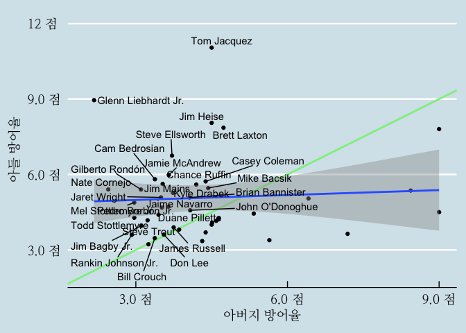

---
name: case-study-data
class: inverse, middle

# Outline

----

.pull-left[

현재 각광받고 있는 .warmyellow[**데이터 과학**]에 대한 전반적인 이해와 더불어 핵심적인 개념을 짧은 시간에 다루게 됩니다.

데이터 과학의 실제 .black[**다양한 사례**]를 정형데이터와 비정형 데이터(문서)를 살펴봅니다.

.green[**디지털 경제**]의 주요한 동인인 .green[**자동화**]와 경제적인 면에 초점을 두어 .green[**기계학습**]에 대해 설펴봅니다.

] <!--end of left-column-->

.pull-right[
.left[
1\. [데이터 과학](#data-science)

2\. **[.warmyellow[사례 분석 : 데이터]](#case-study-data)**

3\. [사례분석 : 문서](#case-study-document)

4\. [자동화(Automation)](#automation)

5\. [기계학습(Machine Learning)](#machine-learning)

6\. [디지털 경제 (Digital Economy)](#digital-economy)

7\. [마무리](#goodbye)
]
] <!--end of right-column-->

---
name: case-study-worldcup
## 러시아 월드컵 (독일전)

.center[

]

.footnote[
[러시아 월드컵(2018) - 한국 vs 독일](https://statkclee.github.io/viz/viz-worldcup-germany.html)
]

---
name: case-study-earthquake
## 지진해일 대피소

.center[

]

.footnote[
[xwMOOC (2018-01-17), "지진해일 대피소 - `crosstalk`"](https://statkclee.github.io/viz/viz-earthquake-shelter.html)
]

---
name: case-study-congress
## 국회의원 프로필

.center[

]

.footnote[
[국회의원 사진 - `trelliscope`](https://statkclee.github.io/viz/viz-congressman.html)
]

---
name: case-study-avi
## 동영상 감성 분석

.center[

]

.footnote[
- [xwMOOC 딥러닝 - 동영상 감정 분석](https://statkclee.github.io/deep-learning/ms-oxford-video.html)
- [KBS NEWS, 인공지능으로 분석한 대통령의 마음…슬픔은 어디에?](http://news.kbs.co.kr/news/view.do?ncd=3390429&ref=D)
]

---
name: case-study-regression
## 회귀분석 - MLB 투수 유전자는 유전이 될까?

.center[

]

.footnote[
[회귀분석 - MLB 투수 유전자는 유전이 될까?](https://statkclee.github.io/politics/pe-baseball-era.html)
]

---
name: case-study-birthrate
## 출산장려 예산은 출산율을 높일까?

.center[

]

.footnote[
[저출산과 소요예산 - 상관관계](https://statkclee.github.io/viz/viz-low-birth-rate.html)
]

---
name: case-study-tax
## 증가된 정부예산: 누가 세금을 많이 냈나?

.center[

]

.footnote[
[국세 세금 데이터 분석](https://statkclee.github.io/election/election_tax_EDA.html)
]

