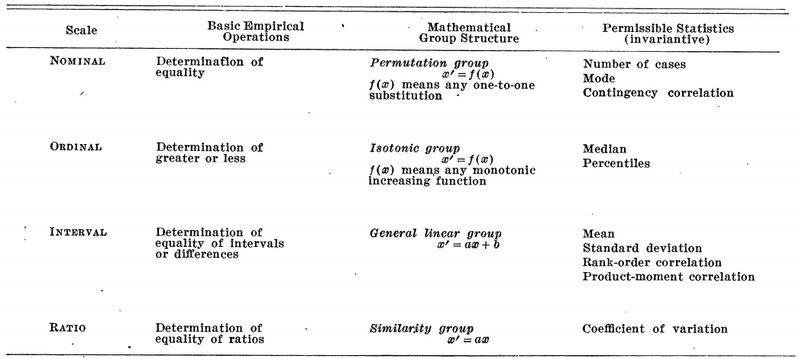
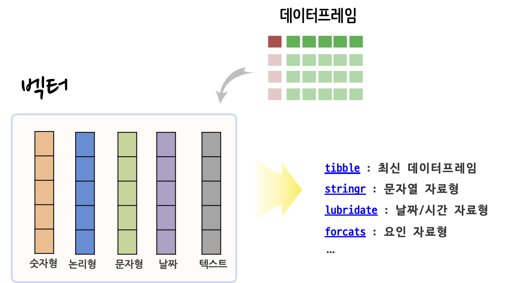

```{r setup, echo = FALSE, cache = FALSE, results = 'hide'}
library(knitr)
options(
  htmltools.dir.version = FALSE, tibble.width = 60, tibble.print_min = 6,
  crayon.enabled = TRUE
)
opts_chunk$set(
  echo = FALSE, warning = FALSE, message = FALSE, comment = "#>",
  fig.path = 'figure/', fig.align = 'center', fig.height = 8.5,
  out.width = '100%', fig.show = 'hold', fig.retina = 3,
  cache = TRUE, cache.path = 'cache/'
)

library(tidyverse)
```

## .left[`r emo::ji("hammer_and_wrench")` &nbsp; &nbsp; 발표 목차]

<br>
.alert[
  .large[
- &nbsp; `xaringan` 기본기
- &nbsp; `xaringan` 확장
- &nbsp; 한국에서 발표
- &nbsp; AI시대 `xaringan`
  ]
]


---
class: inverse middle center

.pull-left[
.animate__animated.animate__bounceInDown[

]
]
.pull-right[
<br>
<br>
# `xaringan` 기본기 `r emo::ji("zoom")`
<hr>
### 자료구조
### 요인(Factor)
### forcats
]

```{r xaringan-logo, echo=FALSE}
# 로고 ----
xaringanExtra::use_logo(image_url = "fig/Tidyverse_Korea_logo_transparent.png",
                        link_url = "https://tidyverse-korea.github.io/seoul-R/",
                        position = xaringanExtra::css_position(top = "0.5em", right = "0.5em"))
```

---
class: middle

.left-column[
.center[]
### - 자료구조
]

.right-column[
### Stevens, Stanley Smith. “On the theory of scales of measurement.” (1946)

.center[

]

.footnote[reference: https://statkclee.github.io/data-science/ds-data-structure.html]

]

---
class: middle

.left-column[
.center[]
### - 자료구조
]

.right-column[
### R 자료구조

.center[

]

.footnote[reference: https://statkclee.github.io/data-science/ds-data-structure.html]

]


---
class: middle

.left-column[
.center[]
### - 자료구조
### - Factor
]

.right-column[
### 요인(Factor)

```{r r-factor-code, echo=TRUE}
library(tidyverse)
x1 <- c("Dec", "Apr", "Jan", "Mar")
sort(x1)

month_levels <- c(
  "Jan", "Feb", "Mar", "Apr", "May", "Jun", 
  "Jul", "Aug", "Sep", "Oct", "Nov", "Dec")

y1 <- factor(x1, levels = month_levels)
y1
```

.footnote[reference: https://statkclee.github.io/data-science/ds-factor-cdata.html]

]


---
class: middle

.left-column[
.center[]
### - 자료구조
### - Factor
### - forcats
]

.right-column[
### `forcats`

- 요인 수준(factor level)에 대한 라벨(label) 바꿈 &rarr; `forcats::fct_recode`, `dplyr::recode`
- 요인 수준 순서 바꾸기 &rarr; `fct_relevel()`
- 요인 범주수준을 줄이기 &rarr; `if_else()`
- 파생 요인 변수 생성시킴 &rarr; `case_when()`

.footnote[reference: https://statkclee.github.io/data-science/ds-factor-cdata.html]

]


---
class: center middle inverse

# 감사합니다.

--

# 질문?

--

# 끝

---
class: center middle inverse

.animate__animated.animate__hinge[

# 감사합니다.
# 질문?
# 끝
]


