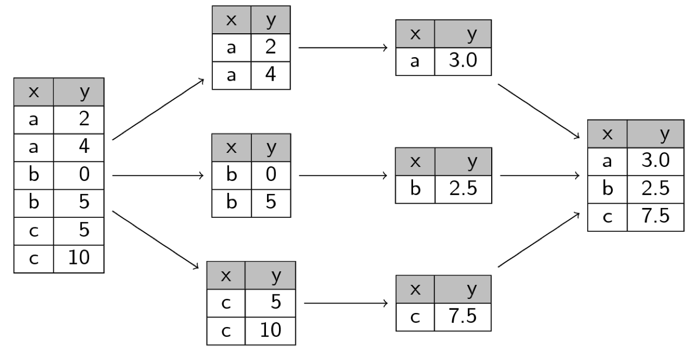

```{r setup, include=FALSE}
options(htmltools.dir.version = FALSE)

knitr::opts_chunk$set(echo = FALSE, warning=FALSE, message=FALSE,
                    comment="", digits = 3, tidy = FALSE, prompt = FALSE, fig.align = 'center')

```

이세돌 9단이 2016년 4월 딥마인드에서 제작한 알파고에 의해 패배를 하면서 한국사회는 인공지능(AI)에 폭발적인 관심을 가지게 되었고 통계학도 예외는 아니다. 알파고가 차용한 기술은 딥러닝 기술이고 딥러닝(Deep Learning, DL) 기술은 기계학습(Machine Learning, ML)을 구성하는 일부이며, 기계학습도 인공지능의 일부다. 기계학습도 회귀모형과 수학적인 공통기반을 갖고 있다는 점에서 통계학과 깊은 관련을 맺고 있다. 
따라서, ML/DL 예측모형도 데이터 사이언스의 탄탄한 이론적인 토대없이는 지속적인 발전에 한계가 있다.

최근 인기를 얻고 있는 기계학습(Machine Learning)이나 인공지능(AI)과는 별개로 몇년 전부터 
RStudio의 해들리 위컴(Hadley Wickham) 박사는 `tidyverse`을 통해 데이터 사이언스를 새롭게 정의하는 시도를 하였고 많은 이론 통계학자와 실무자로부터 호응을 얻고 있었다. 이러한 기여를 인정받아 얼마전 통계학의 노벨상이라고 불리는 COPSS 상을 해들리 위컴이 수상하면서 순수 이론 중심의 통계학도 데이터 사이언스를 적극 포용하는 시작을 공식적으로 알리는 계기가 되었다.  

{#id .class width=50% height=50%}
<!--  -->

# 패러다임의 변화 [^tidyverse-menifesto] {#data-science-paradigm}

[^tidyverse-menifesto]: [Hadley Wickham (2017-11-13), "The tidy tools manifesto"](https://cran.r-project.org/web/packages/tidyverse/vignettes/manifesto.html)

정보를 잃지 않고 압축하거나 최대한 많은 정보를 추출하고자 하는 노력으로 통계학 이론들이 많이 활용되었지만, 최근에는 기계학습/딥러닝을 통해 다양한 통계 모형도 이론적인 면 뿐만 아니라 실무에서도 많이 사용되고 있다.
이런 점에서 만개가 넘는 R 팩키지가 개발되어 활용된다는 점은 긍정적지만, 각자의 설계원칙에 맞춰 제각기 개발되고, 손을 바꿔 여러 다른 사람들이 유지보수 하게 되면서 초기 세워진 설계원칙과 철학이 많이 무너진 점이 지속가능한 데이터 사이언스 발전을 가로막고 있는 커다란 장애물로 떠올랐고, 이를 인지한 데이터 과학자는 다수 존재하지만, 이를 체계적으로 실제로 활용할 수 있도록 아마도 가장 크게 기여하신 분을 꼽으라면 다들 "해들리 위컴"(Hadley Wickham)을 꼽는데 주저하지 않을 것이다. 

`tidyverse`는 수많은 기여자들의 도움을 받아 해들리 위캠이 오랜동안 나름대로의 방식으로 체계화시킨 것을 확대 발전 시킨 것으로 데이터 사이언스를 체계적으로 집대성하였다는 평가를 받고 있다. 특히, 데이터 과학자 및 실무자에게 큰 도움을 주었는데, 어떻게 보면 기존 SAS/SPSS/미니탭과 같은 상용 팩키지 중심에서 R을 중심으로 한 오픈소스 소프트웨어로 흐름이 바꾸었다고 볼 수 있다.
데이터를 다루려면 컴퓨터가 필요하고 컴퓨터와 대화하기 위해서는 언어가 필요한데, 다행히 통계학에서는 R 언어가 1990년대 초반 개발되자마자 오픈소스로 공개 되어 자연스럽게 통계학 전공자들이 오픈소스 소프트웨어에 친숙하게 되는 계기가 되었다.

마이크로소프트 창업자 빌 게이츠가 소프트웨어 상업화 모델로 큰 성공을 거두면서 기존 IBM이 만들어 놓았던 생태계가 크게 변화했지만, 
지나친 소프트웨어 상업화에 대한 반발로 리차드 스톨만이 씨를 뿌리고 리누스 토발즈가 튼튼한 뿌리를 내린 리눅스 운영체제, 인터넷의 보급으로 오픈소스 소프트웨어(Open Source Software)에 대한 확산, 개방과 공유를 가치로 하는 개발자 특유의 문화를 기반으로 이제 대세는 오픈소스 소프트웨어가 되었다.
이러한 소프트웨어에 대한 인식의 전환은 [GNU 선언문](https://www.gnu.org/gnu/manifesto.html)에 잘 표현되어 있다.

데이터를 많이 다루는 통계학도 소프트웨어 패러다임의 변화에 맞춰 진화해 왔다. SAS/SPSS/미니탭으로 대표되는 통계 팩키지와 더불어 가우스/매트랩/매스매티카를 위시한 고급 상용 소프트웨어가 한 시대를 풍미했다면, 이제는 R과 파이썬으로 대표되는 오픈소스 소프트웨어가 
그 빈자리를 급격히 채워나가고 있다. 이러한 변화를 직감했던지 해들리 위컴은 2017년 11월 13일 
Tidyverse 선언문(Tidy Tools Manifesto)을 직접 작성하여 웹사이트에 공개하였다.  

데이터 사이언스 언어 R을 사용해서 산적한 과제를 해결해 나가면서 쌓인 여러
지적 자산을 팩키지로 개발하여 공개하였고, 이를 통칭하여 과거 `Hadleyverse`로 불렀다. 이유는 `dplyr`, `ggplot2` 팩키지를 해들리 위컴이 제작했고, 데이터 사이언스 문제를 풀려고 하면 해들리 위컴이 제작한 팩키지를 조합해서 접근해야 수월히 풀 수 있었기 때문이다.
하지만, 오픈소스 소프트웨어 개발은 한 사람의 노력으로만 가능한 것이 아니고, 전세계 수많은 개발자와 
사용자의 노력으로 이뤄낸 성과이기에 이를 `tidyverse`로 명칭으로 통일하면서 데이터 사이언스 운영체제와 같은 역할과 위상을 가지게 되었다.

# 깔끔한 데이터 사이언스 세상 {#data-science-process-tidyverse}

해드리 위컴이 주장한 `tidyverse`(타이디버스, 깔끔한 세상)를 이해하기 위해서 필히 **유닉스 철학(Unix Philosophy)**에 대한 기본 지식이 필요하다. 세상 유일한 운영체제는 누구나 유닉스(UNIX)를 꼽고 있다. 사실 유닉스를 포크(fork) 떠서 만든 것이 마이크로소프트의 윈도우즈 운영체제다. 따라서, 사용방식에는 다소 차이가 있을 수 있지만, 그 이면의 운영체제 설계와 구성에 있어서 크게 다름은 없다.
초기 유닉스 운영체제 개발자들은 모듈 방식과 재사용성의 개념을 적극 도입하였고, 
이를 소프트웨어 개발에 대한 문화적 규범이자 철학적 접근을 통칭하여 유닉스 철학이라고 부르게 되었다.

엉망진창인 R 도구상자(`messyverse`)와 비교를 하기도 하지만, 
`tidyverse`는 팩키지라기 보다는 유닉스 철학처럼 데이터 사이언스에 있어 하나의 철학적 지침으로 접근하는 것이 일반적이다. 깔끔한 R 도구상자(`tidyverse`)는 깔끔한(tidy) API에 다음과 같은 4가지 원칙을 제시하고 있다.

- 기존 자료구조를 재사용: Reuse existing data structures.
- 파이프 연산자로 간단한 함수를 조합: Compose simple functions with the pipe.
- 함수형 프로그래밍을 적극 사용: Embrace functional programming.
- 기계가 아닌 인간을 위한 설계: Design for humans.

기존 자료구조를 재사용한다는 점은 티블(`tibble`), 파이프 연산자로 함수를 조합한 다는 것은 `%>%` 기호로 유명한 `magrittr` 팩키지, 적극적 함수형 프로그래밍은 `purrr` 팩키지를 통해 구현되었고, 기계가 아닌 인간을 위한 설계는 대표적으로 `1`부터 시작한다는 점을 꼽을 수 있다. 

## `tidyverse` 작업흐름 {#tidyverse-workflow}

`tidyverse`의 핵심적인 내용은 다양한 형태의 데이터를 가져와서 최종 산출물을 사람과 기계가 커뮤니케이션할 수 있는 형태로 제작하는 과정을 추상화한 것으로 이해할 수 있다. 
시각화(Visualization)는 데이터에 대한 통찰력(insight)과 탄성, 놀라움을 줄 수 있지만, 확장성(Scalability) 측면에서는 한계가 명확히 존재하게 되는데 이는 사람이 작업흐름 루프에 포함되기 때문이다. 
반대로 모형(Model)은 자동화와 확장성에는 장점이 있지만, 주어진 모형틀 안에서만 이뤄지기 때문에 통찰력, 놀라움, 탄성을 주지는 못하는 아쉬움이 있다.
따라서, `tidyverse`는 시각화와 모형을 통해 통찰력과 함께 자동화에 대한 부분도 충분히 반영한 체계적인 작업흐름을 제시하고 있는데, 이를 관통하는 핵심적인 개념이 파이프(pipe)로 이미 이런 개념은 유닉스 파이프 연산자를 통해 검증되었다. 

{#id .class width=100%}

<!--  -->

## 깔끔한 데이터 {#tidy-data}

기존 소프트웨어와 다르게 `tidyverse`는 데이터를 중심으로 다루기 때문에 깔끔한 데이터(tidy data)에 대한 이해도 추가로 필요로 한다.
깔끔한 데이터(tidy data)의 정의는 데이터를 통해 정보를 추출하고, 인사이트를 도출하기 위해서 시각화를 하고, 데이터를 모형으로 자동화를 하고, 커뮤니케이션을 위한 웹앱을 개발하고 
발표 보고서를 작성할 때 수월한 자료구조를 갖는 데이터를 의미한다.
엄밀한 의미로 깔끔한 데이터를 전산학 데이터베이스 이론을 가져와서 설명할 수도 있지만, 비전산 전공자의 관점에서 풀어보자면 깔끔한 데이터가 준비되면 정제작업과 변형, 모형개발, 시각화, 보고서 작성을 원활히 할 수 있는 반면 엉망진창인 데이터(messy data)는 그렇지 않은 데이터로 볼 수 있다.

깔끔한 데이터는 특정한 구조를 갖추고 있는데 변수는 열(column)이고, 
관측점은 행(row)이며, 관측단위에 대한 형태는 데이터셋 즉, 테이블(table)로 구성된다.

깔끔한 데이터 원칙은 전산학 코드(Codd) 박사의 관계대수(Relational Algebra)와 깊은 관련이 있어, 
통계학 전공자들은 해당 데이터셋에서 관측점과 변수를 각각 식별하는 작업을 쉽게 생각되지만, 
일반적으로 변수와 관측점을 정확하게 정의하는 것이 보통 어려운 것이 아니다.
따라서, 행과 행보다는 변수간 기능적 관계(functional relationship)를 기술하는 것이 더 쉽고, 
칼럼 그룹집단간 비교보다 관측점 그룹집단 사이 비교를 하는 것이 더 쉽다.

**깔끔한 데이터(tidy data)**는 데이터셋의 의미를 구조에 매칭하는 표준적인 방식으로 
이와 같이 데이터가 구조화 되면, 데이터 분석, 조작, 시각화, 모형 작업을 수월히 진행할 수 있다.

1. 각 변수가 칼럼이 된다.
1. 각 관측점은 행이 된다.
1. 관측 단위에 대한 형태는 테이블로 구성한다.

|       저장 구분          |     의미    |
|--------------------------|-------------|
| 테이블/파일(table/file)  | 데이터셋 (dataset) |
| 행(row)                  | 관측점 (observation)  |
| 열(column)               | 변수 (variable)  |

**깔끔하지 않는 데이터(messy data)** 는 위와는 다른 형태의 데이터를 지칭한다. 
전산학에서 말하는 코드 제3 정규형이지만, 통계적 언어로 다시 표현한 것이다.
또한, 깔끔한 데이터는 R같은 벡터화 프로그래밍 언어에 특히 잘 맞는다. 
왜냐하면 동일한 관측점에 대한 서로 다른 변수 값이 항상 짝으로 매칭되는 것을 보장하기 때문이다.

시각화와 모형을 새로 개발하는데 별도 자료구조(data structure)를 다시 창조하는 대신에 
가능하면 기존 자료구조를 재사용하는 것을 원칙으로 삼고 있다. 
`ggplot2`, `dplyr`, `tidyr`을 포함한 대다수 R 팩키지는 칼럼에 변수, 행에 관측점을 갖는 직사각형 형태 데이터셋을 가정하고 있다.  
그리고, 일부 팩키지는 특정한 변수 자료형에 집중한다. 
`stringr`은 문자열, `lubridate`는 날짜/시간,`forcats`는 요인 자료형에 집중하고 있지만 
모두 기존 자료구조 재사용을 염두에 두고 있는 것도 사실이다.

## 함수형 프로그래밍 {#tidyverse-functional-programming}

복잡한 문제를 해결하는 강력한 전략은 레고 블록처럼 다수의 간단한 조각으로 나누고 이를 조합하는 것이다. 단, 각 조각은 격리되어 쉽게 파악되며, 다른 조각과 조합할 수 있는 표준위에서 성립되어야 된다.
`tidyverse` 밑바탕에는 이런 전략이 파이프 연산자를 통해 구현되어 있고, 파이프 연산자(예를 들어, `%>%`)로 단순한 함수를 조합하여 시스템 전체의 힘을 극대화시킨다.

이를 위해서는 무엇보다 레고 블록같은 팩키지 혹은 함수가 동일한 인터페이스 표준을 준수해야만 된다.
`%>%` 연산자를 통해 많은 팩키지에 걸쳐 동작되도록 만드려면, 함수를 작성할 때 다음 원칙을 준수하여 작성하면 된다.

- 함수를 가능하면 단순하게 작성한다. 일반적으로 각 함수는 한가지 작업을 매우 잘해야 되고, 한 문장으로 함수 존재목적을 기술할 수 있어야 된다.
- 변형(transformation)과 부작용(side-effect)을 뒤섞지 마라. 함수가 객체를 반환하거나, 부작용을 일으키거나 둘 중 하나만 동작하게 만든다.
- 함수명은 동사로 작성해야 된다. 하지만, 함수 다수가 동일한 동사를 사용하는 경우는 예외로 한다. 예를 들어 `modify`, `add`, `compute` 등을 들 수 있다. 이런 경우 반복되는 동사가 중복되지 않도록 명사에 집중한다. `ggplot2`를 좋은 예로 들 수 있는데, 기존 플롯에 좌표, 점, 범례 등에 거의 모든 함수가 추가되기 때문이다. 

R은 데이터를 위해 개발된 함수형 언어를 근본에 두고 있지만, 객체지향언어(OOP)나 다른 언어 패러다임과 싸우려고 하지 말고 적극적으로 받아들이라고 충고하고 있는데, 이것이 의미하는 바는 다음과 같다.

- 상태불변 객체: 작성된 코드에 대한 추론이 쉬움.
- S3, S4 에서 제공하는 제네릭 함수: 상태변형 가능한 상태가 필요하다면, 파이프 내부에서 구현한다. 
- `for` 루프를 추상화한 도구: `apply` 함수 가족과 `purrr` 맵(map) 함수

데이터 사이언스에서 병목점으로 문제가 발생되는 곳은 공통적으로 컴퓨터 실행시간(computing time)이 아니라 사람의 생각(thinking time)의 시간이다.  따라서, 함수명을 작성할 때 생각이 잘 연상되는 이름으로 작명하고 시간을 적절히 안분하고, 명시적이며 긴 명칭을 변수명, 함수명, 객체명에 사용하고, 짧은 명칭은 가장 중요한 이름으로 아껴서 사용한다. RStudio 소스 편집기의 자동완성기능을 사용하는 경우 접두어가 접미어보다 왜 중요한지 알 수 있고, `stringr`, `xml2`, `rvest` 팩키지를 살펴보면 접두어에 일관된 명칭을 부여한 장점을 알 수 있다.

# `tidyverse` 사례: 분할-적용-병합(Split-Apply-Combine) 전략 {#split-apply-combine}

전통적으로 R은 작은 데이터를 빠르게 탐색하는데 최적의 환경을 제공했는데,
빅데이터도 많지 않았고, 지금과 같이 다양한 영역에서 폭넓고 깊이 있게 다룰 필요성이 없었던 것도 큰 이유가 된다. 하지만, 현재 상황은 빅데이터는 널려 있으며 컴퓨팅 자원을 클라우드와 HPC 서비스를 통해서 누구나 저렴한 비용으로 사용할 수 있게 되었다. `tidyverse` 패러다임과 도구를 적극 도입할 경우 데이터 과학자는 거의 모든 데이터를 원하는 방향으로 가져오기부터 정제와 변환, 시각화, 모형개발, 실운영환경 배포를 할 수 있다. 데이터 사이언스 문제를 데이터 크기를 기준으로 다음과 같이 크게 3가지로 나눌 수 있고 실무자 경험에 비춰보면 실제 빅데이터는 1%도 되지 않는다.

- 빅데이터 문제-소규모 분석방법(Big Data-Small Analytics) : 요약/표본추출/부분집합 추출 (90%)
- 병렬처리가 가능한 문제: 작은 데이터 문제로 쪼개서 분할 정복 (9%)
- 빅데이터 문제 대규모 분석방법(Big Data-Large Scale Analytics): 더이상 어찌할 수 없는 큰 문제 데이터 (1%)

정보량을 잃지 않으면서 빅데이터를 요약하는 방법과 병렬처리 가능한 문제로 바꾸어서 하둡과 스파크(Hadoop and Spark) 클러스터를 생성하여 클라우드 컴퓨팅 자원을 활용하여 처리할 수 있는 방법을 고려할 경우 거의 99%의 빅데이터 문제를 처리할 수 있다. 

빅데이터 문제를 소규모 분석방법으로 다루는 방법은 요약, 표분추출, 부분집합 추출 등을 통해 많이 알려져 있지만, 병렬/분산 처리 방법은 클라우드 컴퓨팅을 많이 사용하는 개발자에게는 친숙하지만, 데이터 과학자에게는 아직도 새로운 기술로 받아들여지고 있다. 최근에 큰 문제를 작은 문제로 쪼개고 각 문제에 대해서 적절한 연산(예를 들어 요약통계량)을 취하고 이를 결합하는 **분할-적용-병합(Split-Apply-Combine)** 전략으로 소개되고 있다.

[재현가능한 과학적 분석을 위한 R - "분할-적용-병합 전략"](https://statkclee.github.io/r-novice-gapminder/12-plyr-kr.html)에 나온 것처럼 각 그룹별로 쪼갠 후에 각 그룹별로 평균을 내고 이를 조합한 사례가 전반적인 큰 그림을 그리는데 도움이 될 수 있다. 여기서 평균을 사용했는데 요약함수(summarize) 뿐만 아니라, 윈도우 함수, 이를 일반화한 `do()` 함수로도 넓힐 수 있다. 이론적인 사항은 해드리 위컴의 2011년 Journal of Statistical Software 에 실린 ["The Split-Apply-Combine Strategy for Data
Analysis"](https://www.jstatsoft.org/article/view/v040i01/v40i01.pdf)를 참조한다.

{#id .class width=100%}
<!--  -->

이와 같은 개념적 병렬처리 방식은 오랜기간 다양한 구문형태로 잘 활용되었는데, 이제는 `tidyverse` 아래 `group_by` &rarr; `nest` &rarr; `mutate(map())`으로 수렴되고 있다. 자세한 적용 사례로 빅데이터를 가장 잘 활용하는 보건 통계학자로 잘 알려진 한스 로슬링의 `gapminder` 데이터셋을 활용한 [분할-적용-병합(Split-Apply-Combine) 전략](https://statkclee.github.io/parallel-r/r-parallel-split-apply-combine.html) 사례를 참조하기 바란다.

- 선사시대 Split-Apply-Combine: split, lapply, do.call(rbind, …)
- 석기시대(plyr) Split-Apply-Combine: plyr::ddply
- 초기 tidyverse 시대 Split-Apply-Combine: group_by, do
- 중기 tidyverse 시대 Split-Apply-Combine: group_by & by_slice
- 현대 tidyverse 시대 Split-Apply-Combine: group_by, nest, mutate(map())


