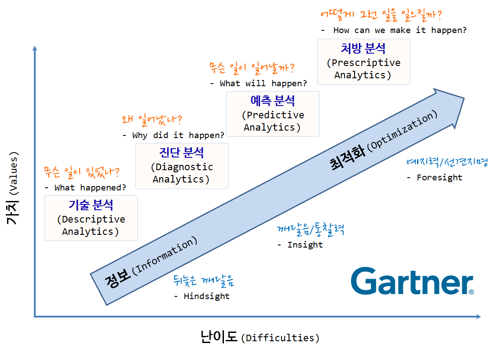
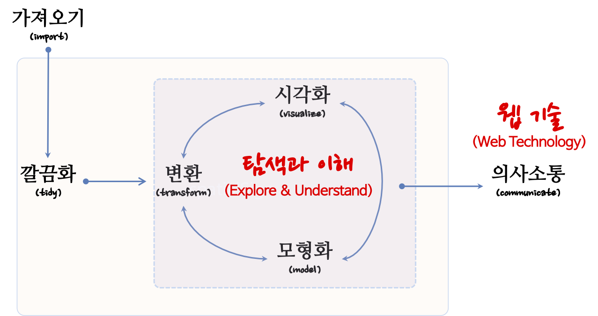

```{r setup, include=FALSE}
knitr::opts_chunk$set(echo = FALSE)
```

# 데이터 과학 산업규모

# 제2의 석유 데이터

```{r the-economist-bigdata-oil, eval = FALSE}
webshot2::webshot(url="https://www.economist.com/leaders/2017/05/06/the-worlds-most-valuable-resource-is-no-longer-oil-but-data", selector = "#content > article > div.ds-layout-grid.ds-layout-grid--edged.layout-article-header > div.article__lead-image > div > img", "fig/economist-bigdata-oil.png")
```


과거 석유가 가장 중요한 자원으로 풍미하던 시절이 있었다. 하지만 이제 더이상 석유가 가장 중요한 자원이 아니라 이제는 누구라도 **데이터(Data)** 라고 말하는 것이 어색하지 않은 세상이 되었고 많은 분들이 이에 동의하고 있다. @economist2017world


# 데이터 과학 제품/서비스 생산공장

## 석유

원유를 정제하게 되면 


## 비용 {#data-science-cost}


데이터 과학의 목표는 원자료(raw data)를 또다른 형태로 수작업 혹은 자동화하는 프로그램을 작성하여 전환하거나 매핑하는 과정이다. 데이터 과학자에 관한 하바드 비즈니스 리뷰 기사 에 따르면, 21세기 가장 인기있는 직업이 데이터 과학자[@davenport2012data]로 친송받고 있지만, 데이터 랭글링에 관한 뉴욕타임즈 기사[@lohr2014big]에 따르면 데이터 과학자 시간의 50% ~ 80% 시간을 데이터를 수집, 준비, 정제 등의 노동집약적인 작업에 소모하는 것으로 보고되고 있다.

데이터 과학은 컴퓨터와 사람이 데이터 프로그래밍 언어(예를 들어, R)로 소통하는 과정으로 이해할 수 있다. 사람이 인지하여 생각한 것을 코딩을 통해 기술하고 이를 컴퓨터에 넣어주면, 컴퓨터가 이를 실행하는 과정이다. 과거, 컴퓨터 자원이 희귀하여 최대한 컴퓨터을 활용하는 점에 초점을 맞춰 데이터 과학 아키텍처가 설계되었다면, 현재는 클라우드, 오픈소스, 오픈 데이터, 인터넷에 연결된 수많은 컴퓨터로 말미암아 사람이 가장 중요한 자원이 되었고, 컴퓨터에 작업명령을 기술하는 코딩도 기계중심 프로그래밍 언어에서 인간중심 프로그래밍 언어로 진화하고 있다.


## 가치 {#data-value}

전통산업 난이도에 따라 마치 경공업, 중화학공업, 반도체 전자공업과 같이 난이도가 높아짐에 따라 창출되는 가치가 달라지듯이 주어진 데이터 자원을 가지고 창출되는 가치는 기술 난이도에 따라 달라진다. 가트너가 제시한 데이터를 활용하는 4단계 즉, 기술분석, 진단분석, 예측분석, 처방분석 단계에 따라 창출되는 가치는 달라지게 된다. 기술분석에서 진단분석을 통한 뒤늦은 깨달음 복기(Hindsight), 진단분석에서 예측분석으로 가는 깨달음/통찰력(Insight), 예측분석에서 처방분석을 통한 예지력/선견지명(Foresight)을 추구하고자 하지만, 그에 따른 어려움은 더욱 가중된다. 

- 기술 분석(Descriptive Analytics): 무슨 일이 있었나? (What happened?)
- 진단 분석(Diagnostic Analytics): 왜 일어났나? (Why did it happen?)
- 예측 분석(Predictive Analytics): 무슨 일이 일어날까? (What will happen?)
- 처방 분석(Prescriptive Analytics): 어떻게 그런 일을 일으킬까? (How can we make it happen?)




# 데이터 과학 경제: API Economy 

API: [@collins2015api; @puschmann2001enterprise]
MyData: [@poikola2015mydata]

## 소프트웨어 교환


## 데이터 교환


## 가치 교환

데이터 &rarr; 전이학습(transfer learning)

# 데이터 과학 방법론: Tidyverse



# 데이터 과학 미래

# 마무리 


