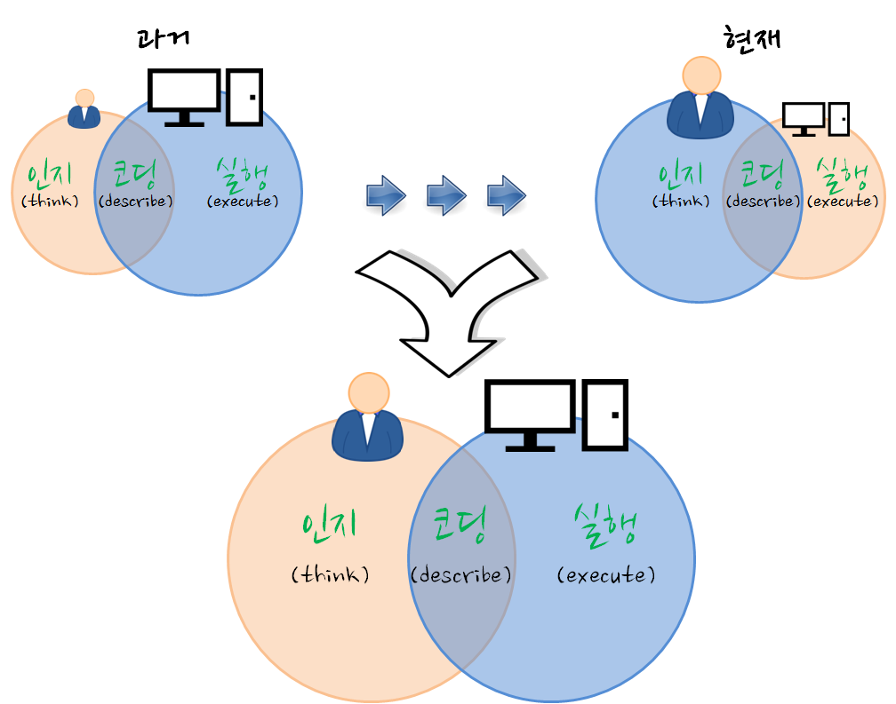
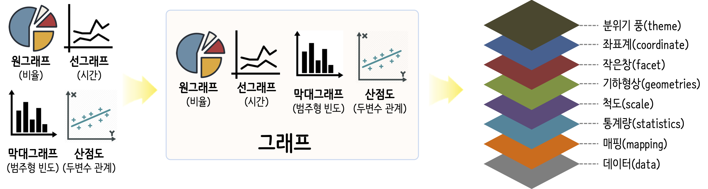

```{r setup, include = FALSE}
options(htmltools.dir.version = FALSE)

knitr::opts_chunk$set(echo = FALSE, warning=FALSE, message=FALSE,
                    comment="", digits = 3, tidy = FALSE, prompt = FALSE, fig.align = 'center')

```

# 

```{r stat-symposium}
library(tidyverse)
library(magick)
library(slickR)

poster <- image_read("fig/stat_symposium.jpg")

poster_01 <- poster %>% 
  image_crop(geometry = geometry_area(750, 970,0, 0))

poster_02 <- poster %>% 
  image_crop(geometry = geometry_area(750, 1050, 0, 970))

poster_03 <- poster %>% 
  image_crop(geometry = geometry_area(750, 1170, 0, 970 + 1075))

poster_01 %>% 
  image_write("fig/poster_01.png")

poster_02 %>% 
  image_write("fig/poster_02.png")

poster_03 %>% 
  image_write("fig/poster_03.png")

fig_files <- list.files("fig")

poster_filenames <- fig_files[str_detect(fig_files, "poster_.*")]

poster_df <- tibble(page = glue::glue("fig/{poster_filenames}") )
  
slickR(poster_df$page, height = 500)

```


# Abstract

<p style="text-align:left;"> 
<small>
 **빅데이터(Big Data)**를 통해 데이터는 과거 RDBMS 정형데이터 뿐만 아니라 비정형 데이터도 충분히 축적될 수 있는 기술적 기반이 마련된 반면에 데이터에 대한 저작권과 라이선스에 대한 이슈가 부각됨에 따라 한동안 혁신의 속도가 주춤했으나, 오픈 공공데이터를 통해서 자유로이 유통될 수 있는 환경이 마련되고 정부에서도 데이터 경제를 표방하면서 제2의 석유라고 불리는 데이터를 원자재로 삼아 부가가치를 창출하는 데이터 산업이 각광받고 있다.
<br>
<br>
  통계학과 컴퓨터 과학을 통해 축적된 데이터에 대한 경험과 지식이 **"데이터 과학"**이라는 용어로 새롭게 정립되어 가고 동시에 산업현장에 대한 적용도 활발해지고 있다. 20세기 초반 생명표에 기반하여 보험업이라는 신생 산업이 태동했고, 신용평가모형을 근간으로 하는 신용카드 산업도 빼놓을 수는 대표적인 데이터 산업 중 하나다. 최근에는 단순히 데이터를 사용하기 좋은 형태인 RESTful API로 포장한 구독(Subscription)기반 데이터 사업도 번창하고 있다.
<br>
<br>
  데이터를 산업현장에 적용하여 가치를 창출하는 제품과 서비스를 만들어 유통하기 위해서는 상당한 수준의 소프트웨어 및 데이터 공학(Software and Data Engineering) 기술이 필요한데 이 모든 과정에서 빠질 수 없는 것이 결국 사람이다. 데이터 과학자는 데이터 기반 제품과 서비스 원가의 대부분을 차지하면서도 데이터에서 가치를 가장 많이 창출하는 자리에 있다. 
<br>
<br>
  데이터 과학자가 어떤 언어와 방식으로 작업하느냐에 따라 눈에 보이지 않는 생산성은 물론이고 유지보수와 밀접한 관련이 있는 품질에도 지대한 영향을 미친다. **"X 문법 (Grammar of X)"**을 표방하는 새로운 `Tidyverse` 방법론은 데이터 문법(Grammar of Data, dplyr), 그래프 문법(Grammar of Graphics, ggplot2), 모형 문법(Grammar of Models, tidymodels) 등으로 구성되며 내재된 추상화와 모듈화 개념을 한번만 배우면 확장 가능한 고품질 데이터 과학 제품과 서비스 개발이 가능케 되었다. 이제 이러한 데이터 과학 혁신 방법론을 통해 더 나은 미래를 만들어가는데 성큼 다가설 수 있게 되었다. 
</small>
</p>

# 데이터 경제와 산업

## 데이터 자원


## 파이프라인


## 가치 {#data-value}

<small>
<ul>
  <li>기술 분석(Descriptive Analytics): 무슨 일이 있었나? (What happened?)</li>
  <li>진단 분석(Diagnostic Analytics): 왜 일어났나? (Why did it happen?)</li>
  <li>예측 분석(Predictive Analytics): 무슨 일이 일어날까? (What will happen?)</li>
  <li>처방 분석(Prescriptive Analytics): 어떻게 그런 일을 일으킬까? (How can we make it happen?)</li>
</ul>
</small>

{#id .class width="67%"}

## 비용 {#data-science-cost}

{#id .class width="77%"}

## 자동화 

{#id .class width="77%"}

# `Tidyverse`

## (비)정형 데이터와 함수

```{r y-fx}
library(tidyverse)
library(slickR)

file_path <- c("fig/intree-xy.png", "fig/intree-xy-x.png", "fig/intree-xy-y.png", "fig/intree-xy-f.png")

y_fx_df <- tibble(img_path = file_path)

slickR(y_fx_df$img_path, height = 350) 
```

## 데이터 사이언스 운영체제

{#id .class width=80% height=80%}

[이광춘 ( 삼정 KPMG 상무), "데이터 사이언스 운영체제 - `tidyverse`", 한국통계학회 소식지 2019년 10월호](https://statkclee.github.io/ds-authoring/ds-stat-tidyverse.html)

## 작업 흐름

{#id .class width=100%}

## 기계학습 알고리즘


## CRISP-DM &rarr; MDP


# X 문법 (Grammar of X)

<br>
<br>

- Reuse existing data structures; 기존 자료구조 재사용.
- Compose simple functions with the pipe; 파이프(pipe)를 사용해서 단순한 함수를 조합.
- Embrace functional programming; 함수형 프로그래밍을 적극 포용.
- Design for humans; 인간을 위한 설계

## 글쓰기 문법: `Rmd`


출처: https://statkclee.github.io/comp_document/

## 데이터 문법: `dplyr`


출처: https://statkclee.github.io/data-science/

## 그래프 문법: `ggplot2`



출처: https://statkclee.github.io/viz/

## 테이블 문법: `gt`


출처: https://statkclee.github.io/data-science/ds-table-gt-kable.html

## 모형 문법: `tidymodels`


출처: https://statkclee.github.io/model/tidyverse-model.html

## 텍스트 문법: `tidytext`


출처: https://statkclee.github.io/text/nlp-twitter-tidytext.html

## 지도: `sf`
