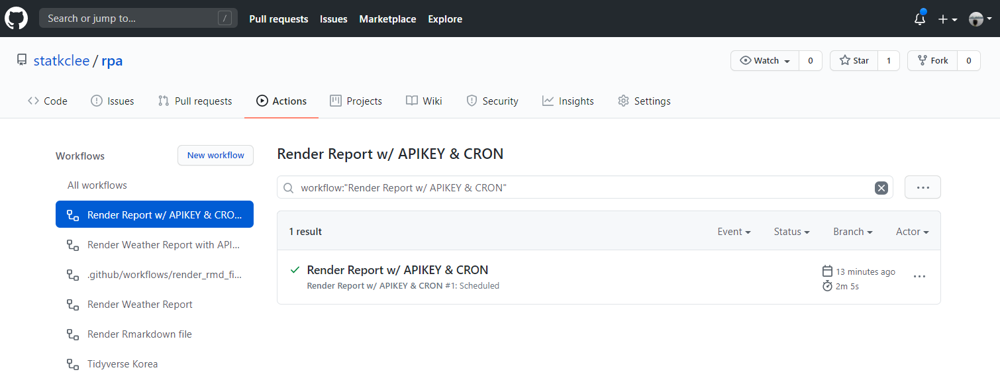
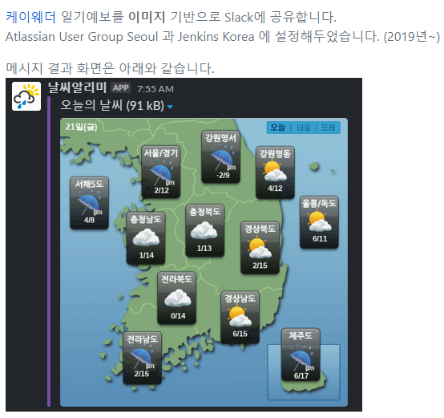
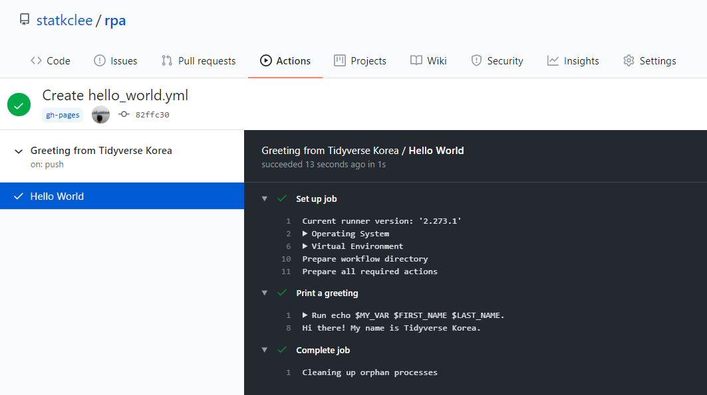
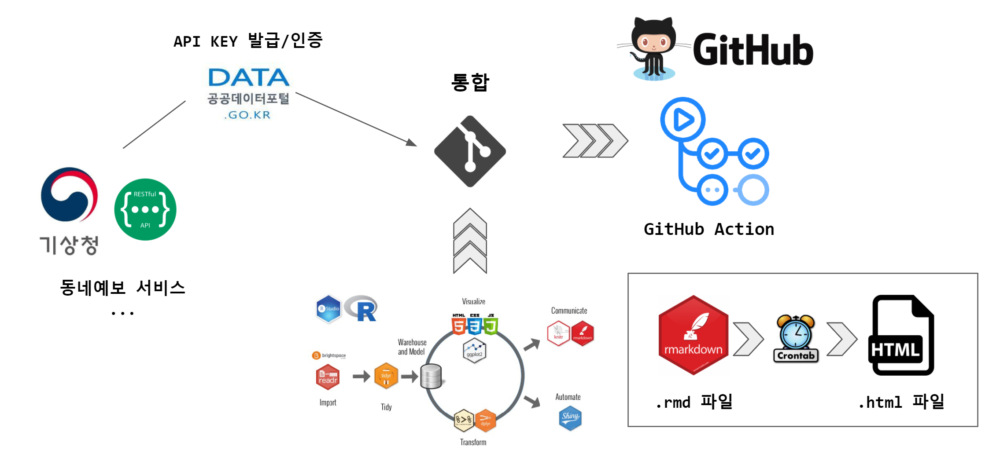
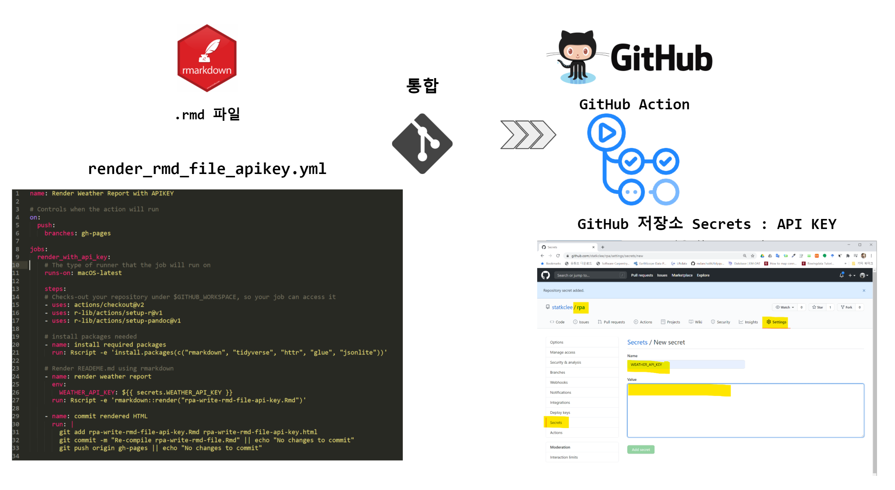
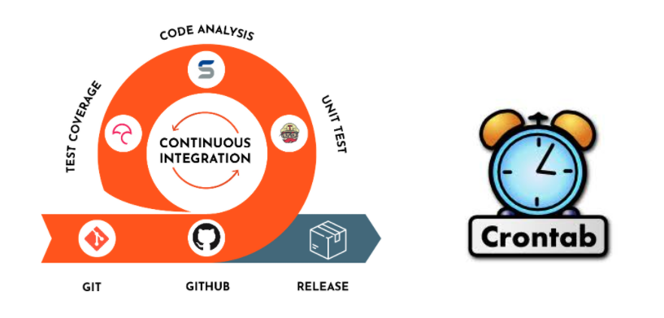

```{r setup, include = FALSE}
options(htmltools.dir.version = FALSE)

knitr::opts_chunk$set(echo = FALSE, warning=FALSE, message=FALSE,
                    comment="", digits = 3, tidy = FALSE, prompt = FALSE, fig.align = 'center')

```

class: bg-main1 split-30 hide-slide-number

.column.bg-main3[
]
.column.slide-in-right[
.sliderbox.bg-main2.vmiddle[
.font5[발표 개요]
]]

---
class: split-two with-border border-white fade-row2-col1 fade-row3-col1

.column[
  .split-three[
  .row.bg-main1[.content.font2[
자동화 GitHub .yellow[Actions]
  ]]
  .row.bg-main2[.content.font2[
헬로우 월드 .yellow[Hello World]
  ]]
  .row.bg-main3[.content.font2[
날씨 .yellow[Rmarkdown] 보고서
]]
]]

.column.bg-main1[.content.center.vmiddle[

]]

---
class: bg-main1 

# 개발 동기

.center[

]

.footnote[
[GitHub Actions으로 날씨알리미 만들기](https://qiita.com/leechungkyu/items/e57951cdaa046acafd76)
]

---
class: bg-main1 

# Seoul R Meetup

<br>
<br>
<br>

.blockquote.font_large[
R에서 .yellow[MLOps] 시작하기: 데이터과학자 개발자 엔지니어협력 <br> <br>
Ian Choi <br> <br>
Seoul R Meetup September 2020
]

<br>
<br>
<br>

.footnote[
[Ian Choi (Sep-2020), "MLOps with R: Collaboration of data scientists & developers/engineers", Seoul R Meetup](https://tidyverse-korea.github.io/seoul-R/#section)
]

---
class: bg-main1 

# 작업흐름 자동화


---
class: split-two with-border border-white fade-row1-col1 fade-row3-col1

.column[
  .split-three[
  .row.bg-main1[.content.font2[
자동화 GitHub .yellow[Actions]
  ]]
  .row.bg-main2[.content.font2[
헬로우 월드 .yellow[Hello World]
  ]]
  .row.bg-main3[.content.font2[
날씨 .yellow[Rmarkdown] 보고서
]]
]]

.column.bg-main1[.content.center.vmiddle[

]]


---
class: split-25 bg-main1 with-border

.row[
#헬로 월드!
]

.row[
  .split-two.with-border[
  .column.bg-orange[.content[
  
```{r bash-script, eval = FALSE, echo = TRUE}
name: Greeting from Tidyverse Korea
on: push

jobs:
  my-job:
    name: Hello World
    runs-on: ubuntu-latest
    steps:
    - name: Print a greeting
      env:
        MY_VAR: Hi there! My name is
        FIRST_NAME: Tidyverse
        LAST_NAME: Korea
      run: |
        echo $MY_VAR $FIRST_NAME $LAST_NAME.
```

    ]]
  .column[.content[
  
    
  
  ]]
]]

<br>
<br>

.footnote[
[RPA - 자동화(Automation) - GitHub Action 살펴보기](https://statkclee.github.io/rpa/rpa-github-action.html)
]

---
class: split-two with-border border-white fade-row1-col1 fade-row2-col1

.column[
  .split-three[
  .row.bg-main1[.content.font2[
자동화 GitHub .yellow[Actions]
  ]]
  .row.bg-main2[.content.font2[
헬로우 월드 .yellow[Hello World]
  ]]
  .row.bg-main3[.content.font2[
날씨 .yellow[Rmarkdown] 보고서
]]
]]

.column.bg-main1[.content.center.vmiddle[

]]

---
class: bg-main1

# 날씨 자동화 보고서



.footnote[
[GitHub Action: R 프로그램 작성](https://statkclee.github.io/rpa/rpa-compile-rmd-file.html)
]

---
class: bg-main1

# R마크다운 코드 & 보고서

.font_large[
- [R마크다운 코드](data:text/x-markdown;base64,LS0tDQpsYXlvdXQ6IHBhZ2UNCnRpdGxlOiAiUlBBIC0g7J6Q64+Z7ZmUKEF1dG9tYXRpb24pIg0Kc3VidGl0bGU6ICJHaXRIdWIgQWN0aW9uOiBSbWQg7ZSE66Gc6re4656oIOyekeyEsSINCm91dHB1dDoNCiAgaHRtbF9kb2N1bWVudDoNCiAgICBpbmNsdWRlczoNCiAgICAgIGluX2hlYWRlcjogaGVhZGVyLmh0bWwNCiAgICAgIGFmdGVyX2JvZHk6IGZvb3Rlci5odG1sDQogICAgdGhlbWU6IGRlZmF1bHQNCiAgICB0b2M6IHllcw0KICAgIHRvY19mbG9hdDogdHJ1ZQ0KICAgIGhpZ2hsaWdodDogdGFuZ28NCiAgICBjb2RlX2ZvbGRpbmc6IGhpZGUNCiAgICBudW1iZXJfc2VjdGlvbnM6IFRSVUUNCm1haW5mb250OiBOYW51bUdvdGhpYw0KZWRpdG9yX29wdGlvbnM6IA0KICBjaHVua19vdXRwdXRfdHlwZTogY29uc29sZQ0KLS0tDQoNCmBgYHtyLCBpbmNsdWRlPUZBTFNFfQ0Ka25pdHI6Om9wdHNfY2h1bmskc2V0KGVjaG8gPSBUUlVFLCBtZXNzYWdlPUZBTFNFLCB3YXJuaW5nPUZBTFNFLA0KICAgICAgICAgICAgICAgICAgICAgIGNvbW1lbnQ9IiIsIGRpZ2l0cyA9IDMsIHRpZHkgPSBGQUxTRSwgcHJvbXB0ID0gRkFMU0UsIGZpZy5hbGlnbiA9ICdjZW50ZXInKQ0KYGBgDQoNCiMg64Kg7JSoIOuztOqzoOyEnCB7I3dlYXRoZXItcmVwb3J0fQ0KDQojIyDrjbDsnbTthLAgeyN3ZWF0aGVyLXJlcG9ydC1kYXRhfQ0KDQpgYGB7ciBjb2RlLXRhYmxlLWZvci1ybWR9DQpsaWJyYXJ5KGh0dHIpDQpsaWJyYXJ5KGdsdWUpDQpsaWJyYXJ5KGpzb25saXRlKQ0KbGlicmFyeSh0aWR5dmVyc2UpDQoNCktNQV9LRVkgPC0gIlhLcEI0WFZTb2t1YjJkNGcwQURSVmxsQ3dVTSUyQndtVDVrNVBoQkxVQ1hiMmhjVzBMZ0htJTJCUkhzMk8lMkJkV2k0UzBKSlFFQ01aRVZFeDBWVjFadUpERFV3JTNEJTNEIg0KDQpjb2RlX3RhYmxlIDwtIHRyaWJibGUofiJjYXRlZ29yeSIsIH4i7ZWt66qp66qFIiwgfiLri6jsnIQiLCANCiAgICAgICAgICAgICAgICAgICAgICAiUE9QIiwgIuqwleyImO2ZleuloCIsICIlIiwNCiAgICAgICAgICAgICAgICAgICAgICAiUFRZIiwgIuqwleyImO2Yle2DnCIsICLsvZTrk5zqsJIiLA0KICAgICAgICAgICAgICAgICAgICAgICJSMDYiLCAiNuyLnOqwhCDqsJXsiJjrn4kiLCAi67KU7KO8ICgxIG1tKSIsDQogICAgICAgICAgICAgICAgICAgICAgIlJFSCIsICLsirXrj4QiLCAiJSIsDQogICAgICAgICAgICAgICAgICAgICAgIlMwNiIsICI27Iuc6rCEIOyLoOyggeyEpCIsICLrspTso7woMSBjbSkiLA0KICAgICAgICAgICAgICAgICAgICAgICJTS1kiLCAi7ZWY64qY7IOB7YOcIiwgIuy9lOuTnOqwkiIsDQogICAgICAgICAgICAgICAgICAgICAgIlQzSCIsICIz7Iuc6rCEIOq4sOyYqCIsICLihIMiLA0KICAgICAgICAgICAgICAgICAgICAgICJUTU4iLCAi7JWE7LmoIOy1nOyggOq4sOyYqCIsICLihIMiLA0KICAgICAgICAgICAgICAgICAgICAgICJUTVgiLCAi64KuIOy1nOqzoOq4sOyYqCIsICLihIMiLA0KICAgICAgICAgICAgICAgICAgICAgICJVVVUiLCAi7ZKN7IaNKOuPmeyEnOyEseu2hCkiLCAibS9zIiwNCiAgICAgICAgICAgICAgICAgICAgICAiVlZWIiwgIu2SjeyGjSjrgqjrtoHshLHrtoQpIiwgIm0vcyIsDQogICAgICAgICAgICAgICAgICAgICAgIldBViIsICLtjIzqs6AiLCAiTSIsDQogICAgICAgICAgICAgICAgICAgICAgIlZFQyIsICLtko3tlqUiLCAibS9zIiwNCiAgICAgICAgICAgICAgICAgICAgICAiV1NEIiwgIu2SjeyGjSIsICIxIikNCg0KDQojIyDrgqDsp5wg7KCE7LKY66asDQp0b2RheV9kYXRlIDwtIFN5cy5EYXRlKCkgJT4lICBhcy5jaGFyYWN0ZXIoKSAlPiUgDQogIHN0cl9yZW1vdmVfYWxsKHBhdHRlcm4gPSAiLSIpDQoNCiMjIFJFU1RmdWwg7Zi47LacDQpidW5kYW5nX2ttYV91cmwgPC0gZ2x1ZSgiaHR0cDovL2FwaXMuZGF0YS5nby5rci8xMzYwMDAwL1ZpbGFnZUZjc3RJbmZvU2VydmljZS9nZXRWaWxhZ2VGY3N0P3NlcnZpY2VLZXk9e0tNQV9LRVl9Jm51bU9mUm93cz0xMCZwYWdlTm89MSZiYXNlX2RhdGU9e3RvZGF5X2RhdGV9JmJhc2VfdGltZT0wMjMwJm54PTYyJm55PTEyMiZkYXRhVHlwZT1KU09OIikNCg0KYnVuZGFuZ19yZXNwIDwtIEdFVChidW5kYW5nX2ttYV91cmwpDQoNCiMjIEpTT04gLS0+IOuNsOydtO2EsO2UhOugiOyehCDrs4DtmZgNCmJ1bmRhbmdfbGlzdCA8LSBqc29ubGl0ZTo6ZnJvbUpTT04oY29udGVudChidW5kYW5nX3Jlc3AsICJ0ZXh0IiksIHNpbXBsaWZ5VmVjdG9yID0gRkFMU0UpDQoNCmJ1bmRhbmdfZGYgPC0gZGF0YS5mcmFtZShSZWR1Y2UocmJpbmQsIGJ1bmRhbmdfbGlzdCRyZXNwb25zZSRib2R5JGl0ZW1zJGl0ZW0pKSAlPiUgDQogIGFzX3RpYmJsZSgpICU+JSANCiAgbXV0YXRlX2FsbCh1bmxpc3QpDQoNCiMjIOuNsOydtO2EsO2UhOugiOyehCDqsIDrj4XshLEg7J6I6rKMIO2RnO2YhA0KYnVuZGFuZ19kZiA8LSBidW5kYW5nX2RmICU+JSANCiAgbGVmdF9qb2luKGNvZGVfdGFibGUsIGJ5PSJjYXRlZ29yeSIpICU+JSANCiAgc2VsZWN0KGZjc3REYXRlLCBmY3N0VGltZSwgY2F0ZWdvcnksIO2VreuqqeuqhSwgZmNzdFZhbHVlLCDri6jsnIQpDQoNCmJ1bmRhbmdfZGYNCmBgYA0KDQojIyDsi5zqsIHtmZQgeyN3ZWF0aGVyLXJlcG9ydC12aXp9DQoNCg0KYGBge3Igd2VhdGhlci1kYXRhLXZpei1mb3Itcm1kfQ0KcGxvdF90aXRsZSA8LSBnbHVlOjpnbHVlKCLshLHrgqjsi5wg67aE64u56rWsIOuPmeuEpOyYiOuztCDshJzruYTsiqQ6IHt1bmlxdWUoYnVuZGFuZ19kZiRmY3N0RGF0ZSl9LCB7dW5pcXVlKGJ1bmRhbmdfZGYkZmNzdFRpbWUpfSIpDQogICAgICAgICAgICAgICAgICAgICAgICAgDQpidW5kYW5nX2RmICU+JSANCiAgbXV0YXRlKGZjc3RWYWx1ZSA9IGFzLm51bWVyaWMoZmNzdFZhbHVlKSkgJT4lIA0KICBmaWx0ZXIo7ZWt66qp66qFICVpbiUgYygi6rCV7IiY7ZmV66WgIiwgIuyKteuPhCIpKSAlPiUgDQogIGdncGxvdChhZXMoeD3tla3rqqnrqoUsIHk9ZmNzdFZhbHVlLCBmaWxsID0g7ZWt66qp66qFKSkgKw0KICAgIGdlb21fY29sKHdpZHRoPTAuNSwgc2hvdy5sZWdlbmQgPSBGQUxTRSkgKw0KICAgIGZhY2V0X3dyYXAofu2VreuqqeuqhSwgc2NhbGVzPSJmcmVlX3giKSAgKw0KICAgIGxhYnMoeD0iIiwgeT0i7ZmV66WgKCUpIiwgdGl0bGU9cGxvdF90aXRsZSkrDQogICAgdGhlbWVfYncoKQ0KYGBgDQoNCg0K)
<br>
<br>
- [보고서](https://statkclee.github.io/rpa/rpa-write-rmd-file.html)
]

---
class: bg-main1

# GitHub Action: Rmd 파일 컴파일 - CI

.center[

]

.footnote[
[GitHub Action: Rmd 파일 컴파일 - CI](https://statkclee.github.io/rpa/rpa-compile-rmd-ghactions.html)
]

---
class: bg-main1

# GitHub Action: Rmd 파일 컴파일 - CI + Cron

.center[

]

.footnote[
[GitHub Action: Rmd 파일 컴파일 - CI + Cron](https://statkclee.github.io/rpa/rpa-compile-rmd-ghactions-cron.html)
]


---
class: bg-main1 split-30 hide-slide-number

.column.bg-main3[
]
.column.slide-in-right[
.sliderbox.bg-main2.vmiddle[
.font5[.yellow[마무리]]
]]


---
class: bg-main1

# References

.font_large[
- [Seoul R Meetup Group: Meetup.com](https://www.meetup.com/seoul-r-meetup/)
</br>
</br>
- [Facebook Group: Tidyverse Korea](https://www.facebook.com/groups/tidyverse/)
</br>
</br>
- [Seoul R Meetup Website](https://tidyverse-korea.github.io/seoul-R/)
]
