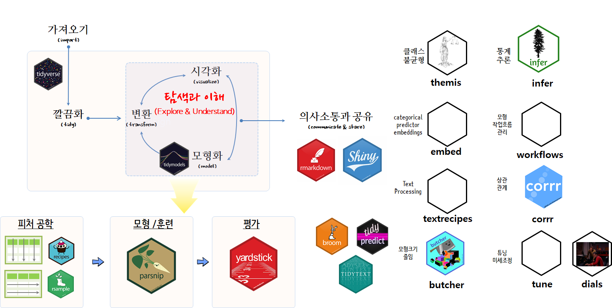

```{r setup, include = FALSE}
options(htmltools.dir.version = FALSE)

knitr::opts_chunk$set(echo = FALSE, warning=FALSE, message=FALSE,
                    comment="", digits = 3, tidy = FALSE, prompt = FALSE, fig.align = 'center')

```

# 발표 개요

- `Tidyverse`
- `Tidymodels`
- Predictive Model
    - Penguins Dataset
    - EDA
    - Basic Workflow
    - Hyper Parameter Tuning
    - Deployment: RESTful API
    - Explainable AI
    - `tidyposterior`
    - ML meets Shiny

# `Tidyverse`

## (비)정형 데이터와 함수

```{r y-fx}
library(tidyverse)
library(slickR)

file_path <- c("fig/intree-xy.png", "fig/intree-xy-x.png", "fig/intree-xy-y.png", "fig/intree-xy-f.png")

y_fx_df <- tibble(img_path = file_path)

slickR(y_fx_df$img_path, height = 350) 
```

## 데이터 사이언스 운영체제

{#id .class width=80% height=80%}

[이광춘 ( 삼정 KPMG 상무), "데이터 사이언스 운영체제 - `tidyverse`", 한국통계학회 소식지 2019년 10월호](https://statkclee.github.io/ds-authoring/ds-stat-tidyverse.html)

# `Tidymodels`



- [tidymodels - tidyverse 모형: tidyverse 성명서](https://statkclee.github.io/model/tidyverse-model.html)

# Predictive Model

## Penguins Dataset


- [펭귄 vs 붓꽃 데이터](https://statkclee.github.io/data-science/ds-iris-penguin.html)

## EDA

- [Tidy Tuesday: Plamer Penguins](https://github.com/rfordatascience/tidytuesday/blob/master/data/2020/2020-07-28/readme.md)
- [tidytuesday.rocks](http://tidytuesday.rocks/)

## Basic Workflow

- [펭귄 성별예측모형: tidymodels](https://statkclee.github.io/model/tidyverse-parsnip-penguin.html)

## Hyper Parameter Tuning

- [펭귄 성별예측모형: tidymodels - Hyper Parameter](https://statkclee.github.io/model/tidyverse-parsnip-penguin-hyper-parameter.html)

## Deployment: RESTful API

- [펭귄 성별예측모형: tidymodels - RESTful API](https://statkclee.github.io/model/tidyverse-parsnip-penguin-RESTful-api.html)

## Explainable AI

- [펭귄 성별예측모형: tidymodels - MDP / DALEX](https://statkclee.github.io/model/tidyverse-parsnip-penguin-DALEX.html)

## `tidyposterior`

- [펭귄 성별예측모형: tidyposterior](https://statkclee.github.io/model/model-tidyposterior.html)

## ML meets Shiny

- [펭귄 성별예측모형: tidymodels - Shiny](https://statkclee.github.io/model/tidyverse-parsnip-penguin-shiny.html)

# References

- [Seoul R Meetup Group: Meetup.com](https://www.meetup.com/seoul-r-meetup/)
- [Facebook Group: Tidyverse Korea](https://www.facebook.com/groups/tidyverse/)
- [Seoul R Meetup Website](https://tidyverse-korea.github.io/seoul-R/)
