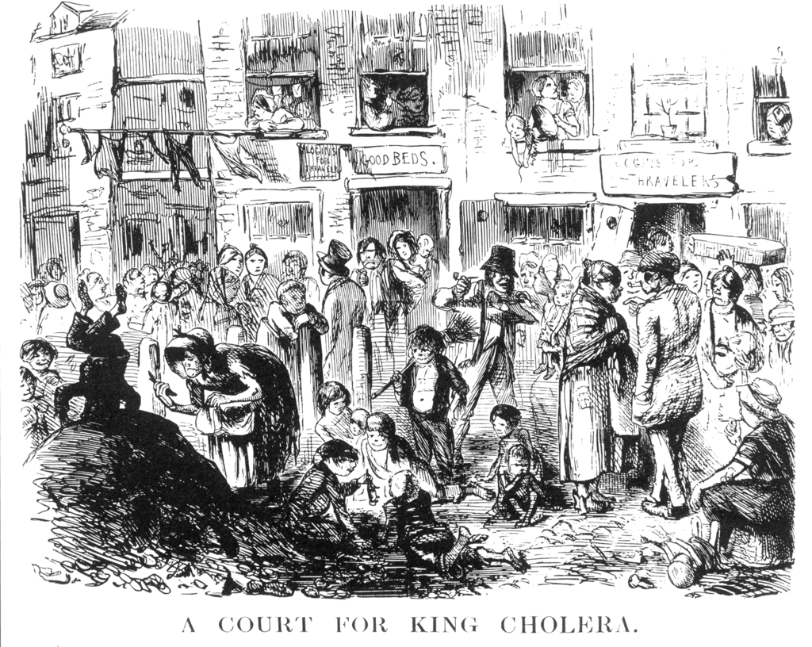
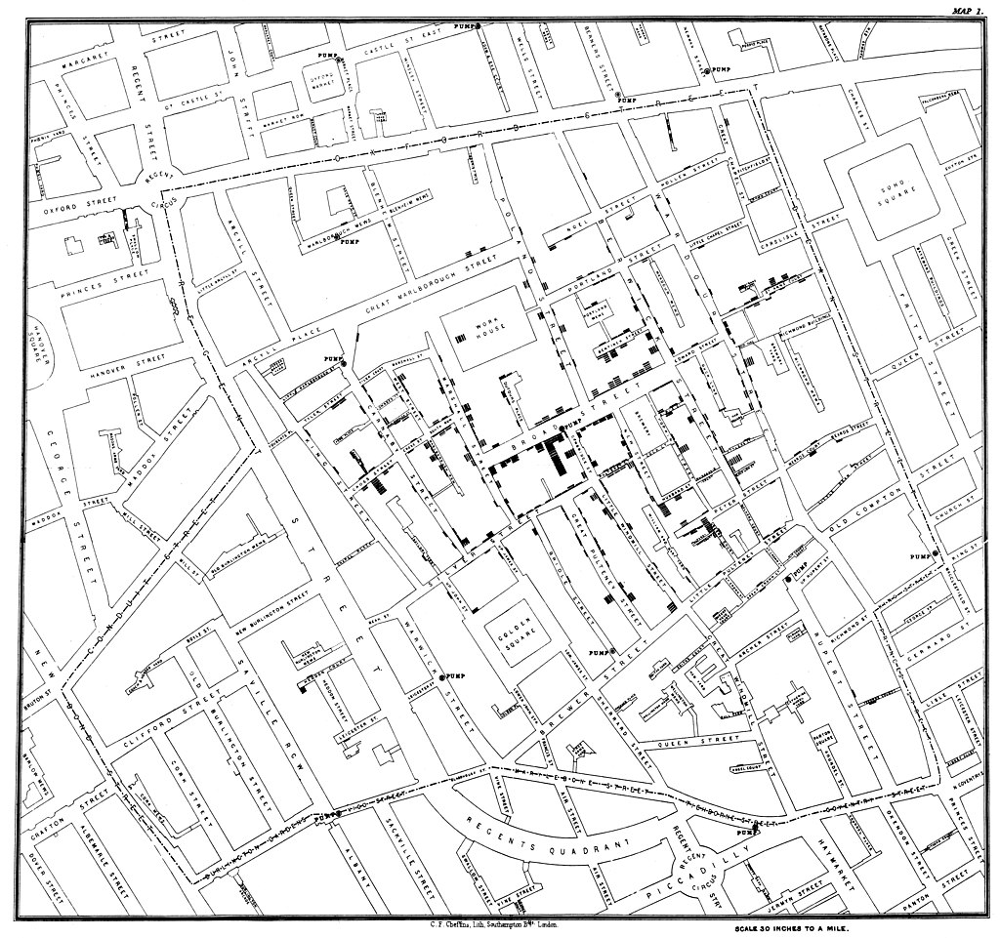

```{r setup, include = FALSE}
library(tidyverse)
# library(nhsrtheme)
# library(NHSRdatasets)
# set default options

options(
  htmltools.dir.version = FALSE, 
  htmltools.preserve.raw = FALSE,
  tibble.width = 60, tibble.print_min = 6,
  crayon.enabled = TRUE
)

knitr::opts_chunk$set(echo = FALSE, message=FALSE, warning=FALSE,
                      comment="", digits = 3, tidy = FALSE, prompt = FALSE, fig.align = 'center',
                      fig.width = 7.252,
                      fig.height = 4,
                      dpi = 300)

# uncomment the following lines if you want to use the NHS-R theme colours by default
# scale_fill_continuous <- partial(scale_fill_nhs, discrete = FALSE)
# scale_fill_discrete <- partial(scale_fill_nhs, discrete = TRUE)
# scale_colour_continuous <- partial(scale_colour_nhs, discrete = FALSE)
# scale_colour_discrete <- partial(scale_colour_nhs, discrete = TRUE)

xaringanExtra::use_panelset()
```


class: title-slide, left, bottom

# `r rmarkdown::metadata$title`
----
## **`r rmarkdown::metadata$subtitle`**
### `r rmarkdown::metadata$author`
### `r rmarkdown::metadata$date`

 
---
class: inverse, middle
name: intro-toc

# 발표 개요 

----

.pull-left[

코딩, 즉 컴퓨팅 사고력은 **.green[자동화(Automation)와 추상화(Abstraction)]** 
두 축으로 하고 있고, 데이터 과학은 **.warmyellow[데이터]** 와 
**.warmyellow[과학]**을 합친 단어입니다. 

수학은 연역적인 사고를 근간으로 하는 반면 통계(데이터)는 **.red[귀납적 사고를]** 근간으로 
하고 있어 수 많은 데이터에서 일반적인 규칙을 찾아내는 작업과 이를 사람들에게
제대로 알리기 위해 시각화를 많이 합니다.

]
 
.pull-right[   
.left[

1\. **[.warmyellow[데이터 과학가 한일]](#intro-toc)**

2\. [데이터 과학자 되는 길](#career-toc)

3\. [데이터 과학 기본기 - 글쓰기](#writing-toc)

4\. [마무리](#ds-world-goodbye) 

]
] <!--end of right-column-->  
 
- [한국통계학회 소식지 2019년 10월호 ](https://statkclee.github.io/ds-authoring/ds-stat-tidyverse.html) 


  
<!--------------------------  1. 도구 ----------------------------------------->


---
name: ds-world
# 왕의 학문 - 통계학

- 왕(국가)이 기원전 3,050년 피라미드 건립을 위해 **인구조사(센서스)** 기록
- 근대 **국가운영**을 위해 인구, 출생, 사망, 실업자수, 세금 수입, 지출, 수입과 수출 등 자료가 필요
- **통계학(Statistics)**는 라틴어 ~~`Status`~~ 정치국가(Political State) 를 의미

.center[

]


---
name: john-snow
# 1854년 런던 코로나19


.panelset[

.panel[.panel-name[팬데믹]
.center[

]
]

.panel[.panel-name[데이터]
.center[

]
]

.panel[.panel-name[데이터 탐정]
.center[

]
]

.panel[.panel-name[시각화(1854)]
.center[

```{r john-snow-hist-data, out.width="100%"}
library(HistData)
library(ggmap)
library(maptools)
library(leaflet)
library(sp)

data(Snow.deaths); data(Snow.pumps); data(Snow.streets); data(Snow.polygons)
london_map <- get_map(c(-.137,51.513), zoom=17)
london <- ggmap(london_map) 
SnowMap(main ="스노우가 작성한 콜레라 지도", density=TRUE)
```
]
]

.panel[.panel-name[시각화(2022)]
.center[

```{r john-snow-hist-data-now, out.width="100%"}
# download.file("http://rtwilson.com/downloads/SnowGIS_SHP.zip",
#               dest="data/SnowGIS.zip", mode="wb")

deaths <- readShapePoints("SnowGIS_SHP/Cholera_Deaths")
df_deaths <- data.frame(deaths@coords)

coordinates(df_deaths)=~coords.x1+coords.x2

proj4string(df_deaths)=CRS("+init=epsg:27700") 
df_deaths = spTransform(df_deaths,CRS("+proj=longlat +datum=WGS84"))
df=data.frame(df_deaths@coords)


df1 <- data.frame(df$coords.x1, df$coords.x2)

Pump_area <- readShapePoints("SnowGIS_SHP/Pumps")
pump_area <- data.frame(Pump_area@coords)

coordinates(pump_area)=~coords.x1+coords.x2

proj4string(pump_area)=CRS("+init=epsg:27700") 
pump_area = spTransform(pump_area,CRS("+proj=longlat +datum=WGS84"))
pa=data.frame(pump_area@coords)


pa1 <- data.frame(pa$coords.x1, pa$coords.x2)

df2 <- cbind(Parameter = "Deaths", df1)
colnames(df2) <- c("Parameter", "coords.x1", "coords.x2")

pa2 <- cbind(Parameter = "Pump", pa1)
colnames(pa2) <- c("Parameter", "coords.x1", "coords.x2")
tot <- rbind(df2, pa2)

london + geom_point(mapping=aes(x=coords.x1, y=coords.x2, col=Parameter,size=Parameter , shape=Parameter), data=tot) + scale_size_discrete(range = c(2, 4)) + 
  labs(title = " 영국 런던 펌부와 콜레라 발병으로 인한 사망자 매핑")
```
]
]


.panel[.panel-name[메타버스]
.center[
<iframe width="560" height="315" src="https://www.youtube.com/embed/B_UsX5vfPJU" title="YouTube video player" frameborder="0" allow="accelerometer; autoplay; clipboard-write; encrypted-media; gyroscope; picture-in-picture" allowfullscreen></iframe>
]
]
]

.footnote[
- [1854 Broad Street cholera outbreak](https://en.wikipedia.org/wiki/1854_Broad_Street_cholera_outbreak)
]


