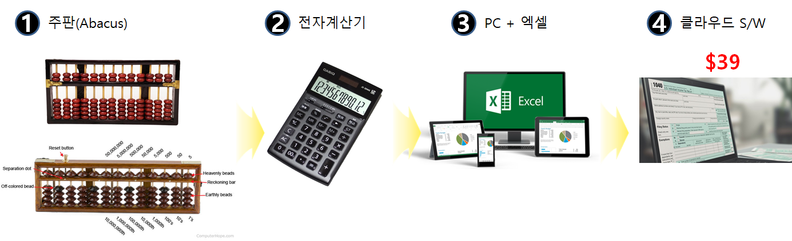
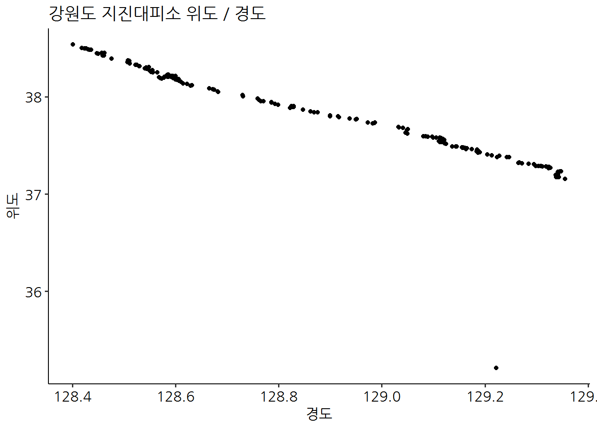

```{r setup, include = FALSE}
library(tidyverse)
# library(nhsrtheme)
# library(NHSRdatasets)
# set default options

options(
  htmltools.dir.version = FALSE, 
  htmltools.preserve.raw = FALSE,
  tibble.width = 60, tibble.print_min = 6,
  crayon.enabled = TRUE
)

knitr::opts_chunk$set(echo = FALSE, message=FALSE, warning=FALSE,
                      comment="", digits = 3, tidy = FALSE, prompt = FALSE, fig.align = 'center',
                      fig.width = 7.252,
                      fig.height = 4,
                      dpi = 300)

# uncomment the following lines if you want to use the NHS-R theme colours by default
# scale_fill_continuous <- partial(scale_fill_nhs, discrete = FALSE)
# scale_fill_discrete <- partial(scale_fill_nhs, discrete = TRUE)
# scale_colour_continuous <- partial(scale_colour_nhs, discrete = FALSE)
# scale_colour_discrete <- partial(scale_colour_nhs, discrete = TRUE)

xaringanExtra::use_panelset()

```


class: title-slide, left, bottom

# `r rmarkdown::metadata$title`
----
## **`r rmarkdown::metadata$subtitle`**
### `r rmarkdown::metadata$author`
### `r rmarkdown::metadata$date`

 
---
class: inverse, middle
name: intro-toc

# 발표 개요 

----

.pull-left[

코딩, 즉 컴퓨팅 사고력은 **.green[자동화(Automation)와 추상화(Abstraction)]** 
두 축으로 하고 있고, 데이터 과학은 **.warmyellow[데이터]** 와 
**.warmyellow[과학]**을 합친 단어입니다. 

수학은 연역적인 사고를 근간으로 하는 반면 통계(데이터)는 **.red[귀납적 사고를]** 근간으로 
하고 있어 수 많은 데이터에서 일반적인 규칙을 찾아내는 작업과 이를 사람들에게
제대로 알리기 위해 시각화를 많이 합니다.

]
 
.pull-right[   
.left[

1\. [19세기 영국 코로나19](#studuent-cholera)

2\. [왜 손씻게 되었나?](#student-handwashing)

3\. [내 신체정보 (정규분포)](#student-normal)

4\. [나폴레옹 러시아 침공](#student-mirad)

5\. [백의천사 나이팅게일](#student-nightingale)

6\. [제2차 세계대전 폭격기](#student-aircraft)

7\. [마무리](#student-goodbye) 

]
] <!--end of right-column-->  
 
- [한국통계학회 소식지 2019년 10월호 ](https://statkclee.github.io/ds-authoring/ds-stat-tidyverse.html) 

  
<!--------------------------  1. 도구 ----------------------------------------->


---
name: ds-world
# 왕의 학문 - 통계학

- 왕(국가)이 기원전 3,050년 피라미드 건립을 위해 **인구조사(센서스)** 기록
- 근대 **국가운영**을 위해 인구, 출생, 사망, 실업자수, 세금 수입, 지출, 수입과 수출 등 자료가 필요
- **통계학(Statistics)**는 라틴어 ~~`Status`~~ 정치국가(Political State) 를 의미

.center[

]

---
name: ds-world-career
# 디지털 시대 시민 역량 - 코딩

<br> 

.center[
<iframe width="560" height="315" src="https://www.youtube.com/embed/t346si4gy_M" title="YouTube video player" frameborder="0" allow="accelerometer; autoplay; clipboard-write; encrypted-media; gyroscope; picture-in-picture" allowfullscreen></iframe>
]

.footnote[
[EBS, "코딩, 소프트웨어 시대 - 조용한 혁명"](https://statkclee.github.io/viz/viz-worldcup-germany.html)
]


---
name: ds-world-career-data
# 디지털 시대 시민 역량 - 데이터 리터러시

.center[

]

.footnote[
[뉴욕타임즈(2014), "Reading, Writing, Arithmetic, and Lately, Coding"](http://www.nytimes.com/2014/05/11/us/reading-writing-arithmetic-and-lately-coding.html)
]

---
name: ds-world-career-data
# 디지털 시대 시민 역량 - 세무사

<br>
<br>
<br>

.center[

]


.footnote[
[이광춘, "로봇 자동화가 빼앗는 일자리 그리고 나" 분당 서현 청소년 수련관, 2019년 12월 4일(수)](http://aispiration.com/ds-authoring/ds-bundang-2019.html)
]

---
name: case-study-worldcup
## [실제 사례] 러시아 월드컵 (독일전)

<br>

.center[

]

.footnote[
[러시아 월드컵(2018) - 한국 vs 독일](https://statkclee.github.io/viz/viz-worldcup-germany.html)
]


```{r child='slideshows/data_science_student/ds-world-cholera.Rmd'}
```

---
name: case-study-earthquake
## [실제 사례] 지진해일 대피소

<br>

.center[

]

.footnote[
[xwMOOC (2018-01-17), "지진해일 대피소 - crosstalk"](https://statkclee.github.io/viz/viz-earthquake-shelter.html)
]


```{r child='slideshows/data_science_student/ds-world-handwashing.Rmd'}
```

---
name: tossing-coins
# 동전던지기

<br>
<br>

.pull-left[


]
.pull-right[


- [R 앱연결](https://r2bit.shinyapps.io/simulation/)
]

.footnote[
- [한국 R 사용자회 - Shiny 앱](https://rpubs.com/statkclee/shiny)
]


```{r child='slideshows/data_science_student/ds-world-normal.Rmd'}
```

```{r child='slideshows/data_science_student/ds-world-russia.Rmd'}
```

---
name: case-study-regression
## [실제 사례] 회귀분석 - MLB 투수 유전자는 유전이 될까?

<br>

.center[

]

.footnote[
[회귀분석 - MLB 투수 유전자는 유전이 될까?](https://statkclee.github.io/politics/pe-baseball-era.html)
]


```{r child='slideshows/data_science_student/ds-world-nightingale.Rmd'}
```

```{r child='slideshows/data_science_student/ds-world-aircraft.Rmd'}
```

---
name: ai-app
# 인공지능 앱

<br>

.pull-left[

<br>


]
.pull-right[


- [R 앱연결](https://r2bit.shinyapps.io/shiny_resnet/)
]

.footnote[
- [20분만에 끝내는 인공지능](https://aispiration.com/united-states/)
]


---
name: student-goodbye
class: middle, inverse

.pull-left[
# **경청해 주셔서 <br>감사합니다.**
<br/>
## 한국 R 사용자회

]

.pull-right[
.right[


]
]
