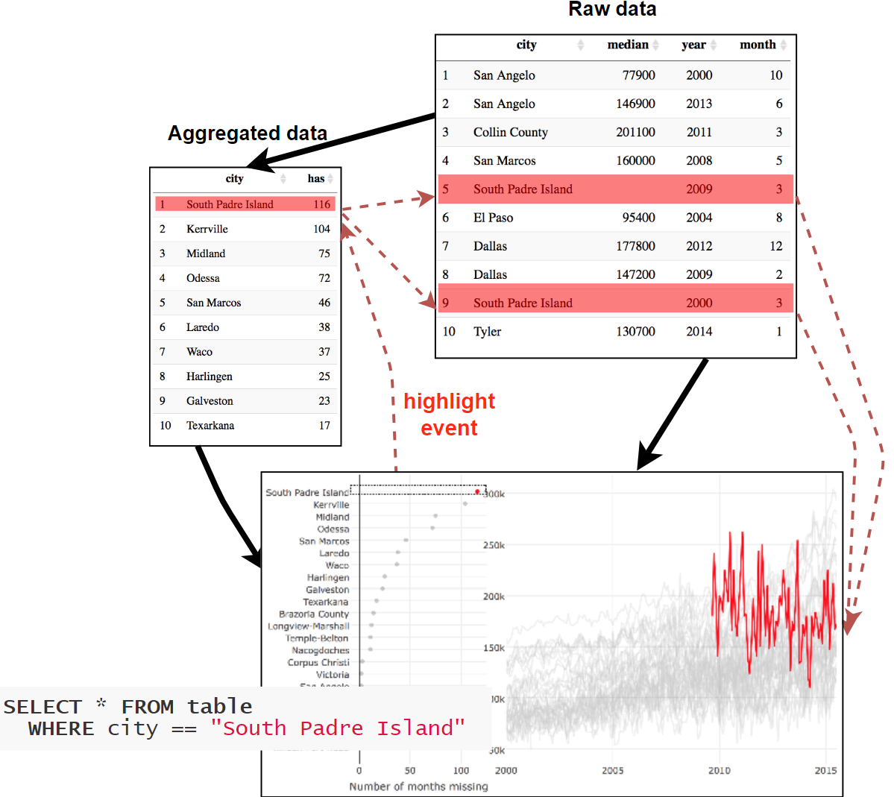

```{r setup, include=FALSE}
options(htmltools.dir.version = FALSE)

knitr::opts_chunk$set(echo = TRUE, warning=FALSE, message=FALSE,
                    comment="", digits = 3, tidy = FALSE, prompt = TRUE, fig.align = 'center')

```


class: inverse, middle, center

# 인터랙티브 시각화


---
### `tidyverse`에서 시각화 놀이터

.center[
  
]

.footnote[
    [데이터 과학 시각화 - 인터랙티브(Interactive) 시각화](https://statkclee.github.io/viz/viz-interactive.html)
]


---
### 인터랙티브 그래픽 놀이터 아키텍처

.center[
  
]


---
### `htmltools`기반 `htmlwidgets` 그리고 아이들

- [htmlwidgets for R](http://www.htmlwidgets.org/showcase_datatables.html)
    - Leaflet
    - dygraphs
    - plotly
    - rbokeh
    - visNetwork
    - networkD3
    - DataTables
    - threejs
    - DiagrammeR

---
class: inverse, middle, center

# `gapminder` 데이터셋

---
### `gapminder`

Hans Rosling's 200 Countries, 200 Years, 4 Minutes - The Joy of Stats - BBC Four

<iframe width="560" height="315" src="https://www.youtube.com/embed/jbkSRLYSojo" frameborder="0" allow="autoplay; encrypted-media" allowfullscreen></iframe>

```{r gapminder-dataset-load, echo=TRUE}
# 0. 환경설정 -----
library(tidyverse)
library(dslabs)
```

---
### 회귀모형 - `purrr` + `trelliscopejs`

.footnote[
- [xwMOOC 모형: 회귀모형 - purrr + trelliscopejs](https://statkclee.github.io/model/model_purrr_trelliscopejs.html)
]

---
### `gapminder` 데이터셋

[`dslabs`](https://cran.r-project.org/web/packages/dslabs/index.html) 팩키지 내장 `gapminder` 데이터셋 10% 표본 추출 &rarr; 데이터 랭글링

```{r gapminder-dataset, echo=FALSE}
gapminder %>% sample_frac(0.1) %>% 
  DT::datatable(fillContainer = FALSE,
                rownames = FALSE,
                options = list(pageLength = 5, scrollX = TRUE))

```

---
### `gapminder` 정제작업

결측값(NA)을 바탕으로 패턴을 추출하고, 1960 ~ 2011년까지 데이터를 예측모형 데이터로 활용함.

```{r gapminder-dataset-preprocessing, echo=TRUE}
# 1. 데이터 정제 -----
gapminder_lc <- gapminder %>% 
   group_by(country) %>% 
   nest()

gapminder_lc_df <- gapminder_lc %>% 
   mutate(na_cnt = map_int(data, ~ sum(is.na(.x)))) %>% 
   filter(na_cnt == 8) %>% 
   unnest(data) %>% 
   filter(year <= 2011) %>% 
   select(-na_cnt) %>% 
   select(-continent, -region)
```


---
class: inverse, middle, center

# 시각화 놀이터 입장

---
### 1. 정적 그래프(Static Graph) - 그래프

```{r static-graph, echo=FALSE}
# 0. 환경설정 -----
library(tidyverse);library(plotly);library(gapminder);library(glue);library(crosstalk);library(leaflet)
# 1. 정적 그래프 -----
gapminder %>% 
    ggplot(aes(x=year, y=lifeExp, group=country)) + 
      geom_line()
```

---
### 1. 정적 그래프(Static Graph) - R코드

```{r static-graph-code, eval=FALSE}
# 0. 환경설정 -----
library(tidyverse)
library(plotly)
library(gapminder)
library(glue)
library(crosstalk)
library(leaflet)

# 1. 정적 그래프 -----

gapminder %>% 
    ggplot(aes(x=year, y=lifeExp, group=country)) + 
      geom_line()
```

---
### 2. 인터랙티브 그래프 - 그래프

```{r interactive-graph, echo=FALSE}
# 2. 정적 그래프 인터랙티브 변환 -----
p <- gapminder %>% 
    ggplot(aes(x=year, y=lifeExp, group=country)) + 
      geom_line()

ggplotly(p)
```

---
### 2. 인터랙티브 그래프 - R코드

```{r interactive-graph-code, eval=FALSE}
# 2. 정적 그래프 인터랙티브 변환 -----
p <- gapminder %>% 
    ggplot(aes(x=year, y=lifeExp, group=country)) + 
      geom_line()

ggplotly(p)
```


---
### 3. 툴팁(Tooltip) 기능 - 그래프

```{r interactive-graph-tooltip, echo=FALSE}
# 3. 툴팁 기능 -----
p <- gapminder %>% 
    ggplot(aes(x=year, y=lifeExp, group=country, text=paste0("대륙: ", continent, "\n", 
                                                             "국가: ", country))) + 
    geom_line()

ggplotly(p, tooltip = "text")
```

---
### 3. 툴팁(Tooltip) 기능 - R 코드

```{r interactive-graph-tooltip-code, eval=FALSE}
# 3. 툴팁 기능 -----
p <- gapminder %>% 
    ggplot(aes(x=year, y=lifeExp, 
               group=country, 
               text=paste0("대륙: ", continent, "\n", 
                           "국가: ", country))) + 
    geom_line()

ggplotly(p, tooltip = "text")
```


---
### 4. 강조(Highlight) 기능 - 그래프

```{r interactive-graph-highlight, echo=FALSE}
# 4. 하이라이트 기능 -----
gapminder_highlight <- highlight_key(gapminder, ~country)

life_g <- gapminder_highlight %>% 
    ggplot(aes(x=year, y=lifeExp, group=country, text=paste0("대륙: ", continent, "\n", 
                                                             "국가: ", country))) + 
    geom_line()

life_gg <- ggplotly(life_g, tooltip = "text")
highlight(life_gg, on = "plotly_click", selectize = TRUE, dynamic = TRUE, persistent = TRUE)
```

---
### 4. 강조(Highlight) 기능 - R코드

```{r interactive-graph-highlight-code, eval=FALSE}
# 4. 하이라이트 기능 -----
gapminder_highlight <- highlight_key(gapminder, ~country)

life_g <- gapminder_highlight %>% 
    ggplot(aes(x=year, y=lifeExp, 
               group=country, 
               text=paste0("대륙: ", continent, "\n",
                           "국가: ", country))) + 
    geom_line()

life_gg <- ggplotly(life_g, tooltip = "text")
highlight(life_gg, on = "plotly_click", 
          selectize = TRUE, 
          dynamic = TRUE, 
          persistent = TRUE)
```

---
### 5. 연결뷰(Linked View) 기능 - 그래프

```{r interactive-graph-linked-view, echo=FALSE}
# 5. Small Multiple 기능 -----
gapminder_cjk <- gapminder %>% 
    filter(country %in% c("China", "Japan", "Korea, Rep."))

gapminder_sd <- SharedData$new(gapminder_cjk, ~country)

life_g <- gapminder_sd %>% 
    ggplot(aes(x=year, y=lifeExp, group=country,
               text=paste0("대륙: ", continent, "\n", 
                           "국가: ", country))) + 
    geom_line() +
    geom_point() +
    facet_wrap(~country)

ggplotly(life_g, tooltip = "text")
```


---
### 5. 연결뷰(Linked View) 기능 - R코드

```{r interactive-graph-linked-view-code, eval=FALSE}
# 5. Small Multiple 기능 -----
gapminder_cjk <- gapminder %>% 
    filter(country %in% c("China", "Japan", "Korea, Rep."))

gapminder_sd <- SharedData$new(gapminder_cjk, ~country)

life_g <- gapminder_sd %>% 
    ggplot(aes(x=year, y=lifeExp, group=country,
               text=paste0("대륙: ", continent, "\n", 
                           "국가: ", country))) + 
    geom_line() +
    geom_point() +
    facet_wrap(~country)

ggplotly(life_g, tooltip = "text")
```

---
### 5. 연결뷰(Linked View) 기능 - 삼국지

.center[
    <iframe width="560" height="315" src="https://www.youtube.com/embed/DbpKKZMe52s" frameborder="0" allow="autoplay; encrypted-media" allowfullscreen></iframe>
]

.footnote[
    [xwMOOC 데이터 저널리즘, "코에이(Koei) 삼국지 - 인물중심"](https://statkclee.github.io/data-product/dp-koei-three-kingdoms.html)
]


---
### 6. 연결뷰(Linked View) 기능 - `ggpairs` 그래프

```{r interactive-graph-linked-view-ggpairs, echo=FALSE}
## 5.1. linked view 기능 -----
iris_sd <- SharedData$new(iris)
iris_g <- GGally::ggpairs(iris_sd, aes(color = Species), columns = 1:4)
highlight(ggplotly(iris_g), on = "plotly_selected")
```

---
### 6. 연결뷰(Linked View) 기능 - `ggpairs` 그래프 코드

```{r interactive-graph-linked-view-ggpairs-code, eval=FALSE}
## 5.1. linked view 기능 -----
library(GGally)
iris_sd <- SharedData$new(iris)
iris_g <- ggpairs(iris_sd, aes(color = Species), 
                  columns = 1:4)

highlight(ggplotly(iris_g), on = "plotly_selected")
```

---
### 6. 연결뷰(Linked View) 기능 - `ggpairs` 그래프 흐름도


.center[
  
]


---
### 7. 애니메이션 기능 - 그래프

```{r interactive-graph-animation, echo=FALSE}
# 6. 애니메이션 기능 -----
life_g <- gapminder %>% 
    ggplot(aes(x=gdpPercap, y=lifeExp, group=country, color=country,
               text=paste0("대륙: ", continent, "\n", 
                           "국가: ", country))) + 
        geom_point(alpha = 0.2) +
        geom_point(aes(frame = year), color="red") +
        facet_wrap(~continent, ncol = 2) +
        scale_x_sqrt() +
        theme(legend.position = "none")

ggplotly(life_g, tooltip="text")
```

---
### 7. 애니메이션 기능 - 그래프 코드

`frame= 매개변수`만 넣으면 됨.

```{r interactive-graph-animation-code, eval=FALSE}
# 6. 애니메이션 기능 -----
life_g <- gapminder %>% 
    ggplot(aes(x=gdpPercap, y=lifeExp, group=country, color=country,
               text=paste0("대륙: ", continent, "\n", 
                           "국가: ", country))) + 
        geom_point(alpha = 0.2) +
        geom_point(aes(frame = year), color="red") +
        facet_wrap(~continent, ncol = 2) +
        scale_x_sqrt() +
        theme(legend.position = "none")

ggplotly(life_g, tooltip="text")
```

---
### 7. 애니메이션 기능 - 2017년 버전

.center[
    
]

.footnote[

[정적 그래프에서 부드러운 동영상 그래프까지](https://statkclee.github.io/viz/viz-animations.html)
]


---
class: inverse, middle, center

# 시각화 놀이터 **재입장**

---
### 1. 다른 위젯 조합 - `crosstalk`

```{r interactive-graph-crosstalk, echo=FALSE}
# 8. 다른 htmlwidgets 과 만남 -----
options(persistent = TRUE)

sd <- SharedData$new(quakes)

p <- plot_ly(sd, x = ~depth, y = ~mag) %>% 
    add_markers(alpha = 0.5) %>%
    highlight("plotly_selected", dynamic = TRUE)

map <- leaflet(sd) %>% 
    addTiles() %>% 
    addCircles()

bscols(widths = c(6, 6), p, map)
```

---
### 1. 다른 위젯 조합 - `crosstalk` R코드

```{r interactive-graph-crosstalk-code, eval=FALSE}
# 8. 다른 htmlwidgets 과 만남 -----
options(persistent = TRUE)

sd <- SharedData$new(quakes)

p <- plot_ly(sd, x = ~depth, y = ~mag) %>% 
    add_markers(alpha = 0.5) %>%
    highlight("plotly_selected", dynamic = TRUE)

map <- leaflet(sd) %>% 
    addTiles() %>% 
    addCircles()

bscols(widths = c(6, 6), p, map)
```


---
### 2. 데이터 분석 - `ggplot`

```{r interactive-graph-ggplot, echo=FALSE}
# 9. ggplot 데이터 분석 -----
m <- SharedData$new(mpg)

p1 <- ggplot(m, aes(displ, fill = class)) + 
    geom_density()
p2 <- ggplot(m, aes(displ, hwy, fill = class)) + 
    geom_point()

subplot(p1, p2) %>% highlight("plotly_click") %>% hide_legend()
```


---
### 2. 데이터 분석 - `ggplot` 코드

```{r interactive-graph-ggplot-code, eval=FALSE}
# 9. ggplot 데이터 분석 -----
m <- SharedData$new(mpg)

p1 <- ggplot(m, aes(displ, fill = class)) + 
    geom_density()
p2 <- ggplot(m, aes(displ, hwy, fill = class)) + 
    geom_point()

subplot(p1, p2) %>% highlight("plotly_click") %>% hide_legend()
```

---
### 3. 데이터 분석 - `plotly`

```{r interactive-graph-plotly, echo=FALSE}
# 9. plotly 데이터 분석 -----

d <- highlight_key(mtcars)
sp_g <- ggplot(d, aes(x = mpg, y = disp)) +
    geom_point()
sp_gg <- ggplotly(sp_g)

hist <- plot_ly(d, x = ~factor(cyl)) %>% add_histogram(color = I("black"))
box <- plot_ly(d, y = ~disp, color = I("black")) %>% add_boxplot(name = " ")
violin <- plot_ly(d, y = ~disp, color = I("black")) %>% add_trace(type = "violin", name = " ")

subplot(sp_gg, box, violin, shareY = TRUE, titleX = TRUE, titleY = TRUE) %>%
    subplot(hist, widths = c(.75, .25), titleX = TRUE, titleY = TRUE) %>%
    layout(
        barmode = "overlay", 
        title = "Click and drag scatterplot",
        showlegend = FALSE
    ) %>%
    highlight("plotly_selected")
```

---
### 3. 데이터 분석 - `plotly` 코드

```{r interactive-graph-plotly-code, eval=FALSE}
# 9. plotly 데이터 분석 -----

d <- highlight_key(mtcars)
sp_g <- ggplot(d, aes(x = mpg, y = disp)) +
    geom_point()
sp_gg <- ggplotly(sp_g)

hist <- plot_ly(d, x = ~factor(cyl)) %>% add_histogram(color = I("black"))
box <- plot_ly(d, y = ~disp, color = I("black")) %>% add_boxplot(name = " ")
violin <- plot_ly(d, y = ~disp, color = I("black")) %>% add_trace(type = "violin", name = " ")

subplot(sp_gg, box, violin, shareY = TRUE, titleX = TRUE, titleY = TRUE) %>%
    subplot(hist, widths = c(.75, .25), titleX = TRUE, titleY = TRUE) %>%
    layout(
        barmode = "overlay", 
        title = "Click and drag scatterplot",
        showlegend = FALSE
    ) %>%
    highlight("plotly_selected")
```


---
class: inverse, middle, center

# 시각화 놀이터 다음은...

[**Tidyverse Korea**](https://www.facebook.com/groups/tidyverse/)
