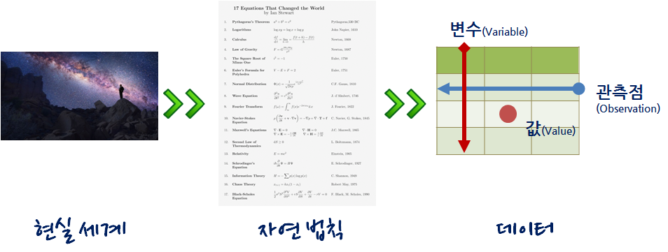

```{r setup, include=FALSE}
options(htmltools.dir.version = FALSE)

knitr::opts_chunk$set(echo = FALSE, warning=FALSE, message=FALSE,
                    comment="", digits = 3, tidy = FALSE, prompt = TRUE, fig.align = 'center')

library(tidyverse)
library(gtrendsR)
# 미국
# us_df <- gtrends(c("big data", "data science", "machine learning", "deep learning"), geo = c("US"), time="2010-01-01 2019-02-23", hl = "en-US")

# 대한민국
Sys.setlocale("LC_ALL", "C")
# kr_df <- gtrends(c("빅데이터", "데이터 사이언스", "기계 학습", "딥러닝"), geo = c("KR"), time="2010-01-01 2019-02-23", hl = "ko-KR")
Sys.setlocale("LC_ALL", "Korean")

dir.create("data")
# us_df %>% write_rds("data/us_df.rds")
# kr_df %>% write_rds("data/kr_df.rds")
```


class: inverse, middle, center

## 빅데이터 &rarr; 데이터 사이언스

---
### 구글 Trends 데이터 사이언스 한미 비교 - 미국


```{r google-trends-comparison-us, echo=FALSE, fig.width=12, fig.height=8}
library(tidyverse)
library(lubridate)
library(googleVis)
library(extrafont)
loadfonts()

Sys.setenv(TZ='Asia/Seoul')

us_df <- read_rds("data/us_df.rds")
kr_df <- read_rds("data/kr_df.rds")

us_df$interest_over_time %>% tbl_df %>% 
  mutate(hits = as.integer(hits)) %>% 
  ggplot(aes(x=date, y=hits, color=keyword)) +
    geom_line() +
    labs(x="", y="구글 인기도", color="구글 검색어") +
    theme_minimal(base_family = "NanumGothic") +
    theme(legend.position = "top",
          legend.title=element_text(size=17), 
          legend.text=element_text(size=15))

```


---
### 구글 Trends 데이터 사이언스 한미 비교 - 한국


```{r google-trends-comparison-kr, fig.width=12, fig.height=8}
kr_df$interest_over_time %>% tbl_df %>% 
  mutate(hits = as.integer(hits)) %>% 
  ggplot(aes(x=date, y=hits, color=keyword)) +
    geom_line() +
    labs(x="", y="구글 인기도", color="구글 검색어") +
    theme_minimal(base_family = "NanumGothic") +
    theme(legend.position = "top",
          legend.title=element_text(size=17), 
          legend.text=element_text(size=15))
```

---
class: inverse, middle, center

## 데이터 사이언스

---
### 데이터 사이언스란?

데이터 사이언스는 데이터를 다루는 과학이다. 따라서 자연법칙을 다루는 자연과학과 맥이 닿아있다.
자연법칙을 측정하여 데이터프레임(`DataFrame`)으로 나타내면 **변수(Variable)**, **관측점(Observation)**, **값(Value)**으로 표현된다.




---
### 데이터 사이언스 업무


- **분석(Analytics) 데이터 과학자**는 좋은 질문을 던질 수 있고, 
탐색적 데이터 분석을 통해서 문제와 해법을 명확히 하는 재주가 있고, 대쉬보드와 시각화를 통해 데이터 분석을 자동화하고, 추천 결과물을 통해 비즈니스를 변화시킨다. 
- **알고리즘(algorithm) 데이터 과학자**는 기계학습에 특기가 있는 사람에 적합하고 제품/서비스, 프로세스에 데이터를 알고리즘을 통해 녹여내서 비즈니스 가치를 창출한다. 
- **추론(inference) 데이터 과학자**는 통계를 사용해서 의사결정을 향상시키고, 업무의 영향도를 측정하는데 주로 통계학, 경제학, 사화과학 전공지식을 적극 활용한다.

.footnote[
  [Elena Grewal(July 25, 2018), "One Data Science Job Doesn’t Fit All"](https://www.linkedin.com/pulse/one-data-science-job-doesnt-fit-all-elena-grewal/)
]

---
class: inverse, middle, center

## 여론조사와 선거 예측

---
### 여론조사와 SNS - 여론조사

.center[

]

---
### 여론조사와 SNS - SNS

.center[

]

---
### 여론조사와 페이스북

.center[
    
]

.footnote[
  [페이스북과 여론조사 - 민심, 페북(SNS), 여론조사, 투표, 당선](http://statkclee.github.io/politics/fb-vs-survey.html)
]


---
class: inverse, middle, center

## 2020년 총선에서 승리하기 <br> 변화요인

---
### 정치지형 변화 - 대통령 지지율

[갤럽/리얼미터 대통령 지지율](https://statkclee.github.io/election/president_approval_survey.html)

---
### 정치지형 변화 - 성남시 분당갑을

[성남시 분당구](https://statkclee.github.io/election/election_politics_votes.html)

---
### 인구 변화

- [인구구조 변화 - 수도권](https://statkclee.github.io/election/election_province_population.html#21_2020%EB%85%84_%EC%8B%9C%EB%8F%84%EB%B3%84_%EC%9D%B8%EA%B5%AC)

- [인구구조 변화 - 경기도](https://statkclee.github.io/election/election_province_population.html#22_%EA%B2%BD%EA%B8%B0%EB%8F%84_(2016%EB%85%84_vs_2020%EB%85%84)

---
### 경제 변화

- [지역내총생산(GRDP) 변화 - 시도별](https://statkclee.github.io/election/election_grdp.html#3_%EC%8B%9C%EB%8F%84%EB%B3%84_grdp_%EC%B6%94%EC%84%B8)

- [지역내총생산(GRDP) 변화 - 업종별](https://statkclee.github.io/election/election_grdp.html#4_%EC%97%85%EC%A2%85%EB%B3%84_grdp_%EC%B6%94%EC%84%B8)


---
### 인터넷 온라인 환경

- [인터넷 온라인 환경 변화 - 집전화](https://statkclee.github.io/election/election_online.html#3_%EC%A0%95%EB%B3%B4%ED%86%B5%EC%8B%A0%EC%84%9C%EB%B9%84%EC%8A%A4)

- [인터넷 온라인 환경 변화 - SNS](https://statkclee.github.io/election/election_online.html#41_%EC%97%B0%EB%A0%B9%EB%B3%84)


---
class: inverse, middle, center

## 2020년 총선에서 승리하기 <br> 총선 &rarr; 대선 &rarr; 지선 

---
### 선거판세: 지방선거(2018) - 광역

- 시도지사: 5월22일 [광역단체장](http://statkclee.github.io/politics/sido-status-2018-05-22.html#23_%EC%A7%80%EB%B0%A9%EC%84%A0%EA%B1%B0_%EC%A0%95%EA%B3%84%EA%B0%9C%ED%8E%B8_1)

- 경기 기초단체장: 6월3일 [경기도 기초단체장](http://statkclee.github.io/politics/gg-19-sigun.html#4_%EC%A0%9C6%ED%9A%8C_%EC%A0%9C7%ED%9A%8C_%EB%B9%84%EA%B5%90)

---
### 지방선거(2018) - 나주시 / 속초시

- [전라남도 나주시](http://statkclee.github.io/politics/jn-naju.html)
- [강원도 속초시](http://statkclee.github.io/politics/kangwon-sokcho.html)

---
### 페이스북 페이지 / 유튜브

- [20대 총선 - 임태희 페이스북 페이지](http://statkclee.github.io/politics/22-vote-fb-page.html)
- [황교안 대통령 권한대행 페북 활동성 분석](http://statkclee.github.io/politics/fb-page-hwang.html)
- [유튜브 채널 - 민주당 경기지사 후보](http://statkclee.github.io/politics/youtube-channel-gg.html)
- [대선 TV토론 - 페이스북 페이지 팬수 추세](http://statkclee.github.io/politics/fb-fans-trends.html)
- [대선 페이스북 좋아요 주별 활동성](http://statkclee.github.io/politics/fb-page-ctr.html)

---
### 지방선거(2018) - 검색엔진 연관검색어

- [검색엔진 연관검색어 - 서울시장](http://statkclee.github.io/politics/related-search-seoul-july-06.html)

- [검색엔진 연관검색어 - 경기지사](http://statkclee.github.io/politics/related-search-gg-july-06.html)


---
class: inverse, middle, center

## 2020년 총선에서 승리하기

---
### Amazon, Apple, Facebook, Google

.pull-left[
  
]
.pull-right[
<div style="max-width:854px"><div style="position:relative;height:0;padding-bottom:56.25%"><iframe src="https://embed.ted.com/talks/lang/ko/scott_galloway_how_amazon_apple_facebook_and_google_manipulate_our_emotions" width="400" height="250" style="position:absolute;left:0;top:0;width:100%;height:100%" frameborder="0" scrolling="no" allowfullscreen></iframe></div></div>
]

.footnote[
  [Scott Galloway(2018), "How Amazon, Apple, Facebook and Google manipulate our emotions", TED](https://www.ted.com/talks/scott_galloway_how_amazon_apple_facebook_and_google_manipulate_our_emotions?language=ko)
]

---
### 저평가 우량주 - 손학규

.center[
  
]

---
### 저녁이 있는 삶 - 데이터 저널리즘

.cetner[
   
]

.footnote[
  [자살자수 국제비교](http://statkclee.github.io/politics/oecd-suicide.html)
]

---
### 유튜브 - 알릴레오 vs. 홍카콜라

- [알릴레요 vs. 홍카콜라 - 트래픽](https://statkclee.github.io/text/youtube-channel-comment-classification.html#22_%EC%B1%84%EB%84%90_%ED%8A%B8%EB%9E%98%ED%94%BD_%EB%B9%84%EA%B5%90)
- [민주당씀 vs. 홍카콜라 - 채널별 상위 10명 영향력 큰 사용자](https://statkclee.github.io/text/nlp-youtube-comment.html#532_%EC%B1%84%EB%84%90%EB%B3%84_%EC%83%81%EC%9C%84_10%EB%AA%85_%EC%98%81%ED%96%A5%EB%A0%A5_%ED%81%B0_%EC%82%AC%EC%9A%A9%EC%9E%90)
- [알릴레요 vs. 홍카콜라 - 동영상 상세 키워드](https://statkclee.github.io/text/youtube-channel-comment-classification.html#24_%EC%9C%A0%ED%8A%9C%EB%B8%8C_%EC%B1%84%EB%84%90%EB%B3%84_%EB%8F%99%EC%98%81%EC%83%81_%EC%83%81%EC%84%B8)

---
### 기계의 선거 개입(?)

.center[
  
]

.footnote[
- [KBS (2016.12.07) "인공지능으로 분석한 대통령의 마음…슬픔은 어디에?"](http://news.kbs.co.kr/news/view.do?ncd=3390429)
- [동영상 감정 분석 - 마이크로소프트 Azure](http://statkclee.github.io/deep-learning/ms-oxford-video.html)
]

---
### 디지털 선거 아키텍처 - 2016년 총선


---
### 미디어별 공약 사례


---
### 선거 대쉬보드

[제7회 전국동시지방선거 - 대쉬보드](http://statkclee.github.io/politics/local-2018-dashboard.html)

