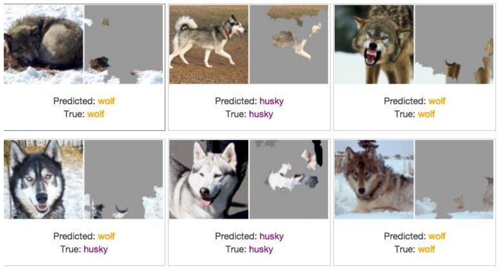
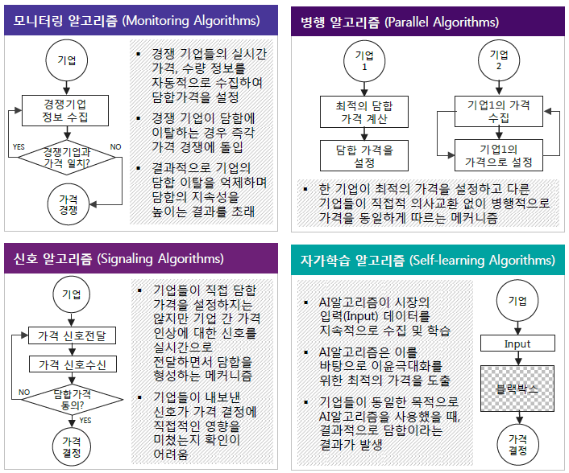
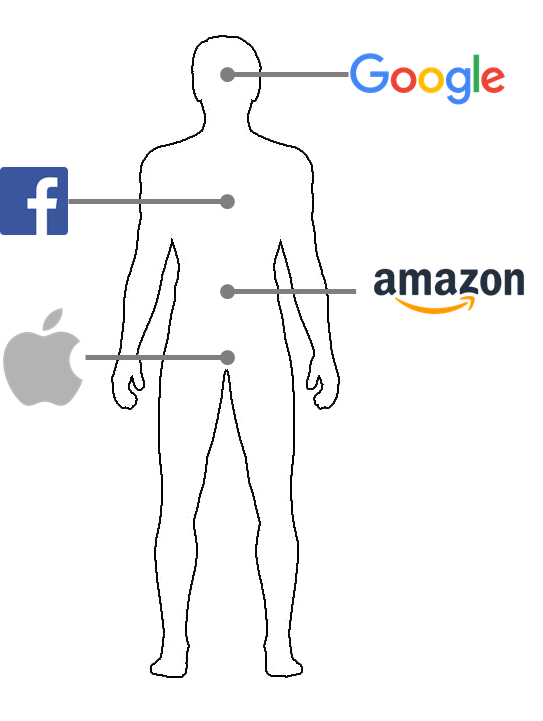

```{r setup, include=FALSE}
options(htmltools.dir.version = FALSE)

knitr::opts_chunk$set(echo = FALSE, warning=FALSE, message=FALSE,
                    comment="", digits = 3, tidy = FALSE, prompt = TRUE, fig.align = 'center')


library(tidyverse)
library(gtrendsR)
# 미국
# us_df <- gtrends(c("big data", "data science", "machine learning", "deep learning"), geo = c("US"), time="2010-01-01 2019-02-23", hl = "en-US")

# 대한민국
Sys.setlocale("LC_ALL", "C")
# kr_df <- gtrends(c("빅데이터", "데이터 사이언스", "기계 학습", "딥러닝"), geo = c("KR"), time="2010-01-01 2019-02-23", hl = "ko-KR")
Sys.setlocale("LC_ALL", "Korean")

dir.create("data")
# us_df %>% write_rds("data/us_df.rds")
# kr_df %>% write_rds("data/kr_df.rds")
```


class: inverse, middle, center

## 빅데이터 &rarr; 데이터 사이언스

---
### 구글 Trends 데이터 사이언스 한미 비교 - 미국


```{r google-trends-comparison-us, echo=FALSE, fig.width=12, fig.height=8}
library(tidyverse)
library(lubridate)
library(googleVis)
library(extrafont)
loadfonts()

Sys.setenv(TZ='Asia/Seoul')

us_df <- read_rds("data/us_df.rds")
kr_df <- read_rds("data/kr_df.rds")

us_df$interest_over_time %>% tbl_df %>% 
  mutate(hits = as.integer(hits)) %>% 
  ggplot(aes(x=date, y=hits, color=keyword)) +
    geom_line() +
    labs(x="", y="구글 인기도", color="구글 검색어") +
    theme_minimal(base_family = "NanumGothic") +
    theme(legend.position = "top",
          legend.title=element_text(size=17), 
          legend.text=element_text(size=15))

```


---
### 구글 Trends 데이터 사이언스 한미 비교 - 한국


```{r google-trends-comparison-kr, fig.width=12, fig.height=8}
kr_df$interest_over_time %>% tbl_df %>% 
  mutate(hits = as.integer(hits)) %>% 
  ggplot(aes(x=date, y=hits, color=keyword)) +
    geom_line() +
    labs(x="", y="구글 인기도", color="구글 검색어") +
    theme_minimal(base_family = "NanumGothic") +
    theme(legend.position = "top",
          legend.title=element_text(size=17), 
          legend.text=element_text(size=15))
```

---
class: inverse, middle, center

## 데이터 사이언스

---
## 수직적 시장 &rarr; 인공지능 시장

.center[
  
]
- 수직적(Vertical) 시장 &rarr; 플랫폼(Platform) 시장 &rarr; 인공지능(AI) 마켓으로


---
### 데이터 사이언스란?

데이터 사이언스는 데이터를 다루는 과학이다. 따라서 자연법칙을 다루는 자연과학과 맥이 닿아있다.
자연법칙을 측정하여 데이터프레임(`DataFrame`)으로 나타내면 **변수(Variable)**, **관측점(Observation)**, **값(Value)**으로 표현된다.


---
### 데이터 사이언스 업무


- **분석(Analytics) 데이터 과학자**는 좋은 질문을 던질 수 있고, 
탐색적 데이터 분석을 통해서 문제와 해법을 명확히 하는 재주가 있고, 대쉬보드와 시각화를 통해 데이터 분석을 자동화하고, 추천 결과물을 통해 비즈니스를 변화시킨다. 
- **알고리즘(algorithm) 데이터 과학자**는 기계학습에 특기가 있는 사람에 적합하고 제품/서비스, 프로세스에 데이터를 알고리즘을 통해 녹여내서 비즈니스 가치를 창출한다. 
- **추론(inference) 데이터 과학자**는 통계를 사용해서 의사결정을 향상시키고, 업무의 영향도를 측정하는데 주로 통계학, 경제학, 사화과학 전공지식을 적극 활용한다.

.footnote[
  [Elena Grewal(July 25, 2018), "One Data Science Job Doesn’t Fit All"](https://www.linkedin.com/pulse/one-data-science-job-doesnt-fit-all-elena-grewal/)
]

---
### 데이터 사이언스 남은 과제들 - 심슨의 역설

```{r simpson-data, fig.width=12}
library(tidyverse)
simp_df <- tribble(
    ~book_type, ~num_pages, ~book_price,
    "hardcover", 150, 27.43, 
    "hardcover", 225, 48.76, 
    "hardcover", 342, 50.25, 
    "hardcover", 185, 32.01, 
    "paperback", 475, 10.00, 
    "paperback", 834, 15.73, 
    "paperback", 1020, 20.00, 
    "paperback", 790, 17.89)

orig_g <- simp_df %>% 
    ggplot(aes(x=num_pages, y=book_price)) +
      geom_point(size=3) +
      geom_smooth(method = "lm", se=FALSE) +
      theme_minimal(base_family = "NanumGothic") +
      labs(x="책페이지 수", y="책가격($)")

simpson_g <- simp_df %>% 
    ggplot(aes(x=num_pages, y=book_price, color=book_type)) +
      geom_point(size=3) +
      geom_smooth(method = "lm", se=FALSE) +
      theme_minimal(base_family = "NanumGothic") +
      labs(x="책페이지 수", y="", color="책유형" )+
      theme(legend.position = "right") 

cowplot::plot_grid(orig_g, simpson_g, nrow=1)

```

---
### 설명가능한 기계학습 - 늑대와 허스키(에스키모 개) 분류 사례

.center[
  
]


.footnote[
Marco Tulio Ribeiro, Sameer Singh, Carlos Guestrin(2016), "Why Should I Trust You?": Explaining the Predictions of Any Classifier", [arXiv:1602.04938](https://arxiv.org/abs/1602.04938)
]


---
### 실제로 분류한 것은? 

.center[
  
]

.footnote[
[Kasia Kulma (PhD, Data Scientist, Aviva, 2017), "Interpretable Machine Learning Using LIME Framework", $H_2 O$.ai](https://www.youtube.com/watch?v=CY3t11vuuOM&t=1956s)
]


---
### 알고리즘 담합 유형

.center[
  
]


.footnote[  
  [ODEC (2017), "ALGORITHMS AND COLLUSION - Competition policy in the digital age"](http://www.oecd.org/competition/algorithms-collusion-competition-policy-in-the-digital-age.htm)
]


---
### 암묵적 담합에 대한 법규 준수

.left[

```yaml

if (가격 상관계수 > 0.9999 & 
      case_when(회사 알고리즘,
                   모니터링 알고리즘 ~ TRUE,
                   병행 알고리즘 ~ TRUE,
                   신호 알고리즘 ~ TRUE,
                   자가학습 알고리즘 ~ TRUE)) {
  return(공정거래법 위반)
} else {
  return(공정거래법 위반 없음)
}
      
```
]

.pull-right[
    
]

.footnote[
  [연합뉴스 (2018/10/31), '전설적인 美 보스턴 갱두목, 비참한 최후…"종신형 감옥서 피살"'](http://www.yonhapnews.co.kr/bulletin/2018/10/31/0200000000AKR20181031005300072.HTML)
  "어떤 사람들은 나에게 범죄에 관한 조언을 구하는데 내가 확실히 말할 수 있는 것은 범죄로 돈을 벌려면 로스쿨에 가라는 것"
]

---
### 알고리즘 담합 사례

1. **포스터 레볼루션, 병행 알고리즘으로 가격담합**
    - 온라인에서 포스터를 판매하는 미국기업 포스터레볼루션(PosterRevolution)의 창업자 데이빗톱킨스(David Topkins)는 사업자들과 일부 고전영화포스터의 **가격을 고정**하기로 합의. 톱킨스와 공모기업들은 병행알고리즘 형태로 가격담합. 결국 2015년 미국법무부는 톱킨스에게 **2만 달러** 벌금부과.
1. **이투라스, 암묵적 동의하에 이루어진 담합**
    - 온라인 여행예약 사이트를 운영하는 리투아니아 이투라스(Eturas)는 자사 플랫폼에서 사업을 영위하는 여행사들에게 소비자에게 적용되는 최대할인율을 공통적으로 제한한다는 메시지를 보내고 예약시스템의 **최대할인율을 3%로 일괄조정**. 리투아니아 최고행정법원은 이투라스와 여행사간 암묵적 동의하에 이루어진 담합이라 판단, 이투라스와 여행사에 **과징금 150만 유로** 부과.
1. **우버, Hub-and-Spoke 모델로 가격담합 논란**
    - 공유경제 생태계에서 플랫폼 역할을 하는 우버는 최적화 알고리즘을 통해 가격을 결정. 법적으로 사업관계인 운전드라이버들이 우버의 동일가격 알고리즘을 이용하는 것이 담합에 해당되는지, 담합에 해당되지 않는지 논란됨. 뉴욕남부지법은 중재를 해달라는 우버의 주장을 기각하고, 집단소송 원고적격을 인정. 지금은 연방항소법원에서 **심리중**.


---
class: inverse, middle, center

## 디지털 선거 배틀그라운드

---
### 여론조사와 SNS - 여론조사

.center[

]

---
### 여론조사와 SNS - SNS

.center[

]

---
### 여론조사와 페이스북

.center[
    
]

.footnote[
  [페이스북과 여론조사 - 민심, 페북(SNS), 여론조사, 투표, 당선](http://statkclee.github.io/politics/fb-vs-survey.html)
]

---
### 디지털 선거 아키텍처 - 2016년 총선


---
### 미디어별 공약 사례


---
class: inverse, middle, center

## 2020년 총선 예측

---
### 페이스북 페이지

- [20대 총선 - 임태희 페이스북 페이지](http://statkclee.github.io/politics/22-vote-fb-page.html)
- [황교안 대통령 권한대행 페북 활동성 분석](http://statkclee.github.io/politics/fb-page-hwang.html)

---
### 지방선거(2018) - 시도지사: 5월22일

[광역단체장](http://statkclee.github.io/politics/sido-status-2018-05-22.html)

---
### 지방선거(2018) - 경기 기초단체장: 6월3일

[경기도 기초단체장](http://statkclee.github.io/politics/gg-19-sigun.html)

---
### 지방선거(2018) - 전라남도 나주시

[전라남도 나주시](http://statkclee.github.io/politics/jn-naju.html)

---
### 지방선거(2018) - 검색엔진 연관검색어

[검색엔진 연관검색어 - 서울시장, 경기지사(6/6)](http://statkclee.github.io/politics/related-search-seoul-july-06.html)


---
class: inverse, middle, center

## 2020년 총선에서 살아남기 - 변화요인

---
### 정치지형 변화 - 대통령 지지율

[갤럽/리얼미터 대통령 지지율](https://statkclee.github.io/election/president_approval_survey.html)

---
### 정치지형 변화 - 성남시 분당갑을

[성남시 분당구](https://statkclee.github.io/election/election_politics_votes.html)

---
### 인구 변화

[인구구조 변화](https://statkclee.github.io/election/election_province_population.html)

---
### 경제 변화

[지역내총생산(GRDP) 변화](https://statkclee.github.io/election/election_grdp.html)

---
### 인터넷 온라인 환경

[인터넷 온라인 환경 변화](https://statkclee.github.io/election/election_online.html)


---
class: inverse, middle, center

## 2020년 총선에서 살아남기 - 제품과 서비스

---
### 데이터 사이언스 제품

[자살자수 국제비교](http://statkclee.github.io/politics/oecd-suicide.html)


---
### Amazon, Apple, Facebook, Google

.center[
  
]

---
### 저평가 우량주 - 손학규

.center[
  
]

---
### 알릴레오 vs. 홍카콜라

- [알릴레요 vs. 홍카콜라 - 댓글 분류](https://statkclee.github.io/text/youtube-channel-comment-classification.html)
