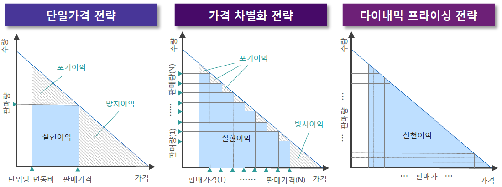
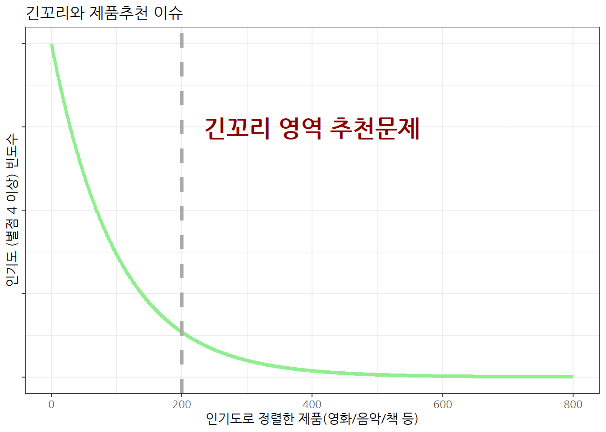
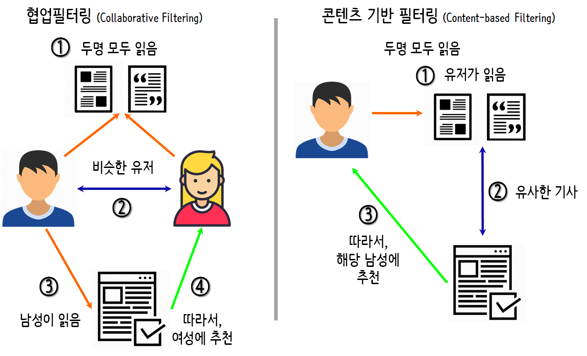

```{r setup, include=FALSE}
options(htmltools.dir.version = FALSE)

knitr::opts_chunk$set(echo = FALSE, warning=FALSE, message=FALSE,
                    comment="", digits = 3, tidy = FALSE, prompt = FALSE, fig.align = 'center')

```

class: inverse, middle, center

# 비즈니스 기회창출

---
## 기업의 기계학습 알고리즘 활용

- 반복적 업무나 중요한 의사결정을 내리는데 기계학습 알고리즘을 활용하여 **거래비용**을 줄이고, **정보유통**을 활발히 하며, 양질의 **제품/서비스 정보**를 고객에게 제공.
    - **다이내믹프라이싱(DynamicPricing)**: 가격민감도가 서로 다른 고객들에게 차별화된 가격을 제시. 이를 통해 알고리즘 기반으로 실시간 가격차별화를 통해 ~~단일가격을 책정~~했을때 대비하여  더 큰이익을 창출
    - 알고리즘 활용 추천시스템: 사용자 행동패턴, 사용자간 관계, 상품유사도를 바탕으로 고객의 취향과 선호를 예측, 이에 적합한 상품을 추천하여 마케팅 효과를 높임.
    - 금융업계 알고리즘 활용 사례: 알고리즘트레이딩, 로보어드바이저, 신용평가시스템


.footnote[이효정, 최성집 (June 2018), "비즈니스 기회창출을 위한 AI알고리즘의 활용", 삼정KPMG 경제연구원, ISSUE MONITOR, 제84호]

---
### 가격 전략별 기업의 실현이익의 변화

<br>
<br>

.center[
  
]

---
### 추천 시스템

.left[
  
]

.right[
  
]


.footnote[
  [xwMOOC R 병렬 프로그래밍: 추천 시스템(Recommendation System) 개요](https://statkclee.github.io/parallel-r/recommendation-sys.html)

]
 

---
### 추천 알고리즘

.center[
  
]

---
### 금융 알고리즘 활용 사례

#### 골드만삭스, 켄쇼의 AI분석 시스템 활용

- 디터 제체 메르세데스-벤츠 자동차그룹 회장이 2012년 **“자동차는 이제 기름이 아니라 소프트웨어로 달린다.”**라고 선언한 것과 유사하게 골드만삭스의 로이드 블랭크페인 회장은 2015년 **"골드만삭스는 IT회사"**라고 선언.
    - 실제로 골드만삭스 전체 임직원 중 4분의 1 가량이 컴퓨터 엔지니어 구성
    - 과거 수백명의 딜러가 트레이딩 업무를 수행했다면, 지금은 컴퓨터 엔지니어가 설계한 알고리즘에 거래를 대행하고 있다.
    
#### 핀테크 기업의 신용평가 알고리즘

- 소득, 직업과 같은 단순정보를 바탕으로 신용을 분석하는 시대는 저물고, 수만가지 데이터를 접목시켜 정교한 신용평가 시스템을 만드는 핀테크기업이 부상.
- 미국의 핀테크 기업인 제스트 파이낸스(ZestFinance)는 SNS 친구수, SNS 포스팅주제, 대출신청서 작성에 걸린 시간, 동호회 가입정보까지 각종데이터를 사용하여 신용분석을 수행하고, 복잡한 관계를 대출심사에 반영하는 알고리즘을 개발하고, 데이터가 갱신될 때마다 알고리즘은 자동으로 업데이트된다.
- 기존 금융사들이 이용하지 않은 정보까지 이용해서 평균보다 **신용도가 낮은 고객들에게도 신용대출서비스**를 시행.


---
class: inverse, middle, center

# 기계학습 알고리즘을 통한 비즈니스 기회창출 관련 주요 이슈와 쟁점

---
## 기계학습 알고리즘 이슈와 쟁점

- **알고리즘 담합**: 경쟁사업자들이 알고리즘을 이용하여 가격, 공급량 등을 조정하거나 관련 정보를 공유하는 행태를 의미. 알고리즘 담합은 시장 경쟁강도를 약화시키고 산업의 혁신을 저하시킴.
- **EU GDPR(개인정보보호규정)도입과 알고리즘 규제** : GDPR 에는 알고리즘이 내리는 자동화된 의사결정에 대해 설명을 요구할 수 있는 권리가 포함되어 있음. 따라서, GDPR도입에 따라 **예측은 뛰어나지만 설명이 어려운** 실무에서 많이 사용되는 블랙박스 예측 및 추천 알고리즘에 대한 완전한 점검이 필요하다는 논의가 제기되고 있음
- **윤리적 알고리즘** : 알고리즘 설계시 **인간의 개입에 따른 오류와 편향성**의 발생가능성이 존재하므로, 각국정부와 기업, 학계는 알고리즘의 활용이 윤리적 방향성을 지녀야 한다는 데 공감이 확산되고 있음.


---
### 알고리즘 담합 유형

.center[
  
]


.footnote[  
  [ODEC (2017), "ALGORITHMS AND COLLUSION - Competition policy in the digital age"](http://www.oecd.org/competition/algorithms-collusion-competition-policy-in-the-digital-age.htm)
]

---
### 암묵적 담합에 대한 법규 준수

.left[
```{r algorithm-tacit-collusion, eval=FALSE, echo=TRUE}

if (가격 상관계수 > 0.9999 & 
      case_when(회사 알고리즘,
                   모니터링 알고리즘 ~ TRUE,
                   병행 알고리즘 ~ TRUE,
                   신호 알고리즘 ~ TRUE,
                   작학습 알고리즘 ~ TRUE)) {
  return(공정거래법 위반)
} else {
  return(공정거래법 위반 없음)
}
      
```
]

.center[
    
    조언은 부질없는 것이다... "어떤 사람들은 나에게 범죄에 관한 조언을 구하는데 내가 확실히 말할 수 있는 것은 **범죄로 돈을 벌려면 로스쿨에 가라**는 것"
]

.footnote[
  [연합뉴스 (2018/10/31), '전설적인 美 보스턴 갱두목, 비참한 최후…"종신형 감옥서 피살"'](http://www.yonhapnews.co.kr/bulletin/2018/10/31/0200000000AKR20181031005300072.HTML)
]

---
### 알고리즘 담합 사례

#### 포스터 레볼루션, 병행 알고리즘으로 가격담합
- 온라인에서 포스터를 판매하는 미국기업 포스터레볼루션(PosterRevolution)의 창업자 데이빗톱킨스(David Topkins)는 사업자들과 일부 고전영화포스터의 **가격을 고정**하기로 합의. 톱킨스와 공모기업들은 병행알고리즘 형태로 가격담합. 결국 2015년 미국법무부는 톱킨스에게 **2만 달러** 벌금부과.

##### 이투라스, 암묵적 동의하에 이루어진 담합
- 온라인 여행예약 사이트를 운영하는 리투아니아 이투라스(Eturas)는 자사 플랫폼에서 사업을 영위하는 여행사들에게 소비자에게 적용되는 최대할인율을 공통적으로 제한한다는 메시지를 보내고 예약시스템의 **최대할인율을 3%로 일괄조정**. 리투아니아 최고행정법원은 이투라스와 여행사간 암묵적 동의하에 이루어진 담합이라 판단, 이투라스와 여행사에 **과징금 150만 유로** 부과.

##### 우버, Hub-and-Spoke 모델로 가격담합 논란
- 공유경제 생태계에서 플랫폼 역할을 하는 우버는 최적화 알고리즘을 통해 가격을 결정. 법적으로 사업관계인 운전드라이버들이 우버의 동일가격 알고리즘을 이용하는 것이 담합에 해당되는지, 담합에 해당되지 않는지 논란됨. 뉴욕남부지법은 중재를 해달라는 우버의 주장을 기각하고, 집단소송 원고적격을 인정. 지금은 연방항소법원에서 **심리중**.


---
### EU GDPR(개인정보보호규정) 도입

- **GDPR(General Data Protection Regulation)**은 2018년 5월 25일부터 시행되는 EU(유럽연합)의 개인정보보호 법령이며, 동 법령 위반시 과징금 등 행정처분이 부과될 수 있어 EU와 거래하는 우리나라 기업도 동법에 영향을 받는다. 법을 위반할 경우 해당 기업은 세계 연매출의 4% 또는 2,000만 유로 중 높은 쪽의 과징금을 부과받게 된다.

- EU GDPR(개인정보보호규정) 주요내용
    - 개인정보 규정 집행력 강화
    - 본인 개인정보 열람 및 이용
    - 본인의 개인정보 이전권
    - 정보유출을 고지받을 권리
    - 설계 및 기본설정에 의한 정보보호
    - 잊혀질권리

---
### EU GDPR 알고리즘 규제
    
- General Data Protection Regulation (GDPR)
    - "[...] the controller shall provide [...] the following information: the existence of automated decision-making, including profiling, [...] meaningful information about the logic involved, as well as the significance and the envisaged consequences of such processing for the data subject."

- 설명을 요구할 권리(Right to Explanation)
    - 정보주체는 알고리즘에 의해 행해진 결정에 대해 질문하고 반박할 수 있음.
    - 데이터를 다루는 사람은 개인에게 언제, 왜 데이터를 모으고 처리하는지 알려야 함.
    - 정보주체는 권리행사를 위해 정보의 투명성과 쉬운 의사소통을 요구할 수 있음.

.footnote[
- [개인정보보호 종합포털(GDPR): https://www.privacy.go.kr/](https://www.privacy.go.kr/gdpr)
- [Bryce Goodman, Seth Flaxman (2016), "European Union regulations on algorithmic decision-making and a right to explanation"](https://arxiv.org/abs/1606.08813)
]


