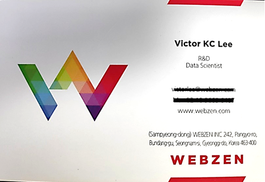
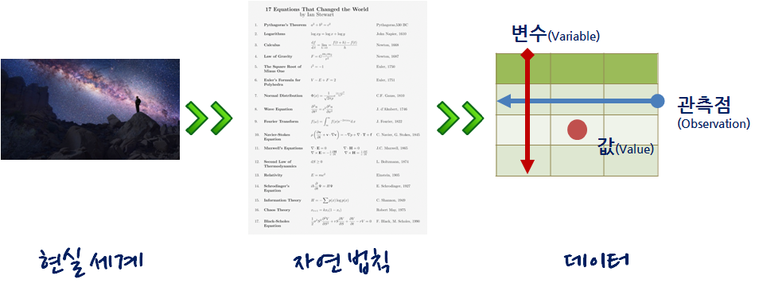
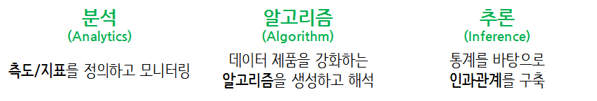
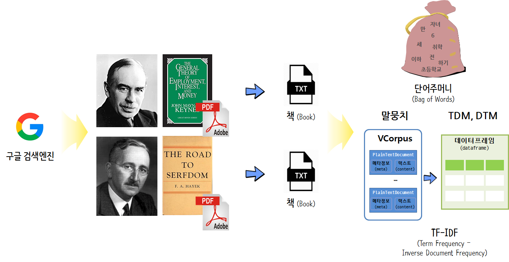

```{r setup, include=FALSE}
options(htmltools.dir.version = FALSE)

knitr::opts_chunk$set(echo = FALSE, warning=FALSE, message=FALSE,
                    comment="", digits = 3, tidy = FALSE, prompt = TRUE, fig.align = 'center')
```


class: inverse, middle, center

## 데이터 과학자 1세대

---
### 데이터 과학자

.pull-left[
  
]

.pull-right[
  <iframe width="400" height="250" src="https://www.youtube.com/embed/K_TGdklC504" frameborder="0" allow="accelerometer; autoplay; encrypted-media; gyroscope; picture-in-picture" allowfullscreen></iframe>
]

.footnote[
- [연세대학교 - "데이터 사이언스 입문"](https://statkclee.github.io/yonsei/)
- [이광춘(2019) "데이터 사이언스, 타이디버스로 향하다", 마이크로소프트웨어 395호](http://it.chosun.com/site/data/html_dir/2019/01/29/2019012900392.html)
- [Cloudera Conference 2018 - Seoul: 기계의 역습 - 설명가능한 기계학습](https://www.clouderasessionsseoul.com/agenda.php)
]

---
### 뉴스빅데이터 해커톤

1. 설명회 개요
    - 목적: 대회 취지 및 뉴스빅데이터 활용사례 공유를 통한 대회 참가 유도
    - 일시: 2019. 4. 4(목) 15:00~17:00
    - 장소: 서울창업허브 9층 세미나실2(마포구 공덕동 백범로31길 21)
    - 대상: 뉴스빅데이터 해커톤에 관심 있는 예비참가자
1. 일정  
    - 15:00~15:10 - 대회요강 및 빅카인즈 설명 (언론진흥재단 윤정주 과장)
    - 15:10~15:50 - 뉴스빅데이터 활용 서비스 사례 (안상선 엠로보 대표)
    - 15:50~16:30 - 뉴스데이터 – 데이터 사이언스 사례 (이광춘 연세대 겸임교수)
    - 16:30~17:00 - 참가자 질의응답 및 팀 빌딩

---
class: inverse, middle, center

## 빅데이터 &rarr; 데이터 사이언스

---
### 구글 Trends 데이터 사이언스 한미 비교 - 미국

```{r google-trends-comparison-us, echo=FALSE, fig.width=12, fig.height=8}
library(tidyverse)
library(lubridate)
library(googleVis)
library(extrafont)
loadfonts()

Sys.setenv(TZ='Asia/Seoul')

us_df <- read_rds("data/us_df.rds")
kr_df <- read_rds("data/kr_df.rds")

us_df$interest_over_time %>% tbl_df %>% 
  mutate(hits = as.integer(hits)) %>% 
  ggplot(aes(x=date, y=hits, color=keyword)) +
    geom_line() +
    labs(x="", y="구글 인기도", color="구글 검색어") +
    theme_minimal(base_family = "NanumGothic") +
    theme(legend.position = "top",
          legend.title=element_text(size=17), 
          legend.text=element_text(size=15))

```


---
### 구글 Trends 데이터 사이언스 한미 비교 - 한국


```{r google-trends-comparison-kr, fig.width=12, fig.height=8}
kr_df$interest_over_time %>% tbl_df %>% 
  mutate(hits = as.integer(hits)) %>% 
  ggplot(aes(x=date, y=hits, color=keyword)) +
    geom_line() +
    labs(x="", y="구글 인기도", color="구글 검색어") +
    theme_minimal(base_family = "NanumGothic") +
    theme(legend.position = "top",
          legend.title=element_text(size=17), 
          legend.text=element_text(size=15))
```

---
class: inverse, middle, center

## 데이터 사이언스

---
### 데이터 사이언스란?

데이터 사이언스는 데이터를 다루는 과학이다. 따라서 자연법칙을 다루는 자연과학과 맥이 닿아있다.
자연법칙을 측정하여 데이터프레임(`DataFrame`)으로 나타내면 **변수(Variable)**, **관측점(Observation)**, **값(Value)**으로 표현된다.




---
### 데이터 사이언스 업무



- **분석(Analytics) 데이터 과학자**는 좋은 질문을 던질 수 있고, 
탐색적 데이터 분석을 통해서 문제와 해법을 명확히 하는 재주가 있고, 대쉬보드와 시각화를 통해 데이터 분석을 자동화하고, 추천 결과물을 통해 비즈니스를 변화시킨다. 
- **알고리즘(algorithm) 데이터 과학자**는 기계학습에 특기가 있는 사람에 적합하고 제품/서비스, 프로세스에 데이터를 알고리즘을 통해 녹여내서 비즈니스 가치를 창출한다. 
- **추론(inference) 데이터 과학자**는 통계를 사용해서 의사결정을 향상시키고, 업무의 영향도를 측정하는데 주로 통계학, 경제학, 사화과학 전공지식을 적극 활용한다.

.footnote[
  [Elena Grewal(July 25, 2018), "One Data Science Job Doesn’t Fit All"](https://www.linkedin.com/pulse/one-data-science-job-doesnt-fit-all-elena-grewal/)
]

---
class: inverse, middle, center

## 뉴스를 데이터로 바라보기

---
### NLP 생태계

- [NLP 생태계 이미지](http://www.bnosac.be/images/bnosac/blog/NLP-R-ecosystem.png)

.footnote[
- NLP(Natural Language Processing): 자연어 처리
- [An overview of the NLP ecosystem in R (#nlproc #textasdata)](http://www.bnosac.be/index.php/blog/87-an-overview-of-the-nlp-ecosystem-in-r-nlproc-textasdata)
]

---
### 파이썬 자연어 처리

- [자연어 처리 입문 - 파이썬](https://statkclee.github.io/text/nlp-intro-python.html)

---
class: inverse, middle, center

## 탐색적 데이터 분석

---
### 텍스트 마이닝



.footnote[
- [케인즈 vs 하이에크](https://statkclee.github.io/text/langcon-keynes-hayek.html)
]

---
class: inverse, middle, center

## 데이터 탐색 &rarr; 예측모형

---
### 예측모형

- [SMS 스팸분류 - Random Forest](https://statkclee.github.io/text/nlp-spam-machine-learning.html)


